# 决策树

## 决策树简介

**学习目标**

1.理解决策树算法的基本思想

2.知道构建决策树的步骤

---

### 【理解】决策树例子

决策树算法是一种监督学习算法，英文是 Decision tree。

决策树思想的来源非常朴素，试想每个人的大脑都有类似于 if-else 这样的逻辑判断，这其中的 if 表示的是条件，if 之后的 else 就是一种选择或决策。程序设计中的条件分支结构就是 if-else 结构，最早的决策树就是利用这类结构分割数据的一种分类学习方法。

比如：你母亲要给你介绍男朋友，是这么来对话的：

女儿：多大年纪了？

母亲：26。

女儿：长的帅不帅？

母亲：挺帅的。

女儿：收入高不？

母亲：不算很高，中等情况。

女儿：是公务员不？

母亲：是，在税务局上班呢。

女儿：那好，我去见见。

于是你在脑袋里面就有了下面这张图：

作为女孩的你在决策过程就是典型的分类树决策。相当于通过年龄、长相、收入和是否公务员对将男人分为两个类别：见和不见。

### 【知道】决策树简介

**决策树是什么？**

决策树是一种树形结构，树中每个内部节点表示一个特征上的判断，每个分支代表一个判断结果的输出，每个叶子节点代表一种分类结果

**决策树的建立过程**：

1.特征选择：选取有较强分类能力的特征。

2.决策树生成：根据选择的特征生成决策树。

3.决策树也易过拟合，采用剪枝的方法缓解过拟合。

## ID3 决策树

**学习目标：**

1.理解信息熵的意义

2.理解信息增益的作用

3.知道 ID3 树的构建流程

### 【理解】信息熵

ID3 树是基于信息增益构建的决策树.

定义

- 熵在信息论中代表随机变量不确定度的度量。
- 熵越大，数据的不确定性度越高
- 熵越小，数据的不确定性越低

公式

$$
H = -\sum_{i=1}^{k} p_i \log(p_i)
$$

例子 1：假如有三个类别，分别占比为：{1/3,1/3,1/3}，信息熵计算结果为：

$H=-\frac{1}{3}\log(\frac{1}{3})-\frac{1}{3}\log(\frac{1}{3})-\frac{1}{3}\log(\frac{1}{3})=1.0986$

例子 2：假如有三个类别，分别占比为：{1/10,2/10,7/10}，信息熵计算结果为：

$H=-\frac{1}{10}\log(\frac{1}{10})-\frac{2}{10}\log(\frac{2}{10})-\frac{7}{10}\log(\frac{7}{10})=0.8018$

熵越大，表示整个系统不确定性越大，越随机，反之确定性越强。

例子 3：假如有三个类别，分别占比为：{1,0,0}，信息熵计算结果为：

$H=-1\log(1)=0$

### 【理解】信息增益

定义

特征$A$对训练数据集 D 的信息增益$g(D,A)$，定义为集合$D$的熵$H(D)$与特征 A 给定条件下 D 的熵$H(D|A)$之差。即

$$
\large
g(D,A)=H(D)-H(D|A)
$$

根据信息增益选择特征方法是：对训练数据集 D，计算其每个特征的信息增益，并比较它们的大小，并选择信息增益最大的特征进行划分。**表示由于特征$A$而使得对数据 D 的分类不确定性减少的程度。**

算法：

设训练数据集为 D，$\mid D\mid$表示其样本个数。设有$K$个类$C_k$，$k=1,2,\cdots,K$，$\mid C_k\mid$为属于类$C_k$的样本个数，$\sum\limits_{k=1}^{K}=\mid{D}\mid$。设特征 A 有$n$个不同取值$\{a_1, a_2, \cdots,a_n\}$，根据特征 A 的取值将 D 划分为$n$个子集$D_1, D_2, \cdots,D_n$，$\mid D_i\mid$为$D_i$样本个数，$\sum\limits_{i=1}^n\mid D_i\mid=\mid D\mid$。子集中属于类$C_k$的样本集合为$D_{ik}$，即$D_{ik}=D_i\bigcap C_k$，$\mid D_{ik}\mid$为$D_{ik}$的样本个数。信息增益算法如下：

- 输入：训练数据集 D 和特征 A；

- 输出：特征 A 对训练数据集 D 的信息增益$g(D,A)$

- (1) 计算数据集 D 的经验熵$H(D)$

  $H(D)=-\sum\limits_{k=1}^{K}\frac{\mid C_k\mid}{\mid D\mid}\log_2\frac{\mid C_k\mid}{\mid D\mid}$

- (2) 计算特征 A 对数据集 D 的经验条件熵$H(D\mid A)$

  $H(D\mid A)=\sum\limits_{i=1}^{n}\frac{\mid D_i\mid}{\mid D\mid}H(D_i)=-\sum\limits_{i=1}^{n}\frac{\mid D_i\mid}{\mid D\mid}\sum_\limits{k=1}^{K}\frac{\mid D_{ik}\mid}{\mid D_i\mid}\log_2\frac{\mid D_{ik}\mid}{\mid D_i\mid}$

- (3) 计算信息增益

  $g(D,A)=H(D)-H(D|A)$

例子：

已知 6 个样本，根据特征 a：

| 特征 a | 目标值 |
| ------ | ------ |
| α      | A      |
| α      | A      |
| β      | B      |
| α      | A      |
| β      | B      |
| α      | B      |

α 部分对应的目标值为： AAAB

β 部分对应的目标值为：BB

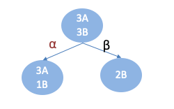

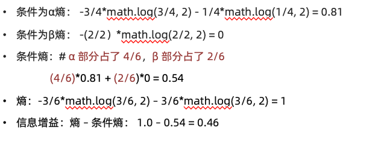

### 【知道】ID3 树构建流程

**构建流程：**

1. 计算每个特征的信息增益
2. 使用信息增益最大的特征将数据集 S 拆分为子集
3. 使用该特征（信息增益最大的特征）作为决策树的一个节点
4. 使用剩余特征对子集重复上述（1，2，3）过程

**案例：**

已知：某一个论坛客户流失率数据

需求：考察性别、活跃度特征哪一个特征对流失率的影响更大

分析：

15 条样本：5 正样本、10 个负样本

- 计算熵

- 计算性别信息增益

- 计算活跃度信息增益

- 比较两个特征的信息增益

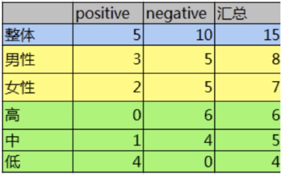

1.计算熵

2.计算性别条件熵(a="性别")：

计算性别信息增益(a="性别")

3. 计算活跃度条件熵(a=“活跃度")

计算活跃度信息增益(a=活跃度")

**结论**：活跃度的信息增益比性别的信息增益大，对用户流失的影响比性别大。

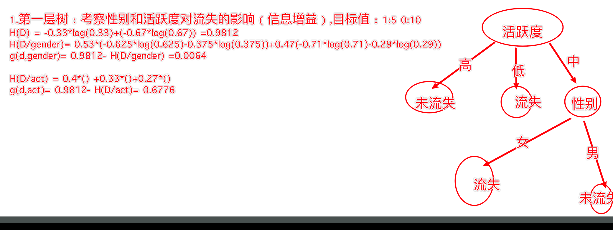

## C4.5 决策树

**学习目标：**

1.理解信息增益率的意义

2.知道 C4.5 树的构建方法

### 【理解】信息增益率

1. Gain_Ratio 表示信息增益率
2. IV 表示分裂信息、内在信息
3. 特征的信息增益 ➗ 内在信息
   1. 如果某个特征的特征值种类较多，则其内在信息值就越大。即：特征值种类越多，除以的系数就越大。
   2. 如果某个特征的特征值种类较小，则其内在信息值就越小。即：特征值种类越小，除以的系数就越小。

**信息增益比本质： 是在信息增益的基础之上乘上一个惩罚参数。特征个数较多时，惩罚参数较小；特征个数较少时，惩罚参数较大。惩罚参数：数据集 D 以特征 A 作为随机变量的熵的倒数。**

### 【知道】C4.5 树构建说明

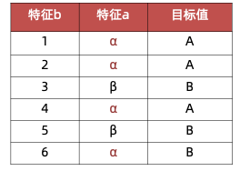

特征 a 的信息增益率：

1. 信息增益：`1-0.5408520829727552=0.46`
2. 特征熵：`-4/6*math.log(4/6, 2) -2/6*math.log(2/6, 2)=0.9182958340544896`
3. 信息增益率：`信息增益/分裂信息=0.46/0.9182958340544896=0.5 `

特征 b 的信息增益率：

1. 信息增益：1
2. 特征熵：`-1/6*math.log(1/6, 2) * 6=2.584962500721156`
3. 信息增益率：`信息增益/信息熵=1/2.584962500721156=0.38685280723454163`

由计算结果可见，特征 1 的信息增益率大于特征 2 的信息增益率，根据信息增益率，我们应该选择特征 1 作为分裂特征。

## CART 决策树

**学习目标：**

1.理解基尼指数的作用

2.知道 cart 构建的特征选择方法

### 【知道】Cart 树简介

Cart 模型是一种决策树模型，它即可以用于分类，也可以用于回归。

分类和回归树模型采用不同的最优化策略。Cart 回归树使用平方误差最小化策略，Cart 分类生成树采用的基尼指数最小化策略。

### 【理解】基尼指数计算方法

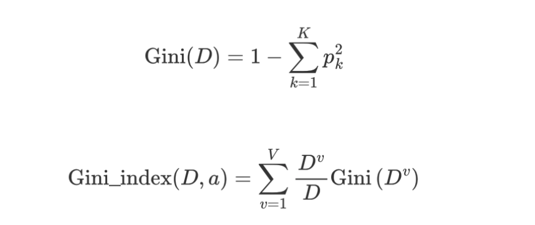

1. 信息增益（ID3）、信息增益率值越大（C4.5），则说明优先选择该特征。

2. 基尼指数值越小（cart），则说明优先选择该特征。

### 【理解】基尼指数计算举例

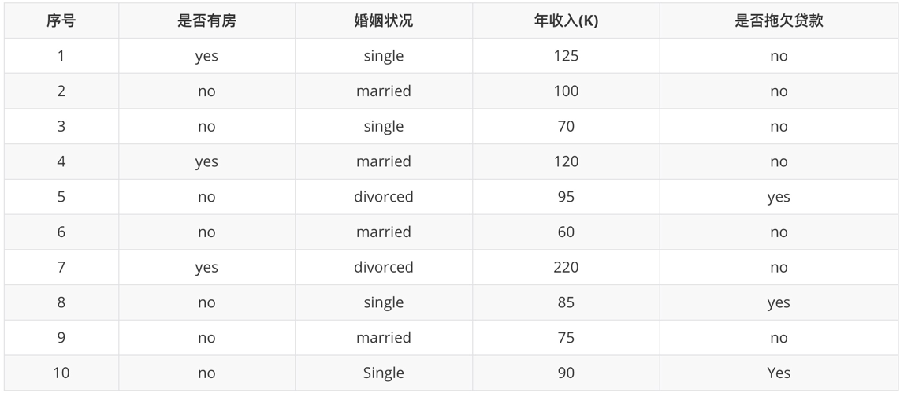

#### 是否有房

计算过程如下：根据是否有房将目标值划分为两部分：

1. 计算有房子的基尼值： **有房子有 1、4、7 共计三个样本，对应：3 个 no、0 个 yes**

   $G i n i(\text {是否有房，yes })=1-\left(\frac{0}{3}\right)^{2}-\left(\frac{3}{3}\right)^{2}=0$

2. 计算无房子的基尼值：**无房子有 2、3、5、6、8、9、10 共七个样本，对应：4 个 no、3 个 yes**

   $\operatorname{Gini}(\text {是否有房，no })=1-\left(\frac{3}{7}\right)^{2}-\left(\frac{4}{7}\right)^{2}=0.4898$

3. 计算基尼指数：**第一部分样本数量占了总样本的 3/10、第二部分样本数量占了总样本的 7/10：**

   $\operatorname{Gini_{-}} i n \operatorname{dex}(D, \text { 是否有房 })=\frac{7}{10} * 0.4898+\frac{3}{10} * 0=0.343$

#### 婚姻状况

1. 计算 **{married} 和 {single,divorced}** 情况下的基尼指数：

   结婚的基尼值，有 2、4、6、9 共 4 个样本，并且对应目标值全部为 no：

   $\operatorname{Gini\_index}(D,\text{{married}})=0$

   不结婚的基尼值，有 1、3、5、7、8、10 共 6 个样本，并且对应 3 个 no，3 个 yes：

   $\operatorname{Gini\_index}(D, \text { {single,divorced} })=1-\left(\frac{3}{6}\right)^{2}-\left(\frac{3}{6}\right)^{2}=0.5$

   以 married 作为分裂点的基尼指数：

   $\operatorname{Gini\_index}(D, \text { married })=\frac{4}{10} * 0+\frac{6}{10} *\left[1-\left(\frac{3}{6}\right)^{2}-\left(\frac{3}{6}\right)^{2}\right]=0.3$

2. 计算 **{single} | {married,divorced}** 情况下的基尼指数

   $\operatorname{Gini\_index}(D,\text{婚姻状况})=\frac{4}{10} * 0.5+\frac{6}{10} *\left[1-\left(\frac{1}{6}\right)^{2}-\left(\frac{5}{6}\right)^{2}\right]=0.367$

3. 计算 **{divorced} | {single,married}** 情况下基尼指数

   $\operatorname{Gini\_index}(D, \text { 婚姻状况 })=\frac{2}{10} * 0.5+\frac{8}{10} *\left[1-\left(\frac{2}{8}\right)^{2}-\left(\frac{6}{8}\right)^{2}\right]=0.4$

4. 最终：该特征的基尼值为 0.3，并且预选分裂点为：**{married} 和 {single,divorced}**

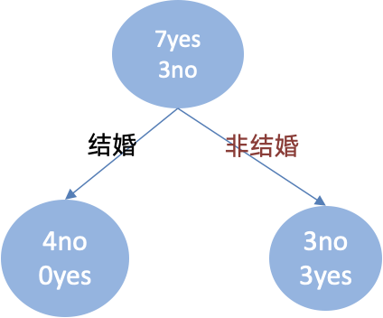

#### 年收入

先将数值型属性升序排列，以相邻中间值作为待确定分裂点：

以年收入 65 将样本分为两部分，计算基尼指数:

$节点为65时:{年收入}=\frac{1}{10} * 0 + \frac{9}{10} *\left[1-\left(\frac{6}{9}\right)^{2}-\left(\frac{3}{9}\right)^{2}\right]=0.4$

以此类推计算所有分割点的基尼指数，我们发现最小的基尼指数为 0.3。

此时，我们发现：

1. 以是否有房作为分裂点的基尼指数为：0.343
2. 以婚姻状况为分裂特征、以 married 作为分裂点的基尼指数为：0.3
3. 以年收入作为分裂特征、以 97.5 作为分裂点的的基尼指数为：0.3

最小基尼指数有两个分裂点，我们随机选择一个即可，假设婚姻状况，则可确定决策树如下：

重复上面步骤，直到每个叶子结点纯度达到最高.

### 【知道】比较

| **名称** | **提出时间** | **分支方式** | **特点**                                                                                                                                               |
| -------- | ------------ | ------------ | ------------------------------------------------------------------------------------------------------------------------------------------------------ |
| ID3      | 1975         | 信息增益     | 1.ID3 只能对离散属性的数据集构成决策树 2.倾向于选择取值较多的属性                                                                                      |
| C4.5     | 1993         | 信息增益率   | 1.缓解了 ID3 分支过程中总喜欢偏向选择值较多的属性 2.可处理连续数值型属性，也增加了对缺失值的处理方法 3.只适合于能够驻留于内存的数据集,大数据集无能为力 |
| CART     | 1984         | 基尼指数     | 1.可以进行分类和回归，可处理离散属性，也可以处理连续属性 2.采用基尼指数，计算量减小 3.一定是二叉树                                                     |

## 【实践】泰坦尼克号生存案例

### 案例背景

泰坦尼克号沉没是历史上最著名的沉船事件。1912 年 4 月 15 日，在她的处女航中，泰坦尼克号在与冰山相撞后沉没，在 2224 名乘客和船员中造成 1502 人死亡。这场耸人听闻的悲剧震惊了国际社会，并为船舶制定了更好的安全规定。 造成海难失事的原因之一是乘客和船员没有足够的救生艇。尽管幸存下来有一些运气因素，但有些人比其他人更容易生存，例如妇女，儿童和社会地位较高的人群。 在这个案例中，我们要求您完成对哪些人可能存活的分析。

数据集中的特征包括票的类别，是否存活，乘坐班次，姓名，年龄，上船港口，房间，性别等。

### API 介绍

class sklearn.tree.DecisionTreeClassifier(criterion=’gini’, max_depth=None,random_state=None)

- criterion
  - 特征选择标准
  - "gini"或者"entropy"，前者代表基尼系数，后者代表信息增益。一默认"gini"，即 CART 算法。
- min_samples_split
  - 内部节点再划分所需最小样本数
  - 这个值限制了子树继续划分的条件，如果某节点的样本数少于 min_samples_split，则不会继续再尝试选择最优特征来进行划分。 默认是 2.如果样本量不大，不需要管这个值。如果样本量数量级非常大，则推荐增大这个值。我之前的一个项目例子，有大概 10 万样本，建立决策树时，我选择了 min_samples_split=10。可以作为参考。
- min_samples_leaf
  - 叶子节点最少样本数
  - 这个值限制了叶子节点最少的样本数，如果某叶子节点数目小于样本数，则会和兄弟节点一起被剪枝。 默认是 1,可以输入最少的样本数的整数，或者最少样本数占样本总数的百分比。如果样本量不大，不需要管这个值。如果样本量数量级非常大，则推荐增大这个值。之前的 10 万样本项目使用 min_samples_leaf 的值为 5，仅供参考。
- max_depth
  - 决策树最大深度
  - 决策树的最大深度，默认可以不输入，如果不输入的话，决策树在建立子树的时候不会限制子树的深度。一般来说，数据少或者特征少的时候可以不管这个值。如果模型样本量多，特征也多的情况下，推荐限制这个最大深度，具体的取值取决于数据的分布。常用的可以取值 10-100 之间
- random_state
  - 随机数种子

### 案例实现

相比其他学习模型，决策树在模型描述上有巨大的优势，决策树的逻辑推断非常直观，具有清晰的可解释性，也有很方便的模型的可视化。在决策树的使用中，无需考虑对数据量化和标准化，就能达到比较好的识别率。

## 回归决策树

**学习目标**：

1.了解回归决策树的构建原理

2.能利用回归决策树 API 解决问题

### 【了解】回归决策树构建原理

CART 回归树和 CART 分类树的不同之处在于:

1. CART 分类树预测输出的是一个离散值，CART 回归树预测输出的是一个连续值。
2. CART 分类树使用基尼指数作为划分、构建树的依据，CART 回归树使用平方损失。
3. 分类树使用叶子节点里出现更多次数的类别作为预测类别，回归树则采用叶子节点里均值作为预测输出

**CART 回归树构建:**

$$
\operatorname{Loss}(y, f(x))=(f(x)-y)^{2}
$$

**例子：**

假设：数据集只有 1 个特征 x, 目标值值为 y，如下图所示：

| x   | 1    | 2   | 3    | 4   | 5   | 6    | 7   | 8   | 9   | 10   |
| --- | ---- | --- | ---- | --- | --- | ---- | --- | --- | --- | ---- |
| y   | 5.56 | 5.7 | 5.91 | 6.4 | 6.8 | 7.05 | 8.9 | 8.7 | 9   | 9.05 |

由于只有 1 个特征，所以只需要选择该特征的最优划分点，并不需要计算其他特征。

1. **先将特征 x 的值排序，并取相邻元素均值作为待划分点，如下图所示：**

   | s   | 1.5 | 2.5 | 3.5 | 4.5 | 5.5 | 6.5 | 7.5 | 8.5 | 9.5 |
   | --- | --- | --- | --- | --- | --- | --- | --- | --- | --- |

2. **计算每一个划分点的平方损失，例如：1.5 的平方损失计算过程为：**

   R1 为 小于 1.5 的样本个数，样本数量为：1，其输出值为：5.56

   $R_1 =5.56$

   R2 为 大于 1.5 的样本个数，样本数量为：9 ，其输出值为：

   $R_2=(5.7+5.91+6.4+6.8+7.05+8.9+8.7+9+9.05) / 9=7.50$

   该划分点的平方损失：

   $L(1.5)=(5.56-5.56)^{2}+\left[(5.7-7.5)^{2}+(5.91-7.5)^{2}+\ldots+(9.05-7.5)^{2}\right]=0+15.72=15.72$

3. **以此方式计算 2.5、3.5... 等划分点的平方损失，结果如下所示：**

   | s    | 1.5   | 2.5   | 3.5  | 4.5  | 5.5  | 6.5      | 7.5  | 8.5   | 9.5   |
   | ---- | ----- | ----- | ---- | ---- | ---- | -------- | ---- | ----- | ----- |
   | m(s) | 15.72 | 12.07 | 8.36 | 5.78 | 3.91 | **1.93** | 8.01 | 11.73 | 15.74 |

4. **当划分点 s=6.5 时，m(s) 最小。因此，第一个划分变量：特征为 X, 切分点为 6.5，即：j=x, s=6.5**

   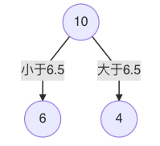

5. **对左子树的 6 个结点计算每个划分点的平方式损失，找出最优划分点：**

   | x   | 1    | 2   | 3    | 4   | 5   | 6    |
   | --- | ---- | --- | ---- | --- | --- | ---- |
   | y   | 5.56 | 5.7 | 5.91 | 6.4 | 6.8 | 7.05 |

   | s   | 1.5  | 2.5  | 3.5  | 4.5  | 5.5  |
   | --- | ---- | ---- | ---- | ---- | ---- |
   | c1  | 5.56 | 5.63 | 5.72 | 5.89 | 6.07 |
   | c2  | 6.37 | 6.54 | 6.75 | 6.93 | 7.05 |

   | s    | 1.5    | 2.5   | 3.5    | 4.5    | 5.5    |
   | ---- | ------ | ----- | ------ | ------ | ------ |
   | m(s) | 1.3087 | 0.754 | 0.2771 | 0.4368 | 1.0644 |

6. **s=3.5 时，m(s) 最小，所以左子树继续以 3.5 进行分裂:**

   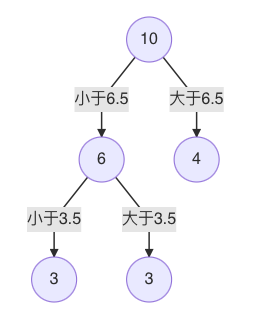

7. **假设在生成 3 个区域** 之后停止划分，以上就是回归树。每一个叶子结点的输出为：挂在该结点上的所有样本均值。

| x   | 1    | 2   | 3    | 4   | 5   | 6    | 7   | 8   | 9   | 10   |
| --- | ---- | --- | ---- | --- | --- | ---- | --- | --- | --- | ---- |
| y   | 5.56 | 5.7 | 5.91 | 6.4 | 6.8 | 7.05 | 8.9 | 8.7 | 9   | 9.05 |

1 号样本真实值 5.56 预测结果：5.72

2 号样本真实值是 5.7 预测结果：5.72

3 号样本真实值是 5.91 预测结果 5.72

CART 回归树构建过程如下：

1. 选择第一个特征，将该特征的值进行排序，取相邻点计算均值作为待划分点
2. 根据所有划分点，将数据集分成两部分：R1、R2
3. R1 和 R2 两部分的平方损失相加作为该切分点平方损失
4. 取最小的平方损失的划分点，作为当前特征的划分点
5. 以此计算其他特征的最优划分点、以及该划分点对应的损失值
6. 在所有的特征的划分点中，选择出最小平方损失的划分点，作为当前树的分裂点

### 【实践】回归决策树实践

已知数据：

分别训练线性回归、回归决策树模型，并预测对比

训练模型，并使用 1000 个[0.0, 10]之间的数据，让模型预测，画出预测值图线

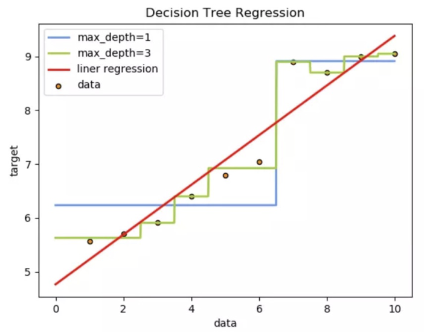

从预测效果来看：

1、线性回归是一条直线

2、决策树是曲线

3、树的拟合能力是很强的，易过拟合

## 决策树剪枝

**学习目标：**

1. 知道什么是剪枝
2. 理解剪枝的作用
3. 知道常用剪枝方法
4. 了解不同剪枝方法的优缺点

### 【知道】什么是剪枝?

> 剪枝 (pruning)是决策树学习算法对付 **过拟合** 的主要手段。
>
> 在决策树学习中，为了尽可能正确分类训练样本，结点划分过程将不断重复，有时会造成决策树分支过多，这时就可能因训练样本学得"太好"了，以致于把训练集自身的一些特点当作所有数据都具有的一般性质而导致过拟合。因此，可通过主动去掉一些分支来降低过拟合的风险。

剪枝是指将一颗子树的子节点全部删掉，利用叶子节点替换子树(实质上是后剪枝技术)，也可以（假定当前对以 root 为根的子树进行剪枝）只保留根节点本身而删除所有的叶子，以下图为例：

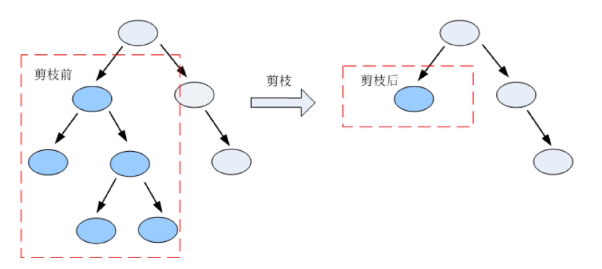

### 【知道】常见减枝方法汇总

决策树剪枝的基本策略有"预剪枝" (pre-pruning）和"后剪枝"（post- pruning) 。

1. 预剪枝是指在决策树生成过程中，对每个结点在划分前先进行估计，若当前结点的划分不能带来决策树泛化性能提升，则停止划分并将当前结点标记为叶结点;
2. 后剪枝则是先从训练集生成一棵完整的决策树，然后自底向上地对非叶结点进行考察，若将该结点对应的子树替换为叶结点能带来决策树泛化性能提升，则将该子树替换为叶结点。

### 【理解】例子

在构建树时, 为了能够实现剪枝, 可预留一部分数据用作 "验证集" 以进行性能评估。我们的训练集如下:

验证集如下:

#### 预剪枝

1. 假设: 当前树只有一个结点, 即编号为 1 的结点. 此时, 所有的样本预测类别为: 其类别标记为训练样例数最多的类别，假设我们将这个叶结点标记为 "好瓜"。此时, 在验证集上所有的样本都会被预测为 "好瓜", 此时的准确率为: 3/7

2. 如果进行此次分裂, 则树的深度为 2, 有三个分支. 在用属性"脐部"划分之后，上图中的结点 2、3、4 分别包含编号为 {1，2，3， 14}、 {6，7， 15， 17}、 {10， 16} 的训练样例，因此这 3 个结点分别被标记为叶结点"好瓜"、 "好瓜"、 "坏瓜"。此时, 在验证集上 4、5、8、11、12 样本预测正确，准确率为: 5/7。很显然, 通过此次分裂准确率有所提升, 值得分裂.

3. 接下来，对结点 2 进行划分，基于信息增益准则将挑选出划分属性"色泽"。然而，在使用"色泽"划分后，编号为 {5} 的验证集样本分类结果会由正确转为错误，使得验证集精度下降为 57.1%。于是，预剪枝策略将禁止结点 2 被划分。

4. 对结点 3，最优划分属性为"根蒂"，划分后验证集精度仍为 5/7. 这个 划分不能提升验证集精度，于是，预剪枝策略禁止结点 3 被划分。

5. 对结点 4，其所含训练样例己属于同一类，不再进行划分.

于是，基于预剪枝策略从上表数据所生成的决策树如上图所示，其验证集精度为 71.4%. 这是一棵仅有一层划分的决策树。

#### 后剪枝

后剪枝先从训练集生成一棵完整决策树，继续使用上面的案例，从前面计算，我们知前面构造的决策树的验证集精度为 42.9%。

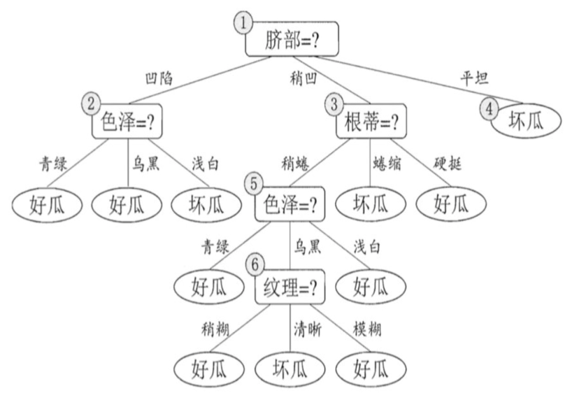

1. 首先考察结点 6，若将其领衔的分支剪除则相当于把 6 替换为叶结点。替换后的叶结点包含编号为 {7， 15} 的训练样本，于是该叶结点的类别标记为"好瓜", 此时决策树的验证集精度提高至 57.1%。

2. 然后考察结点 5，若将其领衔的子树替换为叶结点，则替换后的叶结点包含编号为 {6，7，15}的训练样例，叶结点类别标记为"好瓜'；此时决策树验证集精度仍为 57.1%. 于是，可以不进行剪枝.
3. 对结点 2，若将其领衔的子树替换为叶结点，则替换后的叶结点包含编号 为 {1， 2， 3， 14} 的训练样例，叶结点标记为"好瓜"此时决策树的验证集精度提高至 71.4%. 于是，后剪枝策略决定剪枝.
4. 对结点 3 和 1，若将其领衔的子树替换为叶结点，则所得决策树的验证集 精度分别为 71.4% 与 42.9%，均未得到提高，于是它们被保留。
5. 最终, 基于后剪枝策略生成的决策树如上图所示, 其验证集精度为 71.4%。

### 【了解】剪枝方法对比

预剪枝优点：

- 预剪枝使决策树的很多分支没有展开，不单降低了过拟合风险，还显著减少了决策树的训练、测试时间开销

预剪枝缺点：

- 有些分支的当前划分虽不能提升泛化性能，甚至会导致泛化性能降低，但在其基础上进行的后续划分却有可能导致性能的显著提高
- 预剪枝决策树也带来了欠拟合的风险

后剪枝优点：

- 比预剪枝保留了更多的分支。一般情况下，后剪枝决策树的欠拟合风险很小，泛化性能往往优于预剪枝

后剪枝缺点：

- 但后剪枝过程是在生成完全决策树之后进行的，并且要自底向上地对树中所有非叶子节点进行逐一考察，因此在训练时间开销比未剪枝的决策树和预剪枝的决策树都要大得多。

## 作业

1.完成决策树部分的思维导图

2.课上所有的案例都要自己手动完成

3.

下面以常用的贷款申请样本数据表为样本集，计算信息增益计算过程，并构建 ID3 决策树。

| ID  | 年龄 | 有工作 | 有房子 | 信贷情况 | 类别 |
| :-: | :--: | :----: | :----: | :------: | :--: |
|  1  | 青年 |   否   |   否   |   一般   | 拒绝 |
|  2  | 青年 |   否   |   否   |    好    | 拒绝 |
|  3  | 青年 |   是   |   否   |    好    | 同意 |
|  4  | 青年 |   是   |   是   |   一般   | 同意 |
|  5  | 青年 |   否   |   否   |   一般   | 拒绝 |
|  6  | 中年 |   否   |   否   |   一般   | 拒绝 |
|  7  | 中年 |   否   |   否   |    好    | 拒绝 |
|  8  | 中年 |   是   |   是   |    好    | 同意 |
|  9  | 中年 |   否   |   是   |  非常好  | 同意 |
| 10  | 中年 |   否   |   是   |  非常好  | 同意 |
| 11  | 老年 |   否   |   是   |  非常好  | 同意 |
| 12  | 老年 |   否   |   是   |    好    | 同意 |
| 13  | 老年 |   是   |   否   |    好    | 同意 |
| 14  | 老年 |   是   |   否   |  非常好  | 同意 |
| 15  | 老年 |   否   |   否   |   一般   | 拒绝 |

4.说明 CART 分类树和回归树的特点，并说明构建过程

5.说明决策树剪枝的方法有哪些？及各自的特点是什么？
