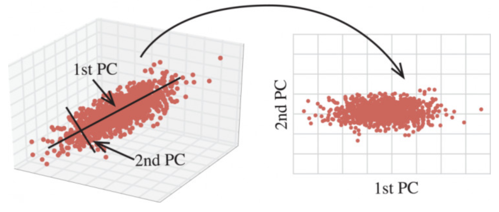
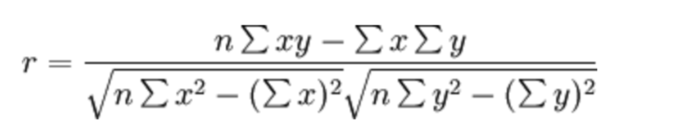
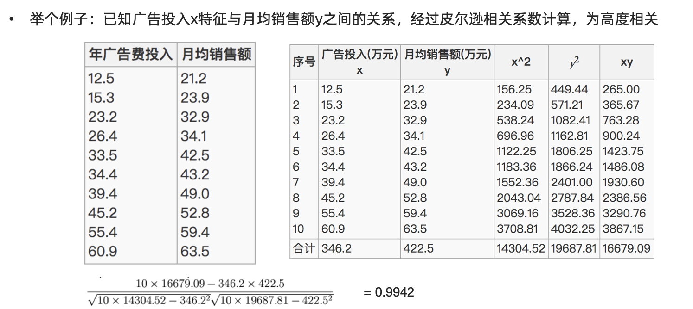
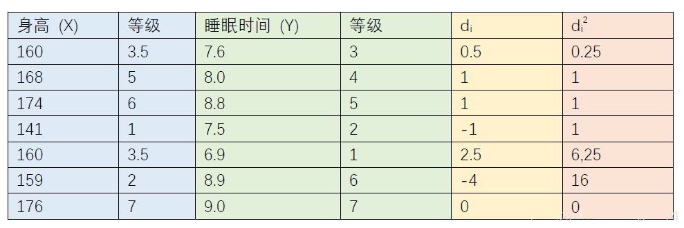

# 特征降维

**学习目标：**

1. 理解特征降维的作用
2. 知道低方差过滤法
3. 知道相关系数法
4. 掌握PCA 进行降维

## 特征降维简介

用于训练的数据集特征对模型的性能有着极其重要的作用。如果训练数据中包含一些不重要的特征，可能导致模型的泛化性能不佳。例如：

1.  某些特征的取值较为接近，其包含的信息较少
2.  我们希望特征独立存在，对预测产生影响，具有相关性的特征可能并不会给模型带来更多的信息，但是并不是说相关性完全无用。

**降维** 是指在某些限定条件下，降低特征个数， 我们接下来介绍集中特征降维的方法：

低方差过滤法，相关系数法，PCA（主成分分析）降维法。


## 低方差过滤法

我们知道:

1. 特征方差小：某个特征大多样本的值比较相近
2. 特征方差大：某个特征很多样本的值都有差别

**低方差过滤法** 指的是删除方差低于某些阈值的一些特征。

```python
sklearn.feature_selection.VarianceThreshold(threshold=0.0)
Variance.fit_transform(X)
#X:numpy array格式的数据[n_samples,n_features]
```

在数据集中，删除方差低于 threshold 的特征将被删除，默认值是保留所有非零方差特征，即删除所有样本中具有相同值的特征。

**示例代码:**

```python
from sklearn.feature_selection import VarianceThreshold
import pandas as pd


# 1. 读取数据集
data = pd.read_csv('data/垃圾邮件分类数据.csv')
print(data.shape) # (971, 25734)


# 3. 使用方差过滤法
transformer = VarianceThreshold(threshold=0.1)
data = transformer.fit_transform(data)
print(data.shape) # (971, 1044)
```

## 主成分分析（PCA）




PCA 通过对数据维数进行压缩，尽可能降低原数据的维数（复杂度），损失少量信息，在此过程中可能会舍弃原有数据、创造新的变量。

```python
from sklearn.decomposition import PCA
from sklearn.datasets import load_iris

# 1. 加载数据集
x, y = load_iris(return_X_y=True)
print(x[:5])

# [[5.1 3.5 1.4 0.2]
#  [4.9 3.  1.4 0.2]
#  [4.7 3.2 1.3 0.2]
#  [4.6 3.1 1.5 0.2]
#  [5.  3.6 1.4 0.2]]

# 2. 保留指定比例的信息
transformer = PCA(n_components=0.95)
x_pca = transformer.fit_transform(x)
print(x_pca[:5])
# [[-2.68412563  0.31939725]
#  [-2.71414169 -0.17700123]
#  [-2.88899057 -0.14494943]
#  [-2.74534286 -0.31829898]
#  [-2.72871654  0.32675451]]


# 3. 保留指定数量特征
transformer = PCA(n_components=2)
x_pca = transformer.fit_transform(x)
print(x_pca[:5])

# [[-2.68412563  0.31939725]
# [-2.71414169 -0.17700123]
# [-2.88899057 -0.14494943]
# [-2.74534286 -0.31829898]
# [-2.72871654  0.32675451]]
```


##  相关系数法

相关系数的计算主要有: 皮尔逊相关系数、斯皮尔曼相关系数。特征之间的相关系数法可以反映变量之间相关关系密切程度。

皮尔逊相关系数的计算公式:





斯皮尔曼相关系数计算公式:


上面的公式中， $d_i$ 为样本中不同特征在数据中排序的序号差值，计算举例如下所示



```python
import pandas as pd
from sklearn.feature_selection import VarianceThreshold
from scipy.stats import pearsonr
from scipy.stats import spearmanr
from sklearn.datasets import load_iris


# 1. 读取数据集(鸢尾花数据集)
data = load_iris()
data = pd.DataFrame(data.data, columns=data.feature_names)

# 2. 皮尔逊相关系数
corr = pearsonr(data['sepal length (cm)'], data['sepal width (cm)'])
print(corr, '皮尔逊相关系数:', corr[0], '不相关性概率:', corr[1])
# (-0.11756978413300204, 0.15189826071144918) 皮尔逊相关系数: -0.11756978413300204 不相关性概率: 0.15189826071144918

# 3. 斯皮尔曼相关系数
corr = spearmanr(data['sepal length (cm)'], data['sepal width (cm)'])
print(corr, '斯皮尔曼相关系数:', corr[0], '不相关性概率:', corr[1])
# SpearmanrResult(correlation=-0.166777658283235, pvalue=0.04136799424884587) 斯皮尔曼相关系数: -0.166777658283235 不相关性概率: 0.04136799424884587


```

## 作业

1.完成特征降维部分内容的思维导图


2.动手实现低方差过滤法、主成分分析法和相关系数法

