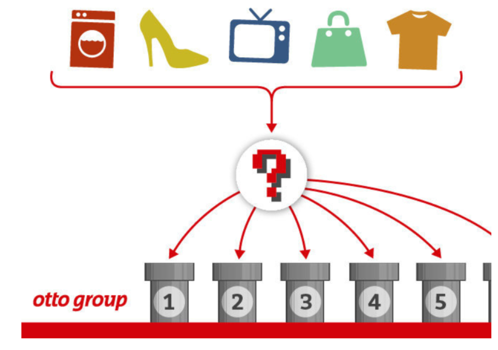

# otto案例介绍 

## 1 背景介绍

otto集团是世界上最大的电子商务公司之一，在20多个国家设有子公司。该公司每天都在世界各地销售数百万种产品,所以对其产品根据性能合理的分类非常重要。

不过,在实际工作中,工作人员发现,许多相同的产品得到了不同的分类。本案例要求,你对奥拓集团的产品进行正确的分类。尽可能的提高分类的准确性。

链接：https://www.kaggle.com/c/otto-group-product-classification-challenge/overview

------

## 2 思路分析

- 1.数据获取
  - 数据可视化
  - 数据分析
- 2.数据基本处理
  - 2.1 截取部分数据
  - 2.2 把标签值转换为数字
  - **2.3 分割数据**
  - **2.4 数据标准化**
  - **2.5 数据pca降维**
- **3.模型训练**
  - **3.1 基本模型训练**
  - 3.2 模型调优
    - 3.2.1 调优参数:
      - **n_estimator,**
      - **max_depth,**
      - **min_child_weights,**
      - **subsamples,**
      - **consample_bytrees,**
      - **etas**
    - **3.2.2 确定最后最优参数**
