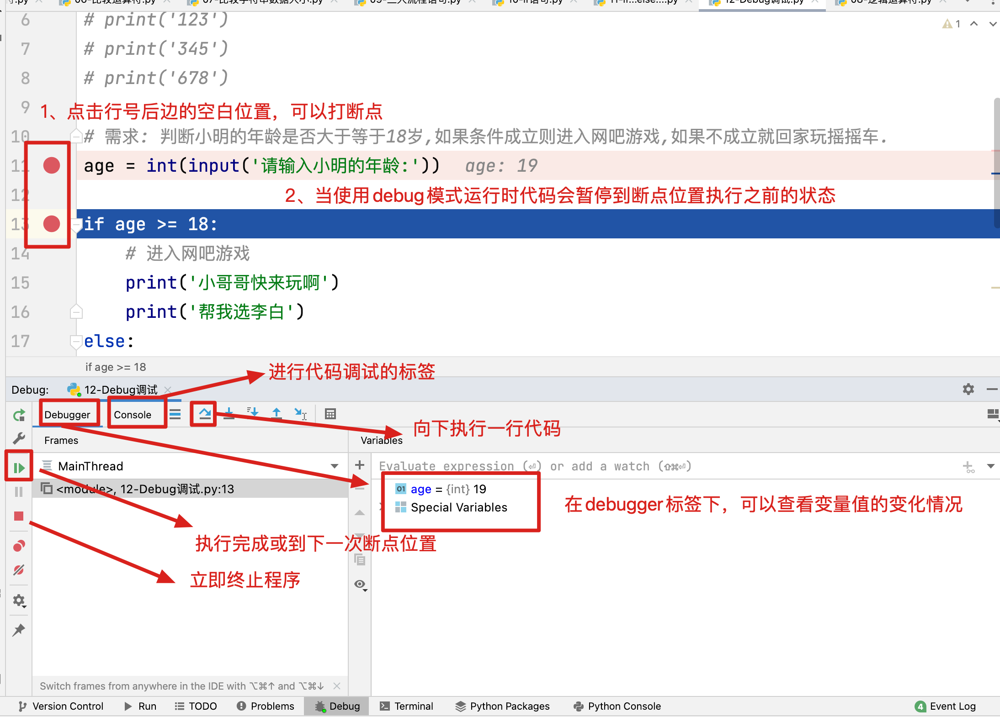

## 1、f-string字符串[了解]

```python
# 需求: 格式化输出一个学员的基本信息(姓名, 年龄, 身高, 学号)
name = '小芳'
age = 12
height = 1.68678
stu_NO = 3

# 使用%号方式格式化字符串并输出
# 学员的姓名为: 小芳, 学员的年龄是: 12岁, 学员的身高是: 1.680000米, 学员的学号是: 3
print('学员的姓名为: %s, 学员的年龄是: %d岁, 学员的身高是: %f米, 学员的学号是: %d' % (name, age, height, stu_NO))
# 身高保留两位小数, 学号为3位,不足位用0补齐
# 学员的姓名为: 小芳, 学员的年龄是: 12岁, 学员的身高是: 1.68米, 学员的学号是: 003
print('学员的姓名为: %s, 学员的年龄是: %d岁, 学员的身高是: %.2f米, 学员的学号是: %03d' % (name, age, height, stu_NO))

# f-string字符串是python3.6版本以上才可以使用的一种字符串格式化方式
# 格式: f'要输出的字符串{变量}'

print(f'学员的名字是{name}')  # 学员的名字是小芳
# f可以使用大写,也可以使用小写
print(F'学员的名字是{name}')  # 学员的名字是小芳

# 使用f-string字符串在一个字符串中拼接多个变量
# 如果字符串之前没有添加f则不能获取大括号内的变量信息
# 学员的姓名为: {name}, 学员的年龄是: {age}岁, 学员的身高是: {height}米, 学员的学号是: {stu_NO}
# print('学员的姓名为: {name}, 学员的年龄是: {age}岁, 学员的身高是: {height}米, 学员的学号是: {stu_NO}')

# 学员的姓名为: 小芳, 学员的年龄是: 12岁, 学员的身高是: 1.68678米, 学员的学号是: 3
print(f'学员的姓名为: {name}, 学员的年龄是: {age}岁, 学员的身高是: {height}米, 学员的学号是: {stu_NO}')

# 身高保留两位小数, 学号为3位,不足位用0补齐
# 保留n位小数  {变量: .2f}
# 不足位用0补齐  {变量: 03d}
# 学员的姓名为: 小芳, 学员的年龄是: 12岁, 学员的身高是: 1.69米, 学员的学号是: 003
print(f'学员的姓名为: {name}, 学员的年龄是: {age}岁, 学员的身高是: {height:.2f}米, 学员的学号是: {stu_NO:03d}')

```

## 2、练习

```python
# 练习
# 去超市购买苹果, 定义两个变量, weight 重量,  price 单价 ,计算总价
# 输出 我在超市购买了XX斤苹果, 单价XX元, 最终付款XX元

weight = 3.4
price = 12.6
total = weight*price

# 使用f-string进行格式化输出
print(f'我在超市购买了{weight}斤苹果, 单价{price}元, 最终付款{total}元')
# 需求: 我们想让最终付款金额,保留两位小数,并且四舍五入
# 格式{float类型数据 :.2f}
print(f'我在超市购买了{weight}斤苹果, 单价{price}元, 最终付款{total:.2f}元')

# 如果我们想输出整数,占用6位,不足位用0补齐
# 格式{int类型数据:06d}
stu_No = 3
print(f'我的学号是{stu_No:06d}')
# 在f-string字符串中d可以被省略
print(f'我的学号是{stu_No:06}')
```

## 3、数据类型转换补充[理解]

```python
# 使用场景:
# 1.当我们获取到的数据需要进行四则运算时,需要将数据转换为数值型(float, int)才能参与运算
# 2.比如我们想在数字之前加多个0, int float都不行,只能转换为str类型
# 3.不同中数据类型之间不能相加,所以也需要转换为同种数据类型才能相加(数值型(float,int,bool)都可以相加)

int1 = 10
float1 = 11.9999
str1 = '10'
str2 = '11.2'
str3 = 'abc'

# 常见的数据类型转换函数  int()  float()  str()  eval()

# int()
# float转换为int类型,可以转换成功,但是会将整数末尾所有的小数部分清除
print(int(float1))  # 11
print(type(int(float1)))  # <class 'int'>

print('-----------------------')
# str类型转换为int类型, 字符串内部必须是整型数据否则报错
print(int(str1))  # 10
print(type(int(str1)))  # <class 'int'>
# ValueError: invalid literal for int() with base 10: '11.2'
# print(int(str2))
# ValueError: invalid literal for int() with base 10: 'abc'
# print(int(str3))

print('-----------------------')
# float()
# int类型转换为float类型, 可以转化成功,但是在数据末尾需要添加.0
print(float(int1))  # 10.0
print(type(float(int1)))  # <class 'float'>

print('-----------------------')
# str类型转换为float类型, 如果引号内是整型或者浮点型数据则可以转换成功,否则失败
print(float(str1))  # 10.0
print(type(float(str1)))  # <class 'float'>

print(float(str2))  # 11.2
print(type(float(str2)))  # <class 'float'>

# ValueError: could not convert string to float: 'abc'
# print(float(str3))


print('-----------------------')
# str()
# 任何数据类型都可以转换为str数据类型
print(str(int1))  # 10
print(type(str(int1)))  # <class 'str'>
print(str(float1))  # 11.9999
print(type(str(float1)))  # <class 'str'>

print('-----------------------')
# eval() 去除字符串左右两侧的引号,内部是什么就运行什么
str4 = '12'
print(eval(str4))
print(type(eval(str4)))

str5 = '12.6'
print(eval(str5))
print(type(eval(str5)))

str6 = 'False'
print(eval(str6))
print(type(eval(str6)))

# 解释: 将下方字符串左右两侧的引号去除,就是打印hello world 的代码,所以使用eval可以打印hello world
eval("print('hello world')")  # hello world

# NameError: name 'aaa' is not defined
# 将str7左右两侧的引号去除,aaa就是一个变量名,但是变量名没有被定义所以会报错
# 注意: 变量必须先定义再调用
str7 = 'aaa'
print(eval(str7))
print(type(eval(str7)))
```

## 4、今日新知识

- 运算符
  - 算数运算符
  - 赋值运算符
  - 比较运算符
  - 逻辑运算符

- **分支语句**
  - 单条件分支
  - 对立条件分支
  - 多条件分支
  - 分支语句案例
- **循环语句**
  - while循环到的基本用法


## 5.算术运算符[理解]

```python
# python中常用的算数运算符:
# + 加 取两个数的和
print(1 + 3)  # 4
# - 减 取两个数的差
print(5 - 4)  # 1
# * 乘 取两个数的积
print(2 * 3)  # 6
# / 除 取两个数的商
print(9 / 2)  # 4.5
print(9 / 3)  # 3.0
# // 整除  11 / 2 商 5 余 1  整除取的就是整数商部分
print(11 // 2)  # 5
print(11.2 // 2)  # 5.0
# % 取模/取余 11 / 2 商 5 余 1 取模取得是余数部分
print(11 % 2)  # 1
# ** 幂次运算
print(2 ** 3)  # 代表2的三次方 8

# 注意: 除法运算的结果是浮点型数据,其余运算中只要有浮点型数据参与计算结果为浮点型

# 算数运算符的优先级
# 先乘除后加减  整除和取模运算优先级和乘除相同
# 测试后法相两个算式都是从左至右依次计算,所以算数运算优先级相同
print(5 // 2 * 2)  # 4
print(5 * 3 // 2)  # 7
# 测试后法相两个算式都是从左至右依次计算,所以算数运算优先级相同
print(5 % 2 * 2)  # 2
print(5 * 3 % 2)  # 1

# 幂次运算的优先级高于其他算数运算符
print(2 * 3 ** 2)  # 18

# 总结 : ** > * / // % > + -
# 注意: 算数运算符优先级不要背, 计算时如果不清楚就使用小括号修改优先级 括号内部优先计算

print((2 * 3) ** 2)  # 36  在进行算数运算时 建议多使用小括号,不仅可以防止优先级问题造成的计算失误,还可以增加代码的可读性

# 注意:
# 1. 程序员是没有办法口算十以内的加减法的,更不能计算四则运算,要求只要是计算,我们提供逻辑,计算机负责运算
# 2. 不要去背诵记忆运算符优先级,善于使用()去规定运算的先后顺序
```


## 6.赋值运算符[理解]

```python
# = 是赋值运算符, 作用就是将等号右侧的数据赋值给等号左侧的变量
name = '小明'
print(name)  # 小明
nick = name
print(nick)
# 等号左侧只能是变量, 等号右侧可以是数据或者已经被定义的变量
# '小芳' = name
# 12 = age

# 1. 可以对于一个变量进行多次赋值,但是我们变量中仅保存最后一次赋值的数据
name = '大黄'
print(name)  # 大黄

# 2. 可以使用连等一次性给多个变量赋值
# 但是必须给多个变量赋相同的值,也就是前边有多个变量,最后只能有一个值
a = b = c = 1
print(a, b, c)  # 1 1 1

# 3. 可以使用逗号分隔一次性给多个变量赋值
# 但是要保证等号左侧的变量数量和等号右侧的变量数量保持一致,不能多也不能少
num1, num2 = 1, 2
print(num1, num2)  # 1 2

# 4. 变量必须先定义后调用,否则报NameError的错误
# NameError: name 'school' is not defined
# print(school)
# school = '传智'

# 5. 复合赋值运算符
# 其实复合赋值运算符就是将算数运算符和复制运算符连接在一起, 当进行赋值之前,需要先进行算数运算
# += -= *= /= %= //= **=

var1 = 12
# var1 += 3 就等价与 var1 = var1 + 3
var1 += 3
print(var1)  # 15

var2 = 3
# var2 *= 2 等价于 var2 = var2 * 2
var2 *= 2
print(var2)  # 6

# 注意: 符合赋值运算符,等号左侧必须是已经被定义的变量,右侧是已经被定义的变量或值
# 例如: var1 += 3 就等价与 var1 = var1 + 3 如果此时 var1未被定义,则先计算var1 + 3 时 var1未被定义,直接报错(变量必须先定义后调用)
```

## 7.比较运算符[重要]

```Python
# 比较运算就是比较两个数值是否相等或者谁大谁小的运算符, 运算符计算的结果是布尔类型数据
# 常用的比较运算符: > < >= <= != ==
# == 判断两个数据是否相等, 相等返回True 不相等返回Flase
# 注意: = 不能判断是否相等,这个是赋值运算符
# SyntaxError: expression cannot contain assignment, perhaps you meant "=="?
# print(1 = 2)
print(1 == 2)  # False
print(1 == True)  # True

# != 判断两个数据是否不等, 不相等则返回True, 相等则返回False
# 在比较运算符中, Flase 就等于 0   True 就等于 1
print(1 != 2)  # True
print(1 != False)  # True

# >
print(3 > 2)  # True
# <
# >=
# <=
print(3 <= 3)  # True

# 如果数据类型不相同 除了 (int float bool)之外 比较大小不成立
# TypeError: '>' not supported between instances of 'int' and 'str'
# print(1 > '2')
# TypeError: '<=' not supported between instances of 'int' and 'str'
# print(1 <= '2')

# 如果数据类型不相同,除了 (int float bool)之外,则判断是否相等时不会报错,但一定不相等
print(3 != '3')  # True
print(5 == '5')  # False
```

## 8.字符串大小比较[了解]

```python
# 字符串之间可以进行比较运算
print('3' > '4')  # False
print('15' < '18')  # True
print('19' > '5')  # False

# 字符串之间比较大小的规则
# 1. 字符串间比较大小,是按照字符的编码序号进行比较的
# ascii码: 美国信息交换标准码 一共128位 代表128个常用字符,可以满足当时的美国正常通讯需求
# GBK: 国标扩展码 内部包含了所有的汉字 可以将二进制数据转码为中文字符, 兼容ascii码
# unicode码: 也叫做万国码, 包含了全世界大部分国家的语言, 符号,表情等, 包括unicode8  unicode 16  unicode32 等, 数字越大,包含的字符数量越多, 兼容ascii码
# 规则:  数字 < 大写字母 < 小写字母 < 汉字
print('A' > 'a')  # False
print('A' < '传')  # True

# 2. 字符串中有多个字符,则从左至右依次对比,如果一个字符大则大, 如果字符大小相同,则继续比较下一位 (空值最小)
# 两个字符串进行比较,先从第一位开始比较, 1 小于 5 则 5大,后续将不继续比较
print('19' > '5')  # False

# 两个字符串进行比较,先从第一位开始比较,两个字符串第一位都是5,则继续比较第二位, 1 < 3 所以53大
print('51' < '53') # True

# 两个字符串进行比较,先从第一位开始比较,两个字符串第一位都是3,则继续比较第二位, 第二位依旧相同都等于3,则继续比较第三位,第三位一个有值一个没有值,则有值的大, 所以331大
print('331' < '33') # False

# 思考
print('998' > '99a')  # False
print('12' > '123')  # False
print('123' > ' 123')  # True

# 注意: 一般我们不会使用字符串进行数字逻辑的比较,而一般比较字符串是为了排序
```

## 9.逻辑运算符[重要]

```python
# 逻辑运算符
# and 逻辑与 , 同真即真
# 例如: 我要拿上电脑,穿上衣服去上课 电脑和衣服缺一不可
print(True and True)  # True
print(False and True)  # False
print(True and False)  # False
print(False and False)  # False

print('--------------')

# or 逻辑或 , 同假即假
# 例如: 我打车或者坐公交车去上课 打车和坐公交车满足其一就可以去上课了
print(True or True)  # True
print(True or False)  # True
print(False or True)  # True
print(False or False)  # False

print('--------------')

# not 逻辑非 , 真假互换
print(not False)  # True
print(not True)  # False

# 注意: 在开发中我们一般会将逻辑运算与其他表达式一起使用,不会使用True或False作为条件
# 例如:
num1 = float(input('请输入一个数字'))

print(num1 > 10 and num1 < 16)
print(num1 > 10 and num1 < 16 and num1 != 13)
```

## 10、Python中的三大流程语句[了解]

- 顺序语句
- 分支语句（判断语句）
- 循环语句

```python
# 1.顺序语句: Python默认代码都是顺序执行的
print('hello Python')
print('hello bigdata')
print('hello 传智')
'''
打印结果:
hello Python
hello bigdata
hello 传智

代码永远都是从上到下依次执行的
'''
# 2.分支语句: 使用if进行构造,在同一条件下,只能有一个分支中的代码被执行

# 3.循环语句: 使用 for 或者 while 构造, 条件满足时可以重复执行相同或相似的代码,条件不成立时跳出循环
```

## 11、单条件分支语句[**重要**]

```python
# if 是构造分支语句的关键字
"""
分支语句格式:
if 条件语句:
    条件成立时执行的代码块

首先判断条件是否成立,如果成立则执行代码块,如果不成立则什么也不做
"""

# 需求: 判断小明的年纪是否大于等于18岁,如果大于等于18岁则可以进入网吧网游戏
age = int(input('请输入小明的年龄: '))

if age >= 18:
    print('小哥哥,快来玩呀')
    print('好的,帮我选李白')

# 注意: python中没有大括号控制分支范围,那么if控制的范围需要使用缩进来进行标明
# 在 if 后的条件末尾必须增加: 下一行内容务必缩进(建议缩进一个tab键的位置或者4个空格)
# if控制的所有代码务必对齐.

# 当取消缩进后,就不在if 控制的范围之内了
print('程序结束')

练习： 小明考试得分  如果大于90分  爸爸就给买新手机  否则就再考一次
score = 10
if socre >= 90:
  	print('可以买新手机了')
    print('我要选李白')
```


## 12、对立条件分支语句[**重要**]

```Python
# if...else...  对立条件分支语句
"""
分支语句格式:
if 条件语句:
    条件成立时执行的代码块
else:
    条件不成立时执行的代码块

首先判断条件是否成立,如果成立则执行if控制的代码块,如果条件不成立则执行else控制的代码块

条件语句就是一个结果是bool类型,或者可以转换为布尔类型的数据.
"""

# 需求: 判断小明的年龄是否大于等于18岁,如果条件成立则进入网吧游戏,如果不成立就回家玩摇摇车.
age = int(input('请输入小明的年龄: '))

if age >= 18:
    print('你要选什么呢?')
    print('我要选李白')
else:
    print('给你一块钱,回家玩摇摇车吧')
    print('记得给硬币')

# 注意: 同一情况下,if控制的代码块和else控制的代码块必有一个被执行,且绝不可能同时执行.

# 此处已经不在分支语句内部,无论条件是否成立都会被执行.
print('程序结束')
```


## 13、Debug调试[掌握]

```python
# Debug模式  也叫调试模式或者纠错模式
# 在代码去右键点击debug
# 在debug模式下,代码会暂停到断点行执行之前的状态(断点就是程序中断的点)
# 在此状态下,我们可以查看代码的执行流程和变量的值
```



## 14、多条件分支语句[**重要**]

```python
# if...elif...else... 多情况分支语句
"""
书写格式:
if 条件1:
    条件1成立时执行的代码
elif 条件2:
    条件2成立时执行的代码
elif 条件3:
    条件3成立时执行的代码
....
else:
    上述条件均不成立时执行的代码

如果条件1成立则执行if 中的代码块, 条件2成立执行第一个elif中的代码块,
以此类推,当所有条件均不满足时,则执行else中的代码块
"""

# 根据女生的年龄不同夸赞女生
# age = 80
#
# if age < 0 or age > 120:
#     # 判断如果不在正常年龄范围内,即说明数据异常
#     print('数据异常')
# elif 0 <= age < 18:
#     print('小妹妹你真可爱')
#     print('叔叔,我们不约而同的认为我很可爱')
# elif 18 <= age < 40:
#     print('美女,你真漂亮')
#     print('彩礼钱三千万')
# elif 40 <= age < 60:
#     print('阿姨,您真端庄')
#     print('小伙子,又不想努力啦')
# else:
#     print('老奶奶,您真慈祥')
#     print('我北京三套房')


# 不等号可以连续使用,但是这种使用方式只能在Python中.

# 对于多情况分支语句的优化
# 当age = 30时 条件三个条件四均满足 此时执行哪个条件中的命令
age = 30

if age < 0 or age > 120:  # 条件1 如果条件1 不成立,证明该数据 0 <= age <=120
    # 判断如果不在正常年龄范围内,即说明数据异常
    print('数据异常')
elif age < 18:  # 条件2  判断到条件2时证明条件1不成立所以默认有0 <= age <=120条件
    print('小妹妹你真可爱')
    print('叔叔,我们不约而同的认为我很可爱')
elif age < 40:  # 条件3 判断到条件3时证明条件2不成立所以默认有18 <= age <=120条件
    print('美女,你真漂亮')
    print('彩礼钱三千万')
elif age < 60:  # 条件4 判断到条件4时证明条件3不成立所以默认有40 <= age <=120条件
    print('阿姨,您真端庄')
    print('小伙子,又不想努力啦')
else:
    print('老奶奶,您真慈祥')
    print('我北京三套房')
    
# 结论: 分支语句从上到下依次进行判断,,如果不成立则继续向下判断, 当一个条件满足时,则进入其控制的代码块执行代码
# 代码块执行完成后,跳出分支语句,不继续向下判断
# 重点:换句话说,分支语句中只有一个分支中的代码会被执行

# 练习： 小明考试得分   0-60 不及格  60-70及格  70-80中等 80-90良好  90-100优秀  根据小明的得分，写出评级

# 定义分数变量
score = 55

if score > 100 or score < 0:
    print('分数异常')
elif score < 60:
    print('不及格')
elif score < 70:
    print('及格')
elif score < 80:
    print('中等')
elif score < 90:
    print('良好')
# elif score <= 100:
#     print('优秀')
else:
    print('优秀')

# 注意事项:
# 1.情况要判断完全.如果不确定自己可以判断完全,最好书写else
# 2.60 < score < 100  等价于  score < 100  and score > 60
# 3.如果使用熟练,最好省略多余的条件

```


## 15、分支语句的嵌套[了解]

```python
"""
分支语句嵌套的格式:
if 外层条件语句:
    外层条件成立时执行的代码块
    if 内层条件语句:
        内层条件成立时执行的代码块
else:
    外层条件不成立时执行的代码块
    if 内层条件语句:
        内层条件成立时执行的代码块

# 只有外层条件成立时,才能执行内存分支语句,所以内层分支语句是否执行由外层条件决定
"""
# 情节描述：上公交车，并且可以有座位坐下
# 要求：输入公交卡当前的余额，只要超过2元，就可以上公交车；如果车上有空座位，就可以坐下。
# 分析: 只有余额大于两元的情况下,才需要判断是否有座位,否则无需判断
money = 3
seat = True

# 判断公交卡余额是否大于等于2元
if money >= 2:
    print('赶紧上车吧')
    # 当上车之后就可以判断是否有座了
    if seat:
        print("赶紧坐下,车要开了")
    else:
        print('抓紧扶好,要飙车了')
else:
    print('穷鬼,跟着车跑吧,不费油')


# 案例二: 输入一个整数,判断其为正奇数,正偶数,负奇数还是负偶数或者是0
num = int(input('请输入一个整数:'))

if num > 0:
    # 输出正负,并将结束符变成空字符串
    print('正', end='')
    if num % 2 == 0:
        print('偶数')
    else:
        print('奇数')
elif num < 0:
    print('负', end='')
    if num % 2 == 0:
        print('偶数')
    else:
        print('奇数')
else:
    print('该数字为0')
```

## 16、猜拳游戏[掌握]

```python
'''
猜拳游戏规则
1. 输⼊要出的拳 —— ⽯头（1）／剪⼑（2）／布（3）
2. 电脑 随机 出拳 —— 先假定电脑只会出⽯头，完成整体代码功能
3. ⽐较胜负
'''
import random
# 下方随机整数范围为 1, 2, 3  所以randint函数是一个左闭右闭的区间
# print(random.randint(1, 3))

# 1. 获取玩家拳型 ⽯头（1）／剪⼑（2）／布（3）
player = int(input('请输入您要出的拳型:(石头 1, 剪刀 2, 布 3)\n'))
# 2. 获取电脑拳型 ⽯头（1）／剪⼑（2）／布（3）
# random是python内置的三方库, 内部提供了随机数的生成函数
computer = random.randint(1, 3)
# 3. 判断玩家和电脑的拳型比对后输出谁获胜了
'''
p  c  w
1  1  -
1  2  p
1  3  c
2  1  c
2  2  -
2  3  p
3  1  p
3  2  c
3  3  -
'''
if (player == 1 and computer == 2) or (player == 2 and computer == 3) or (player == 3 and computer == 1):
    print('玩家获胜')
elif player == computer:
    print('平局')
else:
    print('电脑获胜')

```

- 缩进就是tab键
- 取消缩进就是 shift + tab

## 17、三目运算符[了解]

```python
# 如果一个数据参与运算就是单目: not False
# 如果两个数据参与运算就是双目: 1 + 2
# 三目运算: 三个数据参与运算

# 三目(三元)运算符的格式 : 条件成立时的到的结果 if 条件 else 条件不成立时得到的结果

# 需求: 有两个变量 a 和 b  打印a 和 b 中 较大的值
# 使用分支语句完成
a = 19
b = 26

if a > b:
    print(a)
else:
    print(b)

print('---------------------------')

# 使用三目运算符完成
print(a if a > b else b)

# 三目运算符的结果可以复制给变量
res = a if a > b else b
print(res)

# 在某些情况下,三目运算符可以替换ifelse  但是局限性比较大
# 1. 三目运算符不能返回否则的代码结构,例如分支嵌套, 循环等内容
# 2. 三目运算符如果过于复杂,可读性极差
```

## 18、循环语句的体验[了解]

```python
# 循环语句: 当条件满足时,重复做相同或者相似的事情
# 在Python中构成循环语句的关键字有两个  while  for

# 体验Python中的循环
"""
while 循环的格式:
while 判断条件:
    判断条件成立循环执行的代码1
    判断条件成立循环执行的代码2

注意: 不在while控制的缩进范围内的代码不参与循环
"""

i = 0
while i < 10000:
    print('老婆,我错了...')
    print('你哪错了...')
    i += 1

print('买个包我就原谅你.')

# 循环可以提高开发效率,但是不一定会提高执行效率
```

## 19、while语句详解[**重要**]

```python
"""
while 循环的格式:
while 判断条件:
    判断条件成立循环执行的代码1
    判断条件成立循环执行的代码2

注意: 不在while控制的缩进范围内的代码不参与循环
"""

# 需求: 输出从1-5的连续整数
# 数据从几开始  1
# 数据到几结束  5
# 循环条件是什么?  创建一个变量每次循环自增1 当变量大于5时 结束循环
# 循环的内容是什么? 输出数值

# 1. 创建一个变量从1 开始
i = 1
# 2. 构造循环语句,循环条件就是让i值小于结束值
while i <= 5:
    # 3. 每次循环打印相关数据
    print(i)
    # 4. 循环体执行结束后,给i 自增1
    i += 1

# 缩进结束后,就不在循环体控制范围之内了
print('程序结束')

# i 又被称为循环变量,用于控制循环的次数,或者说控制循环的跳出条件

# 循环是否一定需要循环变量呢? 如果没有循环变量会怎样?
# while循环的必备条件: while关键字, 循环条件 循环体


# 循环变量可以没有
# 此时没有循环变量,循环条件一直成立,循环正常执行
while True:
    print('1')
# 这种循环条件恒成立的情况叫做死循环,也叫做无限循环
# 死循环是程序的一种正常执行状态,不一定是bug

# 如果没有循环变量一定会成为死循环么?
# 不一定,可以使用一些非循环变量作为结束条件,比如 时间

```


