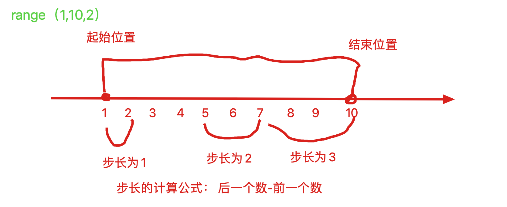
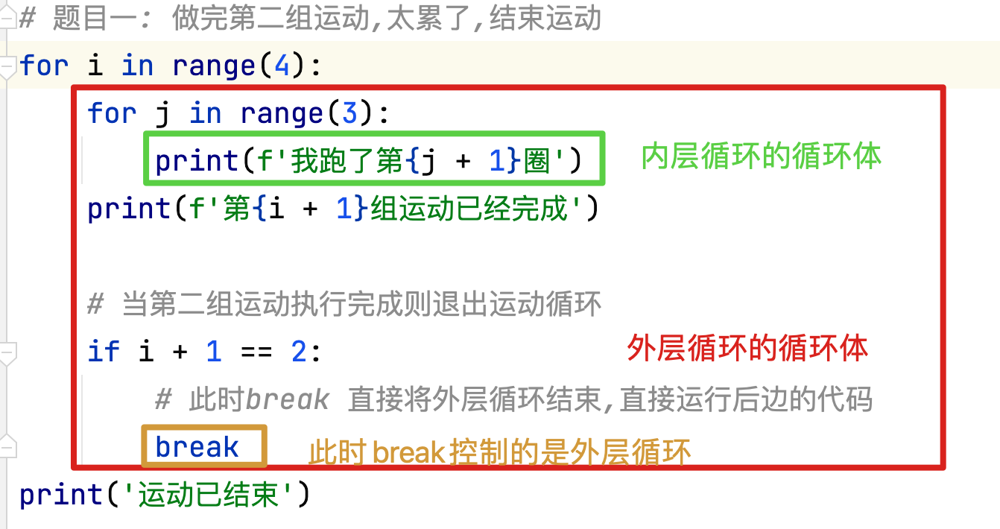
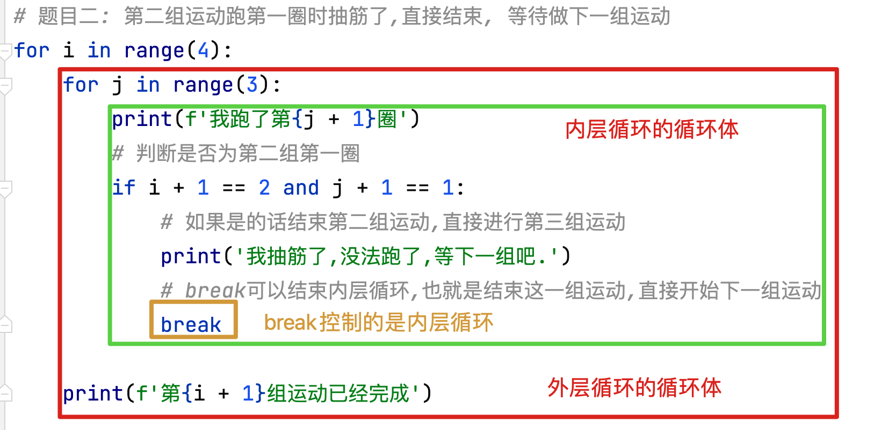

## 1、while的应用（1-100的累加和）

```python
# 需求: 使用while循环快速计算1-100的累加和
"""
如果我想计算1-100的累加和 我应该怎么办?
1   2   3   4   5 .... 100
1.先计算1 + 2  将结果记录
2.之前计算的结果加上3,将结果记录
3.之前计算的结果加上4,将结果记录
4.之前计算的结果加上5,将结果记录
....
100.之前计算的结果加上100,将结果记录

最终的结果就为1-100的累加和

分析: 我们做了一百次相似的事情 将上一次计算的结果个下一个数字进行相加
1. 每次相加的数字都递增1
2. 我们要使用一个变量记录每一次计算的结果
"""

# 第一步: 获取1 - 100 的所有整数
# 1. 从几开始循环
i = 1
# 2. 到几结束循环
while i <= 100:
    # 3. 循环体中要打印每一个数字
    print(i)
    # 4. 循环变量自增,让下一次输出的数据累加1
    i += 1

# 第二步: 将 1 - 100 的数字累加到一起
# 1. 从几开始循环
i = 1
# 添加一个累加器,记录每次累加的结果(累加器一定要放在循环体外部,否则每次循环都会重新初始化)
sum1 = 0
# 2. 到几结束循环
while i <= 100:
    # 3. 在循环体中累加每一次计算的结果(要创建一个变量记录每一次的累加结果)
    sum1 = sum1 + i
    # 4. 循环变量自增, 让下一次累加的数组自增1
    i += 1

# 5. 打印最终计算的结果
print(sum1)  # 5050

```

```python
# 练习: 计算1-20的累乘积  1 * 2 * 3 .... * 20 = ?
# 创建循环变量
i = 1
# 创建一个累乘器
mul = 1
# 设置循环条件
while i <= 20:
    # 数据累乘
    mul *= i
    # 循环变量自增
    i += 1

print(mul)
```

## 2、while的应用（1-100的偶数累加和）

```python
# 需求: 使用while循环 快速计算1-100的偶数累加和

# 分析: 计算累积和和偶数累积和唯一的区别就是要判断数值的奇偶性, 该数据判断应写在循环体中

# 创建循环变量
i = 1
# 创建累加器
sum1 = 0
# 设置循环条件
while i <= 100:
    # 判断数据奇偶性
    if i % 2 == 0:
        # 如果是偶数则累加
        sum1 += i
        # 如果是奇数则什么也不做
    # 循环变量自增
    i += 1

# 打印结果
print(sum1)
```

## 3、循环嵌套

```python
# 循环嵌套,就是在一个循环的循环体中书写了另外一个循环

# 需求: 我现在要做4组运动 每组运动内容如下
# 跑3圈  做5个蹲起

# 分析: 如果做4组动作,每组动作相同可以使用循环, 跑3圈  5个蹲起也可以使用循环

# 第一步: 做一组动作
# 使用循环功能跑三圈
i = 1
while i <= 3:
    print(f'我跑了{i}圈...')
    i += 1
# 使用循环功能做5个蹲起
i = 1
while i <= 5:
    print(f'我做了{i}个蹲起...')
    i += 1

print('一组动作已经完成')

print('-' * 30)

# 第二步: 要做四组运动
i = 1
while i <= 4:
    print(f'第{i}组动作已经完成')
    i += 1

print('-' * 30)

# 第三步: 将第一步中的运动细节,替换到第二步的代码块中
# 注意: 使用循环嵌套时,一定要注意,内外层的循环,循环变量名一定不能相同
# i = 1
# while i <= 4:
#     # 使用循环功能跑三圈
#     i = 1
#     while i <= 3:
#         print(f'我跑了{i}圈...')
#         i += 1
#     # 使用循环功能做5个蹲起
#     i = 1
#     while i <= 5:
#         print(f'我做了{i}个蹲起...')
#         i += 1
#     # 输出当前完成的第几组运动
#     print(f'第{i}组动作已经完成')
#     i += 1
#
# print('程序结束...')

j = 1
while j <= 4:
    # 使用循环功能跑三圈
    i = 1
    while i <= 3:
        print(f'我跑了{i}圈...')
        i += 1
    # 使用循环功能做5个蹲起
    i = 1
    while i <= 5:
        print(f'我做了{i}个蹲起...')
        i += 1
    # 输出当前完成的第几组运动
    print(f'第{j}组动作已经完成')
    j += 1

print('程序结束...')

```

## 4、循环嵌套的应用（输出五行五列的矩阵）

```python
# 需求: 使用while循环,快速打印矩形
"""
* * * * *
* * * * *
* * * * *
* * * * *
* * * * *
"""

# 第一步: 要输出一行*(使用循环输出)
i = 1
while i <= 5:
    # 当打印结束时,会自动换行,所以无法打印一行数据.
    # 如果想打印一样数据,就要修改结束符,让其无法自动换行
    print('*', end=' ')
    i += 1

print('\n---------------------')

# 第二步: 要输出多行 * (5行)
# 循环打印五次一行数据即可
j = 1
while j <= 5:
    i = 1
    while i <= 5:
        # 当打印结束时,会自动换行,所以无法打印一行数据.
        # 如果想打印一样数据,就要修改结束符,让其无法自动换行
        print('*', end=' ')
        i += 1
    # 由于换行符都进行了替换,所以在此处需要print一个换行符
    print()  # 结束符默认就是\n
    j += 1

# 思考: 当前i 是行数还是列数呢? 列数
# 思考: 当前j 是行数还是列数呢? 行数

# 结论: 外层循环控制行, 内层循环控制列
# 如果需要打印一个4行8列的矩形,我们应该如何修改呢?
j = 1
while j <= 4:
    i = 1
    while i <= 8:
        # 当打印结束时,会自动换行,所以无法打印一行数据.
        # 如果想打印一样数据,就要修改结束符,让其无法自动换行
        print('*', end=' ')
        i += 1
    # 由于换行符都进行了替换,所以在此处需要print一个换行符
    print()  # 结束符默认就是\n
    j += 1

# 练习:
# 使用循环嵌套,打印如下直角三角形
'''
* 
* *  
* * *  
* * * *  
* * * * * 
'''
# 分析1: 第一行打印1个*  第二行打印2个* 以此类推,我们得出结论, * 的个数就是行数
# 分析2: 如果想要打印一列数据, 则让循环变量i从1开始, 使用 i <= 1作为循环条件, 想要打印几列,就让i <= 几即可
# 分析3: 当前数据的行数,就等于j, 如果想让打印与行数相同的列,则使用i <= 行数即可, 也可以说 是 i <= j

j = 1
while j <= 5:
    i = 1
    while i <= j:
        print('*', end=' ')
        i += 1
    print()
    j += 1

'''
* * * * * 
* * * *  
* * *  
* *  
* 
'''

j = 1
while j <= 5:
    i = 1
    while i <= 6 - j:
        print('*', end=' ')
        i += 1
    print()
    j += 1

```

## 5、猜拳游戏的优化[**重要**]

```python
# 需求: 对猜拳游戏进行优化
# 1.让猜拳游戏循环进行
# 2.让猜拳游戏计算得分,谁赢了积一分, 输了不扣分,平局不扣分也不得分
# 3.其中一方得分超过3分则结束游戏
# 快捷键:反向导包: alt+enter
import random

# TODO: 2.1 创建变量进行玩家和电脑分数的统计,一定要在循环体外部进行创建,否则每次循环都会初始化分数
player_score = 0
computer_score = 0

# TODO: 1. 使用while构建循环,让猜拳游戏循环进行
# TODO: 3.1 其中一方得分超过3分则结束游戏 (控制循环的跳出条件)
while player_score < 3 and computer_score < 3:
    # 1. 玩家出拳,拳型由键盘录入,用变量接受 (拳型: 1.剪刀, 2.石头,3.布)
    player = int(input('请输入您要出的拳型:(1.剪刀, 2.石头,3.布) '))

    # 2. 电脑出拳,拳型使用random模块随机生成 (拳型: 1.剪刀, 2.石头,3.布)
    computer = random.randint(1, 3)

    # 3. 使用分支语句,判断获胜方,并输出内容
    '''
    p c w  差
    1 1 -  0
    1 2 c  -1
    1 3 p  -2
    2 1 p  1
    2 2 -  0
    2 3 c  -1
    3 1 c  2
    3 2 p  1
    3 3 -  0
    '''
    if (player - computer == -1) or (player - computer == 2):
        # TODO: 2.2 当电脑获胜时,给电脑增加一分
        computer_score += 1
        print('电脑获胜')
    elif player == computer:
        print('平局')
    else:
        # TODO: 2.3 当玩家获胜时,给玩家增加一分
        player_score += 1
        print('玩家获胜')

    # TODO: 2.4 一局结束后,输出玩家和电脑的分数
    print(f'本局结束后双方得分为: 电脑{computer_score}分, 玩家{player_score}分')

# TODO: 3.2 输出最终获胜的人员
if player_score >= 3:
    print('最终玩家获得了胜利')
else:
    print('最终电脑获得了胜利')

print('游戏结束')
```

## 6、for循环遍历[**重要**]

```python
# for循环也是循环结构的一种,一般和容器类型搭配使用
# 循环规则: for循环就是依次从容器或数据序列中获取每一个元素,所有元素都获取完成后则跳出循环,继续执行后续代码
'''
格式:
for 临时变量 in 容器类型数据:
    循环体
'''

# 需求: 循环遍历一个字符串
for i in 'chuanzhi':
    print(i)

# 思考: for循环相比于while有什么缺点
# 1. 循环次数,和容器长度有关,如果要进行次数极多的循环,就要构建相当大的一个容器,则占用内存较多
# 2. 循环遍历的次数不明确,无法直观看到是第几次遍历

# 思考: for循环相比于while循环有什么优点
# 1. 代码更加精简,可读性更高
# 2. 不用控制循环变量,出现异常的概率更低.

# 注意:
# 1. 在所有情况下,while循环和for循环都是可以互相转换的. 一般遍历容器使用for, 根据条件循环使用while
# 2. 构建死循环一般都使用while True.
# 3. 临时变量,不要在循环体外使用(因为如果容器长度为0 则i未被创建)
# for j in '':
#     print(j)
#     
# print(j)
```

## 7、for循环搭配range函数使用[**重要**]

```python
# range函数就是一个范围函数,内部是根据特定规则生成的整数序列
# 使用格式: range(起始位置, 终止位置, 步长)

# 1. range从起始位置到终止位置时一个左闭右开区间
# 创建一个1-9的整数序列
# 注意: range函数的范围是一个左闭右开区间,从(1,9) 代表的范围就是从1-8的整数区间,这个就是包含1,不包含9, 不需要背.
num_ran = range(1, 9, 1)
print(num_ran)  # range(1, 9, 1)
print(list(num_ran))  # [1, 2, 3, 4, 5, 6, 7, 8]

print('-------------------------------')

# 2. range的步长可以省略,省略后默认步长为1
num_ran = range(1, 9)
print(num_ran)  # range(1, 9)
print(list(num_ran))  # [1, 2, 3, 4, 5, 6, 7, 8]
# 什么叫步长???  在按照规则获取数据时,后一个数字的位置需要减去前一个数字的位置序号为几, 步长就是几
# 我们使用range只可以创建一定规则的整数序列, 所有整数之间步长必须相等,否则无法创建.

print('-------------------------------')

# 3. range 函数可以省略起始位置, 例如 range(10) 默认从 0开始
num_ran = range(10)
print(num_ran)  # range(0, 10)
print(list(num_ran))  # [0, 1, 2, 3, 4, 5, 6, 7, 8, 9]

print('-------------------------------')

# 4. range中的步长可以是任意整数
num_ran = range(0, 10, 2)
print(num_ran)  # range(0, 10, 2)
print(list(num_ran))  # [0, 2, 4, 6, 8]
# TypeError: 'float' object cannot be interpreted as an integer
# num_ran = range(0, 10, 2.5)  range中的所有参数,只能使用整型数据

print('-------------------------------')
######################### 配合for循环使用range函数  #############################

# 需求: 打印从1-9的数字
for i in range(1, 10):
    print(i)

# 需求: 打印从1-9的数字累加和
sum1 = 0
for i in range(1, 10):
    sum1 += i
print(f'1-9的累加和是{sum1}')

# 需求: 打印从1-9的数字中的偶数累加和
sum1 = 0
for i in range(1, 10):
    if i % 2 == 0:
        sum1 += i
print(f'1-9的偶数累加和是{sum1}')

```



## 8、for循环输出一个5行5列的矩阵

```python
# 需求: 使用for循环,快速打印矩形
"""
* * * * *
* * * * *
* * * * *
* * * * *
* * * * *
"""

# 第一步: 输出一行 * (使用循环)
for i in range(5):
    print('*', end=' ')

print('\n-------------------')

# 第二步: 输出5行*
# 内外层循环次数,与i值无关时,可以内外层循环都使用同名变量,但是不建议,因为可读性极差.
# for i in range(5):
#     for i in range(5):
#         print('*', end=' ')
#     print()

for j in range(5):
    for i in range(5):
        print('*', end=' ')
    print()


'''
循环结束逻辑:
while循环根据循环条件判断是否循环结束
    while循环一般用循环变量来控制循环结束条件
for循环是根据容器内的元素个数决定是否循环结束
    for循环中不需要循环变量
    
循环使用场景:
while循环一般构造有特定结束条件的循环或者死循环
for循环一般只对于容器类型遍历时使用

注意:在开发中一般情况下while 和for 可以相互转换,但是for循环使用场景比while要广一些
'''
```

## 9、使用for循环输出一个五行五列的直角三角形

```python
# 练习:
# 使用循环嵌套,打印如下直角三角形
'''
* 
* *  
* * *  
* * * *  
* * * * * 
'''
# 分析1: 第一行打印1个*  第二行打印2个* 以此类推,我们得出结论, * 的个数就是行数
# 分析2: 如果想要打印一列数据, 则让循环变量i从0开始, 使用 range(n)作为被遍历的容器, 想要打印几列,就让range中的n 为几即可 几即可
# 在for循环中, 外层循环range中的数据控制行数, 内层循环range中的数据控制列数
# for j in range(3):
#     for i in range(8):
#         print('*', end=' ')
#     print()
# 分析3: 当前数据的行数,就等于j+1(因为range从0开始), 如果想让打印与行数相同的列,则使用range(j + 1)行数即可

for j in range(5): # [0,1,2,3,4]
    for i in range(j + 1):
        print('*', end=' ')
    print()
```

## 10、for循环实现九九乘法表

```python
"""
九九乘法表:
1*1=1
1*2=2  2*2=4
1*3=3  2*3=6 3*3=9
.......
........................9*9=81
"""
# 分析:乘法表中每一个公式的第一个数字就是列号, 第二个数字就是行号
# 得到结论:
# 1.九九乘法表是一个直角三角形的阵列, 9行9列
# 2.每一个公式的第一个数字就是列号, 第二个数字就是行号
# 3.每一个公式都是一个字符串

# 第一步: 打印一个直角三角形 9 行, 9 列
# 外部循环控制行数, 内部循环控制列数
for j in range(9):
    for i in range(j + 1):
        print('*', end=' ')
    print()

print('______________________')

# 第二步: 打印一个九九乘法表的阵列
# 将* 替换为一个字符串, '列 * 行 = 值'
for j in range(9):
    for i in range(j + 1):
        # 因为i 和j 都是从0开始的, 而 九九乘法表从1开始,所以我们需要再j 和 i 后边加1
        print(f'{i + 1} * {j + 1} = {(i + 1) * (j + 1)}', end=' ')
    print()

print('______________________')

# 第三步: 将结束符替换为\t(制表位) 保证数据对齐
for j in range(9):
    for i in range(j + 1):
        # 因为i 和j 都是从0开始的, 而 九九乘法表从1开始,所以我们需要再j 和 i 后边加1
        print(f'{i + 1} * {j + 1} = {(i + 1) * (j + 1)}', end='\t')
    print()

print('______________________')
```

练习3:

```python
# 练习3: 打印如下三角形 (使用循环嵌套, 提示空白部分可以打印空格)
'''
    *
   ***
  *****
 *******
*********
'''
# 分析1: 一共有多少行数据  5行  外层循环,循环5次
# 分析2: 一共有多少列空格, [4 3 2 1 0] 每一行的空格数是 5-n个, n为行数
# 分析3: 一共有多少列*, [1 3 5 7 9] 每一行的*数是2n-1  n为行数
# 分析4: 在同一行,既要书写空格,又要书写* 书写完成后在进行换行

# 外层循环执行5次,打印5行数据,range(1, 6) 则从1 - 5 每一行打印时,k获取的就是行数
for k in range(1, 6):
    # 打印空格  5-n
    for i in range(5 - k):
        print(' ', end='')
    # 打印* 2n-1
    for i in range(2 * k - 1):
        print('*', end='')
    # 外层循环执行一次后需要换行
    print()

```


## 11、break和continue[**重要**]

```python
# break: 用于终止循环, 即执行了break之后循环不再进行执行,直接执行下一句代码
# 举例: 辞职不干了

# 需求: 模拟吃苹果, 一共5个苹果,吃到第三个吃到半条虫子.
# 一共5个苹果,需要循环5次

# for
for i in range(1, 6):
    if i == 3:
        print('吃到了半条虫子,有点腻,不吃了!')
        # 当吃到半条虫子时,立即结束吃苹果的操作
        break
    print(f'我吃完了{i}个苹果')

print('吃完收工!!!')

print('____________________')

# while
i = 1
while i <= 5:
    if i == 3:
        print('吃到了半条虫子,有点腻,不吃了!')
        break
    print(f'我吃完了{i}个苹果')
    i += 1

print('吃完收工!!!')

```

```python
# continue: 用于结束本次循环中未执行的内容,直接进入下一次循环
# 举例: 类似于请一天假

# 需求: 模拟吃苹果, 一共五个苹果,吃到第三个,发现吃到一条虫子,这个苹果不吃了,继续吃下一个
# for
for i in range(1, 6):
    if i == 3:
        print('吃到了一条虫子,这个苹果让给虫子吧,不吃了,我吃下一个')
        continue
    print(f'我吃完了第{i}个苹果')

print('-----------------------')

# while
i = 1
while i < 6:
    if i == 3:
        print('吃到了一条虫子,这个苹果让给虫子吧,不吃了,我吃下一个')
        # 如果使用循环变量控制循环跳出,则在执行continue之前,必须进行改变
        i += 1
        continue
    print(f'我吃完了第{i}个苹果')
    i += 1

print('-----------------------')

# 也可以如下操作
i = 0
while i < 5:
    i += 1
    if i == 3:
        print('吃到了一条虫子,这个苹果让给虫子吧,不吃了,我吃下一个')
        continue
    print(f'我吃完了第{i}个苹果')


```


## 12、break和continue只能控制其所在的循环体

```python
# 做四组运动,每组运动 跑三圈
for i in range(4):
    for j in range(3):
        print(f'我跑了第{j + 1}圈')
    print(f'第{i + 1}组运动已经完成')

print('------------------------')

# 题目一: 做完第二组运动,太累了,结束运动
for i in range(4):
    for j in range(3):
        print(f'我跑了第{j + 1}圈')
    print(f'第{i + 1}组运动已经完成')
    # 当进行第二组运动时,太累了,直接结束运动不继续做运动了
    if i + 1 == 2:
        print('不行,太累了,回家做500个俯卧撑吧.')
        break

print('------------------------')

# 题目二: 第二组运动跑第一圈时抽筋了,直接结束, 等待做下一组运动
for i in range(4):
    for j in range(3):
        # 判断现在为第二组运动的第一圈
        if i + 1 == 2 and j + 1 == 1:
            print('抽筋了,跑不了了,等下一组运动吧')
            break
        print(f'我跑了第{j + 1}圈')
    print(f'第{i + 1}组运动已经完成')


# 结论:
# 1. break和continue只能控制当前所在循环体的循环方式.
# 2. 如果使用循环变量控制循环跳出,则在执行continue之前,必须进行改变
# 3. break 和continue只能使用在循环体中,否则报错

if True:
    print(123)
    # SyntaxError: 'break' outside loop
    # break只能用在循环体中
    # break
    
    # SyntaxError: 'continue' not properly in loop
    # continue也只能使用在循环体中
    # continue
    print(456)
```





## 13、循环中的else语句

- 循环异常终止则不会执行else中的命令
- 循环正常终止会执行else中的命令
- break会造成程序异常终止, continue不会

```python
# 回顾:if语句中的else是什么意思?当判断条件不满足要求时,执行else中的命令

"""
循环中的else:
格式:
    while 条件:
        循环体
    else:
        代码块
    当循环条件不满足时,执行else中的代码

    for 临时变量 in 容器类型:
        循环体
    else:
        代码块
    当容器类型的元素遍历完后执行else中的代码
# 总结: 当循环正常结束后,就要执行else中的代码

# 注意: 当循环异常终止时,else中的代码将不会执行
# while循环不是因为条件不成立而终止循环就是异常终止, 比如 break
# for 循环中元素没有遍历完就终止了循环属于异常终止, 比如break
# continue不会造成循环的异常结束
"""

# 需求: 下载软件分为10个安装包, 全部下载完则输出下载完成,否则不输出
# for
for i in range(10):
    print(f'第{i + 1}个安装包已经下载完成')
else:
    # 循环正常结束,该代码块被执行
    print('所有文件已经下载完成')

print('--------------------------')

for i in range(10):
    # 当下载到第6个安装包时,系统异常,终止下载
    if i + 1 == 6:
        print('系统异常,终止下载')
        break
    print(f'第{i + 1}个安装包已经下载完成')
else:
    # 使用了break 循环异常结束,该代码不会被执行
    print('所有文件已经下载完成')
# 写到循环体外,无论循环是否正常结束,均会执行此代码.
# print('所有文件已经下载完成')

print('--------------------------')

# while
i = 1
while i <= 10:
    print(f'第{i}个安装包已经下载完成')
    i += 1
else:
    # 循环正常结束,该代码块被执行
    print('所有文件已经下载完成')

print('--------------------------')

i = 1
while i <= 10:
    # 当下载到第6个安装包时,系统异常,终止下载
    if i + 1 == 6:
        print('系统异常,终止下载')
        break
    print(f'第{i}个安装包已经下载完成')
    i += 1
else:
    # 循环正常结束,该代码块被执行
    print('所有文件已经下载完成')

print('--------------------------')

# 思考: 使用continue 会造成循环异常结束么?
for i in range(10):
    # 当下载到第6个安装包时,由于网络波动,跳过该安装包下载
    if i + 1 == 6:
        print('由于网络波动,跳过该安装包下载')
        continue
    print(f'第{i + 1}个安装包已经下载完成')
else:
    # 使用continue不会影响循环的次数和循环条件的判断,所以循环依旧正常结束, else中的代码会被执行.
    print('所有文件已经下载完成')
```

## 14、报数游戏小案例

```python
# 需求:
# 一些同学从1开始报数，当需要报出的数字尾数是7或者该数字是7的倍数时，
# 则该同学跳过这个数字，不进行报数。所有同学都参与游戏后，游戏结束。
# 如输入学生数量为50，游戏结束后，报数的同学数量为39。

# 分析:
# 1.从1-50进行报数
# 2.如果数字位数为7 或者该数字是7的倍数时,该学员不报数
# 3.报数的同学的数量要进行记录

# 第一步: 从1-50开始报数
# for i in range(1, 51):
#     print(i)

# 第二步: 从1-50报数, 但是位数是7 或者是7的倍数的数字不打印
# for i in range(1, 51):
#     # 不能是7的倍数: i % 7 != 0
#     # 尾数不能是7: 17 27 37  这些数字除以10 ,余数都为7 i % 10 != 7
#     if (i % 10 != 7) and (i % 7 != 0):
#         print(i)

# 第三步: 从1-50报数, 但是位数是7 或者是7的倍数的数字不打印,并且打印了多少个数字,我们要进行记录
# 创建一个变量记录一共报了多少数
count = 0

for i in range(1, 51):
    # 不能是7的倍数: i % 7 != 0
    # 尾数不能是7: 17 27 37  这些数字除以10 ,余数都为7 i % 10 != 7
    if (i % 10 != 7) and (i % 7 != 0):
        count += 1
        print(i)

print(f'一共有{count}人报数')
```

```python
'''
# 猜数游戏
1.使用random 随机生成一个1-100之间的数字
2.循环用键盘输入猜测的数据
3.如果猜测的数据大于答案就输出‘您猜的数字太大了’
4.如果猜测的数据小于答案就输出‘您猜的数字太小了’
5.如果猜中了，则提示您猜对了，并退出游戏
'''

import random

# 1. 生成一个随机整数(一定要在循环体外部生成,否则每次循环都生成随机数)
ran_num = random.randint(1, 100)
start_num = 1
end_num = 100

# 2. 循环(循环跳出条件,就是猜对)
while True:
    # 3. 在循环体内部键入数值
    num = int(input(f'请输入您猜的数据值: [{start_num}-{end_num}]'))
    # 4. 比对键入的数值是否正确
    if ran_num < num:
        # 4.1 如果数据大则输出您猜的数字太大了
        print('您猜的数字太大了')
        end_num = num
    elif ran_num > num:
        # 4.2 如果数据小则输出您猜的数字太小了
        print('您猜的数字太小了')
        start_num = num
    else:
        # 4.3 如果猜中了则,提示您猜对了,跳出循环 退出游戏
        print('您猜对了')
        break

print('退出游戏')
```

