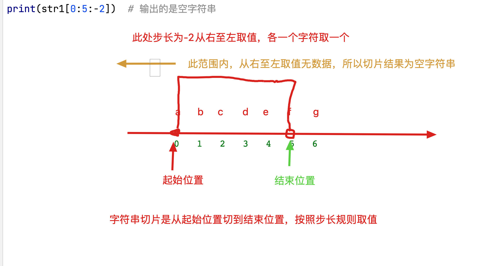
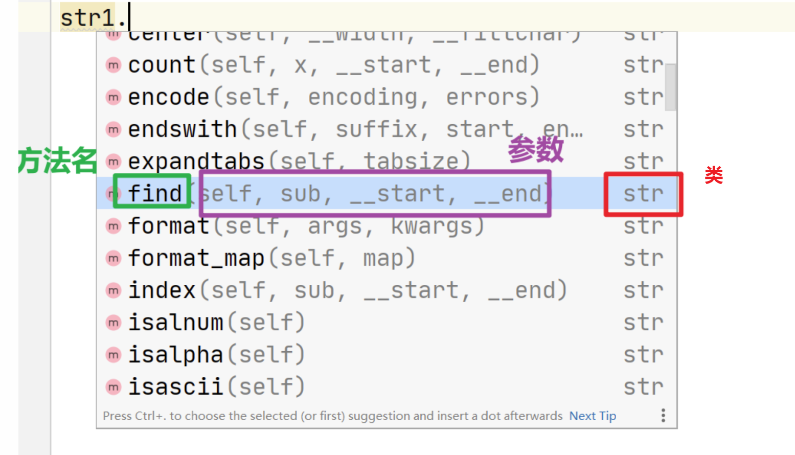

## 1、今日课程介绍（容器类型一）

- 字符串的定义
- 字符串的索引
- 字符串的切片和查找
- 字符串的其他函数
- 列表的格式
- 列表的遍历
- 列表的操作方式
  - 增删改查

> 注意：今天的知识点，不要去背，我们重点学习的是使用方法，不是函数或方法的背诵

## 2、容器类型

- 容器类型就是可以保存多个数据或变量的数据类型
- 容器类型的作用
  - 减少变量的定义，例如我们保存所有学员的名称，使用容器类型只需要一个变量即可
  - 容器类型中的元素可以使用for循环依次遍历获取
  - 容器类型有自己的增删改查的方法，便于使用
- 容器类型可以提高开发和存储（内存）效率
- 容器类型都有哪些：字符串(str)，列表(list)，元组(tuple)，字典(dict)，集合(set)


## 3、字符串的定义[**重要**]

```python
# 字符串的定义: 字符串就是多个字符的组合,将多个字符放入一个容器中就形成了一个字符串, 字符串类型是一个容器类型,可以迭代

# 方式一: 一对单引号
str1 = '一对单引号'
print(type(str1))

# 方式二: 一对双引号
str2 = "一对双引号"
print(type(str2))

# 方式三: 三对单引号
str3 = '''三对单引号'''
print(type(str3))

# 方式四: 三对双引号
str4 = """三对双引号"""
print(type(str4))

# 注意: 在python单引号双引号不敏感, 在开发中字符串使用单引号或双引号都可以,但是要保证一个项目中药统一. 单双引号要成对出现,不能混用  例如  : '传智"

# 思考: 使用一对引号和三对引号有什么区别呢?
str5 = '锄禾日当午,' \
       '汗滴禾下土!'
# 这种方法使用了 \(未完待续符),标记了下一行和上一行是同一行内容, 所以开发中这种换行方式不会对数据格式产生影响.
print(str5) # 锄禾日当午,汗滴禾下土!

str6 = '''
君不见黄河之水天上来,
奔流到海不复回
'''
# 这种方法在三对引号内部的换行效果将存储到数据中,打印时换行效果依然存在.
print(str6)

# 总结:三对引号中存放的数据,无需使用\n进行换行可以直接使用回车,并且换行效果可以打印出来
```

## 4、多种引号嵌套使用

```python
# 思考: 为什么我们要设计这么多种字符串的定义格式呢?
# 因为可以方便字符串的处理以及数据的存储

# 需求: 打印一个I'm Tom
# SyntaxError: invalid syntax  此时在数据内容中存在'与字符串边界冲突
# print('I'm Tom')
# 在数据内部的'前增加\防止其转义
print('I\'m Tom')

# 需求: 打印一个 鲁迅说 : 'I'm a 周树人'
print('鲁迅说 : \'I\'m a 周树人\'')

print('------------------')
# 以上方法,可以解决问题,也是绝大多数编程语言中解决字符串引号嵌套的常用方法,但是在python中我们可以使用多种引号嵌套的方式,避免使用转义字符
# 需求: 打印一个I'm Tom
print("I'm Tom")

# 需求: 打印一个 鲁迅说 : "I'm a 周树人"
# 无论使用单引号还是双引号都出错
# print('鲁迅说 : "I'm a 周树人"')
# print("鲁迅说 : "I'm a 周树人"")
print('''鲁迅说 : "I'm a 周树人"''')

# 思考: 我要输出:  '''鲁迅说:"I'm a 周树人"'''  我应该怎么办?

print("""'''鲁迅说:"I'm a 周树人"'''""")
```


## 5、字符串下标[**重要**]

```python
"""
字符串下标:
    所谓的下标就是指字符串的元素的索引(编号),每一个索引(编号)对应一个唯一的元素
    所有的下标均为整数,且连续,不可跳跃

    格式:
        字符串变量[索引] 根据索引获取字符串中指定位置的元素
"""

# 正数索引
str1 = '两个黄鹂叫喳喳.'
"""
两  个  黄  鹂  叫  喳  喳  .
0   1   2  3   4   5   6  7

注意: 正数索引从0开始,从左只有一次递增,连续不可跳跃,且每个元素对应唯一索引
"""

# 需求: 获取上述字符串中的黄字
print(str1[2]) # 黄

# 需求: 获取上述字符串中的叫字
print(str1[4]) # 叫

# 需求: 获取上述字符串中的最后一个元素
print(str1[7]) # . 无论是点还是空格都是一个单独的元素,占用一个索引值

# 思考: 如果使用的索引在字符串中不存在会怎样?
# IndexError: string index out of range 字符串索引超出范围后会报错
# print(str1[25])

# 负数索引
str2 = '一行白鹭齐刷刷.'
"""
一  行  白  鹭  齐  刷  刷  .
-8 -7  -6  -5  -4  -3 -2  -1

注意: 负数索引从-1开始从右至左依次递减
"""
# 需求: 获取上述字符串中的白字
print(str2[-6]) # 白

# 需求: 获取上述字符串中的齐字
print(str2[-4]) # 齐

# 需求: 获取上述字符串中的最后一个元素
print(str2[-1])

# 负数索引超出范围后一样会报错
# IndexError: string index out of range
# print(str2[-25])

# 注意:
# 1.在字符串中左侧数据的索引一定小于右侧数据的索引.
# 2.我们一般使用时都是使用正数索引,当想要获取末尾数据时使用负数索引. 
 
```

## 6、字符串切片[**重要**]

```python
# 切片:按照规则获取字符串中一部分元素的方法叫做切片
# 切片格式:[起始位置： 结束位置： 步长]
# 起始位置: 切片开始位置的下标[包含]
# 结束位置: 切片结束位置的下标[不包含]
# 步长: 获取数据的间隔(后一个索引,减去前一个索引)

# 创建一个字符串
str1 = 'abcdef'
'''
a   b   c   d   e   f
0   1   2   3   4   5 
-6 -5  -4  -3  -2  -1
'''
# 正数步长
# 需求: 获取abc
# 切片格式:[起始位置： 结束位置： 步长]
print(str1[0:3:1])  # abc  从下标为0的位置开始截取,到下标为3的位置终止,不包含3, 依次获取每一个元素
print(str1[-6:-3:1])  # abc  切片可以使用负数下标

# 思考: 如果切片的范围查出索引范围会怎样?
# 不会报错,如果切片范围超出则只保留能够获取的数据,如果切片范围不存在,任何数据则返回空字符串
print(str1[0:25:1])  # abcdef
print(str1[23:25:1])  # 空字符串

# 需求: 获取bdf
print(str1[1:6:2])  # bdf  因为我们需要包含最后一个元素,所以我们使用最有一个元素的下标+1作为结束索引

# 思考: 如果进行了切片,原数据会不会发生改变呢? 不会改变,切片会产生新的字符串,原字符串不变
print(str1)  # abcdef

str2 = str1[1:4:1]
print(str2)  # bcd

# 负数步长
# 当步长为负数时,我们获取数据的顺序不再是从左至右,而是从右至左
# 需求: 获取edc
# print(str1[2:5:-1]) # 空字符串  因为起始位置为2 结束位置为5 步长为-1时从右至左依次取值,该区间没有任何数据
print(str1[4:1:-1])  # edc

# 需求: 获取fdb
print(str1[5:0:-2])  # fdb

# 注意:
# 我们开发中一般都使用正数索引,负数索引了解即可.  如果需要逆向取值,可以先正向取然后逆转容器元素.

# 负数步长最常用的应用场景
# 进行容器逆转:  [::-1]  

str3 = str1[::-1]
print(str3)  # fedcba  字符串反转方法

# 练习:
str4 = '春种一粒粟,秋收万颗子.'

# 需求:  获取 一粒粟
print(str4[2:5:1])  # 一粒粟

# 需求:  获取 春一栗
print(str4[0:5:2])  # 春一粟

# 需求:  获取 子颗万
print(str4[-2:-5:-1])  # 子颗万

# 需求:  将整个字符串反转
print(str4[::-1])  # .子颗万收秋,粟粒一种春

```



## 7、字符串切片的省略格式

```python
# 当步长为正时:
# 可以省略起始位置:省略后默认起始位置从字符串开始位置进行切片
# 可以省略终止位置:省略后默认到字符串结束位置结束切片
# 可以省略步长:省略后默认步长为1, 如果省略步长可以省略步长前的:

str1 = '大江东去浪淘尽'

# 需求1: 获取   大江东去
print(str1[0:4:1])  # 大江东去
# 可以省略起始位置
print(str1[:4:1])  # 大江东去
# 可以省略步长
print(str1[:4:])  # 大江东去
# 省略步长时,也可以省略:
print(str1[:4])  # 大江东去

# 需求2: 获取   浪淘尽
print(str1[4:7:1])  # 浪淘尽
# 可以省略结束位置
print(str1[4::1])  # 浪淘尽
# 可以省略步长
print(str1[4::])  # 浪淘尽
# 省略步长时,也可以省略:
print(str1[4:])  # 浪淘尽

# 获取整个字符串全部内容
print(str1[0:7:1])
# 省略起始,结束和步长
print(str1[:])  # 最后一个:不能省略 , 这种写法相当于复制了一个字符串

str1 = '大江东去浪淘尽'
# 当步长为负的时候(不能省略步长)
# 可以省略开始位置:省略后,默认从字符串结束位置开始切片
# 可以省略结束位置:省略后,默认切片到字符串开始位置

# 需求1: 获取  尽淘浪
print(str1[-1:-4:-1])  # 尽淘浪
# 可以省略开始位置
print(str1[:-4:-1])  # 尽淘浪

# 需求2: 获取 去东江大
print(str1[3:-8:-1])  # 去东江大
# 可以省略结束位置
print(str1[3::-1])  # 去东江大

# 获取全部字符串并从后往前依次取值
print(str1[::-1])  # 尽淘浪去东江大


# 注意:
# 1. 省略方式中,正数方式重点记忆,负数步长了解即可
# 2. 如果想要复制一个字符串可以使用str[:]
# 3. 如果想要反转一个字符串可以使用str[::-1]
```

## 8、find（） 和 index（）[**重要**]

```python
str1 = 'hello chuanzhi!!!!'

# find()
# find(self, sub, __start, __end)
# self : 先不用理会,这个不需要我们传值.
# sub : 我们要查找的字符或字符串
# __start : 查找的起始位置索引
# __end : 查找的结束位置索引

# 需求: 要查找当前字符串中c的下标值是什么
index = str1.find('c', 0, 100)
print(index)  # 6
print(type(index))  # <class 'int'>

print(str1[6])  # c

# 需求: 要查找当前字符串中chuanzhi的下标是什么
index = str1.find('chuanzhi', 0, 100)
print(index)  # 6
# 注意: 如果查找的是字符串,则返回该字符串首字母在目标字符串中的索引值.

# 起始位置和终止位置可以省略,省略后默认获取从整个字符串中查找
index = str1.find('chuanzhi')
print(index)  # 6

# 如果我们指定字符串查找范围,该范围是左闭右开区间
index = str1.find('chuanzhi', 7, 100)
# -1 代表该字符串中没有要查找的子字符串, 如果被查找字符串不存在不会报错
print(index)  # -1

# 注意: 如果我们想要使用查找到的索引值,获取数据内容,要注意一定要判断该值是否为-1,因为-1也有值
# 例如: 我们获取下标为6,则可以通过6获取到我们查找的字符c,如果获取的下标为-1,应该没有该字符串,但是我们也可以获取一个值.

# 需求: 查找字符串中h出现的位置索引
# find 是查找从左至右第一个出现的指定字符串的索引位置.
index = str1.find('h')
print(index)  # 0

print('-----------------------')

str1 = 'hello chuanzhi!!!!'

# index()
# index(self, sub, __start, __end)
# self : 先不用理会,这个不需要我们传值.
# sub : 我们要查找的字符或字符串
# __start : 查找的起始位置索引
# __end : 查找的结束位置索引

# 需求: 要查找当前字符串中c的下标值是什么
print(str1.index('c'))  # 6

# 需求: 要查找当前字符串中chuanzhi的下标是什么
print(str1.index('chuanzhi'))  # 6

# 如果我们指定字符串查找范围,该范围是左闭右开区间
# ValueError: substring not found  如果使用index 子字符串在目标字符串中未出现则报错
# print(str1.index('chuanzhi', 7, 100))

# 需求: 查找字符串中h出现的位置索引
# index 是查找从左至右第一个出现的指定字符串的索引位置.
print(str1.index('h'))  # 0


# 总结:
# 1. index 和 find 都是进行子字符串在目标字符串中从左至右第一次出现的位置索引查询
# 2. index 和 find 都可以进行查找范围的指定,查找范围依然是左闭右开区间
# 3. index 中如果被查找的字符串不存在,则报错
# 4. find 中如果被查找的字符串不存在,则返回-1
# 5. 当我们查找的是多个字符的子字符串时,只返回第一个字母的位置
```



#### 练习

```python
# 练习:
str1 = 'hello Python and BigData!!!!'
# 查询str1中所有的a出现的位置并打印
# 思路: 每次查询到字符位置后,修改字符串查找范围, 让起始位置为上次结果位置+1
start_index = 0
while True:
    # 指定查询范围
    index = str1.find('a', start_index)
    if index != -1:
        # 当查到数据之后,将查询的起始位置设置为当前查询结果+1
        print(index)
        start_index = index + 1
    else:
        print('字符串已经查询完成')
        break
```

## 9、replace（）[**重要**]

```python
str1 = 'hello python and chuanzhi and world!!!'

# replace
# 格式: replace(self, __old, __new, __count)
# self: 暂时不用理会, 不用我们传值
# __old : 旧值
# __new : 新值
# __count : 替换次数
# 将字符串中的子字符串替换为新的字符内容的方法, 原始数据不发生变化,生成新的字符串数据

# 需求1: 将str1中所有的and 替换为 &&
str2 = str1.replace('and', '&&')
print(str2)

# 需求2: 将str1中从左至右第一个and 替换为 &&
str3 = str1.replace('and', '&&', 1)
print(str3)

# 如果 count 大于其最大拥有的子字符串数量,则 全部替换
# 如果没有给count传值,则全部替换
str4 = str1.replace('and', '&&', 5)
print(str4)

# 需求3: 将str1中的dingdang 替换为 duola
# 当要替换旧字符串在目标字符串中不存在时,不会报错,但是也不会替换
str5 = str1.replace('dingdang', 'duola')
print(str5)

# 原始字符串始终未发生改变
print(str1)  # hello python and chuanzhi and world!!!

```

## 10、split（）[**重要**]

```python
str1 = 'hello world and python'
# split 字符串拆分
# 格式: split(self, sep, maxsplit)
# self: 不予理会, 不需要我们传值
# sep : 拆分字符串时依据的分割符
# maxsplit : 最大拆分次数(拆分后,最多将字符串拆分为maxsplit+1份)
# 根据指定的字符,将字符串拆分为多个子字符串, 放置在一个列表中,进行返回.

# 需求1: 将str1 按照空格拆分为多个单词,放置在list中
str_list = str1.split(' ')
print(str_list)  # ['hello', 'world', 'and', 'python']
print(type(str_list))  # <class 'list'>

# 设置最大拆分次数为2, 此时拆分为3份,并且是从左至右依次拆分的.
str_list = str1.split(' ', 2)
print(str_list)  # ['hello', 'world', 'and python']

# 需求2: 将str2 按照空白拆分为多个单词, 空白包括(空格, 制表位, 换行符)
str2 = 'hello world\tand\npython'
str_list2 = str2.split()
# 注意: 当split 中什么也不写时, 就是按照空白进行拆分,空白包括(空格, 制表位, 换行符)
print(str_list2)  # ['hello', 'world', 'and', 'python']

# 需求3: 将str3 按照 a 拆分为多个字符串
str3 = 'apple and banana'
# 注意: 按照哪一个字符或字符串进行拆分,则该字符或字符串将会消失
print(str3.split('a'))  # ['', 'pple ', 'nd b', 'n', 'n', '']
print(str1.split('and'))  # ['hello world ', ' python']

# 在使用split 之后,不会对原数据产生影响,而是产生了新的字符串
print(str1)
print(str2)
print(str3)
```

## 11、字符串的应用

```python
# 需求:输入一个文件名称,根据扩展名判断该文件是否为txt格式文件
# 分析: 通过键盘录入文件名称, 要查找文件的末尾扩展名是否为txt
# 1. 使用键盘录入一个文件名称
file_name = input('请输入您要查询的文件名称: ')
# 2. 根据文件名称判断是否以.txt结尾
# 方式一: 使用split根据. 进行拆分,确定最后一个元素是否为txt文件
str_list = file_name.split('.')
end_str = str_list[-1]
if end_str == 'txt':
    print('该文件为txt文件格式')
else:
    print('该文件格式错误')

print('------------------------')

# 方式二: 可以使用字符串切片,仅切割最后四个字符 ,如果字符串为 .txt 证明该文件为txt格式文件
end_str = file_name[-4:]
if end_str == '.txt':
    print('该文件为txt文件格式')
else:
    print('该文件格式错误')

print('------------------------')

# 方式三: 我们也可以根据endswith判断该字符串是否以.txt结尾
# endswith 是判断字符串是否以某个子字符串结尾的方法,返回值是布尔类型数据,可以作为判断条件使用
print(file_name.endswith('.txt'))

if file_name.endswith('.txt'):
    print('该文件为txt文件格式')
else:
    print('该文件格式错误')
    
print('------------------------')

# 需求: 有如下字符串, 将所有的o的位置进行输出,并替换为a
str1 = 'hello python'
start = -1

while True:
    start = str1.find('o', start + 1)
    if start == -1:
        print('查询结束')
        break
    else:
        print(start)

# 无论你使用replace如何替换,最终都不会修改原数据的值
# 如果一定要改,我们可以使用原来的变量接收新产生的数据即可
str1 = str1.replace('o', 'a')
print(str1)

```

## 12、字符串方法的补充

```python
# count
# count就是用于查询目标字符串中有多少个指定子字符串的
# 注意: 查询子字符串数量时,可以约束起始和终止范围, 该范围为左闭右开区间.
str1 = 'hello python'
print(str1.count('o'))  # 2
print(str1.count('n'))  # 1

# len
# len 是一个函数, 用来查询字符串中有多少个字符元素的,无论是空格还是换行符等,都计算元素数
str2 = '小明&&小刚 小丽\n小绿'
print(len(str2))  # 12  \n \t \001等都只占一个字符
print(str2.__len__())  # 12

# strip
# 去除字符串左右两侧的指定字符
str3 = '    传智     博客     '
# 仅去除左右两侧的字符, 中间的字符不去除
print(str3.strip(' '))  # 传智     博客

str4 = '   \t传智     博客\n     '
# 如果strip括号中什么也不写,则去除左右两侧的空白数据
print(str3.strip())  # 传智     博客

# 能理解即可
str5 = '123124124123传智   博客1231251231231'
print(str5.strip('1'))  # 23124124123传智   博客123125123123
print(str5.strip('12'))  # 3124124123传智   博客123125123123
print(str5.strip('1234'))  # 传智   博客123125
print(str5.strip('12345'))  # 传智   博客

# join  join是字符串类型的方法
# 格式:  分隔符.join(字符串列表)
# 字符串的合并, 根据指定字符将列表中的字符串和并为一个字符串
str_list1 = ['hello', 'world', 'and', 'python']
str6 = '☆'.join(str_list1)
print(str6)  # hello☆world☆and☆python

# 字符串转换  (作用不大)
str1 = 'Hello wORLD!!'
# upper 将字符串转换为全大写
print(str1.upper())  # HELLO WORLD!!
# lower 将字符串转换为全小写
print(str1.lower())  # HELLO WORLD!!

# title 将每个单词的首字母大写,其余字母小写
# 注意: 判断是否为同一个单词的依据仅有一个, 只要是非字母数据就是分隔符
print(str1.title())  # Hello World!!
str2 = 'itcast传智xiaoming'
print(str2.title())

# capitalize 整个字符串的首字母大写 其余均小写
print(str1.capitalize())  # Hello world!!

# 字符串的判断
# 记住除了判断开始和结束字符串以外,判断方法都是 is 开头的,直接输入is进行查找就可以了
# startswith 判断是否以某个字符串开始
print(str1.startswith('hello'))  # False  严格区分大小写
str3 = 'hello world'
print(str3.startswith('hello'))  # True

# endswith 判断是否以某个字符串结束
print(str3.endswith('world'))  # True

str4 = 'apple'
# isupper 判断字符串中是否均为大写
print(str4.isupper())
# islower 判断字符串中是否均为小写
print(str4.islower())
# istitle 判断字符串中是否均首字母大写
print(str4.istitle())

# isdecimal, isdigit, isnumeric 是判断字符串中是否为纯数字的.
str5 = '12'
print(str5.isdecimal())
print(str5.isdigit())
print(str5.isnumeric())
# 注意字符串中如果为浮点型数据无法判断,因为.不是数值字符

# isalnum 判断是否全部字符为数字或字母
str6 = 'abc123'
print(str6.isalnum())  # True

# isalpha 判断是否为纯字母
print(str6.isalpha())  # False
```

## 13、列表的定义[**重要**]

```python
# 列表(list)可以一次存储多个数据, 并且保存在同一个变量中 ,是一个容器类型
# 列表的定义
# 格式: 变量 = [元素1, 元素2, 元素3 .....]
# 理论上,列表类型可以存储无数个元素
list_num = [1, 2, 3, 4, 5]
print(list_num)
print(type(list_num))  # <class 'list'>

list_name = ['小智', '小刚', '小霞', '武藏', '小次郎']
print(list_name)

# 注意: 在python中列表类型中可以存储任意类型数据,且数据类型可以混合存储
list1 = [12, 11.2, True, 'str1', [1, 2, 3]]
print(list1)

# 创建一个空列表
# 方法1:
empty_list = []
print(empty_list)  # []
print(type(empty_list))  # <class 'list'>
# 方法2:
empty_list = list()
print(empty_list)  # []
print(type(empty_list))  # <class 'list'>

# 列表同样要根据索引值获取元素
# 正数索引从0开始,错左至右依次递增
# 负数索引从-1开始,从右至左依次递减

list2 = ['a', 'b', 'c', 'd', 'e']
# 获取字符a
print(list2[0])  # a
print(list2[-5])  # a
# 获取字符c
print(list2[2])  # c
print(list2[-3])  # c

```

## 14、列表的遍历[**重要**]

```python
# 列表的遍历在开发中非常常见,因为列表中一般存储的都是大量数据,无法记住每一个数据的索引.所以查找数据时通常要遍历出每一个数据进行使用
list1 = [1, 2, 4, 5, 7, 8, 0]
print(list1)

# for 循环遍历
# for 就是配合容器类型使用的,使用for循环可以直接从列表中获取每一个值
for i in list1:
    print(i)

print('-------------------')

# while 循环遍历
# while 循环一般我们不使用它遍历容器,如果非要用,则可以使用循环变量来模拟索引值,进行依次提取
# 索引值从0开始, 到列表长度-1结束
i = 0

while i <= len(list1) - 1:
    # 此时获取的i就是索引值
    print(i, end=':')
    # 此时可以依次根据元素下标取值
    print(list1[i])
    i += 1
```

## 15、列表的增操作[**重要**]

```python
list1 = [1, 2, 3]

# 1. append 在列表的末尾增加指定的元素
# 使用格式: 列表对象.append(数据)
# 需求: 在列表的末尾追加 4
# 注意: append方法是在列表原数据中增加了一个元素, 没有产生新的列表
# print(list1.append(4)) # None
list1.append(4)
print(list1)  # [1, 2, 3, 4]
list1.append(5)
print(list1)  # [1, 2, 3, 4, 5]

list1.append([6, 7, 8])
# 无论append括号内填写了基础类型,还是容器类型,最终都当做一个元素添加到列表末尾.
print(list1)  # [1, 2, 3, 4, 5, [6, 7, 8]]

# 2. extend 在列表的末尾扩展一个容器类型数据,也就是将容器类型的数据内部元素依次提取出来,追加到列表末尾
list2 = [1, 2, 3]
# extend 修改的也是原列表, 不会产生新的列表数据
list2.extend([4, 5, 6])
print(list2)  # [1, 2, 3, 4, 5, 6]

# list2.extend(3)
# TypeError: 'int' object is not iterable
# 在extend内部必须传入可迭代数据类型(容器类型), 否则报错
# print(list2)
# 哪怕容器类型中只有一个元素,或者没有元素,都可以,但是非容器类型就不行.
list2.extend('3')
print(list2)  # [1, 2, 3, 4, 5, 6, '3']

# 3. insert 在列表的指定索引位置增加一个指定元素
# 格式:insert(索引, 元素)
list3 = [1, 2, 3]
# 需求: 在下标为1, 的位置传入一个4
list3.insert(1, 4)
print(list3)  # [1, 4, 2, 3]
# insert中执行下标为1的位置进行数据的插入,则插入后改元素下标为1, 原数据将统一向后移动一位,下标自动增长.
# 注意: 在开发中insert 由于会修改已有数据的元素下标,所以操作时要慎重,尽量使用append
list3.insert(23,5)
# 如果insert插入索引位置远大于最大索引值,则自动将数据插入到末尾
print(list3)


# 注意事项:
# 1. append 和extend 插入数据时不会影响原数据的索引值
# 2. insert插入数据时,可能会影响原数据的索引值,insert安全性较低
# 3. insert插入的位置如果远大于列表长度,则自动插入到末尾
```

## 16、列表的查的操作[**重要**]

```python
# 1. 使用索引值查询元素
list1 = ['python', 'java', 'c++', 'go', 'php', 'go']
print(list1[0])  # python
print(list1[2])  # c++
print(list1[4])  # php

# 2. inedx 查询指定元素出现的索引值
print(list1.index('java'))  # 1
# 如果查询的元素不存在,将报错
# ValueError: 'JavaScript' is not in list
# print(list1.index('JavaScript'))
# 如果列表中存在多个相同的元素,那我们只获取从左至右第一个该元素的索引值
print(list1.index('go'))  # 3

# 3. count 查询指定元素在列表中出现的次数
print(list1.count('python'))  # 1
print(list1.count('go'))  # 2
# 当查询的数据不存在时,返回0  不会报错
print(list1.count('chuanzhi'))  # 0
# 注意: 在list中count 不能设定范围

# 4. in  not in 判断元素是否在容器中
# 格式: 元素 in 容器
list2 = [2, 3, 4, 5]
# in 判断是否在容器内, 在则返回True, 不在则返回False
print(4 in list2)  # True
print(9 in list2)  # False
# not in判断是否不在容器内, 在则返回False, 不在则返回True
print(4 not in list2)  # False
print(9 not in list2)  # True


# 注意: 在list中不存在find方法
# AttributeError: 'list' object has no attribute 'find'
# print(list1.find('python'))
# 在list类中不存在find方法.
```

