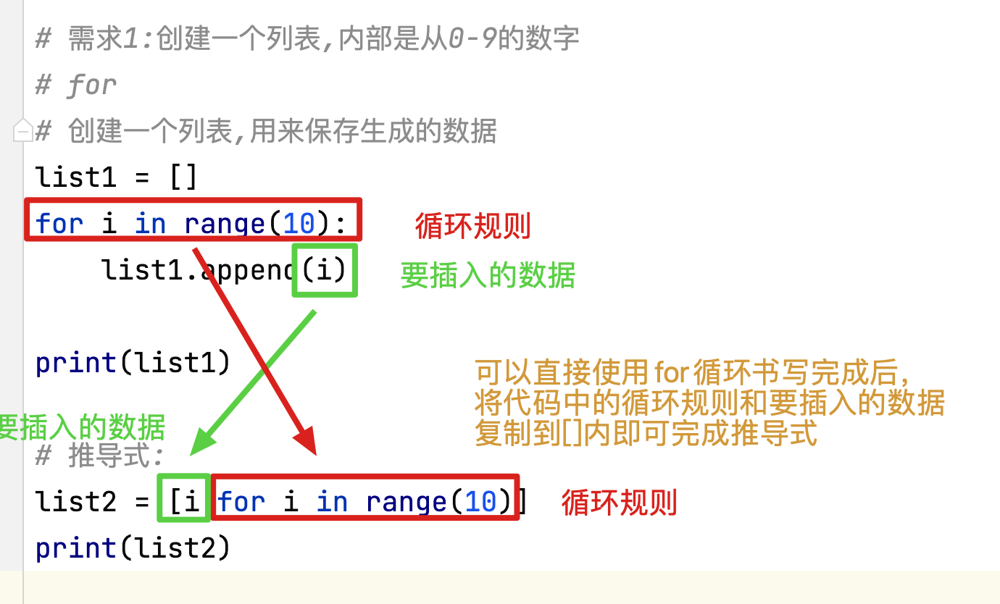

## 1、列表的操作--删[**重要**]

```python
# 在列表中删除数据元素时,如果删除的是中间的元素,后续的索引会发生改变

# 1. remove
# remove是根据数据的值删除该元素的方法
list1 = [1, 2, 3, 3, 2, 1, 4, 5, 6]
# 列表使用remove删除数据时,不会产生新的列表,而是在原有列表上修改数据
# print(list1.remove(5)) # None
# 需求: 删除列表中的5
list1.remove(5)
print(list1)  # [1, 2, 3, 3, 2, 1, 4, 6]

# 需求:删除列表中的2
list1.remove(2)
# remove 只能删除从左至右第一个出现的该元素. 无法全部删除
print(list1)  # [1, 3, 3, 2, 1, 4, 6]

# 需求: 删除列表中的9
# 使用remove删除列表元素时,列表中元素必须存在,否则报错
# ValueError: list.remove(x): x not in list
# list1.remove(9)
# print(list1)


# 2. pop
# pop 是根据数据的索引,删除指定位置元素的方法
list2 = [1, 2, 4, 3, 2]

# 需求: 删除索引值为3的数据
pop_value = list2.pop(3)
print(list2)  # [1, 2, 4, 2]
# pop删除数据后,会将被删除的数据返回,可以使用变量接收
print(pop_value)  # 3

# 需求: 删除索引值为9的数据
# 注意: 删除数据时,不要删除不存在的索引位置的数据,会报错.
# IndexError: pop index out of range
# list2.pop(9)
# print(list2)

# 3. clear
# 清空列表, 此时列表数据为空
list3 = [1, 2, 3]
list4 = list3

print(list3)
print(list4)

print('---------------------')

# list3.clear() # 不等价于 list3 = []
#
# print(list3) # []
# print(list4) # []

print('-----------------------')
list3 = []

print(list3)  # []
print(list4)  # [1, 2, 3]

# 列表相当于储蓄罐, clear相当于将钱全部倒出,此时储蓄罐可以继续使用, list3 = [] 相当于将储蓄罐敲碎,又买了一个新的空储蓄罐

# 4. del
# del 不是 列表的专有操作方式, 所有的容器只要内部数据可以被删除,都可以使用del,但是前提是你必须找到该元素
list5 = [1, 2, 3, 4, 5]
# 需求: 使用del删除下标为4的数据
del list5[4]
print(list5)  # [1, 2, 3, 4]

# 注意: 如果要删除这个元素,必须要先可以获取到这个元素
# del list5[12]
# 如果我们要删除数据的索引不存在则会报错.
# IndexError: list assignment index out of range
# print(list5)

# 这个删除方法比较暴力,所以我们尽量使用pop
# del list5
# NameError: name 'list5' is not defined
# print(list5)
```


## 2、列表中删除元素会影响原数据的索引值

```python
# 练习: 将list_num中所有的3删除
list_num = [1, 2, 3, 3, 2, 1]

for i in list_num:
    if i == 3:
        list_num.remove(3)

# 循环删除后,发现有一个3依然没有删除干净.
print(list_num)  # [1, 2, 3, 2, 1]
# 为什么删不掉呢? 因为在删除的过程中元素索引值发生了改变,遍历时就会有遗漏
# 由此推论,如果在遍历时,使用insert插入数据,就有可能会重复遍历某些数据

print('----------------------------')

# 处理方案1:
list_num = [1, 2, 3, 3, 2, 1]

for i in range(list_num.count(3)):
    list_num.remove(3)

print(list_num)  # [1, 2, 2, 1]

print('----------------------------')

# 处理方案2:
list_num = [1, 2, 3, 3, 2, 1]

for i in list_num[:]:
    if i == 3:
        list_num.remove(3)

print(list_num)
```


## 3、列表的操作--改[**重要**]

```python
# 修改列表中的数据需要使用索引值
# 格式: 列表[索引] = 新值
list1 = ['Tom', 'Jack', 'Rose', 'Dave']

# 需求: 将Jack 修改为 王翠花
list1[1] = '王翠花'
print(list1)  # ['Tom', '王翠花', 'Rose', 'Dave']

# 在修改数据时, 我们查找的索引必须存在,否则报错
# IndexError: list assignment index out of range
# list1[5] = '杰克逊'
# print(list1)
```

## 4、列表的排序以及逆转

```python
# 列表的反转
list1 = [1, 5, 6, 3, 4, 8, 2]

# 方法1:
# 之前我们学习切片的时候有一种字符串反转的方法,该方法在列表中同样适用
print(list1[::-1])  # [2, 8, 4, 3, 6, 5, 1]
# 原数据无任何变化
print(list1)  # [1, 5, 6, 3, 4, 8, 2]

print('------------------')

# 方法2:
# 在列表中也有一种方法叫做reverse 可以进行列表反转
# reverse 和 切片不同,切片时生成一个新的反转的列表.而reverse是在原数据上进行修改的,没有生成新的列表
# print(list1.reverse()) # None
list1.reverse()
print(list1)  # [2, 8, 4, 3, 6, 5, 1]

print('------------------')

# 列表的排序
# 列表的排序,可以使用循环的方法完成,但是比较麻烦.
# 在python中给我们提供了一种非常方便的排序方式  sort
list2 = [1, 5, 6, 3, 4, 8, 2]

# sort 也是修改了列表的原数据,而没有产生新的列表
# print(list2.sort()) # None
list2.sort()
# 在python中的sort函数排序时默认使用升序排列(从小到大)
print(list2)  # [1, 2, 3, 4, 5, 6, 8]

print('------------------')

# 如果需要降序排列
list3 = [1, 5, 6, 3, 4, 8, 2]

# 方法一:
list3.sort()  # 先排序
list3.reverse()  # 再反转
print(list3)  # [8, 6, 5, 4, 3, 2, 1]

# 方法二:
list3 = [1, 5, 6, 3, 4, 8, 2]

list3.sort(reverse=True)
print(list3)  # [8, 6, 5, 4, 3, 2, 1]

```

## 5、列表嵌套[**重要**]

```python
# 列表的嵌套就是在列表中存储子列表
# 一般最外层列表,我们叫做一级列表,一级列表内叫做二级列表,以此类推
school_names = [['北京大学', '清华大学'], ['南开大学', '天津大学'], ['复旦大学', '河北大学']]
# 一级列表 [['北京大学', '清华大学'], ['南开大学', '天津大学'], ['复旦大学', '河北大学']]
# 一级列表中有几个元素?3
print(len(school_names))  # 3
# 0:['北京大学', '清华大学']
# 1:['南开大学', '天津大学']
# 2:['复旦大学', '河北大学']
# 二级列表: ['北京大学', '清华大学'] 和 ['南开大学', '天津大学'] 和  ['复旦大学', '河北大学']
# 每个2级列表中,都有2个元素, 下标分别是0,1
print(len(school_names[0]))  # 2
print(len(school_names[1]))  # 2
print(len(school_names[2]))  # 2

# 需求1:我们如何查找到南开大学???school_names[1][0]
# 第一步: 我们先查找南开大学所在的二级列表的索引值 1
print(school_names[1])  # ['南开大学', '天津大学']
# 第二步: 我们再查找南开大学在这个二级列表中的索引值 0
print(school_names[1][0])  # 南开大学

# 需求2:获取复旦大学
print(school_names[2][0])  # 复旦大学

print('---------------------------')

# 多级列表的处理,只需要注意一件事情,就是从外向内,一级一级列表的查找,不要跨级查找,就永远不会错

# 在开发中 列表层级一般不会过多, 因为在使用列表时不方便,且遍历时需要做各种判断非常麻烦

# 如果需要遍历多级列表,需要使用循环嵌套

# 此处遍历的是一级列表,存储在临时变量中的数据是二级列表
for names in school_names:
    print(names)  #

# 如果使用循环嵌套,在一级列表中再写一个对于二级列表数据的循环即可
for names in school_names:
    for name in names:
        print(name)

# 注意: 在使用循环嵌套遍历时,要保证列表中的元素均为容器,否则会报错
school_names = [['北京大学', '清华大学'], ['南开大学', '天津大学'], ['复旦大学', '河北大学'], 1]

# TypeError: 'int' object is not iterable
# for names in school_names:
#     for name in names:
#         print(name)
```

## 6、列表推导式

```python
# 列表推导式,按照一定规则快速生成一个列表的方法.
# 格式1: 变量 = [要插入列表中的数据  for 临时变量 in 容器]  按照循环规则进行列表生成
# 格式2: 变量 = [要插入列表中的数据  for 临时变量 in 容器 if 条件]  循环后进行条件判断,然后生成列表

# 需求1:创建一个列表,内部是从0-9的数字
# for
list1 = []
for i in range(10):
    list1.append(i)

print(list1)

# 推导式
list2 = [i for i in range(10)]
print(list2)

print('---------------------------')

# 需求2: 创建一个列表,内部从0-9的偶数
# for
list3 = []
for i in range(10):
    if i % 2 == 0:
        list3.append(i)

print(list3)

# 推导式
list4 = [i for i in range(10) if i % 2 == 0]

print(list4)

print('---------------------------')

# 需求3:创建一个列表,内容为['传智1.jpg', '传智2.jpg'.......'传智10.jpg']
# for
list5 = []
for i in range(1, 11):
    list5.append(f'传智{i}.jpg')

print(list5)

# 推导式
list6 = [f'传智{i}.jpg' for i in range(1, 11)]

print(list6)

print('---------------------------')

# 需求4: 创建一个列表,内部存放从0-100间既不是7的倍数,数字中又不含有7的数字
# for
list7 = []
for i in range(101):
    if i % 7 != 0:
        if str(i).count('7') == 0:
            list7.append(i)

print(list7)

# 推导式
list8 = [i for i in range(101) if i % 7 != 0 if str(i).count('7') == 0]
# list8 = [i for i in  range(101) if i % 7 != 0 and str(i).count('7') == 0]
print(list8)

print('---------------------------')

# 练习:
# 1. 使用推导式快速生成 [1,4,9,16,25... 100]
list9 = [i * i for i in range(1, 11)]
print(list9)

# 2. 快速生成一个列表,内部是1-100之间的所有奇数
list10 = [i for i in range(1, 101) if i % 2 != 0]
print(list10)

# 3. 生成个一个列表, 内部是[传智01.txt, 传智02.txt.....传智10.txt]
list11 = [f'传智{i:02d}.txt' for i in range(1, 11)]
print(list11)

```





## 7、元组的定义

```python
# 元组的操作方式和列表基本相同,但是由于元组不可修改的特性,所以元组的操作方式中没有增删改,只能进行查询
# 1. 元组的定义
# 格式: 变量 = (元素1, 元素2, ....)
tuple1 = (1, 2, 3, 4)
print(tuple1)  # (1, 2, 3, 4)
print(type(tuple1))  # <class 'tuple'>

# 2. 创建空元组
tuple2 = ()
print(tuple2)  # ()
print(type(tuple2))  # <class 'tuple'>

tuple3 = tuple()
print(tuple3)  # ()
print(type(tuple3))  # <class 'tuple'>

# 3. 定义一个单元素元组的方法
tuple4 = (3)
print(tuple4)  # 3
print(type(tuple4))  # <class 'int'>

# 注意: 创建单元素元组时,必须在元素末尾添加逗号,否则创建的就不是元组,而是内部元素本身的数据类型
tuple5 = (3,)
print(tuple5)  # (3,)
print(type(tuple5))  # <class 'tuple'>

# 当括号内没有逗号时,我们认为括号时提升算术运算符优先级用的
# (2 + 3) * 4 此时()修改了算数运算符的优先级,此时计算机先将2 + 3 的结果计算出来,放入括号中, (5) * 4  最终结果是20  (5) 就等价与整型5

# 4. 当我们创建元组时, 元组最外层的括号时可以省略的, 系统会帮我们自动添加
tuple6 = 1, 2, 3, 4, 5
print(tuple6)  # (1, 2, 3, 4, 5)
print(type(tuple6))  # <class 'tuple'>

tuple7 = 3,
print(tuple7)  # (3,)
print(type(tuple7))  # <class 'tuple'>

# 自动添加括号仅限于元组的定义和返回
```

## 8、元组的特性

```python
# 元组的特性其实就是内部元素不可修改

# 1. 元组和列表相同可以使用索引值获取内部元素
tuple1 = ('徐坤', '亦凡', '志祥', '海波')
print(tuple1[0])
print(tuple1[1])
print(tuple1[2])
print(tuple1[3])

# 2. 通过索引值修改元组内部的元素
# TypeError: 'tuple' object does not support item assignment
# 元组内部的元素不能通过索引值进行修改
# tuple1[2] = '易峰'

# 3. 通过索引值删除元组内部的元素
# TypeError: 'tuple' object doesn't support item deletion
# 元组内部的元素不能通过索引值删除
# del(tuple1[2])

# 4. 元组没有追加数据的方法
# AttributeError: 'tuple' object has no attribute 'append'
# tuple1.append(5)

# 5. 元组可以切片
# 切片后得到的的数据依然是元组
print(tuple1[:2])  # ('徐坤', '亦凡')
# 切片其实并没有修改元组的原数据,而是产生了一个新的元组对象
print(tuple1)  # ('徐坤', '亦凡', '志祥', '海波')

# 所谓的元组不能修改,其实是为了提示你的同事,不要改, 不是真正的不能修改,如果想改,有一万种方法.
```

## 9、元组的常见使用方式

```python
# 由于元组内部的元素不可增删改,所以我们元组只具备查询功能,其余功能均没有
# 1. 通过索引值,查询内部元素
tuple1 = ('python', 'java', 'php', 'c', 'c++', 'java')
print(tuple1[2])

# 2. index 查询指定元素在tuple中从左至右第一次出现的索引值
print(tuple1.index('php'))  # 2
# 如果查询的元素在元组中不存在,则会报错
# print(tuple1.index('go')) # ValueError: tuple.index(x): x not in tuple
# 如果元组中存在多个被查询的元素,则只能返回从左至右第一个元素索引
print(tuple1.index('java'))  # 1

# 3. count 查询指定元素在tuple中出现的次数
print(tuple1.count('c'))  # 1
print(tuple1.count('java'))  # 2

# 4. len  查询元组中共有几个元素
print(len(tuple1))  # 6
print(tuple1.__len__())  # 6

# 5. 元组的遍历
# 元组遍历时,和列表遍历完全相同
# for
for i in tuple1:
    print(i)

print('------------------')
# while
i = 0
while i < len(tuple1):
    print(tuple1[i])
    i += 1
```

## 10、set集合（补充）

```python
#  set集合的定义
# 1. set集合定义时,使用{}在内部增加元素即可
# 格式: {元素1, 元素2, 元素3....}
set1 = {1, 2, 3, 4}
print(set1)  # {1, 2, 3, 4}
print(type(set1))  # <class 'set'>

print('------------')

# 2. 创建一个空集合
set2 = {}
print(set2)  # {}
print(type(set2))  # <class 'dict'>

print('------------')

# 注意: {} 是空字典的意思,并不是一个空集合,所以如果使用该{}只能创建空字典
set3 = set()
print(set3)  # set()
print(type(set3))  # <class 'set'>

# 3. 定义一个单元素集合
set4 = {3}
print(set4)  # {3}
print(type(set4))  # <class 'set'>

print('------------')

# 集合的特性就是无序 和不重复
# 无序: 容器内的数据元素顺序不可以被控制的
set5 = {1, 2, 3, 4}
set6 = {4, 1, 3, 2}
print(set5)  # {1, 2, 3, 4}
print(set6)  # {1, 2, 3, 4}

set7 = {'Tom', 'Bob', 'Dave', 'Rose', 'Jay'}
print(set7)  # 每次打印上述元素的顺序不一定相同

# 无序带来的影响,就是不能使用索引, 所有需要使用索引的容器操作方式他都没有例如index
# print(set7[3]) # TypeError: 'set' object is not subscriptable

print('------------')

# 不重复
# 写入到集合中的元素会自动去重, 去重规则就是判断哈希值是否相同
set8 = {1, 2, 3, 4, 3, 2, 1, 4, 3, 2, 1}
print(set8)  # {1, 2, 3, 4}
print(type(set8))  # <class 'set'>

# 数值型之间  在去重时 True 等价于 1 等价于 1.0   False 等价于 0 等价于 0.0
set9 = {False, 3, 4, 1.0, 0, True}
print(set9) # {False, 1.0, 3, 4}

# 结论: 在set集合中,后添加进去的输入如果在容器中已经存在,则忽略,如果不存在则添加

# 注意: 在数值型数据中  False == 0  True == 1
print(False == 0)  # True
print(True == 1)  # True

# set集合的遍历
for i in set7:
    print(i)
```

## 11、字典的定义[**重要**]

- 1.字典中键不可以重复，值可以
- 2.键值对必须同时出现
- 3.字典不能使用索引
- 4.只能通过键取值

```python
# 字典dict 该容器可以帮助程序员快速存取数据
# 字典中是以键值对来存储数据的,一个键对应一个值,键不可以重复

# 1. 定义字典
# 格式: 变量 = {键1:值1, 键2:值2, .....}
# 键值对: 键其实就是这个值的唯一标识, 通过键就可以获取值,可以理解为键就是该值的身份证号.值可以理解为一个人的姓名
# 在字典中键不可以重复,但是值可以重复
dict1 = {'name': '小明', 'age': 12, 'gender': '男'}
print(dict1)  # {'name': '小明', 'age': 12, 'gender': '男'}
print(type(dict1))  # <class 'dict'>

# 定义字典时,键和值必须成对出现,不能出现单独的键,也不能出现单独的值
# SyntaxError: invalid syntax 如果出现单独的键或者值会报错
# dict2 = {'name': '小明', 'age': 12, 'gender': '男', 'abc'}

# 字典的键不能重复,如果定义时出现同名的键,则后添加的值会覆盖先添加的值
dict2 = {'name': '小明', 'age': 12, 'gender': '男', 'name': '小芳'}
print(dict2)  # {'name': '小芳', 'age': 12, 'gender': '男'}

# 字典的值可以重复
dict3 = {'name': '小明', 'age': 12, 'gender': '男', 'stu_NO': 12}
print(dict3)  # {'name': '小明', 'age': 12, 'gender': '男', 'stu_NO': 12}

# 2. 定义一个空字典
dict4 = {}
print(dict4)  # {}
print(type(dict4))  # <class 'dict'>

# 3.字典无法使用索引,对于程序员来说,字典的顺序无法调整也无法利用,所以也可以看做是无序的
# KeyError: 2  没有这个key会报错
# print(dict4[2])

# 4.字典要使用键获取值, 如果我们发现某个需求需要我们使用值获取键,则检查数据容器是否选择错误
# 因为在开发中,一个键会对应唯一的值, 但是一个值,可能对应多个键,无法获取准确值

# 注意: 如果我们忘记了键怎么取值呢????  起名时要见名知意,方便记忆,否则忘记键就无法快速取值了,只能遍历
# 一般情况下,键都是对于值的解释,值是键的具体内容
```

## 12、字典的操作--增[**重要**]

```python
# 字典中增加元素的方式要一次性增加一个键值对,不能对于键或值单独添加

# 1. 使用键=值的方式增加键值对
# 格式: 变量[键] = 值
dict1 = {'name': '小芳', 'age': 18, 'gender': '男'}
dict1['weight'] = 56

print(dict1)  # {'name': '小芳', 'age': 18, 'gender': '男', 'weight': 56}

# 2. 使用update方法增加键值对
dict2 = {'name': '小红', 'age': 12}
# update传值方式1: 变量.update(字典类型数据)
dict2.update({'gender': '男'})
print(dict2)  # {'name': '小红', 'age': 12, 'gender': '男'}

# update传值方式2: 变量.update(键=值)
dict2.update(weight=56, height=125)
print(dict2)  # {'name': '小红', 'age': 12, 'gender': '男', 'weight': 56, 'height': 125}


# 注意: 给字典添加键值对时, 字典的键不能存在,如果该键已经存在,则会修改原键对应的值,不会增加新的键值对.
```

## 13、字典的操作--改[**重要**]

```python
# 字典的改的操作和字典增的操作完全相同,如果我们进行操作时,新键值对的键,在原字典中存在就是改,不存在就是增

# 1. 使用键=值的方式进行修改, 前提是键必须在字典中存在
dict1 = {'name': '小华', 'age': 12, 'gender': '男'}
dict1['name'] = '小坤'

print(dict1)  # {'name': '小坤', 'age': 12, 'gender': '男'}

# 2. 使用update方式进行修改, 前提是涉及的键必须在字典中存在
# 在update中传入字典
dict1.update({'name': '小美', 'age': 14})

print(dict1)  # {'name': '小美', 'age': 14, 'gender': '男'}

# 在update中使用键=值传值
dict1.update(name='小红', age=16)

print(dict1)  # {'name': '小红', 'age': 16, 'gender': '男'}

# 使用update 可以一次性既新增键值对,又修改键值对
dict1.update(name='小白', height=176)

print(dict1)  # {'name': '小白', 'age': 16, 'gender': '男', 'height': 176}
```

## 14、字典的相关操作--删[**重要**]

```python
# 字典的删除操作,只能按照键值对为单位进行删除,不能只删除键或值

dict1 = {'name': '小华', 'age': 12, 'gender': '男'}

# 1. pop 可以根据指定的键删除对应的值
# pop在删除键值对的同时会将被删除的键所对应的值进行返回,我们可以使用变量接收
v1 = dict1.pop('gender')

print(v1)  # 男
print(dict1)  # {'name': '小华', 'age': 12}

# 如果pop删除的键不存在,会报错
# KeyError: 'stu_NO'
# dict1.pop('stu_NO')

# 2. popitem 每次删除最后一个键值对.
dict1 = {'name': '小华', 'age': 12, 'gender': '男'}
dict1.popitem()
print(dict1)  # {'name': '小华', 'age': 12}
dict1.popitem()
print(dict1)  # {'name': '小华'}
dict1.popitem()
print(dict1)  # {}

# 3. clear 清空字典
dict1 = {'name': '小华', 'age': 12, 'gender': '男'}
dict1.clear()
print(dict1)  # {}

```

## 15、字典的操作--查[**重要**]

```python
# 定义一个字典
dict1 = {'name': '小芳', 'age': 40, 'gender': '男', 'weight': 60}

# 1. 使用键查询值
# 格式: 变量[键]
print(dict1['name'])  # 小芳
print(dict1['age'])  # 40
print(dict1['gender'])  # 男
print(dict1['weight'])  # 60

# 注意: 使用这种方法获取值,如果键不存在,则报错
# KeyError: 'height'  没有这个键会报错
# print(dict1['height'])

# 2. 使用get方法查询数据
# 格式: 变量.get(键, 默认值) 如果键不存在则返回默认值, 如果没有指定默认值返回None
print(dict1.get('name'))  # 小芳
print(dict1.get('age'))  # 男
print(dict1.get('gender'))  # 40

# 当使用get方法查询数据时,没有该键会自动返回默认值None
print(dict1.get('height'))  # None

# 当我们查询的键不存在时,我们也可以指定返回的默认值
print(dict1.get('height', '无此数据'))  # 无此数据

# 3. keys 查询字典中所有的键
print(dict1.keys())  # dict_keys(['name', 'age', 'gender', 'weight'])

# 4. values 查询字典中所有的值
print(dict1.values())  # dict_values(['小芳', 40, '男', 60])

# 5. items 查询字典中所有的键值对, 以元组的方式返回每一个键值对
print(dict1.items())  # dict_items([('name', '小芳'), ('age', 40), ('gender', '男'), ('weight', 60)])

# 注意: keys, values, 和 items 返回的数据类型不是列表类型,想要使用内部的数据,要么转换为list 要么遍历

dict_keys = dict1.keys()
# TypeError: 'dict_keys' object is not subscriptable
# keys方法获取的是dict_keys类型数据, 不支持使用索引获取子元素
# print(dict_keys[1])

# keys, values, 和 items 的结果可以转换为list类型数据
print(list(dict_keys))  # ['name', 'age', 'gender', 'weight']
```

## 16、字典的遍历

```python
# 当遍历字典时,建议使用for循环,在之后讲解遍历时,就不再写while循环了,自己进行转换
dict1 = {'name': '小芳', 'age': 40, 'gender': '男', 'weight': 60}

# 1. 直接遍历字典,其实就是依次获取字典的每一个key值
for key in dict1:
    print(key)

print('--------------------------------')

# 2. 可以使用keys()方法进行遍历,此时获取的也是每一个key值  (用的很少)
for key in dict1.keys():
    print(key)

print('--------------------------------')

# 3. 可以使用values()方法进行遍历,此时获取的是字典中的每一个value值
for value in dict1.values():
    print(value)

print('--------------------------------')

# 4. 可以使用items() 方法进行遍历,此时获取的是字典中的每一个键值对组成的元组
for item in dict1.items():
    print(item)

print('--------------------------------')

# 在开发中我们通常习惯使用两个变量分别接收键和值
for key, value in dict1.items():
    print(key, value, sep=':')

```

## 17、公共方法

```python
# + 加法运算符
# 1. 回顾: 数值型数据中, 加法运算就是求两个数字的和
print(12 + 23)  # 35
# 数值型数据包括  int float bool 可以随意相加, True == 1  False == 04
print(12 + 1.4 + True)  # 14.4

# 2. 容器类型数据相加,就是数据容器的合并(拼接)
# str
print('123' + 'abc')  # 123abc
# list
print([1, 2, 3] + ['a', 'b', 'c'])  # [1, 2, 3, 'a', 'b', 'c']
# tuple
tuple1 = (1, 2, 3)
tuple2 = ('a', 'b', 'c')
# 容器类型的加法运算,不会修改原来的容器,而是产生了一个新的容器类型数据.
print(tuple1 + tuple2)  # (1, 2, 3, 'a', 'b', 'c')
print(tuple1)  # (1, 2, 3)
print(tuple2)  # ('a', 'b', 'c')

# 注意: set 和dict 不能使用加法运算
# TypeError: unsupported operand type(s) for +: 'set' and 'set'
# print({1, 2, 3} + {3, 4, 5})
# TypeError: unsupported operand type(s) for +: 'dict' and 'dict'
# print({'a': 1} + {'b': 2})

# 注意: 容器间的加法运算只能在相同数据类型的容器间进行
# TypeError: can only concatenate tuple (not "list") to tuple
# print((1, 2, 3) + [1, 2, 3])

print('-----------------')

# * 乘法运算符
# 1. 回顾 : 数值型数据中 乘法运算就是求两个数字的积
print(3 * 4)  # 12

# 2. 容器类型相加,就是将容器赋值n份并相加
# str
print('123' * 3)  # 123123123
# list
print([1, 2, 3] * 3)  # [1, 2, 3, 1, 2, 3, 1, 2, 3]
# tuple
tuple3 = (1, 2, 3)
# 乘法运算不会修改容器的原有数据,而是产生了一个新的数据容器
print(tuple3 * 3)  # (1, 2, 3, 1, 2, 3, 1, 2, 3)
print(tuple3)  # (1, 2, 3)

# 注意: 乘法运算的本质就是将容器复制多份,再进行相加,所以不能进行加法运算的数据类型(set , dict)一样不能进行乘法运算

# 容器类型数据仅可以和整型数据进行乘法运算
# TypeError: can't multiply sequence by non-int of type 'float'
# print((1, 2, 3) * 3.2)

print('-------------------')

# in not in
# 判断元素是否在容器内
# 1. 使用in 或者not in 判断字典类型数据时,判断的是键是否存在
dict1 = {'name': '小强', 'age': 12}
# 判断name是否在dict中
print('name' in dict1)  # True
# 判断小强是否在dict中
print('小强' in dict1)  # False

# 2. 使用in 或者not in 判断字符串时, 只能判断字符元素是否在字符串中
str1 = 'hello world and python'

# 判断 hello 是否在 str1 中
print('hello' in str1)  # True
# 判断1 是否在str1中
# TypeError: 'in <string>' requires string as left operand, not int
# print(1 in str1)

# 也可以理解为,我们要判断元素是否在该容器内,那么这个容器必须可以存储到该容器内.

# 3. list tuple set 都可以使用in 和 not in 进行判断
print(1 in (1, 2, 3))  # True
print(1 in [1, 2, 3])  # True
print(1 in {1, 2, 3})  # True


# len  获取容器中元素的个数,或者说获取容器的长度
list1 = [1, 2, 3, 4]
print(len(list1))  # 4

tuple1 = (1, 2, 3, 4)
print(len(tuple1))  # 4

set1 = {1, 2, 3, 2, 3, 4}
# 获取集合类型数据长度时,要去重后再获取长度
print(len(set1))  # 4

dict1 = {'a': 1, 'b': 2}
# 字典类型数据中,一个键值对算一个元素
print(len(dict1))  # 2

# del 操作
# 1. 可以使用del 删除列表中的数据
list1 = [1, 2, 3, 4]
del (list1[2])
print(list1)  # [1, 2, 4]

# 2. 可以使用del 删除字典中的数据
dict1 = {'name': '小华', 'age': 12, 'gender': '男'}
# 使用del 本质上时切断引用关系,而使用get实在调用方法不能这样用
# del(dict1.get('name'))
del (dict1['name'])
print(dict1)  # {'age': 12, 'gender': '男'}

# 3. 无法使用del 删除集合中的数据,因为集合中的数据无法指定获取

# 4. 无法使用del 删除字符串和元组中的元素,因为字符串和元组内的数据时不可修改的

# max min
# max 获取容器中的最大值
# min 获取容器中的最小值
print(max([1, 2, 4, 7, 5]))  # 7
print(min([1, 2, 4, 7, 5]))  # 1

# dict 类型数据中,获取最大和最小值,获取的是最大的键或最小的键
print(max({'a': 1, 'b': 2}))  # b
print(min({'a': 1, 'b': 2}))  # a

# sum
# 获取容器内所有数据的和, 注意,使用sum时,要保证容器中所有数据的数据类型一致,否则报错
print(sum([1, 2, 4, 7, 5]))  # 19

# any 内部元素有任意一个不为空,则为True
print(any([1, 2, 4, None, 5]))  # True
print(any([None, None]))  # False

# all 内部元素都不为空则为 True 否则为 False
print(all([1, 2, 4, None, 5]))  # False
print(all([1, 2, 4, 7, 5]))  # True

```


学习容器类型的方法：

​	1.学习如何定义和调用

​	2.学习如何遍历

​	3.学习容器的增删改查

​	5.学习容器的其他方法
