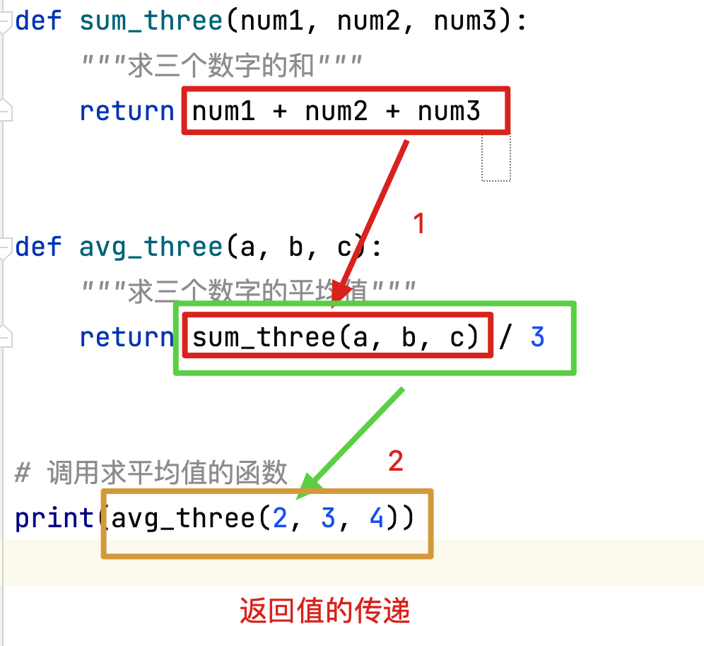

##  1、函数介绍

- 函数就是将一段具有独立功能的代码打包 在一起，当需要调用该功能时，我们将函数进行调用即可

- 函数中的参数： 从函数的外部向函数的内部传递数据,并参与函数内部代码的计算或运行
- 函数的返回值：将函数内部代码执行的结果或者运算的值传递到函数外部

## 2、函数的简单使用

```python
# 我们之前使用过很多的函数
# print, input, len, max, min 都是函数
# 总结规律:
# 1.所有的函数都实现了一个特定的功能
# 2.所有的函数都使用()进行了调用
# 3.所有的函数都可以使用变量进行接收(但是有的函数接收到的数据为None)

# 自定义函数
# 函数的定义:  使用关键字def 构造函数
'''
定义格式:
def 函数名():  # 函数名要满足标识符的命名规则,并且见名知意, 一般使用下划线分割法定义
    函数体(一般具有完整功能)

调用格式:
函数名()

函数的好处: 可以提高代码的复用率,重复利用多次我们定义的函数,减少代码量,提高开发效率和代码的可读性
'''

# 定义一个函数
def func1():
    print('chuanzhi')
    print('python')
    print('AI')

# 调用一个函数
func1()
print('学习真有趣')
print('今天我又进步了')
func1()

# 每次调用函数,都可以执行函数内的代码,在开发中一般相同的代码执行一次以上,我们就建议封装为函数.

# 为什么重复使用多次该功能不使用for循环呢???

# 因为多次使用函数,不一定在同一个位置重复使用,如果在不同的位置,无规律的重复使用,不能使用循环.
```

## 3、函数定义的注意事项

```python
# 1. 定义函数时,要先定义后调用
# NameError: name 'func1' is not defined
# func1() 函数需要先定义后调用

def func1():
    print('hello world')
    print('hello python')


func1()


# 2. 如果出现同名函数, 后定义的函数,会覆盖先定义函数的功能
def func1():
    print('红军不怕远征难')
    print('万水千山只等闲')


func1()

# 3. 如果出现了同名的变量,一样会覆盖函数定义
func1 = 'chuanzhi'

# TypeError: 'str' object is not callable
# 由于func1中储存了字符串类型数据, 覆盖了之前函数的功能,所以此处调用的是字符串,不能执行函数功能.
# func1()
print(func1)  # chuanzhi
```

## 4、函数的说明文档[**重要**]

```python
# 函数的说明文档: 可以在提示信息中展示出来的说明文字
# 提示信息出现的方式鼠标悬停在函数调用位置上,或者按住ctrl键鼠标悬停
# 格式: 在函数体的第一行书写多行注释,则为说明文档

# 如果我们使用普通注释,不能在鼠标悬停后进行提示
def func1():
    # 打印了一首诗
    print('莫等闲,白了少年头,空悲切.')


func1()


# 在函数的函数体第一行书写一个多行注释,则可以进行说明文档提示
def func2():
    """打印了一首诗"""
    print('莫等闲,白了少年头,空悲切.')


func2()


# 在函数提的第一行,使用多行注释时,尽量使用双引号,单引号一样可以作为说明文档进行提示,但是会报一行格式异常(灰色波浪线)
def func3():
    '''打印一首诗'''
    print('莫等闲,白了少年头,空悲切.')


func3()

"""
灰色波浪线: 格式警告
绿色波浪线: 拼写错误
红色波浪线: 语法错误
"""
```


## 5、函数的参数[**重要**]

```python
# print() 传入不同的数据,就打印出不同的内容
# 函数的参数,就是在调用函数的位置向函数内传递数据,并参与函数内部的运算或执行
# 通过传递参数的不同可以改变函数的执行结果

# 函数参数的作用:让代码更加灵活,让函数的复用率更高,提高开发效率
# 我们定义一个函数计算3+4的和
def sum1():
    print(3 + 4)


sum1()


# 如果我们又要计算2 + 3 的和 我们应该怎么办呢?
# 1. 可以再创建一个函数,输出2+3, 不推荐, 因为不能提高代码的复用率.
# 2. 可以给函数增加参数, 提高代码的复用率,增加代码的灵活度
# 格式: def func(参数1, 参数2, 参数3....)
# 定义函数
def func1(num1, num2):
    print(num1 + num2)


# 调用函数
func1(2, 3)  # 5
func1(4, 7)  # 11

# 此时,所有两个数值之间的加法运算,都可以使用该函数完成,代码复用率提高

# 函数定义位置书写的参数 num1, 和num2 只是形式正参加了运算,但是其实是一个变量名,所以我们称之为形参
# 函数调用位置书写的参数 2, 3 是传递到函数体内部,真正参加计算的数据,我们称之为实参.

# 注意: 给函数赋值时,所有的参数既不要多赋值,也不要漏赋值
# TypeError: func1() takes 2 positional arguments but 3 were given
# func1(1, 2, 3)
# TypeError: func1() missing 1 required positional argument: 'num2'
# func1(1)
```

#### 练习：

创建一个函数，有一个参数 叫做n  通过传入n的数量决定我们要输出多少行横线

打印一行横线的方法 print（‘-’ * 30）

```python
# 练习:
# 创建一个函数，有一个参数 叫做n  通过传入n的数量决定我们要输出多少行横线
# 打印一行横线的方法 print（‘-’ * 30）

def print_lines(n):
    for i in range(n):
        print('-' * 30)


print_lines(5)
```


## 5、函数的返回值[**重要**]

```python
# 返回值,就是函数体内部运算或执行的数据,想要传递到函数体外部进行使用,就必须使用返回值进行传递

def func1(num1, num2):
    print(num1 + num2)


# 计算3 +4 的和
func1(3, 4)

# 我们要将上述函数计算的结果再乘以5
# TypeError: unsupported operand type(s) for *: 'NoneType' and 'int'
# print(func1(3, 4) * 5)

# 由于func1 并没有返回计算结果,所以该计算结果无法再函数体外进行使用
print(func1(3, 4))  # None

print('-------------------')


# 如果想要在函数体外使用计算结果需要借助返回值

def func2(num1, num2):
    return num1 + num2


# 此处仅仅将数据进行了返回,但是没有使用,不能打印对应内容
# func2(3, 4)
print(func2(3, 4) * 5)  # 35

# 一般使用函数返回值时,都会使用变量进行数据接收
res = func2(6, 8)

print(res) # 14

# 注意: 将数据返回到函数体外并不能在控制台上显示出来,需要打印
```

## 6、局部变量和全局变量[**重要**]

```python
# 变量的作用域: 数据生效的范围, 根据作用域的范围不同,可以将变量划分为两类  局部变量和全局变量
# 全局变量: 在文件中顶格书写,可以在函数内和函数外使用的变量
# 局部变量: 在函数体内定义的,只能在定义函数的函数体中使用的变量

# 全局变量: 作用范围,是从定义位置开始,无论函数体内还是函数体外都可以使用的变量
# 全局变量时在函数体外部定义的,一般是顶格书写.
age = 18


def func1():
    # 全局变量,可以再函数体内部使用
    print(f'小明今年{age}岁了')


func1()

# 全局变量, 也可以在函数体外部使用
print(f'小芳今年也{age}岁了')

# 局部变量: 作用范围是从函数体内的定义位置开始,到函数体结束位置, 在这个范围内可以使用局部变量,出了函数则变量销毁.

def func2():
    weight = 50
    # 局部变量可以再定义该函数的函数体内部使用
    print(f'张大妈今年{weight}kg了')

func2()

def func3():
    # NameError: name 'weight' is not defined
    # 局部变量不能再其他函数体中使用
    print(f'李大妈今年也{weight}kg了')

# func3()

# NameError: name 'weight' is not defined
# 局部变量,不能在函数体外部使用
# print(f'赵大妈今年也{weight}kg了')

# 注意事项: 在python中,变量的作用域只和在函数体内部还是外部有关,和缩进无关,
# 所以循环体和分支语句的代码块中的变量如果在函数体外定义则是全局变量,在函数体内定义则为局部变量

# 注意: 无论是全局变量,还是局部变量,都必须遵循先定义后调用的原则
```

## 7、global关键字[**重要**]

```python
# 需求: 有一个全局变量num1 = 1 我们需要再函数体内部将其修改为 100

# 创建一个全局变量
num1 = 1


# 创建一个函数
def func1():
    # 修改全局变量的值
    num1 = 100
    # 查看修改结果
    print(num1)  # 100


func1()

# 在函数体外再次打印全局变量
print(num1)  # 1

# 问题: 我们在函数体内修改了全局变量num1的值为100,但是在函数体外调用num1时,值依然没有发生变化.
# 答案: 其实在函数体内部我们并没有修改全局变量,而是创建了一个名字叫num1的局部变量
# 在函数体内,调用num1时,优先调用局部变量,如果局部变量中没有num1, 才会去全局变量中查找

print('----------------------')


# 如果想要在函数体内修改全局变量的值,就要先声明该变量为全局变量

def func2():
    # 先声明该变量为全局变量
    global num1
    # 将全局变量num1 修改为100
    num1 = 100
    print(num1)  # 100


func2()

# 修改完成后,在函数体外打印该全局变量的值
print(num1)  # 100

# 此时就修改成功了


# 需求:在函数体内,使用复合赋值运算符,让全局变量自增1
def func3():
    # 如果想要自增需要先声明num1为全局变量
    global num1
    # UnboundLocalError: local variable 'num1' referenced before assignment
    # 因为num1 += 1 等价于 num1 = num1 + 1 此时我们num1= 被检索到,系统认为其有局部变量,优先使用局部变量,但是+1时局部变量还没有赋值,所以报错
    num1 += 1
    print(num1)

func3()

print(num1)

print('----------------------')

# 注意: 局部变量和全局变量哪怕名称相同也不是同一个变量,同一个函数体内要么使用全局变量要么使用局部变量,不能同时出现

def func4():
    # 声明全局变量,并自增, global声明后函数体内使用的所有该名称变量,都是全局变量
    global  num1
    num1 += 1

    # 再创建一个同名的局部变量
    num1 = 12
    print(num1)

func4()

print(num1)


# def func5():
#     # 再创建一个同名的局部变量
#     num1 = 21
#     print(num1)
#     # global关键字必须放在变量使用之前
#     # SyntaxError: name 'num1' is used prior to global declaration
#     # 声明全局变量,并自增, global声明后函数体内使用的所有该名称变量,都是全局变量
#     global  num1
#     num1 += 1
# 
# 
# 
# func5()
# 
# print(num1)

# 总结:
# 1. 在函数体内使用变量时,优先使用局部变量,如果局部变量不存在,则查找全局变量
# 2. 如果想再函数体内修改全局变量的值,需要先使用global进行声明
# 3. 在函数体内必须先声明global再使用变量,否则报错
# 4. 在一个函数体内不可能出现同名的全局变量和局部变量,只能出现其中一个.
```

## 8、函数定义内部嵌套函数的调用

```python
# 其实在函数体中可以调用其他函数,我们之前也一直 在使用,例如在函数体内调用print函数
# 自定义函数,也可以在其他函数体中被调用

# 定义一个函数func1
def func1():
    print('功能开始')
    print('hello world')
    print('功能结束')


def func2():
    print('程序开始')
    # 在func2的函数体内部,调用func1
    func1()
    print('程序结束')


# 调用func2
func2()


# 案例:
# 创建两个函数: 第一个函数就是打印一行横线,第二个函数,就是根据传入的n值打印多行横线, 在第二个函数中调用第一个函数

# 创建打印一条横线的方法
def print_line():
    print('-' * 30)

# 再创建一个打印n条横线的方法,内部调用打印一条横线的方法
def print_lines(n):
    for i in range(n):
        print_line()

# 调用print_lines函数, 打印5条横线
print_lines(5)
```

## 9、函数的执行流程

```python
def func1():
    print(abc)


print(123)

# 注意: 我们代码执行时,不会执行函数中的代码,仅记录函数名称,当执行函数调用位置时,才会执行函数体中的代码
# func1() # NameError: name 'abc' is not defined


# 案例:
# 创建两个函数: 第一个函数就是打印一行横线,第二个函数,就是根据传入的n值打印多行横线, 在第二个函数中调用第一个函数
print(123)


# 再创建一个打印n条横线的方法,内部调用打印一条横线的方法
def print_lines(n):
    for i in range(n):
        print_line()


# 创建打印一条横线的方法
def print_line():
    print('-' * 30)


# 调用print_lines函数, 打印5条横线
print_lines(5)

# 思考: 如果将print_line 和print_lines互换位置会不会报错? 用debug工具进行调试,查看报错/不报错的原因
# 1. 函数的执行顺序,是在程序启动后,从上到下将所有函数的函数名称记录下来保存在内存中,此时不会执行函数体中的代码
# 2. 当我们调用函数时,我们会去刚才记录的函数列表中查询,如果存在,则调用其函数体中的代码,如果不存在,则报错
# 3. 系统内置函数是怎么样加载进来的呢? Python启动时会自动将核心库加载进来.
# 4. 在执行前函数被定义即可,函数定义间的顺序不影响执行结果

```

## 10、参数和返回值的传递流程

```python
# 案例: 创建一个函数计算三个数字的和,再创建一个函数记录三个数字的平均值,在第二个函数中调用第一个函数

def sum_three(num1, num2, num3):
    """求三个数字的和"""
    return num1 + num2 + num3


def avg_three(a, b, c):
    """求三个数字的平均值"""
    return sum_three(a, b, c) / 3


# 调用求平均值的函数
print(avg_three(2, 3, 4))

# 结论: 参数从外向内一层一层的传递进来, 返回值从内向外一层一层的传递出去
```




## 11、返回值加强[**重要**]

```python
# 1. return有两个功能, 第一个是返回指定的数据, 第二个是结束当前的函数, 当执行到return之后,在return之后的所有代码将无法执行
def func1():
    print('hello world')
    return 3
    return 4
    print('hello python')


# 当前return 3 之后的所有内容都没有被执行.此时在return之后的代码中会提示警告信息This code is unreachable
print(func1())  # 3


# 我们在函数内部,有时会使用return在特定情况下退出函数, 作用类似于 break

# 2. return 后如果什么也不写,则默认返回None
def func2():
    print('hello AI')
    return


print(func2())  # None


# 3. 在函数中如果没有书写return 则默认返回一个None
def func3():
    print('hello chuanzhi')


print(func3())  # None


# 4. 在函数体中返回的数据,有且只能由一个值,如果是多个值,可以使用容器类型返回,如果没有值默认返回None
def func4():
    return 1, 2, 3, 4


print(func4())  # (1, 2, 3, 4)

# 5. 如果需要手动返回数据必须书写return 目前Python没有提供除了return之外的返回方式
```

## 12、实参--位置参数[**重要**]

```python
# 实参中我们可以使用位置参数进行传参,赋值方式就是从左至右依次赋值. 既不能多赋值,也不能遗漏,更不能跳跃赋值

# 创建一个需要赋多个值的函数
def func1(a, b, c, d):
    print(a, b, c, d)


func1(1, 2, 3, 4)

# TypeError: func1() takes 4 positional arguments but 5 were given
# func1(1, 2, 3, 4, 5)

# TypeError: func1() missing 1 required positional argument: 'd'
# func1(1, 2, 3)

# 使用位置参数赋值时,从左至右依次赋值,不能多也不能少

# 注意: 位置参数无法跳跃赋值,也无法指定赋值位置,只能从左至右按序赋值
```

## 13、实参--关键字参数[**重要**]

```python
# 关键字参数赋值,就是根据形参名称对于指定的形参进行赋值的方式
# 格式: 形参名=值
# 之前我们使用过 print('adfas', end=' ')  end=' '就是关键字参数赋值

def func1(a, b, c, d):
    print(a, b, c, d)


# 1. 能够使用位置参数赋值的函数,一定可以使用关键字参数赋值
func1(a=1, b=2, c=3, d=4)

# 2. 关键字参数赋值,可以跳跃赋值,不需要按照形参位置顺序赋值
func1(b=2, c=3, a=1, d=4)

# 3. 位置参数赋值,和关键字参数赋值,可以同时使用
func1(1, 2, c=3, d=4)

# 4. 使用关键字参数赋值时注意不能给同一个参数重复赋值
# SyntaxError: keyword argument repeated
# func1(a=1, b=2, c=3, d=4, a=5)
# ypeError: func1() got multiple values for argument 'a'
# 此处位置参数赋值时,按序给ab已经赋值完成,后续又实用关键字参数进行了赋值,所以报错.
# func1(1, 2, a=3, b=4, c=5, d=6)

# 5. 使用关键字参数赋值时,注意不能少赋值
# TypeError: func1() missing 1 required positional argument: 'd'
# func1(a=1, b=2, c=3)

# 6. 使用关键字参数赋值时,形参名称必须存在,否则报错
# TypeError: func1() got an unexpected keyword argument 'f'
# func1(a=1, b=2, c=3, d=4, f=5)
```

练习：

```python
# 练习：
# 写一个函数，向函数内传入两个整数参数 m和n  计算m到n的累加和。
# 要求：使用位置参数和关键字参数两种赋值形式调用

# 第一步: 不书写函数,直接书写代码
m = 4
n = 8
sum1 = 0
for i in range(m, n + 1):
    sum1 += i

print(sum1)


# 第二步: 我们将功能代码封装到函数中,将m n 变量改写为函数的形参

def func1(m, n):
    sum1 = 0
    for i in range(m, n + 1):
        sum1 += i
    # 函数需要将数据进行返回
    return sum1


print(func1(4, 8))
print(func1(m=4, n=8))
```


## 14-形参--位置参数[**重要**]

```python
# 形参中的位置参数,从左至右依次定义.这种参数必须赋值,未赋值则报错.
def func1(a, b, c):
    print(a, b, c)


func1(1, 2, 3)  # 1 2 3
# TypeError: func1() missing 1 required positional argument: 'c'
# func1(1, 2)  # 1 2 3
# TypeError: func1() takes 3 positional arguments but 4 were given
# func1(1, 2, 3, 4)  # 1 2 3

# 使用位置位置参数和关键字参数赋值都可以对于形参中的位置参数赋值
```

## 15-形参--缺省参数（默认参数）[**重要**]

```python
# 缺省参数,就可以理解为给参数一个默认值,如果我们不赋值就使用默认值,如果我们赋值,就使用我们新赋予的值.
# 格式: 形参名=值
# 缺省参数 是形参中的参数,定义函数时,只能放在位置参数之后

def func1(a, b, c=10):
    print(a, b, c)


# 使用位置参数赋值,如果给c赋值则使用新值
func1(1, 2, 3)  # 1 2 3
# 使用位置参数赋值, 如果不给c赋值,则使用默认值
func1(1, 2)  # 1 2 10


# 注意:
# 1. 缺省参数只能放在位置参数之后,如果写在位置参数之前就会报错
# SyntaxError: non-default argument follows default argument
# def func2(c=1, a, b):
#     print(a, b, c)

# 2. 缺省参数我们一般情况下不修改,例如:统计学员信息,姓名没必须使用缺省参数, 但是国籍可以使用.
# 之前我们使用的print 中  end 和sep都是缺省参数, 我们使用print时,90%我们都不会修改分隔符和结束符.
```

## 16-形参--位置不定长参数

```python
# 位置不定长参数: 可以接收任意多个位置参数的参数类型,是形参的一种,在函数定义时使用
# 格式: 在函数的参数列表中使用*args
def func1(*args):
    print(args)


# 1. 传入多个实参,会打包为一个元组,保存在args中,理论上可以接收任意多个位置参数
func1(1, 2, 2, 3, 3, 4, 5, 5, 6, 7, 8)  # (1, 2, 2, 3, 3, 4, 5, 5, 6, 7, 8)


# 2. args 不能使用关键字参数形式进行赋值
# TypeError: func1() got an unexpected keyword argument 'args'
# func1(args=(1, 2, 3, 4, 5))

# 3. args就是一个形参名称,可以随意修改,只不过官方文档中用的就是这个名字,所以不建议修改
def func2(*apple):
    print(apple)


func1(1, 2, 3, 4)  # (1, 2, 3, 4)


# 4. *args可以和其他形参类型一起使用
def func3(*args, a, b, c=10):
    print(args)
    print(a)
    print(b)
    print(c)


# TypeError: func3() missing 2 required keyword-only arguments: 'a' and 'b'
# func3(1, 2, 3, 4, 5)
# 如果位置参数在args之后,则将只能通过关键字参数赋值的形式修改值的内容
func3(1, 2, 3, 4, 5, a=6, b=7)


# 所以在开发中,我们一般不会在位置参数之前使用不定长参数,建议顺序如下  位置参数, 位置不定长参数,缺省参数
def func4(a, b, *args, c=10):
    print(args)
    print(a)
    print(b)
    print(c)


func4(1, 2, 3, 4)

# 结论: 形参的顺序是: 位置参数  >>> 位置不定长参数 >>> 缺省参数(只能通过关键字参数进行赋值)
# print(self, *args, sep=' ', end='\n', file=None) 官方的参数顺序也是如此

```

```python
# 练习
# 定义一个函数 ，计算任意多个数值的平均值。
# 方法一: 
# def average(*args):
#     avg1 = sum(args) / len(args)
#     return avg1

# 方法二:
def average(*args):
    sum1 = 0
    for i in args:
        sum1 += i
    avg1 = sum1 / len(args)
    return avg1


print(average(1, 2, 3, 4, 5))
```

## 17-形参--关键字不定长参数

```python
# 关键字不定长参数: 接收任意多个关键字参数的形参类型
# 格式: **kwargs


# 1. 关键字不长参数,可以接收任意多个关键字参数赋值
def func1(**kwargs):
    print(kwargs)


# 在实参部分,使用关键字不定长参数进行赋值,会将其以字典的形式打包写入kwargs中,形参名为键, 数据内容为值.
func1(a=1, b=2, chuanzhi='youxiu')  # {'a': 1, 'b': 2, 'chuanzhi': 'youxiu'}

# 2. kwargs同样不能通过关键字 参数赋值
# {'kwargs': {'a': 1, 'b': 2}} 此时我们接收到的不是给kwargs赋值一个字典,而是将这个字典以key=kwargs进行赋值.
func1(kwargs={'a': 1, 'b': 2})


# 3. kwargs同样是一个参数名称, 可以进行修改
def func2(**itcast):
    print(itcast)


func2(a=1, b=2, chuanzhi='youxiu')  # {'a': 1, 'b': 2, 'chuanzhi': 'youxiu'}


# 4. kwargs可以和其他形参类型一起使用,但是只能放在末尾
def func3(a, b, *args, c=10, **kwargs):
    print(a, b)
    print(args)
    print(c)
    print(kwargs)


# 使用关键字参数赋值形式给函数赋值时,有对应的形参,优先给该形参赋值,如果该形参不存在,则给关键字不定长参数赋值.
func3(a=1, b=2, c=3, d=20, e=15)


# 注意
# 1.位置不定长参数和关键字不定长参数在一个函数中能出现一次
# 2.在开发中我们的参数类型数量以一种或两种居多.因为参数类型多,调用难度就大,沟通成本就高.
# 3.如果参数数量多,或者参数类型多,则最好进行文档注释(输入三对双引号点击回车即可)
# 4.使用 *args 和 **kwargs 可以接收一切参数

def func4(a, b, *args, c=10, **kwargs):
    """
    验证多种形参类型的排列顺序
    :param a: 第一个位置参数
    :param b: 第二个位置参数
    :param args: 位置不定长参数
    :param c: 缺省参数,默认值为10
    :param kwargs: 关键字不定长参数
    :return: 返回值无意义
    """
    print(a, b)
    print(args)
    print(c)
    print(kwargs)
    return '传智'


func4()

```


## 18、组包和拆包

```python
# 组包: 将多个数据自动合并为一个数据的过程
def func1():
    return 1, 2, 3


a = func1()

print(a)  # (1, 2, 3)

# 拆包: 将一个数据自动拆分为多个数据的过程

# 定义变量时,可以一次性给多个变量赋值
num1, num2 = (1, 2)
print(num1, num2)  # 1 2
# 注意: 所有的容器都可以拆包
# 集合类型数据拆包后数据的顺序不一定
a1, a2 = {'Bob', 'Tom'}
print(a1, a2)  # Tom Bob
# 字典类型数据,拆包后获取的是字典的键
d1, d2 = {'a': 1, 'b': 2}
print(d1, d2)  # a b

dict1 = {'a': 1, 'b': 2}
# 此处key,value接收数据也是拆包的过程
for key, value in dict1.items():
    print(key, value)

# 组包和拆包的同时应用
v1 = 1
v2 = 2
# 需求: 将v1和v2数据互换
v1, v2 = v2, v1

print(v1, v2) # 2 1

```

## 19、引用

```python
# 引用: 其实就是变量和数据之间的关联关系
# 例如: a = 1  此时我们将数据1 赋值给了变量a 则a 就引用了1
# 如果引用关系切断,此时a 会消失,1也不存在了

# 怎样判断引用关系: 赋值  容器
# a = 1 此时  a 引用了1
# list1 = [1,2,3,4]  list1 引用了[1,2,3,4]这个列表, list1[0]引用了1 这个数据
# 在Python中所有的数据存储都是引用关系

# 引用地址 : 其实python中的引用地址,就是根据内存地址计算出来的唯一标识,我们可以认为引用地址就是内存地址,引用地址相同数据一定相同
# 使用is关键字,可以判断数据的引用地址是否相同, 使用id 可以输出变量的引用地址
# 1. 数据的类型相同一定是同一个数据么?  不一定
print('1' is '2')  # False
print(id('1'))  # 2090987168880
print(id('2'))  # 2090988554480

# 2. 数据的值相同一定是同一个数据么?  不一定
print(True == 1)  # True 值相同
print(True is 1)  # False 不是同一个数据
print(id(True))  # 140709490235216
print(id(1))  # 140709490513568

print('-------------')

# 3. 数据的值和类型都相同一定是同一个数据么? 不一定
list1 = [1, 2, 3]
list2 = [1, 2, 3]

print(list1 == list2)  # True 数据的值相同
print(list1 is list2)  # False 不是同一个数据, 内存地址不相同

print('-------------')

tuple1 = (1, 2, 3)
tuple2 = (1, 2, 3)

print(tuple1 == tuple2)  # True
print(tuple1 is tuple2)  # True

print('-------------')

set1 = {1, 2, 3}
set2 = {1, 2, 3}

print(set1 == set2)  # True
print(set1 is set2)  # False

print('-------------')

str1 = '123'
str2 = '123'

print(str1 == str2)  # True
print(str1 is str2)  # True

print('-------------')

dict1 = {'a': 1}
dict2 = {'a': 1}

print(dict1 == dict2)  # True
print(dict1 is dict2)  # False


# 因为内部数据可以修改的数据类型,如果数据的值相同,数据就存储在一个内存空间中,则修改一个,另一个也修改了

list1 = [1, 2, 3]
list2 = list1
# 此时 list1, 和list2 引用地址相同
print(id(list1))  # 2791737937600
print(id(list2))  # 2791737937600
# 给list1内部增加一个数值
list1.append(4)
# 此时内存地址相同,修改一个其他的也发生变化
print(list1) # [1, 2, 3, 4]
print(list2) # [1, 2, 3, 4]


# 结论: 
# 1. 使用id 可以查看引用地址, 使用is 可以判断两个数据的引用地址是否相同,引用地址相同则一定是同一个数据
# 2. 经过观察发现 容器类型中 列表 集合 字典 数据值相同 类型也相同,不一定引用地址相同,也就不一定是同一个数据
# 3. 字符串, 元组 数据值相同, 类型也相同, 引用地址就相同也就是是同一个数据
# 4. 如果两个变量引用的是同一个内存空间中的数据,则修改内存空间中的数据,两个变量同时改变
```

## 20、可变类型和不可变类型

```python
# 可变数据类型: 内存空间中的数据可以被修改的数据类型 (能做到不修改引用地址的前提下修改数据的值)
# 不可变数据类型: 内存空间中的数据不可以被修改的数据类型(不能做到不修改引用地址的前提下修改数据的值)

# 可变数据类型:
# list , 列表类型数据,在不修改引用地址的前提下,可以修改数据的值
list1 = [1, 2, 3]
print(list1)  # [1, 2, 3]
print(id(list1))  # 1812508565120
list1.append(4)
print(list1)  # [1, 2, 3, 4]
print(id(list1))  # 1812508565120

# set, 集合类型数据,在不修改引用地址的前提下,可以修改数据的值
set1 = {1, 2, 3}
print(set1)  # {1, 2, 3}
print(id(set1))  # 2377739611936
set1.add(4)
print(set1)  # {1, 2, 3, 4}
print(id(set1))  # 2377739611936

# dict
dict1 = {'a': 1}
print(dict1)  # {'a': 1}
print(id(dict1))  # 1448850623232
dict1['b'] = 2
print(dict1)  # {'a': 1, 'b': 2}
print(id(dict1))  # 1448850623232

# 不可变数据类型
# int, float, bool 基础数值类型数据都是不可变数据类型,只要值相同一定引用地址相同
# str
str1 = '123'
# TypeError: 'str' object does not support item assignment
# 字符串类型数据数据空间中的数据不可修改
# str1[1] = '4'

# tuple
tuple1 = (1, 2, 3)
# TypeError: 'tuple' object does not support item assignment
# 元组类型数据空间中的数据不可修改
# tuple1[1] = 4

# 1. 可变数据类型 数据值相同, 类型也相同,不一定引用地址相同,也就不一定是同一个数据
# 2. 不可变数据类型 数据值相同, 类型也相同, 引用地址就相同也就是是同一个数据
# 3. 如果要修改引用地址,必须使用= ,所有容器类型的方法都是不能修改引用地址的.
```


