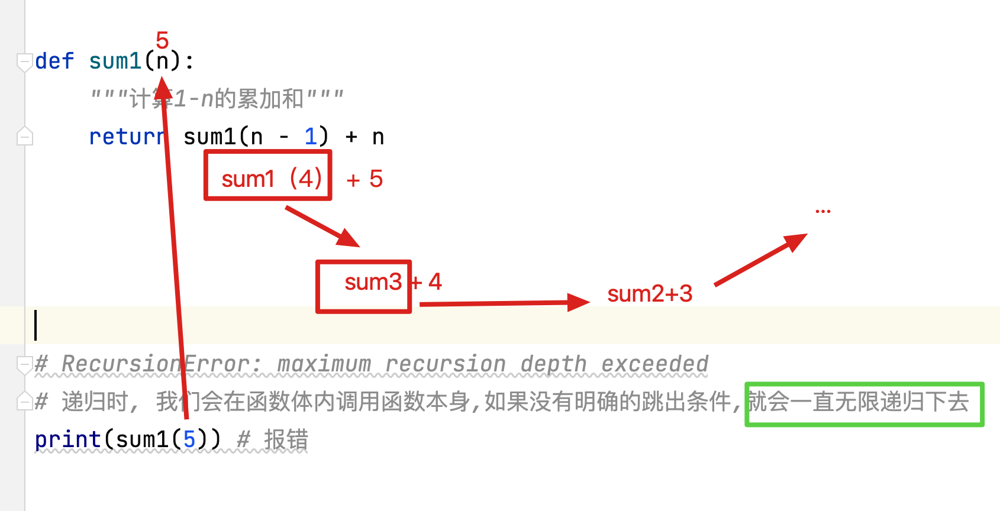
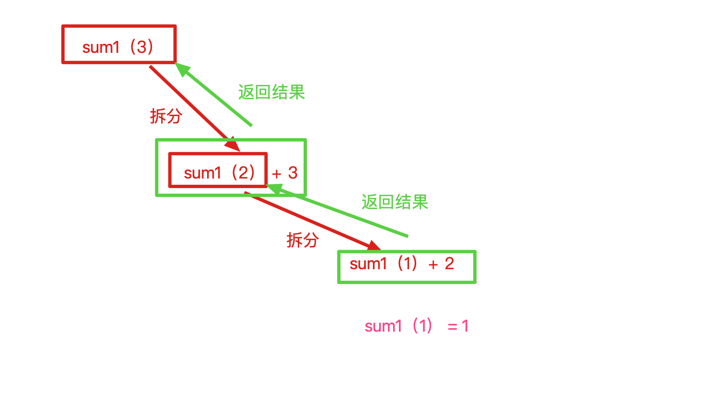
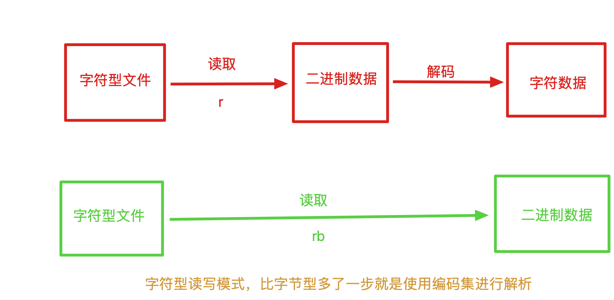
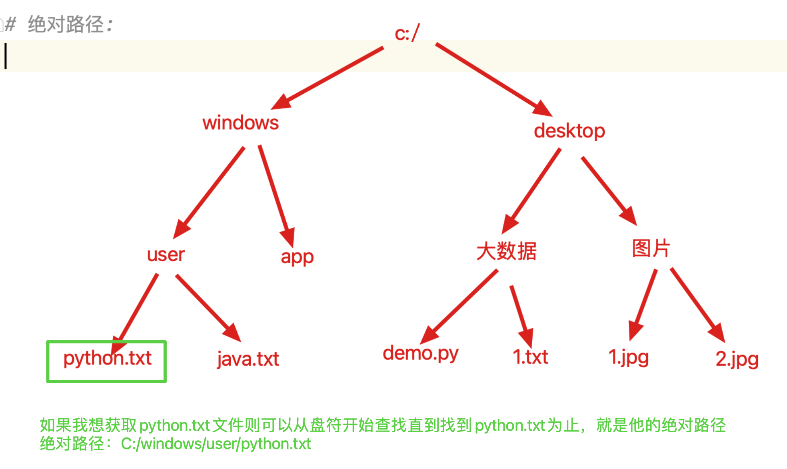
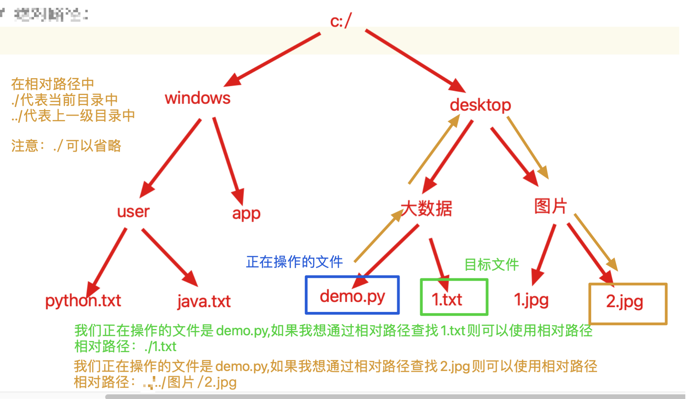
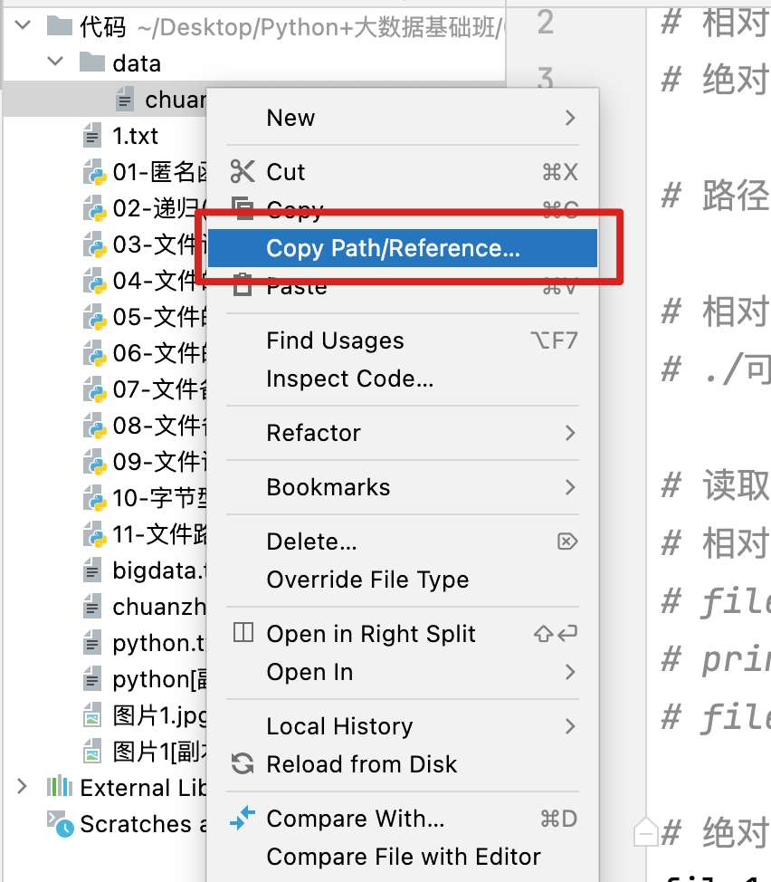
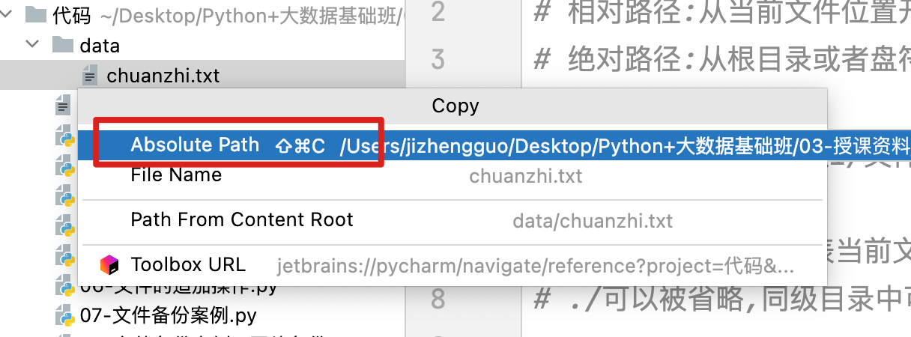

## 1、今日课程内容

- 匿名函数（重点）
- 了解递归
- 文件的读写操作（重点）  
- os模块进行文件操作
- 异常

## 2、lambda表达式[**重点**]

```python
# 匿名函数又叫lambda表达式,是函数的另外一种定义方式,定义时和def存在差异,调用时,完全一致.
# 格式: lambda 参数列表:返回值

# 需求: 创建一个函数,输入两个数字,通过计算返回两个数字的和.

# def 定义普通函数
def sum1(num1, num2):
    return num1 + num2


print(sum1(3, 4))  # 7

# lambda 表达式定义匿名函数
# 定义:
lambda num1, num2: num1 + num2

# 调用:
# 方式一: 直接调用
# 此方法不需要函数名,但是这种方法定义的匿名函数只能调用一次,下次使用需要重新定义.
res = (lambda num1, num2: num1 + num2)(3, 4)  # 7
print(res)

# 方式二: 间接调用 (使用变量接收匿名函数后再使用()进行调用)
sum2 = lambda num1, num2: num1 + num2
print(sum2(3, 4))  # 7
# 使用方式二定义的匿名函数,可以多次使用
print(sum2(4, 5))  # 9

# 匿名函数的最大作用就是可以将函数更加方便的以参数的形式传递到函数体内部

# sort 函数 (列表排序函数)
list1 = [1, 2, 6, 7, 5, 4, 3]
list1.sort()
print(list1)  # [1, 2, 3, 4, 5, 6, 7]

# sort的完整格式 列表.sort(self, key, reverse)
# self : 不需要传值,系统自动传值
# key : 排序规则,需要传递一个函数,一般我们习惯使用匿名函数
# reverse : 升序降序, 默认为False 是升序, 如果修改为True 是降序

# sort函数中的key参数需要传递一个函数定义
list2 = [(3, 4), (2, 1), (5, 3), (6, 2)]
# 需求:自定义规则进行排序,让list2中的元素,按照元组中的第二个元素的大小进行排序
# 举例: (3,4) > (5,3)  因为 4 大于 3
# 此时就需要使用到参数key : 列表.sort(key = lambda 元素 : 排序规则)
list2.sort(key=lambda x: x[1])

# sort(key=lambda x: x[1])解释: 遍历列表,每次将一个元素进行传入,用x接收, 我们返回的排序规则是x[1],也就是按照元组元素的下标为1的元素排列大小
print(list2)  # [(2, 1), (6, 2), (5, 3), (3, 4)]
```

```python
# 练习:
# 1. 使用lambda表达式，随机传入任意多个数据，并计算累加和， 使用两种方式调用（*args）
res = (lambda *args: sum(args))(1, 2, 3, 5, 6, 8, 9)
print(res)  # 34

func1 = lambda *args: sum(args)
print(func1(1, 2, 3, 5, 6, 7, 8))  # 32

# 2. 使用lambda表达式，计算a 和 b 中的较大值，并返回（选做）
max1 = lambda a, b: max(a, b)
print(max1(1, 2))

# lambda函数过于复杂后,可读性会变差
max2 = lambda a, b: a if a > b else b
print(max2(4, 9))

# 3. 使用lambda进行排序, 排序规则是按照元素除以4的余数大小进行排序
list3 = [4, 8, 3, 6, 5, 7, 9]
list3.sort(key=lambda x: x % 4, reverse=True)
print(list3)


# lambda表达式缺点:
# 1.如果函数结构或功能过于复杂,则无法使用lambda完成,使用lambda 表达式创建的函数只能书写一个返回值表达式,例如判断循环等都不能出现
# 2.可读性较差,一般不建议书写过于复杂的lambda
```

## 3、递归（了解）

```python
# 递归不需要同学们掌握,需要的是有所了解
# 递归是一种算法
# 算法: 将数学知识转换为编程代码的一种思想

# 需求: 计算1-100的累加和   f(x) 这个函数代表 1-x的累加和
'''
总结规律
f(1) = 1
f(2) = 1 + 2 = f(1) + 2
f(3) = 1 + 2 + 3 = f(2) + 3
f(4) = 1 + 2 + 3 + 4 = f(3) + 4
....
f(n) = 1 + 2 + 3.... + n = f(n-1) + n

最终规律: f(n) = f(n-1) + n
'''


# 递归就是在函数体内调用函数本身的计算方法.
def sum1(n):
    return sum1(n - 1) + n


# RecursionError: maximum recursion depth exceeded
# 超出函数的最大调用深度(python中默认最大调用深度为1000) , 由于此处没有明确的递归出口,所以函数将无限递归下去
# print(sum1(5))

# 解决问题: 当n = 1 时, 我们发现不需要继续调用函数,可以直接返回1, 此时我们就具备了递归出口

def sum2(n):
    if n == 1:
        return 1
    return sum2(n - 1) + n


print(sum2(5))
# print(sum2(100)) # 5050


# 有效递归的注意事项:
# 1.函数定义的内部必须调用函数本身
# 2.要有明确的函数跳出条件
# 3.不超出最大调用深度, Python默认是1000层
# RecursionError: maximum recursion depth exceeded in comparison
# 系统默认函数嵌套超过1000层就会报错,所以我们要保证我们的递归在循环调用函数时不超过1000层,否则就会报错
print(sum2(997))


# 注意: 开发中尽量不要使用
# 1.递归效率极低
# 2.递归的业务应用场景不多见,一般出现在算法中
# 3.极易出错


# 举例: 斐波那契数列(第三个数是前两个数之和)
# 1 1 2 3 5 8 13 21 ......

def Fibonacci(n):
    # 递归出口,当n = 1 或者 n = 2 时 值为 1
    if n in (1, 2):
        return 1
    return Fibonacci(n - 2) + Fibonacci(n - 1)

# 使用上述函数计算,如果计算数值较大,则无法快速算出数据,计算性能较差,效率较低
print(Fibonacci(40))

```

- 无限递归




- 有明确递归出口



## 4、文件介绍

- 文件就是存储在磁盘上的，需要重复使用的数据或者功能，我们将其命名为文件
  - 将数据存储到磁盘中时,都会以文件为单位保存,叫做数据的持久化
  - 在内存中存储的数据,是以二进制形式存储在内存中的,不是文件.
- 文件操作的步骤
  - 读取文件
    - 打开文件
    - 读取数据
    - 关闭文件
  - 写入文件
    - 打开文件
    - 写入数据
    - 关闭文件

```python
# 此处只需要体验文件的读写,不需要了解书写方式
# 注意: 在pycharm中会自动保存写入的数据,如果使用记事本创建txt文件,写入数据后必须手动保存,否则无法读取.

# 以读取数据为例进行体验
# 1. 打开文件
file = open('1.txt')

# 2. 读取文件内容
print(file.read())

# 3. 关闭文件
file.close()
```

## 5、文件的读取[**重点**]

注意: 使用read 或者 readline读取时,只有在同一次打开文件时,才会继续读取,如果关闭文件后,再打开则又从文件开头位置读取.

```python
'''
步骤:
1.文件打开
    格式: open(文件路径,读写模式,指定编码集) 这个函数的返回值是一个file对象
2.文件读取
    格式:
        文件对象.read(n)
        文件对象.readline()
        文件对象.readlines()
3.文件关闭
    格式: 文件对象.close()  文件关闭后将不能继续操作文件对象
'''


# 1. 打开文件
# def open(file, mode='r', buffering=None, encoding=None, errors=None, newline=None, closefd=True):  # known special case of open
# 第一个参数 file: 填写要打开文件的路径 (使用鼠标右键点击文件 >> copy >> copy path)
# 第二个参数 mode: 读写模式 r 代表只读, w代表只写 , a 代表追加
# 第三个参数 encoding : 指定编码集
file = open('1.txt', mode='r', encoding='utf8')

# 2. 读取文件内容
# 方式一: read()
# read() 可以一次性读取全部文件内容
# content = file.read()
# print('方式一:', content)

# 方式二: read(n)
# read(n) 可以指定最大读取字符数, 如果填写4,证明最多读取4个字符. (如果内部只有一个字符,则读取一个.)
# content = file.read(4)
# print('方式二:', content)
# # 如果继续使用read读取数据,将会在之前读取的数据结尾位置继续读取,直到全部读取完成后返回空字符串.
# content = file.read(4)
# print('方式二:', content)
# content = file.read(4)
# print('方式二:', content)

# 方式三: readline()
# readline()一次读取一行数据,以\n作为读取终点. readline 读取数据时,如果数据不存在读取空字符串
# content = file.readline()
# print('方式三:', content)
# # 如果再次使用readline读取数据,则会读取下一行,直到数据读取完成后,返回空字符串
# content = file.readline()
# print('方式三:', content)

# 方式四: readlines()
# readlines() 可以一次性读取全部数据,将数据以行为单位进行分隔,生成一个列表,将子字符串存储进去 (返回值是list)
# readlines的参数hint 代表的不是行数.
# content = file.readlines()
# print('方式四:', content, type(content))

# 我们最常用的数据读取方式时read(n)如果需要读取全部数据,可以使用循环
# 这种写法的好处,就是不会一次性占用大量的内容.
while True:
    content = file.read(4)
    # 当获取到大的数据content 为空时,证明所有数据已经读取完成.
    if content == '':
        break
    print(content, end='')
    
# 3. 关闭文件
# 如果不关闭文件,会持续占用内存,会影响后续文件的读写效率
file.close()

# 注意事项:
# 1.在开发中,read应用场景比readline等大很多
# 2.readlines几乎不用(限制条件越多的函数或方法,功能越强大, 调用难度越高,使用频率越低)
```

练习： 

```python
# 练习
# 自己写一个文件读写代码， 创建一个txt文件，内部书写静夜思， 通过Python将其独读取出来
# UnicodeDecodeError: 'gbk' codec can't decode byte 0x89 in position 14: illegal multibyte sequence
# 注意: 在windows中一定要使用encoding进行编码集的指定. 因为我们在windows中默认使用gbk进行读取
# 1. 打开文件
file = open('shi.txt', mode='r', encoding='utf8') 
# 2. 读取文件
print(file.read())
# 3. 关闭文件
file.close()

# 注意: 用什么编码格式写入, 就要用什么编码格式读取,否则无法读取成功.

```

## 6、文件的写入[**重点**]

```python
# 写入操作  w
'''
步骤:
1.文件打开
    格式: open(文件路径,读写模式,指定编码集) 这个函数的返回值是一个file对象 写入模式是w
2.写入数据
    格式:
        文件对象.write(要写入的内容)
        文件对象.writelines(字符串列表)
3.文件关闭
    格式: 文件对象.close()  文件关闭后将不能继续操作文件对象

思考1: 以写入模式打开文件时,文件中原有的数据会被清空,那么是写入时清空的,还是打开时清空的呢?
一定要注意,文件是打开时被清空的,而不是写入时清空的.

思考2: 如果写入的文件不存在会创建还是报错呢?
在w模式下,被打开的文件不存在则会创建一个该名称的文件.

思考3: 如果我们不使用encoding, 默认的编码格式是什么?
在windows中如果不书写编码集,则默认使用gbk格式编码,所以我们默认在windows下开发时,一定会书写编码集,无论读写
'''

# 1. 文件打开
# file  = open('2.txt', 'w')
# 在windows下开发时,一定会书写编码集,无论读写
file = open('2.txt', 'w', encoding='utf8')

# 2. 写入数据
# io.UnsupportedOperation: not readable w模式下无法读取数据(同时 r 模式下也不能写入数据)
# print(file.read())

# 方式一: write()
file.write('传智')

# 方式二: writelines 这种写入方式几乎不用,用的时候也是配合readlines去写入, 传参格式与readlines输出格式一致
# 传参格式: ['床前明月光,\n','疑是地上霜.\n','举头望明月,\n','低头思故乡.\n']
str_lists = ['床前明月光,\n', '疑是地上霜.\n', '举头望明月,\n', '低头思故乡.\n']
file.writelines(str_lists)

# 3. 文件关闭
file.close()

# 已经被关闭的文件是不可以操作的.
# ValueError: I/O operation on closed file.
file.write('文件关闭')
```

## 7、文件的追加操作[**重点**]

```python
# 追加  a
'''
步骤:
1.文件打开
    格式: open(文件路径,读写模式,指定编码集) 这个函数的返回值是一个file对象 追加模式是a
2.追加数据
    格式:
        文件对象.write(要写入的内容)
        文件对象.writelines(字符串列表)
3.文件关闭
    格式: 文件对象.close()  文件关闭后将不能继续操作文件对象

思考1: 以a模式打开文件时,文件会被清空么?
以追加模式打开文件时, 文件不会被清空, 而是在文件末尾继续追加数据

思考2: 以a模式打开文件时,如果文件不存在会怎样?
如果文件不存在,则新建一个该名称的文件

思考3: 如果不书写encoding 则是以什么编码集编码??
gbk
'''

# 1. 文件打开
file = open('2.txt', 'a', encoding='utf8')

# 2. 追加数据
# AttributeError: '_io.TextIOWrapper' object has no attribute 'append'
# file.append('欲渡黄河冰塞川, 将登太行雪满山')
# 在文件读写类中,没有追加的方法,在追加模式下,直接使用写入方法写入数据即可

# 方式一:
file.write('闲来垂钓碧溪上,忽复乘舟梦日边')

# 方式二:
# TypeError: write() argument must be str, not int
# writelines 的列表中必须是全部元素均为字符串类型数据,否则报错
# file.writelines(['风萧萧兮易水寒,\n', '壮士一去兮不复还.\n', 1])
file.writelines(['风萧萧兮易水寒,\n', '壮士一去兮不复还.\n'])

# 3. 文件关闭
file.close()

# 思考:读取数据时,文件不存在会报错么? 会报错
# FileNotFoundError: [Errno 2] No such file or directory: '4.txt'
# file = open('4.txt', 'r')
# file.close()
```

## 8、文件备份案例

```python
# 需求：用户输入当前目录下任意文件名，程序完成对该文件的备份功能(备份文件名为xx[备份]后缀)
# 例如：test[备份].txt)。

# 分析: 如果想去备份文件,我们需要做哪些事情?
# 打开旧文件,读取旧数据,,打开新文件, 写入新文件,关闭文件

# 1. 让用户手动键入文件名称
file_name = input('请输入您要备份的文件名称: ')

# 2. 打开用户输入的文件
old_file = open(file_name, 'r', encoding='utf8')

# 3. 读取该文件中的内容
content = old_file.read()

# 4. 打开备份文件
new_file_name = file_name.replace('.', '[备份].')
new_file = open(new_file_name, 'w', encoding='utf8')

# 5. 将刚刚读取到的数据写入到备份文件中
new_file.write(content)

# 6. 关闭旧文件
old_file.close()

# 7. 关闭新文件
new_file.close()
```

## 9、文件备份案例--字节型

```python
# 问题: 使用之前备份字符型文件的代码,无法备份字节型文件,因为编码集异常,无法解析.
# utf8编码集是对于字符进行编码的,而图片数据是字节型文件,无法编码.解码.

# 思考1: 读取和写入纯文本类型文件和字节型文件的读写模式一样么? 不一定一样
# 之前读取和写入纯文本文件时使用的读写模式是 r w a  而读取和写入字节型文件需要使用 rb wb ab

# 思考2: 读取和写入纯文本文件可以使用rb  wb ab么?
# 读取和写入纯文本文件，可以使用 rb  wb ab， 但是读取和写入字节型文件不能使用r a w

# 1. 让用户手动键入文件名称
file_name = input('请输入您要备份的文件名称: ')

# 2. 打开用户输入的文件
# 我们打开图片文件时, 如果我们书写encoding提示不能使用uft8编码集, 如果不写,提示不能使用gbk编码
# 因为r模式就是读取字符型数据的,要么指定编码集,要么默认编码集,而图片类型数据不需要编码,所以需要使用rb读写模式
old_file = open(file_name, 'rb')

# 3. 读取该文件中的内容
# 读取出来的数据是以b开头,代表是二进制字符串.
# b'\xff\xd8\xff\xe0\'  \x代表16进制数据, 这里一共2位, 代表8位, 而8位就是一个字节.
content = old_file.read()
print(content)

# 4. 打开备份文件
new_file_name = file_name.replace('.', '[备份].')
new_file = open(new_file_name, 'wb')

# 5. 将刚刚读取到的数据写入到备份文件中
new_file.write(content)

# 6. 关闭旧文件
old_file.close()

# 7. 关闭新文件
new_file.close()

```

## 10、文件的读写模式

```python
"""
文件件读写模式分为三大类
r  读取模式
    r: 文本型读取模式
    rb:字节型读取模式
    r+:文本型读取模式加强
    rb+:字节型读取模式加强

w  写入模式
    w: 文本型写入模式
    wb:字节型写入模式
    w+:文本型写入模式加强
    wb+:字节型写入模式加强

a  追加模式
    a: 文本型追加模式
    ab:字节型追加模式
    a+:文本型追加模式加强
    ab+:字节型追加模式加强

拆分:
# 读写类别
    读取: 从文件中读取数据,以读取模式打开文件时,文件必须存在,从文件开头读取,不会影响原数据
    写入: 向文件中写入数据,当以写入模式打开文件时,文件如果存在,则清空原数据,如果不存在,则新建文件
    追加: 向文件中追加数据,当以追加模式打开文件时,文件如果存在,则在原文件末尾追加数据,如果不存在,则新建文件

# 模式
    # 字符操作: 读写操作时,操作的是字符型数据
    # 字节操作: 读写操作时,操作的是字节型数据
    # 字符加强操作: 操作的是字符型数据,但是在读的模式下可以写,在写的模式下可以读
    # 字节加强操作: 操作的是字节型数据,但是在读的模式下可以写,在写的模式下可以读

# 举例:
wb+:向文件中写入数据,当以写入模式打开文件时,文件如果存在,则清空原数据,如果不存在,则新建文件,操作的是字节型数据,在写的模式下可以读
"""

# 练习: 创建一个文件,在内部写入'衣带渐宽终不悔,为伊消得人憔悴.',并读取出来打印到控制台
# # 1. 打开文件
# file = open('2.txt', 'r+', encoding='utf8')
# # 2. 写入数据
# file.write('衣带渐宽终不悔,为伊消得人憔悴.')
# # 3. 读取数据
# content = file.read()
# print(content)
# # 4. 关闭文件
# file.close()

# 根据输出的结果和文件内容,可以得出如下结论:
# 使用r+时,既可以读,又可以写,但是此时打开文件后,光标在文件开始位置,向后写入,覆盖原有字符,读取时,以光标位置为起始点继续向后读取.

# 1. 打开文件
# 使用w+会将文件中的数据清空,并且可读可写
file = open('1.txt', 'w+', encoding='utf8')
# 2. 写入数据
file.write('衣带渐宽终不悔,为伊消得人憔悴.')
# 3. 读取数据
content = file.read()
print(content)
# 4. 关闭文件
file.close()

# 根据输出的结果和文件内容,可以得出如下结论:
# 使用w+时,既可以读,又可以写, 但是此时打开文件后,文件内容将被清空,从开始位置想向后写入内容,当读取数据时,光标在数据末尾,向后读物无内容,所以打印内容为空

# 解决方案 : 控制光标
# 1. 打开文件
# 使用w+会将文件中的数据清空,并且可读可写
file = open('1.txt', 'w+', encoding='utf8')
# 2. 写入数据
file.write('衣带渐宽终不悔,为伊消得人憔悴.')

# 解决方案: 将光标移动到文件的开始位置
file.seek(0, 0)

# 3. 读取数据
content = file.read()
print(content)
# 4. 关闭文件
file.close()

# 注意事项:虽然带+号的读写模式既可以读,又可以写极其方便,但是使用过程中要配合复杂的光标移动,所以用的很少,不如开启两次文件,分别读写.
```

## 11、字符集的了解

```python
# 字节型文件: 以字节形式存储的数据文件, 例如 图片, 音频, 视频等
# 字符型文件: 使用字符集将字节型文件进行编码后的文件, 例如 :txt文件 csv文件等

# 创建一个 字符型数据
str1 = '我们要勇敢'
print(str1)
print(type(str1))

# 创建一个二进制字符串
byte1 = b'abc'
print(byte1)
print(type(byte1))

# 1. 将字符串数据类型,转换为字节型数据
# encode  编码
byte2 = str1.encode(encoding='utf8')
# 将str1 以utf8编码集转换为字节型数据,从5个字符转换为了15个字节, 所以一个汉字占用3个字节
print(byte2)  # b'\xe6\x88\x91\xe4\xbb\xac\xe8\xa6\x81\xe5\x8b\x87\xe6\x95\xa2'
print(type(byte2))  # <class 'bytes'>

byte3 = str1.encode(encoding='gbk')
# 将str1 以gbk编码集转换为字节型数据, 从5个字符转换为了10个字节, 所以一个汉字占2个字节
print(byte3)  # b'\xce\xd2\xc3\xc7\xd2\xaa\xd3\xc2\xb8\xd2'
print(type(byte3))  # <class 'bytes'>

# 2. 将字节型数据转换为字符型数据
# decode  解码
str2 = byte2.decode(encoding='utf8')
print(str2)  # 我们要勇敢
print(type(str2))  # <class 'str'>

str3 = byte3.decode(encoding='gbk')
print(str3)  # 我们要勇敢
print(type(str3))  # <class 'str'>


# UnicodeDecodeError: 'utf-8' codec can't decode byte 0xce in position 0: invalid continuation byte
# 在进行编码集使用时,一定要注意,使用什么编码集编码,就要使用它解码,否则报错.
# str4 = byte3.decode(encoding='utf8')
# print(str4)
# print(type(str4))

# 3. 字节型数据 + 编码集 = 字符型数据
# 使用正确的编码集可以让数据在字节型和字符型之间进行转换
# 但是不是所有的字节型数据都可以转换为字符型,必须时以字符集编码的字节型数据才可以使用该字符集解码.

```



## 12、相对路径和绝对路径[**重点**]

```python
# 文件路径分为两种
# 相对路径:从当前文件位置开始进行查找,直到找到文件位置的查找路径
# 绝对路径:从根目录或者盘符开始查找,直到找到文件位置的查找路径

# 路径格式: 文件层级1/文件层级2/....文件.后缀

# 相对路径中 ./ 代表当前文件夹中, ../ 代表上一级文件夹中
# ./可以被省略,同级目录中可以直接使用文件名称

# 读取data文件夹中的chuanzhi.txt文件
# 相对路径查找
# file1 = open('./data/chuanzhi.txt', 'r')
# ./可以省略
file1 = open('data/chuanzhi.txt', 'r')
print(file1.read())
file1.close()

# 绝对路径
# file1 = open('/Users/jizhengguo/Desktop/Python+大数据基础班/03-授课资料/day07/代码/data/chuanzhi.txt', 'r')
# print(file1.read())
# file1.close()
```

练习： 操作的文件为demo.py如果想要获取到python.txt文件 相对路径如何书写。

- Python.txt绝对路径



- 相对路径



- 在pycharm获取绝对路径的方法

  

​		获取绝对路径



## 13、os模块的介绍

- 不需要背，只要用到了知道有这么个功能就行

```python
# os模块: 就是操作系统模块 operation system
# 这个模块中可以进行文件的创建,查询等操作

# 导包: 如果我们想使用一个功能,我们自己又没有去实现,可以导入别人写好的包,帮我们实现
import os

# os.getcwd()当前文件所在的绝对路径
print(os.getcwd())  # C:\Users\75954\Desktop\AI23期基础班--Python阶段\day07\代码

# os.rename(旧文件路径, 新文件路径) 给文件重命名
# FileNotFoundError: [WinError 2] 系统找不到指定的文件。: '1.txt' -> 'demo1.txt'
# 重命名文件时,如果文件已经不存在,则报错
# os.rename('1.txt', 'demo1.txt')

# os.remove(文件路径) 删除指定位置的文件
# FileNotFoundError: [WinError 2] 系统找不到指定的文件。: '1[备份].txt'
# 次方法可以删除文件,但是如果文件不存在,则报错.
# 这种方法慎用,因为不会存放到回收站内.不安全.
# os.remove('1[备份].txt')

# os.listdir() 可以获取指定目录中的所有文件名称
# 括号内什么也没有写时,默认获取的是文件所在目录的文件名称列表
print(os.listdir()) # ['.idea', '01-lambda表达式.py','12-os模块的简单使用.py', '2.txt', '2[备份].txt', '3.txt', 'demo1.txt', 'erkang.jpg', 'erkang[备份].jpg', 'shi.txt', 'shi[备份].txt']
# 括号内填写目录路径,则可以获取指定位置目录下的所有文件名称列表. windows中文件的分隔符为\ 这个符号也是转义字符的意思,所有你在字符串中使用需要增加一个\防止其转义
print(os.listdir('C:\\Users\\75954\\Desktop\\AI23期基础班--Python阶段\\day02')) # ['代码', '作业', '笔记', '视频']

# os.mkdir(目录路径) 创建一个空文件夹
# FileExistsError: [WinError 183] 当文件已存在时，无法创建该文件。: './data'
# 可以创建一个空目录, 但是如果目录已经存在则报错.
os.mkdir('./data')

```

