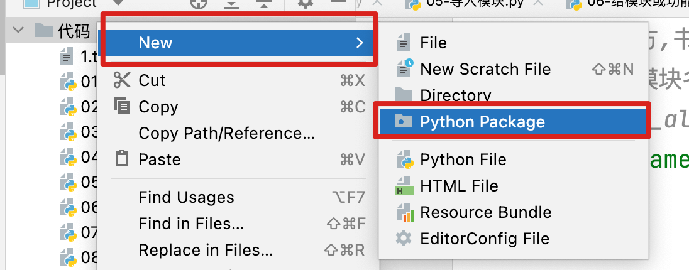
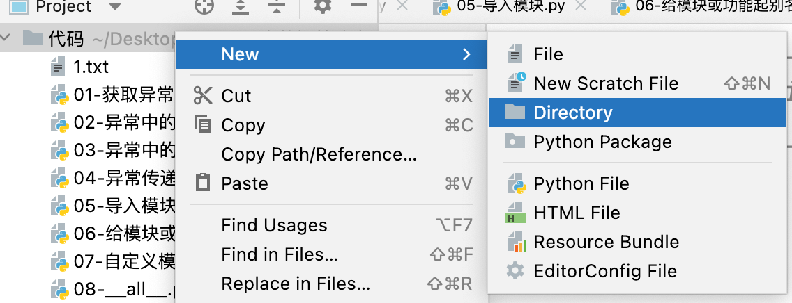

## 1、异常介绍

- 异常就是代码在执行过程中出现的错误，会造成程序的终止(Error)
  - 区分异常和警告
    - 异常: 程序运行过程中出现的错误,会造成程序的终止运行
    - 警告: 程序运行的结果可能和我们预想的不一致,不一定会造成程序的终止运行
- 在开发中尽量避免因为异常造成的程序崩溃，异常不能完全避免，所以需要进行一定程度的处理。
- 异常是开发中的一种安全措施：
  - 如果所有的代码不出现异常，会造成数据错误，服务混乱，业务问题。会直接造成经济损失
  - 异常是为了让程序员在开发过程中，尽量的发现更多的问题，但是在上线后尽量避免服务崩
- 常见的异常类型：
  - NameError
  - TypeError
  - VlaueError
  - KeyError
  - IndexError
  - 。。。。。

## 2、异常捕获体验

```python
# 在开发中,一般我们不希望异常造成程序崩溃,所以我们会使用try..except对于异常进行捕获.
'''
异常捕获格式:
    try:
        可能出现异常的代码
    except:
        try中的代码出现异常后将会执行此代码
    # 处理完异常后会继续执行后续代码
    print('程序结束')

# Process finished with exit code 1  当code = 1时证明有异常.  当code=0时没有异常
'''

# print(1 / 0)  # ZeroDivisionError: division by zero

# 需求: 当出现零除错误时,我们不希望代码崩溃,而是输出一句话, 0不能作为分母出现.
try:  # 注意: try必须配合except,不能单独使用
    print(1 / 2)  # 执行
    print(1 / 0)  # 异常
    print(1 / 4)  # 不执行
    # 如果try中的代码没有出现异常,则不会执行except中的代码.
except:
    # 如果代码出现异常,程序不会崩溃,会执行except中的代码
    print('0不能作为分母出现.')

print('程序结束')

# 结论: try中的代码会从上到下依次运行, 当代码出现异常后,不会执行try中的后续代码直接执行except
```

## 3、捕获指定类型的异常[**重要**]

```python
# 在出现异常时,最后一行信息中 冒号之前是异常类型,冒号之后是异常描述信息
# NameError: name 'a' is not defined
# NameError: 冒号之前是异常类型
# : name 'a' is not defined 冒号之后是异常描述信息
# print(a)

# 获取指定类型异常的方法

"""
try:
    可能出现异常的代码
except 异常类型1:
    出现异常类型1时执行的代码
except 异常类型2:
    出现异常类型2时执行的代码
......

如果出现的异常不是我们指定的类型中的其中一个,则异常依然会造成程序终止
"""

# 下方代码只能捕获NameError 如果出现TypeError则结束程序
# TypeError: unsupported operand type(s) for +: 'int' and 'str'

# try:
#     print(1 + '2')  # TypeError
#     print(a)  # NameError
# except NameError:
#     print('此处出现了变量未定义错误.')

# 如果我想捕获多种类型的异常应该怎么做呢?
# 方法一: 书写多个except 在后方分别填写异常类型
try:
    print([1, 2, 3][100])
    print(1 / 0)  # ZeroDivisionError
    print(a)  # NameError
    print(1 + '2')  # TypeError
except NameError:
    print('此处出现了变量未定义错误.')
except TypeError:
    print('此处出现了类型不一致错误.')
# 在开发中,我们不可能记得每一种异常类型的名称,此时我们可以使用Exception接收任意类型的异常
except Exception:
    print('此处出现了未知异常,但是任何异常类型都可以被Exception接收.')

# 方法二: 书写一个except 在后方填写多个异常类
try:
    print(1 + '2')  # TypeError
    print(a)  # NameError
    print(1 / 0)  # ZeroDivisionError
except (NameError, TypeError):
    print('出现了变量未定义或者类型不一致错误')
except Exception:
    print('此处出现了未知异常,但是任何异常类型都可以被Exception接收.')

# 思考: 在一个程序中,可能既出现了NameError 又出现了TypeError么?
# 绝不可能, 出现了一个异常,就退出程序了,不会执行到第二个异常的
```


## 4、获取异常描述信息[**重要**]

```python
# NameError(异常类型): name 'a' is not defined(异常描述信息)
'''
获取异常描述信息的格式:
try:
    可能会出现异常的代码
except 异常类型 as 变量名:
    print(变量名) 此时会输出异常信息
except 异常类型 as 变量名:
    print(变量名) 此时会输出异常信息
...

'''

# 方式一: except后只有一个异常类
try:
    print(a)
    print(1 + '2')
except NameError as e:
    # 使用print打印e就可以输出异常描述信息
    print(e)  # name 'a' is not defined
except TypeError as e:
    print(e)

# 思考: 为什么多种异常类都是用e作为变量, 会不会发生冲突???
# 因为同一个try...except...中只能存在一个异常,所以也就只能捕获一次异常,如果上变的e被赋值,则下边的e就不会被执行.

# 方式二: except后有多个异常类

try:
    print(a)
    print(1 + '2')
except (NameError, TypeError) as e:
    print(e)

# 思考: 为什么这种方式中except后只有一个as e呢?会不会漏赋值呢?
# 因为同一个try...except...中只能存在一个异常,所以也就只能捕获一次异常,如果出现异常则e只能存放一种异常,不会漏赋值,也不会冲突.
```

## 5、异常中的else

```python
"""
格式:
try:
    可能出现异常的代码
except:
    如果try中的代码出现了异常执行的代码
else:
    如果try中的代码没有出现异常时执行的代码

在开发中,else和except只能执行一个,不能同时执行
"""

try:
    # print(a)
    print(1)
except:
    print('出现异常时执行')
else:
    print('未出现异常时执行')
    
# 思考: 如果没有else,将else中的代码写到try中代码的末尾, 效果一致么?
# 效果完全一致,所以else不是功能代码,可有可无,但是可以增加代码的逻辑性和可读性.
try:
    # print(a)
    print(1)
    print('未出现异常时执行')
except:
    print('出现异常时执行')

```

## 6、异常中的finally

```python
"""
格式:
try:
    可能出现异常的代码
except:
    try中的代码出现异常后执行的代码
else:
    try中的代码没有出现异常时执行的代码
finally:
    无论是否出现异常都会执行的代码
"""

try:
    # print(a)
    print(1)
except:
    print('当代码出现异常时执行')
else:
    print('当代码没有出现异常时执行')
finally:
    print('无论是否出现异常都会执行')

# 思考: 卸载finally中和写在异常捕获之外一样么? 绝大多数情况下无区别,但是finally更加厉害,在异常捕获失败后,依然可以执行
try:
    print(a)
    # print(1)
except:
    print('当代码出现异常时执行')
else:
    print('当代码没有出现异常时执行')

print('无论是否出现异常都会执行')

try:
    print(a)
    # print(1)
except TypeError:
    print('当代码出现异常时执行')
else:
    print('当代码没有出现异常时执行')
finally:
    print('无论是否出现异常都会执行') # 此为止代码,无论是否出现异常都会执行,且异常捕获失败后,也会执行完该代码再结束程序
 
print('无论是否出现异常都会执行') # 此带代码,无论是否出现异常都会执行,但是异常捕获失败后,直接退出程序,不会执行该代码.


# 综上所述 : else 和finally 是锦上添花的 ,会可以提高效率,增加可读性,不会不影响开发.

# finally使用场景:
# 1. 当程序崩溃时,需要记录完崩溃原因后再结束长须
# 2. 当读写内容时,程序崩溃则立即关闭文件,防止出现文件损坏
```

```python
'''
练习：
1.我们再try中尝试打开一个文件，文件名称手动输入
2.如果出现异常，提示文件不存在, 并且以写入模式打开,创建该文件
3.如果没有出现异常，将数据输出
4.无论是否出现异常，将文件关闭
'''

try:
    file = open('1.txt', 'r', encoding='utf8')
except Exception as e:
    print(e)
    print('该文件不存在')
    file = open('1.txt', 'w', encoding='utf8')
    file.write('苔痕上阶绿,草色入帘青,谈笑有鸿儒,往来无白丁')
else:
    print(file.read())
finally:
    print('文件操作结束')
    file.close()
```

## 7、异常传递（异常穿透）[**重要**]

```python
# 存在异常嵌套的情况下,如果内层try没有捕获到异常,可以传递到外层异常中进行捕获,这种现象叫做异常传递(异常穿透)
# 如果外层还是没有捕获到将会继续向外传递,直到程序终止为止.

try:
    print('外层异常')
    try:
        # 内层try中没有捕获TypeError会传递到外层try中进行处理
        print('内层异常')
        print('123' + 4)
    except NameError as error:
        print('变量没有被定义')
# 当接收到内层传递出来的异常时将会执行如下代码
except TypeError as e:
    print(f'数据类型错误, {e}')
```

## 8、模块的导入方式[**重要**]

```python
# 模块: 其实就是一个python源文件, 内部书写了一些功能, 我们导入模块就可以使用其他人写好的功能.
# 作用:
# 1. 可以提高代码的复用率,同一个模块中的功能可以再不同文件或工程中使用.
# 2. 可以使用大神写好的功能,通过简单的调用实现复杂的功能.降低开发门槛.
# 3. 方便大家协同开发

# 模块的导入方式

# 方式一: 全部导入
# 导入方式:  import 模块名
# 调用方式:  模块名.功能名
# 导入
import random

# 调用 : 这种导入方式导入的模块内所有的功能我们都可以直接使用.
print(random.randint(1, 10))
print(random.random())

# 方式二: 局部导入
# 导入方式:  from 模块名 import 功能名
# 调用方式: 功能名
# 导入
from random import randint
# 调用 : 这种导入方式,导入的模块只能使用其导入的功能,未导入的功能不能使用.
print(randint(1,10))
# TypeError: 'module' object is not callable
# print(random())

# 方式三: 局部导入
# 导入方式: from 模块名 import * (通配符)
# 调用方式: 功能名
# 导入:
from random import *
# 调用 : 这种导入方式还是局部导入,因为虽然我们可以使用import * 导入多个功能,但是被导入功能的范围我们可以手动控制.
print(randint(1, 10))
print(random())
print(randrange(1, 10))
```

## 9、给模块或功能起别名

```python
# 为什么要起别名?
# 1. 简化调用方式: 有些模块或功能名称过长, 调用层级过多,使用不便
# import multiprocessing
# 2. 如果出现同名功能,必须起别名,否则无法调用.(后导入覆盖先导入)
# 3. 约定俗成:  例如  import pandas as pd   import numpy as np

# 给模块起别名
import random as rd

# import random as rd, os as o  # 不要这样写

# 给模块起别名后,原来的模块名称将无法继续使用
# NameError: name 'random' is not defined
# print(random.randint(1, 10))
print(rd.randint(1, 10))

# 给功能起别名
from random import randint as rdt

# 给功能起别名后,原来的功能名称将无法继续使用
# NameError: name 'randint' is not defined
# print(randint(1, 3))
print(rdt(1, 3))

# 如果一次性导入多个功能,如何起别名呢?
# 需要在被起别名的功能后添加as 别名
from random import randint as rdt, random as rd, randrange as rdr

print(rdt(1, 3))
print(rd())
print(rdr(1, 3))

```

## 10、自定义模块[**重要**]

- 模块名要遵守标识符的命名规则
- 只有模块中可以存储到内存中的数据才可以导入到其他文件中

```python
# 之前我们使用的random os 都是系统内置模块, 也就是系统帮我们写好的模块,这部分不需要我们实现任何功能,导入后就可使用.

# 自定义模块: 用户自己书写的.py文件,在导入到其他文件内部时,可以直接使用该文件中的功能,这个就是自定义模块

# import 0_0_chuanzhi  # 这个文件不是一个模块,模块名称必须遵循标识符命名规范,否则无法导入

# 导入自定义模块
import my_module_01

# 调用自定义模块的功能
print(my_module_01.age)

my_module_01.func1()

my_module_01.func2()


# 什么样的数据,可以导入到其他文件中作为模块的功能被调用???
# 1. 被标识符存储, 例如 函数, 全局变量, 类等
# 2. 作用域是全局.
```

`my_module_01.py`

```python
age = 12


def func1():
    print('无边落木萧萧下,不尽长江滚滚来!')


def func2():
    print(age, 'func2')

```


## 11、`__all__`的用法

```python
# 在模块中可以再模块开始位置,增加一个__all__变量
# 在这个变量中,存储一个列表, 写入到列表中的功能名称,就可以使用 from ... import * 的形式进行一次性导入

# 1. 如果我们不在模块中书写__all__ ,则使用 from ... import * 可以导入全部功能.
# from my_module_01 import *
#
# print(age)
# func1()
# func2()

# 2. 如果我们在模块中书写__all__ = [] 则使用 from ... import *  导入任何功能都无法使用
from my_module__all__ import *

# NameError: name 'age' is not defined
# print(age)
# NameError: name 'func1' is not defined
# func1()

# 3. 如果我们在模块中书写了 __all__ = [功能1, 功能2] 则仅可以使用from .. import * 导入功能1 和功能2
from my_module__all__ import *

print(age)
# print(name) # NameError: name 'name' is not defined
func1()
# func2() # NameError: name 'func2' is not defined

# 4. __all__的值不影响全部导入的方式
import my_module__all__

my_module__all__.func2()
print(my_module__all__.name)

# 5. __all__的值不影响局部导入中指定功能的方式
from my_module__all__ import func2

func2()

# 总结: __all__是为了防止使用全部导入时,使用* 的模式下导入过多的函数或方法,影响正常操作
# 建议: 在开发中,需要什么导入什么 不要多,也不要缺
```

模块

```python
__all__ = ['age', 'func1']

age = 18

name = '小明'


def func1():
    print('星垂平野阔, 月涌大江流')


def func2():
    print('月下飞天镜,云生结海楼')

```

## 12、包的创建 

方法一：在工程目录中右键---new---Python package  创建即可



方法二：在工程目录中右键---new---Directory--在新创建的目录中再创建一个`__init__.py`文件。



如果一个目录中没有`__init__.py`文件，则这个目录不是一个包

- 包：具有关联的一些模块存放在一个目录中，并且有一个`__init__.py`文件统一管理

## 13、包的使用[**重要**]

```python
# 包: 相关模块的集合,存放在一个目录中,这个目录就可以称之为包
# 包在pycharm中显示时,又一个小圆点.
# 在普通目录中创建一个__init__.py文件,默认当前的目录就是一个包
# 包：具有关联的一些模块存放在一个目录中，并且有一个`__init__.py`文件统一管理

# 1. 全部导入
# 导入模块: import 包名.模块名
# 调用功能: 包名.模块名.功能名
import my_package.my_module_02

print(my_package.my_module_02.age)
my_package.my_module_02.func1()

# 2. 局部导入1
# 导入模块: from 包名 import 模块名
# 调用功能: 模块名.功能名
from my_package import my_module_03

print(my_module_03.age)
my_module_03.func1()

# 3. 局部导入2
# 导入模块: from 包名.模块名 import 功能名
# 调用模块: 功能名
from my_package.my_module_02 import age

print(age)
# func1()

# 4. 局部导入3
# 导入模块: from 包名.模块名 import *
# 调用模块: 功能名
# 此处的导入也受到 __all__ 的影响
from  my_package.my_module__all__ import *
print(age)
func1()
# func2()
```

## 14、模块中演示代码的书写位置

- 如果想在模块中书写测试代码或者演示代码就写在`if __name__ == '__main__':`中

```python
# 其实导入模块的思路,就是将模块中的代码都执行一遍,将函数名和变量名保存到内存中,如果调用函数或者变量,则找到其定义位置执行代码.
import my_package.my_module_02

# 但是my_module_02中有测试代码, 我们仅导入模块,没有进行任何功能书写时,就输出了数据,会影响业务实现.
# 所以我们有这样一个需求:
# 当我们在my_module_02中执行代码时,调用测试代码
# 当我们将该文件以模块形式导入到其他文件中时,不调用该测试代码

# 思考:如果我们想在模块中书写示例代码,演示代码,或者进行测试,我们应该怎么办????
# 写入if __name__ == '__main__':中即可
```

模块

```python
age = 18


def func1():
    print('万里悲秋常作客,百年多病独登台.')


def func2():
    print(age, '我是一个函数')

print(__name__) # 当在本文件中执行时结果为__main__, 当做模块导入到其他文件时,结果为my_package.my_module_02(模块名称)
# 快捷方式, 输入main 自动跳出if 语句
if __name__ == '__main__':
    func1()
    func2()

# __name__是系统内置变量, 内部存储的是当前模块的名称
# 如果我们是在当前文件中启动Python程序,则__name__的值为__main__
# 如果我们不是在当前文件中启动,而是导入到其他文件中,则__name__的值为模块名称
```

## 15、学生管理系统的需求分析

```python
"""
需求：进入系统显示系统功能界面，功能如下：

1、添加学员
2、删除学员
3、修改学员信息
4、查询学员信息
5、显示所有学员信息
6、退出系统
系统共6个功能，用户根据自己需求选取。
"""


# 分析步骤:
# 1.展示功能列表
# 2.获取用户输入的功能编号
# 3.根据功能编号选择要执行的功能
# 4.循环上述内容

# 分析,如果我们想保存学员信息,我们需要使用什么容器来进行存储???
# 保存一个学员的信息,使用字典最为合适
# 如果我想保存多个学员的信息呢??? 列表嵌套字典
# 举例:
students_list = [
    {'name': '小明', 'age': 18, 'stu_id': '001'},
    {'name': '小红', 'age': 19, 'stu_id': '002'}
]
```

## 16、搭建学生管理系统的框架

```python
# TODO: 4.循环上述内容
while True:
    # TODO: 1.展示功能列表
    print('-' * 20)
    print('欢迎登录学员管理系统')
    print('1: 添加学员')
    print('2: 删除学员')
    print('3: 修改学员信息')
    print('4: 查询学员信息')
    print('5: 显示所有学员信息')
    print('6: 退出系统')
    print('-' * 20)
    # TODO: 2.获取用户输入的功能编号
    option = input('请输入您要执行的功能: (1-6)')
    # TODO: 3.根据功能编号选择要执行的功能
    if option == '1':
        print('添加学员')
    elif option == '2':
        print('删除学员')
    elif option == '3':
        print('修改学员信息')
    elif option == '4':
        print('查询学员信息')
    elif option == '5':
        print('显示所有学员信息')
    elif option == '6':
        print('退出系统')
    else:
        print('输入信息有误,请重新输入.')
    # 根据输入的信息执行功能后进行阻塞,方便查看输出结果
    input()
```

## 17、从框架中抽取函数

```python
# 一个完整的功能可以抽取函数
# 分析可以抽取的功能:
# 1. 展示功能列表
# 2. 根据用户输入的编号执行特定功能
# 3. 功能列表中的每一个函数都可以抽取

# TODO: 1. 先将函数抽取出来
def print_info():
    """展示功能列表"""
    print('-' * 20)
    print('欢迎登录学员管理系统')
    print('1: 添加学员')
    print('2: 删除学员')
    print('3: 修改学员信息')
    print('4: 查询学员信息')
    print('5: 显示所有学员信息')
    print('6: 退出系统')
    print('-' * 20)


def choose_option(option):
    """根据选择的编号,执行不同的功能"""
    # TODO: 3. 将所有功能函数进行替换
    if option == '1':
        # print('添加学员')
        add_student()
    elif option == '2':
        # print('删除学员')
        delete_student()
    elif option == '3':
        # print('修改学员信息')
        modify_student()
    elif option == '4':
        # print('查询学员信息')
        search_student()
    elif option == '5':
        # print('显示所有学员信息')
        show_all_students()
    elif option == '6':
        # print('退出系统')
        program_exit()
    else:
        print('输入信息有误,请重新输入.')


def add_student():
    """添加学员"""
    print('添加学员')


def delete_student():
    """删除学员"""
    print('删除学员')


def modify_student():
    """修改学员信息"""
    print('修改学员信息')


def search_student():
    """查询学员信息"""
    print('查询学员信息')


def show_all_students():
    """显示所有学员信息"""
    print('显示所有学员信息')


def program_exit():
    """退出系统"""
    print('退出系统')


# 循环上述内容
while True:
    # TODO: 2. 将函数进行替换
    # 展示功能列表
    # print('-' * 20)
    # print('欢迎登录学员管理系统')
    # print('1: 添加学员')
    # print('2: 删除学员')
    # print('3: 修改学员信息')
    # print('4: 查询学员信息')
    # print('5: 显示所有学员信息')
    # print('6: 退出系统')
    # print('-' * 20)
    print_info()
    # 获取用户输入的功能编号
    option = input('请输入您要执行的功能: (1-6)')
    # 根据功能编号选择要执行的功能
    # if option == '1':
    #     print('添加学员')
    # elif option == '2':
    #     print('删除学员')
    # elif option == '3':
    #     print('修改学员信息')
    # elif option == '4':
    #     print('查询学员信息')
    # elif option == '5':
    #     print('显示所有学员信息')
    # elif option == '6':
    #     print('退出系统')
    # else:
    #     print('输入信息有误,请重新输入.')
    choose_option(option)
    # 根据输入的信息执行功能后进行阻塞,方便查看输出结果
    input()

```

## 18、学生管理系统--添加学员

```python
# TODO: 1. 创建一个全局变量, 用来存储所有学员的信息  (列表嵌套字典)
# 为了更好的进行测试,我们在启动服务时,预设两个学员
students_list = [
    {'name': '小明', 'age': 18, 'stu_id': '001'},
    {'name': '小红', 'age': 19, 'stu_id': '002'}
]


def print_info():
    """展示功能列表"""
    print('-' * 20)
    print('欢迎登录学员管理系统')
    print('1: 添加学员')
    print('2: 删除学员')
    print('3: 修改学员信息')
    print('4: 查询学员信息')
    print('5: 显示所有学员信息')
    print('6: 退出系统')
    print('-' * 20)


def choose_option(option):
    """根据选择的编号,执行不同的功能"""
    if option == '1':
        add_student()
    elif option == '2':
        delete_student()
    elif option == '3':
        modify_student()
    elif option == '4':
        search_student()
    elif option == '5':
        show_all_students()
    elif option == '6':
        program_exit()
    else:
        print('输入信息有误,请重新输入.')


def add_student():
    """添加学员"""
    # TODO: 2. 让用户键入要添加学员的学号 (学号不能重复)
    stu_id = input('请输入您要添加学员的学号:')
    # TODO: 3. 循环遍历该学员列表,查找学员的学号是否存在
    for student_info in students_list:
        if student_info['stu_id'] == stu_id:
            # TODO: 4. 如果学员学号存在,则提示学员已存在,无法添加
            # 如果能够进入到这里,证明学员已经存在,则输出提示信息后,立即结束程序,因为没必须继续遍历了.
            print('请要添加的学员学号已经存在,请核对后再添加')
            break
    else:
        # 当所有的循环执行完毕后,均没有进入到break阶段,证明没有这个学员的学号.
        # TODO: 5. 如果学员学号不存在,则提示输入学员的姓名和年龄并保存数据.
        name = input('请输入您要添加学员的姓名:')
        age = input('请输入您要添加学员的年龄:')
        # 在students_list中添加字典
        students_list.append({'name': name, 'age': age, 'stu_id': stu_id})


def delete_student():
    """删除学员"""
    print('删除学员')


def modify_student():
    """修改学员信息"""
    print('修改学员信息')


def search_student():
    """查询学员信息"""
    print('查询学员信息')


def show_all_students():
    """显示所有学员信息"""
    print('显示所有学员信息')


def program_exit():
    """退出系统"""
    print('退出系统')


while True:
    # 展示功能列表
    print_info()
    # 获取用户输入的功能编号
    option = input('请输入您要执行的功能: (1-6)')
    # 根据功能编号选择要执行的功能
    choose_option(option)

    # TODO: 6. 此处临时增加一个学员列表展示代码, 方便查看结果,此代码在所有功能完成后删除
    print(students_list)

    # 根据输入的信息执行功能后进行阻塞,方便查看输出结果
    input()
```

## 19、学生管理系统--删除学员

```python
def delete_student():
    """删除学员"""
    # TODO: 1. 让用户输入要删除学员的学号
    stu_id = input('请输入您要删除学员的学号:')
    # TODO: 2. 遍历学员列表,查询要删除的学员是否存在
    for student_info in students_list:
        # TODO: 3. 要删除的学员存在,则删除该学号所在的字典.
        if student_info['stu_id'] == stu_id:
            # 思考: 从列表中删除该学员使用哪种方法呢?pop ×   remove √
            students_list.remove(student_info)
            # 当找到这个学员后,就没必要继续查找了,所以需要break
            break
    else:
        # TODO: 4. 要删除的学员不存在,则提示要删除的学员不存在,请重新输入
        print('您要删除的学员学号不存在,请核对后再删除.')

```

## 20、学生管理系统--修改学员

```python
def modify_student():
    """修改学员信息"""
    # TODO: 1. 让用户输入要修改学员的学号
    stu_id = input('请输入您要修改的学员的学号: ')
    # TODO: 2. 遍历查找要修改的学员是否存在
    for student_info in students_list:
        # TODO: 3. 如果要修改的学员存在,则继续获取姓名和年龄,并修改指定学号的学员信息
        if student_info['stu_id'] == stu_id:
            student_info['name'] = input('请输入您要修改为的姓名:')
            student_info['age'] = input('请输入您要修改为的年龄:')
            break
    else:
        # TODO: 4. 如果要修改的学员不存在,则提示该学员不存在请核对后再修改
        print('您要修改的学员学号不存在,请核对后再修改.')
```

## 21、学生管理系统--查询学员

```python
def search_student():
    """查询学员信息"""
    # TODO: 1. 让用户输入要查询学员的学号
    stu_id = input('请输入您要查询学员的学号: ')
    # TODO: 2. 遍历学生列表,查询该学号学员是否存在
    for student_info in students_list:
        # TODO: 3. 该学员存在,则将该学员的信息,打印出来
        if student_info['stu_id'] == stu_id:
            print(f'学员姓名为{student_info["name"]}, 学员的年龄为{student_info["age"]}, 学员的学号为{student_info["stu_id"]}')
            break
    else:
        # TODO: 4. 该学员不存在, 则提示该学员不存在,请核对后再查询
        print('您要查找的学员学号不存在,请核对后再查找.')
```

## 22、学生管理系统--展示所有学员

```python
def show_all_students():
    """显示所有学员信息"""
    # TODO: 1. 遍历所有学员信息
    for student_info in students_list:
        # TODO: 2. 打印学员信息
        print(f'学员姓名为{student_info["name"]}, 学员的年龄为{student_info["age"]}, 学员的学号为{student_info["stu_id"]}')
```

## 23、学生管理系统--退出系统

```python
def program_exit():
    """退出系统"""
    # 使用exit函数,直接结束程序退出系统
    # exit 函数使用时,括号内什么也不写,就是正常退出, 如果书写了提示信息或者书写了异常编号,则代表异常退出
    # exit('系统退出成功')
    print('系统退出成功')
    exit()
```

## 学生管理系统完整版[**重要**]

```python
# 创建一个全局变量, 用来存储所有学员的信息  (列表嵌套字典)
students_list = [
    {'name': '小明', 'age': 18, 'stu_id': '001'},
    {'name': '小红', 'age': 19, 'stu_id': '002'}
]


def print_info():
    """展示功能列表"""
    print('-' * 20)
    print('欢迎登录学员管理系统')
    print('1: 添加学员')
    print('2: 删除学员')
    print('3: 修改学员信息')
    print('4: 查询学员信息')
    print('5: 显示所有学员信息')
    print('6: 退出系统')
    print('-' * 20)


def choose_option(option):
    """根据选择的编号,执行不同的功能"""
    if option == '1':
        add_student()
    elif option == '2':
        delete_student()
    elif option == '3':
        modify_student()
    elif option == '4':
        search_student()
    elif option == '5':
        show_all_students()
    elif option == '6':
        program_exit()
    else:
        print('输入信息有误,请重新输入.')


def add_student():
    """添加学员"""
    # 让用户键入要添加学员的学号 (学号不能重复)
    stu_id = input('请输入您要添加学员的学号:')
    # 循环遍历该学员列表,查找学员的学号是否存在
    for student_info in students_list:
        if student_info['stu_id'] == stu_id:
            # 如果能够进入到这里,证明学员已经存在,则输出提示信息后,立即结束程序,因为没必须继续遍历了.
            print('请要添加的学员学号已经存在,请核对后再添加')
            break
    else:
        # 如果学员学号不存在,则提示输入学员的姓名和年龄并保存数据.
        name = input('请输入您要添加学员的姓名:')
        age = input('请输入您要添加学员的年龄:')
        # 在students_list中添加字典
        students_list.append({'name': name, 'age': age, 'stu_id': stu_id})


def delete_student():
    """删除学员"""
    # 让用户输入要删除学员的学号
    stu_id = input('请输入您要删除学员的学号:')
    # 遍历学员列表,查询要删除的学员是否存在
    for student_info in students_list:
        # 要删除的学员存在,则删除该学号所在的字典.
        if student_info['stu_id'] == stu_id:
            # 思考: 从列表中删除该学员使用哪种方法呢?pop ×   remove √
            students_list.remove(student_info)
            # 当找到这个学员后,就没必要继续查找了,所以需要break
            break
    else:
        # 要删除的学员不存在,则提示要删除的学员不存在,请重新输入
        print('您要删除的学员学号不存在,请核对后再删除.')


def modify_student():
    """修改学员信息"""
    # 让用户输入要修改学员的学号
    stu_id = input('请输入您要修改的学员的学号: ')
    # 遍历查找要修改的学员是否存在
    for student_info in students_list:
        # 如果要修改的学员存在,则继续获取姓名和年龄,并修改指定学号的学员信息
        if student_info['stu_id'] == stu_id:
            student_info['name'] = input('请输入您要修改为的姓名:')
            student_info['age'] = input('请输入您要修改为的年龄:')
            break
    else:
        # 如果要修改的学员不存在,则提示该学员不存在请核对后再修改
        print('您要修改的学员学号不存在,请核对后再修改.')

def search_student():
    """查询学员信息"""
    # 让用户输入要查询学员的学号
    stu_id = input('请输入您要查询学员的学号: ')
    # 遍历学生列表,查询该学号学员是否存在
    for student_info in students_list:
        # 该学员存在,则将该学员的信息,打印出来
        if student_info['stu_id'] == stu_id:
            print(f'学员姓名为{student_info["name"]}, 学员的年龄为{student_info["age"]}, 学员的学号为{student_info["stu_id"]}')
            break
    else:
        # 该学员不存在, 则提示该学员不存在,请核对后再查询
        print('您要查找的学员学号不存在,请核对后再查找.')


def show_all_students():
    """显示所有学员信息"""
    # 遍历所有学员信息
    for student_info in students_list:
        # 打印学员信息
        print(f'学员姓名为{student_info["name"]}, 学员的年龄为{student_info["age"]}, 学员的学号为{student_info["stu_id"]}')


def program_exit():
    """退出系统"""
    # 使用exit函数,直接结束程序退出系统
    # exit 函数使用时,括号内什么也不写,就是正常退出, 如果书写了提示信息或者书写了异常编号,则代表异常退出
    # exit('系统退出成功')
    print('系统退出成功')
    exit()


while True:
    # 展示功能列表
    print_info()
    # 获取用户输入的功能编号
    option = input('请输入您要执行的功能: (1-6)')
    # 根据功能编号选择要执行的功能
    choose_option(option)

    # 此处临时增加一个学员列表展示代码, 方便查看结果,此代码在所有功能完成后删除
    # print(students_list)

    # 根据输入的信息执行功能后进行阻塞,方便查看输出结果
    input()

```

## 21、PEP8语法规范

```python
# 如果我们的代码不满足PEP8语法规范,会在代码下方显示灰色波浪线
# 但是不满足规范不影响代码运行

# 绝大多数语法规范我们可以使用pycharm进行格式化修复 : ctrl + alt + L

# 如果格式化代码没有解决,将鼠标悬停到灰色波浪线位置,即可知道不符合语法规范的原因.
```

**思考题: 是否可以将学生管理系统中的学员信息保存到文件中呢?** 

> 1. 启动服务后,从指定的文件中读取学员信息
> 2. 退出程序前,将内存中的学员信息,覆盖写入到文件中.
> 3. 出现异常时,在finally中可以先保存数据再崩溃.
