## 1 机器学习课程说明

### 总体课程：

-   Day01：机器学习概述（三大经典任务、常见开发概念）knn开个头
-   Day02 day03 ： knn、线性回归 
-   Day04 ：逻辑回归
-   Day05 ：决策树
-   Day06 day07： 集成学习 
-   day08 : 朴素贝叶斯 KMeans聚类67
-   day09：大的案例 能源之星 
-   Day10：svm支持向量机   
-   小结：四类经典算法   
    -    线性回归逻辑回归梯度下降
    -    决策树
    -    集成学习
    -    svm


### 机器学习特点

 - 基础专业课
   - 专业课：很多行业经验，自己学非常耗时
   - 基础课：要求消化吸收，搭建知识体系；避免眼高手低
 - 理论和实践相结合
   - 数学用到什么学什么，先把最短知识路径打出来


### 课程要求

-   对老师的要求

    -   课程演绎好 【听课都是有上限，需要学生通过学和习，练习突破消耗吸收】
    -   消化吸收
    -   有问题：随时和老师、同学联系
    -   反馈：知识点反馈（已掌握，正在掌握、需要老师帮助）、每日反馈、【将问题或代码bug啥的写入文档】
-   学生要求

    -   提交作业（手推公式、代码敲一遍）
    -   课堂上把代码运行起来 - 向课堂要效率
        -   每天提前把授课代码发给咱们同学
        -   老师敲代码的时候, 同学们第1时间把代码给运行起来. Hello1--->Hello2
    -   搭建知识体系有一个临界点突破的话题
        -   积累：本课程需要记忆的知识点太多
        -   eg：很多公式、原理需要手工推导；很多重要的api 需要记录在笔记本上
        -   【要求每个人购买本子，手抄公式推导、每天重要的知识点上本子】
        -   切忌浮躁！稳住心态！脚踏实地的继续积累自己的知识体系！


-   其他说明

    -   课堂的代码也分三六九，不是所有的代码都需要敲出来
    -   敲过的代码，就不再敲了
    -   特别耗时的（比如画个图，很多参数的配置）繁琐，性价比不高的，没有必要浪费时间


# python面向对象基础

## 1 什么是面向对象？

**学习目标**

1. 了解有哪些常见的编程思想？
2. 理解什么是面向对象？
3. 知道面向对象的三大特性有哪些？

### 1.1 [了解]常见的编程思想

人们利用计算机来解决实际问题的一种思维方式

编程思想是通用的，与计算机语言本身没有太大关系的。

常见的思维方式有面向过程和面向对象。

Python是同时支持面向过程和面向对象的编程语言！  A.面向过程：前段学习的思维都是过程；  B.面向对象：新思维。

### 1.2 [重点]理解面向对象是什么

#### 1.2.1 面向过程

我们解决问题的时候，会把所需要的步骤都列出来,然后按照步骤写代码挨个实现

这种过程化的叙事思维，就是面向过程思想。


| 以 面向过程 形式了解去ATM机取钱         |
| --------------------------------------- |
| (1) 带上你的银行卡，去ATM机所在的地方； |
| (2) 排队等待；                          |
| (3) 轮到自己了，把银行卡插入ATM机；     |
| (4) 输入密码，取钱；                    |
| (5) 取钱成功，准备回去咯。              |


#### 1.2.2 面向对象

当我们的视角不再是步骤过程，而是另一个视角：**操作完整对象**。

这里的对象可以理解为：冰箱、手机、电脑等一切现实实体事物。  

这时候，我们就是使用面向对象思维看待问题了，大家记住五个字一切皆对象。

我们来看看这种思维的优点：

- 使人们的编程与实际的世界更加接近，所有的对象被赋予属性和方法，这样编程就更加富有人性化；
- 它的宗旨在于模拟现实世界中的概念；
- 在现实生活中，所有事物全被视为对象。   

举例子：把大象放进冰箱里


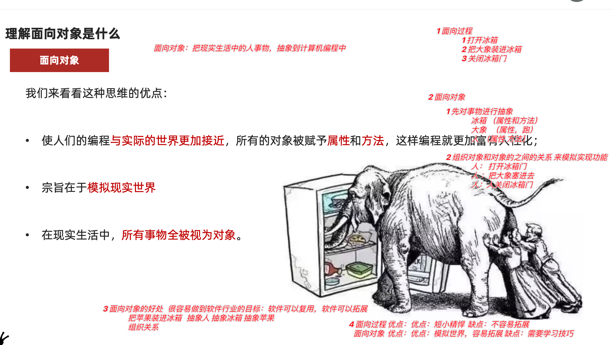


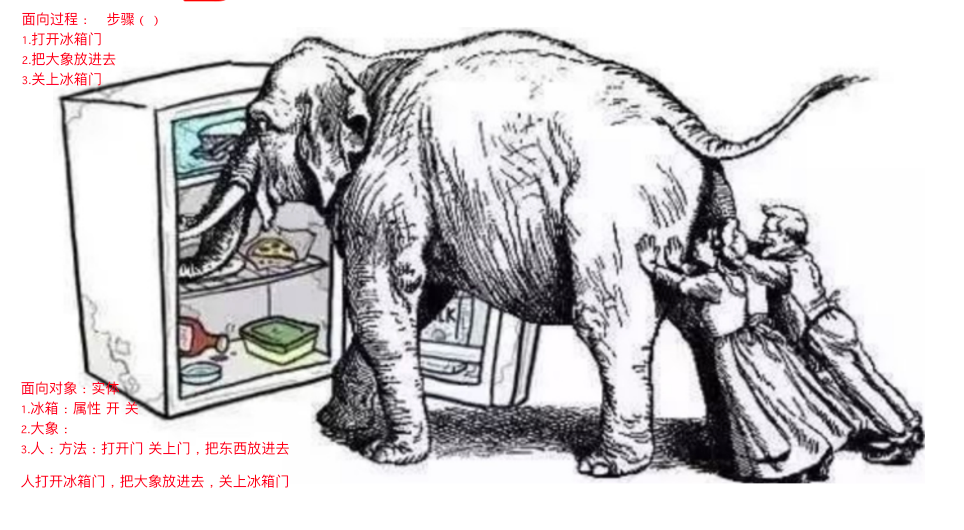


### 1.3 [了解]面向对象的三大特性

面向对象的三大特性有：封装、继承、多态。

#### 1.3.1 封装

在现实生活中，我们身边也是有很多与封装相关的案例。

小明是一个IT公司的公司职员，当他要去银行办理信用卡时，银行需要他提供身份证号、银行卡号、联系方式；在他身边的同事知道他的姓名、职位、性别、年龄等基本信息，小明的爸妈知道他的血型、身份证号、女朋友姓名、性别等等。我们会发现，小明在生活中有很多隐私，其实这就是封装。

| 小明身边的人信息 | 了解小明的隐私内容项                 |
| :--------------: | ------------------------------------ |
|     银行柜员     | 身份证号、联系方式、银行卡号等。     |
|       同事       | 姓名、职位、性别、年龄等。           |
|       爸妈       | 血型、身份证号、女朋友姓名、性别等。 |

在面向对象中，封装就是隐藏对象的属性和实现细节，仅对外公开接口，控制在程序中属性的读和修改的访问级别【公有、私有】，将抽象得到的数据和行为（或功能）相结合，**形成一个有机的整体【类】**，也就是将数据与操作数据的源代码进行有机的结合，形成"**类**"，其中数据和函数都是类的成员。

封装的目的是增强安全性和简化编程，使用者不必了解具体的实现细节，而只是要通过外部接口，以特定的访问权限来使用类的成员。

比如，我们日常生活中的手机、电脑都可以封装为一个类。   一切皆对象！


#### 1.3.2 继承

在现实生活中，继承一般指的是子女继承父辈的财产，如"**子承父业**"等。

在面向对象中，继承也是面向对象的基本特征之一。

继承就是子类继承父类的特征和行为，使得子类对象(实例)具有父类的属性和行为；

或子类从父类继承方法，使得子类具有父类相同的行为。


只要是继承关系，那么都满足：is-a关系。  子类是父类。

#### 1.3.3多态

**多态是指不同类的对象对同一消息做出响应，即同一消息可以根据发送对象的不同而采用多种不同的行为方式**。  -->官方。

这里的发送消息就是指方法的调用。

【通俗】从一个生活中使用电脑的案例来简要说明什么是多态，比如电脑键盘上的F12功能键是固定不变的。

| 固定不变的F12功能键 | 完成功能                                   |
| :-----------------: | ------------------------------------------ |
|       **F12**       | 在WPS办公软件使用时，提示用户保存文件。    |
|       **F12**       | 在Chrome浏览器使用时，能进入到开发者模式。 |

### 1.4 【⚡️重点⚡️】内容总结

- 编程思想：
  - 写代码的思维方法
  - 分2类：面向对象面向过程
- 面向过程：面向一个一个的步骤编码
- 面向对象：抽象类（属性和方法）来模拟实现世界
- 三大概念
  - 封装：把属性和方法封装到类中进行隐藏，对外提供访问接口
  - 继承：子承父业 子类继承父类的属性和方法
  - 多态：同样一个函数在不同的场景下有不同的表现 （多种状态）


## 2 面向对象的基本概念

**学习目标**

1. 了解什么是类，什么是对象？
2. 知道使用class关键字定义类；
3. 知道如何创建对象
4. 知道调用方法的语法格式；
5. 知道self参数是什么。

### 2.1 [了解]面向对象中的重要概念

Python是一门面向对象的语言(也是一门面向过程的语言)。要掌握Python面向对象的基本语法，则首先需要掌握两个重要的概念：类、对象。怎么理解呢？


⚡️类：对现实事物的**抽象**描述

⚡️对象：现实事物的具体体现

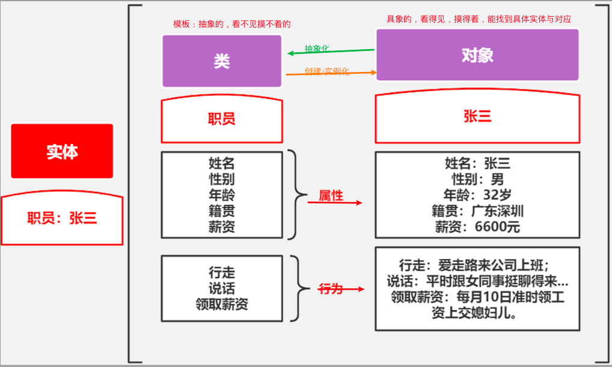


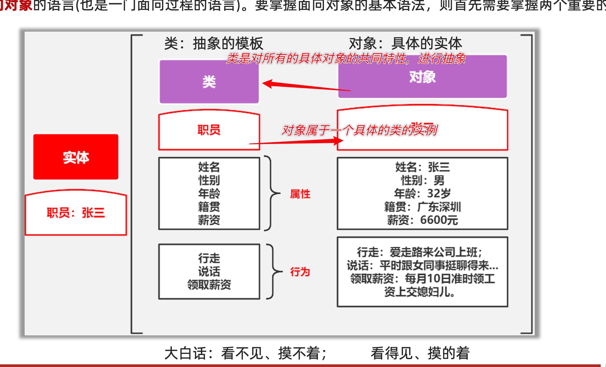


### 2.2 [重点]类

**案例描述：**我们都知道汽车是由汽车图纸生产出来的，那么此处的汽车图纸就是一个模板（即类），在汽车图纸上，指定规则：生产出来的汽车必须具有跑起来的行为。


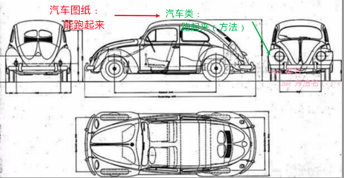

在Python中如何创建类呢？需要通过关键字class 来定义类，Python 类的语法格式如下: 

```python
# 定义类
class 类名:
    # 定义方法
    方法列表...
```

**案例👩‍💻**：定义一个汽车类，并有跑起来的行为。

```python
# 1.定义类:class 类名:
class Car:
    # 2.定义方法:跑起来
    def run(self):
        print('能跑起来...')
```


###2.3  [重点]对象

**案例描述：**通过汽车图纸生产出能跑起来的汽车（即对象）。


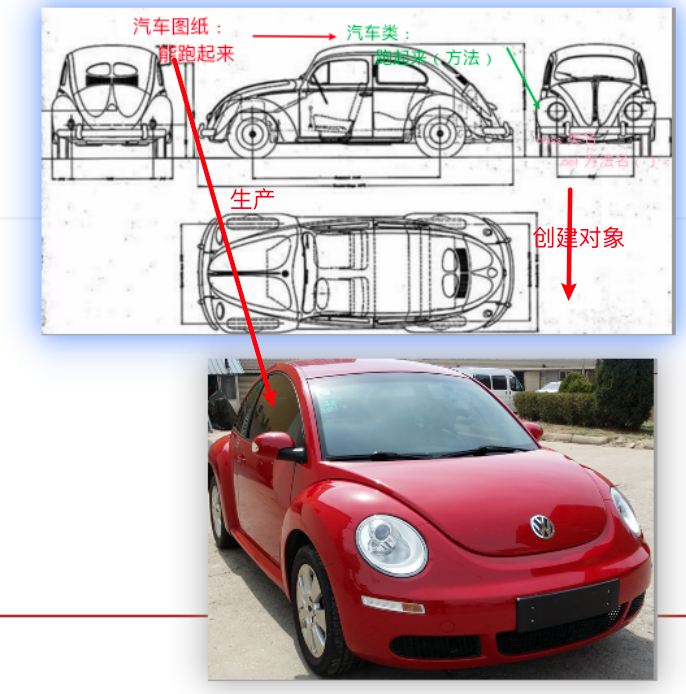

创建对象的语法格式如下：

```properties
对象名 = 类名()    # 创建对象
```

在实际应用中，创建和使用对象的基本步骤如下：

**步骤1：**通过上述语法创建一个对象，如下：

```properties
对象名 = 类名()
```

**步骤2：**可通过对象名.方法来调用方法，如下：  调用行为   ==.==  的

```properties
对象名.方法名()		#调用方法
```

**案例👨‍💻**：生产一台可以跑起来的车

```python
# 1.定义类:class 类名:
class Car:
    # 1.1.定义方法:跑起来
    def run(self):
        print('能跑起来...')

# 2.创建对象:对象名 = 类名()
car = Car()
# 3.调用方法:对象.方法名()
car.run()
```


执行顺序

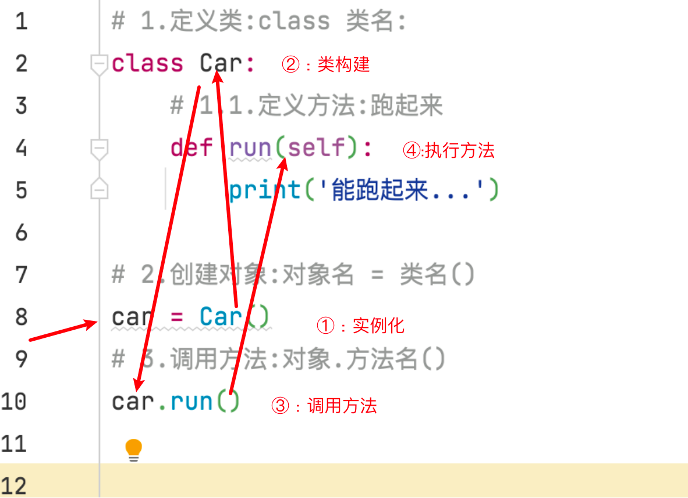

### 2.3 [重点]self关键字

self也是Python内置的关键字之一，其指向了对象实例本身【对象自己】。

**案例分析**：

1.了解self是什么，创建一个对象，输出对象名、self；

2.创建多个对象，查看self的结果；

```python
# 1.定义类:class 类名:
class Car:
    # 1.1.定义方法:跑起来
    def run(self):
        print(f'self的结果{self}')
        print('能跑起来...')


# 2.创建对象:对象名 = 类名()
car = Car()
print(f'car对象结果{car}')
# 3.调用方法:对象.方法名()
car.run()

print('*' * 30)
# 3.创建对象:对象名 = 类名()
car2 = Car()
print(f'car2对象结果{car2}')
car2.run()
```

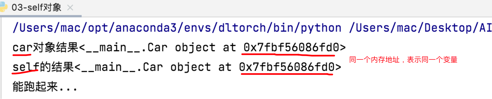

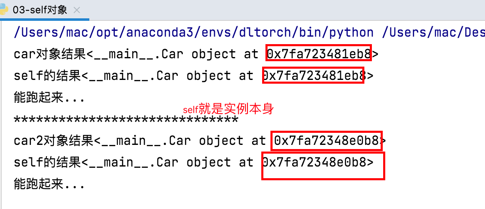

3.在类内部调用方法:一般用在私有方法上

```python
# 1.定义类:类名使用大驼峰方式命名
class Car():
    def run(self):
        print('能跑起来...')

    # 在类内部调用方法:对象名.方法名()->self.方法名()
    def work(self):
        self.run()

# 2.定义对象:对象名一般小驼峰命名
car = Car()

# 3.调用方法:对象名.方法名()
car.work()
```

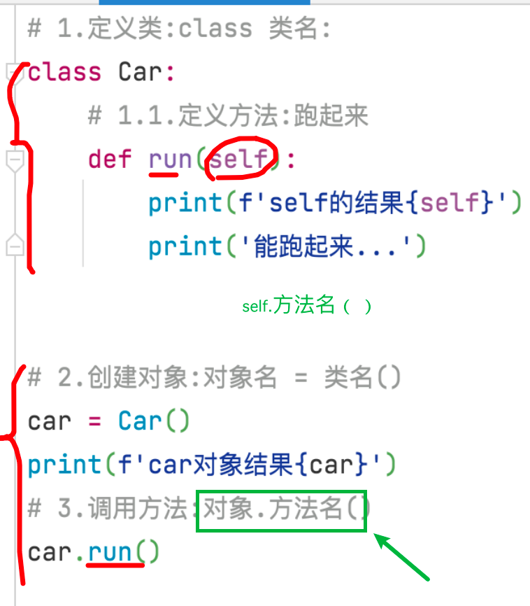


​			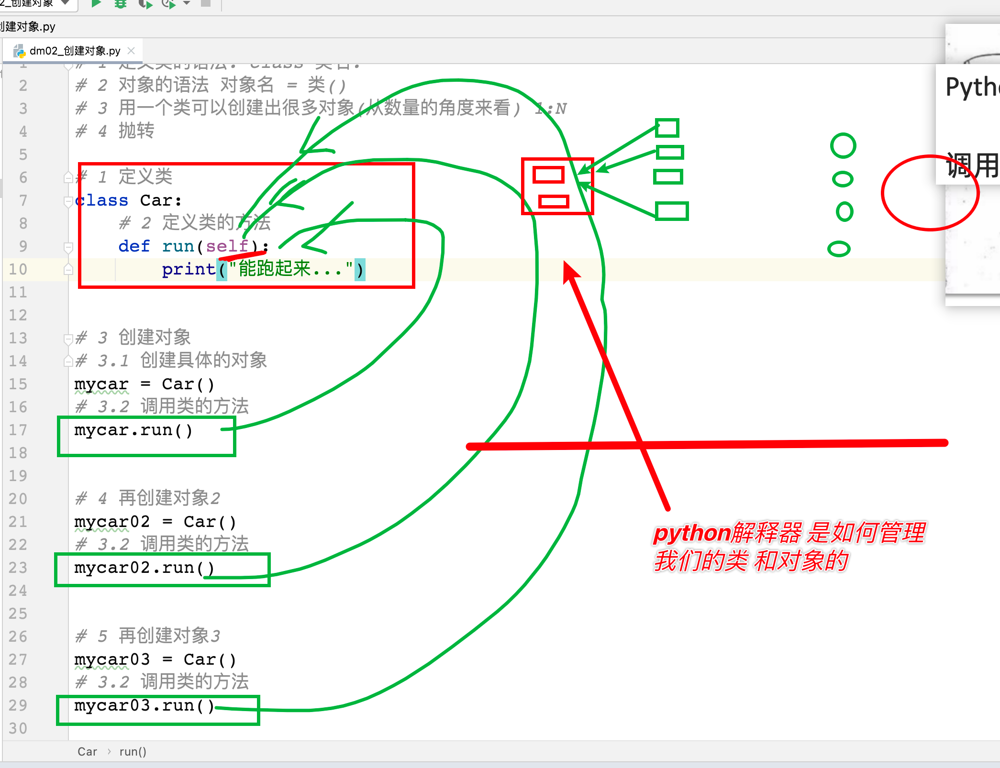


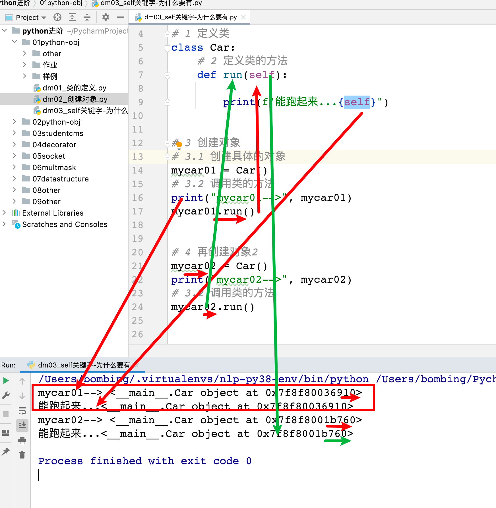


### 2.4【⚡️重点⚡️】内容总结

- 类和对象语法

  ````python
  class 类名：
  	pass
  
  对象1 = 类名()
  对象2 = 类名()
  ````


- self关键字
  - 为什么需要self关键字
    - 类和对象的关系1：N ，为了区分那个对象调用了类的方法，引入了self。
    - 谁调用run函数。self就是谁
  - self关键字的作用：
    - 在类的内部，调用类的方法 self.work()


## 3  添加和获取对象属性

**学习目标**

1. 知道如何添加对象属性;
2. 知道如何获取对象属性。

### 3.1 [了解]什么是属性

属性即是特征，比如：人的姓名、年龄、身高、体重…都是对象的属性

### 3.2 [重点]类外面添加和获取属性

#### 3.2.1 添加属性

设置对象中属性是通过"."点来操作的，如下：

```properties
对象名.属性 = 属性值
```

#### 3.2.2 获取属性

在Python中，获取对象属性的方式如下：

```properties
对象名.属性
```

**例如**，给车设置颜色为红色、4个轮胎，且获取属性值并输出。 


### 3.3 [重点]类内部获取对象属性

在类内部获取对象属性的方式，如下：

```properties
对象名.属性            
----
self.属性
```

例如，在类内部定义一个show()方法来获取刚刚给车设置颜色为红色、4个轮胎的属性值信息。


### 3.4【⚡️重点⚡️】内容总结

- 属性：和现实生活中的属性类似 

- 添加属性：

  - 在类的外部

    ```python
    对象名.属性名 = 4
    ```

- 获取属性

```python
在类的内部： self.属性
在类的外部： 对象.属性
```


​	


- 添加属性
  - 类外部(其他)
    - 对象名.属性名 = 属性值
  - 类内部(初始化)
    - 在init魔法方法中,使用
    - self.属性名 = 属性值
- 获取属性(在设置属性之后在进行获取)
  - 类外部
    - 对象名.属性名
  - 类内部
    - self.属性名


## 4 上午总结

- 编程思想: 利用计算机解决实际问题的思维方式

  - 面向过程:**步骤**,扩展性差

  - 面向对象: **一切皆对象**

    - 类 :抽象的模板

      ```python
      # 大驼峰
      class 类名:
      	pass
      ```

    - 对象:具象的实体

      ```python
      # 下划线
      对象名 = 类名()
      对象名.方法名()
      ```

    - 方法->函数

      ```properties
      定义方法自动填充self,调用方法时不需要传递self
      self: 对象本身,类内部对对象进行操作时要想到self
      ```

    - 属性->变量

      ```properties
      对象固有的特征,可以设置获取这些属性
      ```


## 5 魔法方法

**学习目标**

1. 了解魔法方法是什么；
2. 知道`__init__()`方法的作用；
3. 知道`__str__()`方法的作用；
4. 知道`__del__()`方法的作用。

### 5.1 [了解]魔法方法的概念

在Python中，有一些可以给Python类增加魔力的特殊方法，我们称之为魔法方法。

在特殊情况下会被自动调用，不需要开发者手动去调用。

对于这些魔法方法，都有一个共同的特性，那就是它们总是被双下划线所包围，如下：

```properties
__魔法方法名__()
```

语法：

```properties
class 类名:
	def __魔法方法名__(self[,xxx,xxx]):
		代码
		...
	# ...
```

### 5.2 [重点]`__init__()`方法

有没有办法能够在创建对象时，就把车这个对象的属性给设置好呢？

此时，就可以使用`__init__()`方法(也称为构造方法)了。

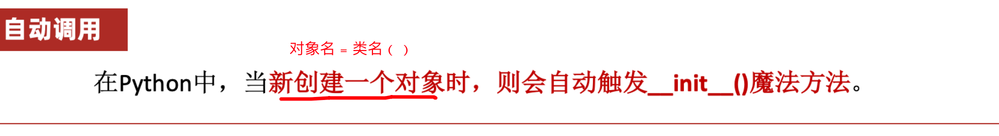

在Python中，当新创建一个对象时，则会自动触发`__init__()`魔法方法。

|       魔法方法名称       | 描述信息                             |
| :----------------------: | ------------------------------------ |
| `__init__(self [, ...])` | 当一个实例被创建时调用的初始化方法。 |

#### 无参数的`__init__()`方法

**无参数**情况：当仅需在类内部使用及初始化某些属性时，可以使用，格式如下：

```properties
def __init__(self):
	# 初始化属性     对象名.属性 = 属性值
	self.属性 = 属性值
    代码
    ......
```

**例如**，给车这个对象默认设置color(颜色)和number(轮胎数)为黑色、3个轮胎。

```python
# 1.定义类
class Car:
    # 1.1 设置属性:__init__
    def __init__(self):
        self.color = 'red'
        self.number = 4

    # 1.2 获取属性: self.属性名
    def show(self):
        print(f'车身颜色:{self.color}')
        print(f'车轮数:{self.number}')


# 2.创建对象:对象名 = 类名()
car = Car()

# 2.1 获取属性
# 类内部
car.show()
# 类外部
# print(car.color)
# print(car.number)

```

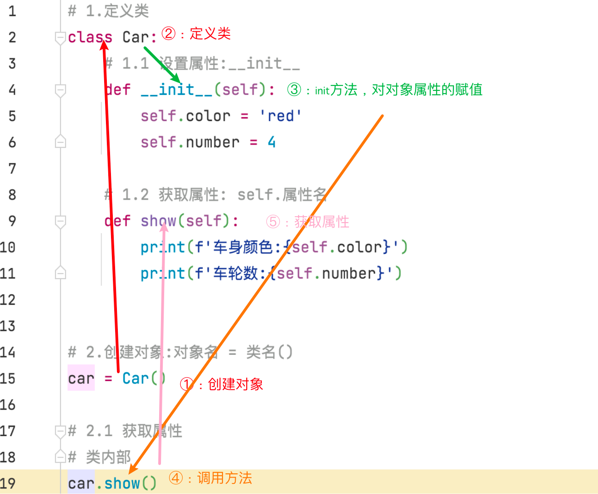

#### 有参数的`__init__()`方法

**有参数**情况：当需要通过类外部传递相应变量值用于改变某些属性时，可以使用，格式如下：

```properties
def __init__(self,参数1,参数2,...):
    代码
    ......
    
```

**例如**，通过外部给车这个对象设置color(颜色)、number(轮胎数)值。

```python
# 1.定义类
class Car:
    # 1.1 设置属性:__init__
    def __init__(self, color, number):
        self.color = color
        self.number = number

    # 1.2 获取属性: self.属性名
    def show(self):
        print(f'车身颜色:{self.color}')
        print(f'车轮数:{self.number}')


# 2.创建对象:对象名 = 类名()
car = Car('black', 8)

# 2.1 获取属性
# 类内部
car.show()
# 类外部
# print(car.color)
# print(car.number)

```

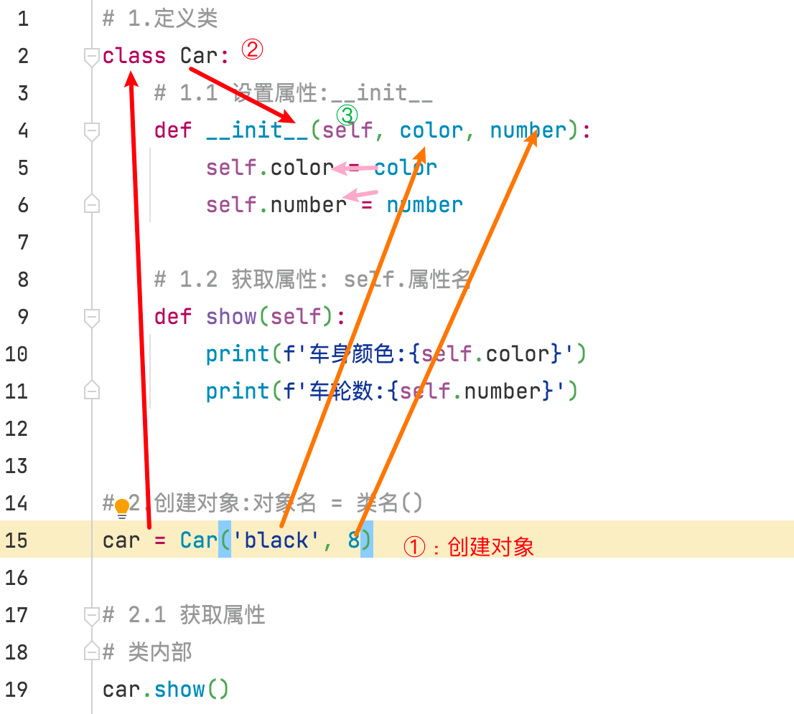

### 5.3 [重点]`__str__()`方法

当使用print输出对象时，默认打印对象的内存地址值【十六进制】。   若要让输出对象名时，不是内存地址值，应该要在类中定义str方法。

如果类定义了`__str__`方法，那么就会打印从在这个方法中 return的数据。

|  魔法方法名称   | 描述信息                    |
| :-------------: | --------------------------- |
| `__str__(self)` | 定义当被str()调用时的行为。 |

语法：

```properties
class 类名:
	def __str__(self):
		代码
		...
		return 值   # 说明:值的类型必须是字符串类型
```

例如，在输出car对象时，把它的颜色color、轮胎数number属性值显示出来。


```python
# 1,定义类
class Car:
    # 1.1 属性的设置
    def __init__(self):
        self.color = '红色'
        self.number = 4

    # 1.2 str:输出属性信息
    def __str__(self):
        # return f'{self.color}的汽车有{self.number}个车轮'
        print(f'{self.color}的汽车有{self.number}个车轮')


# 2.创建对象
car = Car()

# 3.打印对象
print(car)

```


- 未实现str时输出内存地址


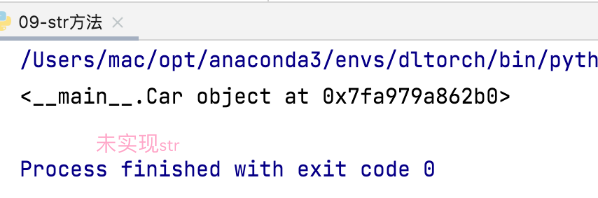

- 实现str时输出str的返回值
- 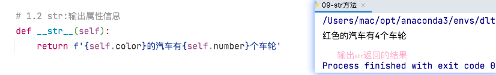

- 一定要有返回值,返回值必须是字符串类型的

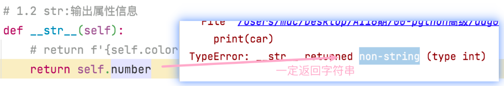

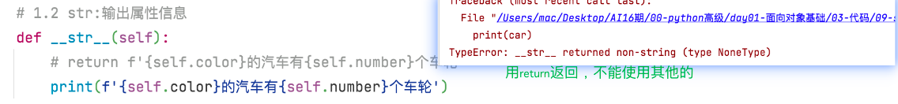


### 5.4 [重点]`__del__()`方法

当删除对象时，Python解释器也会默认调用`__del__()`方法。

|  魔法方法名称   | 描述信息                               |
| :-------------: | -------------------------------------- |
| `__del__(self)` | 析构器，当一个实例被销毁时调用的方法。 |

👨‍💻👨‍💻**例如**，定义一个有品牌属性的车类，并使用`__del__()`方法删除对象查看效果。

```python
# 1.定义类
class Car:
    # 1.1 属性赋值
    def __init__(self,color):
        self.color = color

    # 1.2 del魔法
    def __del__(self):
        print('自动调用了del魔法方法')

# 2.创建对象
car = Car('红色')
# 3.获取属性
# print(car.color)
del car
print(car.color)
```


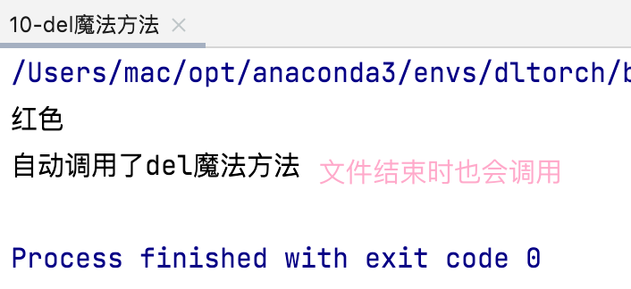

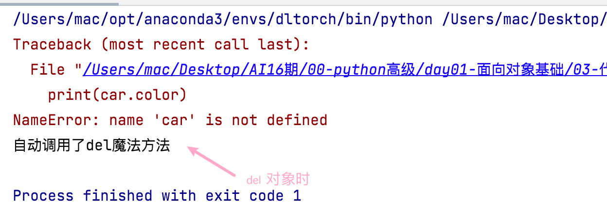

### 5.5 【⚡️重点⚡️】内容总结

魔法方法: 与普通方法区别

- 自动调用,特殊情况下
- 前后被双下滑线包围

init方法:创建对象时自动调用,用来对对象属性进行赋值

- 无参(self):在类内部进行属性值的确定
- 有参: 通过类外部实现属性值的设置

str方法:print(对象)是自动调用,直接输出str方法返回的结果

del方法:删除对象时自动调用


## 6 面向对象的综合案例

**学习目标**

1. 知道`__init__()`、`__str__()`及方法的实际应用;
2. 能完成面向对象综合案例的编写。

### 6.1 [重点]案例：减肥

案例描述：例如，小明同学当前体重是100kg[默认]。

每当他跑步一次时，则会减少0.5kg；

每当他大吃大喝一次时，则会增加2kg。

请试着采用面向对象方式完成案例。


```python
# 1.定义类
class Student:
    # 1.1 属性赋值:weight
    def __init__(self):
        self.weight = 100

    # 1.2 run
    def run(self):
        self.weight-=0.5
        print(f'跑步一次之后体重为{self.weight}')

    # 1.3 eat
    def eat(self):
        self.weight+=2
        print(f'大吃大喝后体重为{self.weight}')


# 2.创建对象
xiaoming = Student()
# 3.调用方法
xiaoming.run()
xiaoming.eat()
xiaoming.run()
xiaoming.run()
xiaoming.run()
xiaoming.run()
xiaoming.eat()
```


### 6.2 [重点]案例：烤地瓜


**需求主线：**

被烤时间、生熟程度

```properties
0-3分钟:生的
3-7分钟:半生不熟
7-12分钟:熟了
超过12分钟:已烤焦，糊了
```

添加调料

```properties
添加的调料:用户可以按自己的意愿添加调料。
```

需求：涉及了一个事物地瓜，因此从面向对象角度思考就涉及一个类：地瓜类。


```python
# 1.定义类
class SweetPotato:
    # 1.1 初始化属性
    def __init__(self):
        self.cook_time = 0
        self.cook_state = '生的'
        self.condi_list = []

    # 1.2 地瓜被烤
    def cook(self,time):
        # 被烤的时间
        self.cook_time +=time
        if 0<=self.cook_time<3:
            self.cook_state = '生的'
        elif 3<=self.cook_time<7:
            self.cook_state = '半生不熟的'
        elif 7<=self.cook_time<12:
            self.cook_state = '熟了'
        elif self.cook_time>12:
            self.cook_state = '烤糊了'

    # 1.3 添加调料
    def add_condi(self,condi):
        self.condi_list.append(condi)


    # 1.4 信息输出
    def __str__(self):
        return f'这个地瓜烤了{self.cook_time},状态是{self.cook_state},添加了{self.condi_list}'


# 2.创建对象
potato = SweetPotato()
print(potato)

# 3.调用方法
potato.cook(3)
potato.add_condi('蜂蜜')
print(potato)


potato.cook(5)
potato.add_condi('酱油')
print(potato)

potato.cook(6)
potato.add_condi('醋')
print(potato)
```

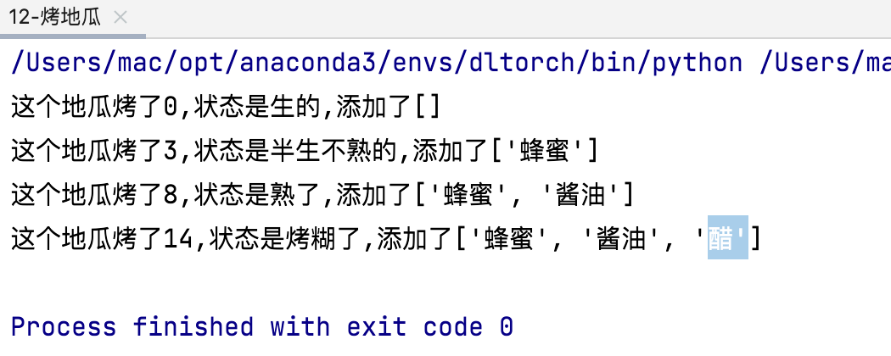


面向对象编程:

- 在需求中找实体->对象
- 把对象抽象为类
- 在需求中找属性和方法


## 7 今日总结

### 编程思想

使用计算机解决实际问题的思维方法

#### 面向过程

步骤进行拆分,一步一步的去实现

扩展性差

#### 面向对象

一切皆对象

- 封装:把属性和方法封装在类里面
- 继承:子承父业
- 多态:对同一消息反映是不一样的

类和对象

```properties
类: 抽象的模板
	class 类名:
		pass
对象: 具象的,一个一个的实体
	对象名 = 类名()
	对象名.方法名()
self: 对象本身,在类内进行对象处理都使用它
```


添加属性和获取属性(对象)

```properties
添加属性:
类外部:对象名.属性名 = 属性值
类内部:init方法中,self.属性名= 属性值
获取属性:
类外部:对象名.属性名
类内部:self.属性名
```


魔法方法

```properties
魔术方法: 方法名被双下划线包围,在特殊情况下会自动调用
__init__:初始化,在属性的赋值,在创建对象时自动调用
__str__:信息输出,print(对象)时自动调用
__del__:删除对象,在文件运行结束或del对象时自动调用
```

