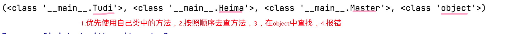
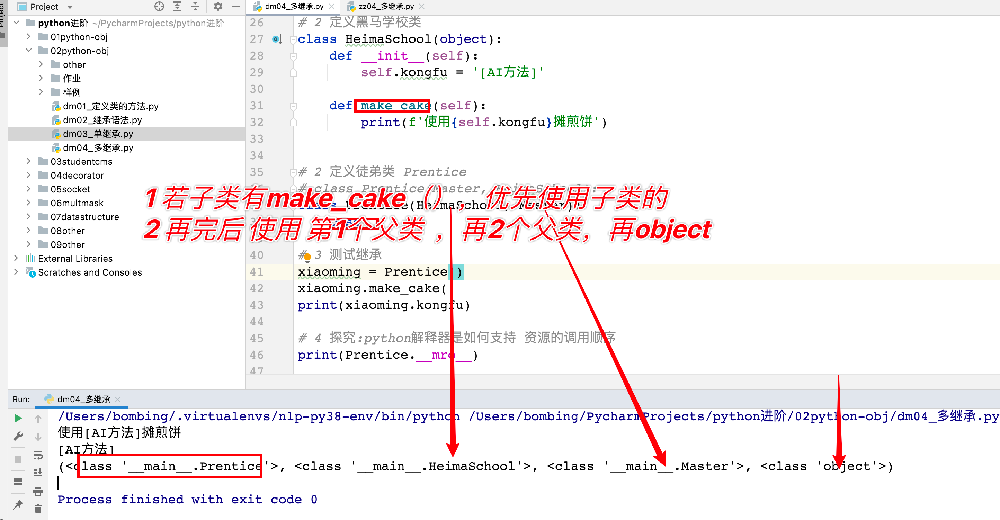
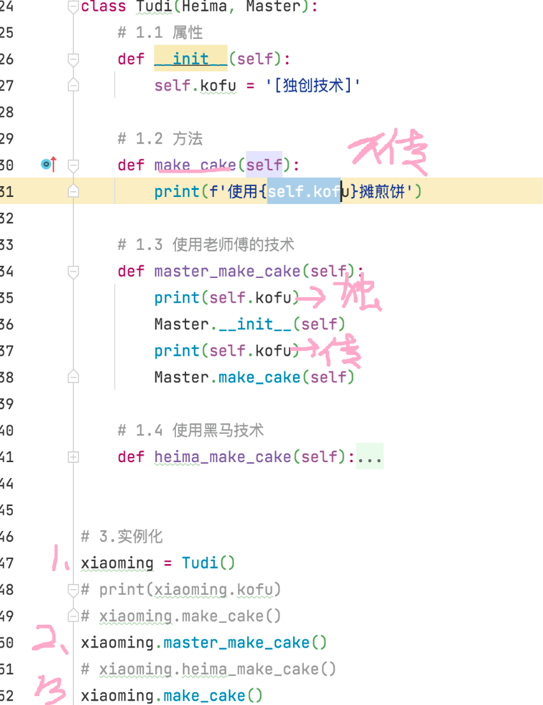
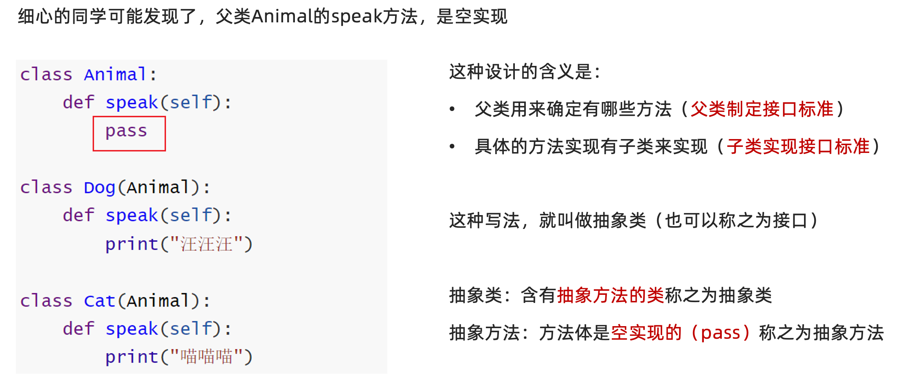

# python面向对象高级


## 1 [重点]定义类的几种语法

**学习目标**

1. 了解定义类的几种语法；
2. 重点掌握定义`类名(object)`的语法。

---

### 方式1：类名

在上一章节的学习过程中，我们都使用了这种定义类的语法：

```properties
class 类名:
	代码
	...
```

例如，使用该方式来定义一个老师类。

```python
# 1.class 类名:
#       pass
class Teacher:
    pass
```

### 方式2：类名()

在编写类时，也可以写成如下格式（旧式类）：

```properties
class 类名():
	代码
	...
```

例如，使用该方式来定义一个老师类。

```python
# # 2.class 类名():
# #   pass
class Teacher():
    pass
```


### 方式3：类名(object)

此外，还有一种更为常见的定义类的语法（新式类），如下：

```properties
class 类名(object):
	代码
	...
```

例如，使用该方式来定义一个老师类。

```python
# 3.class 类名(object):
#   pass
class Teacher(object):
    pass
```


### ⚡️内容总结⚡️

推荐使用第三种类的定义方式


## 2 python中的继承

**学习目标**

1. 了解什么是继承；
2. 知道什么是单继承和多继承。
3. 知道子类重写父类同名方法和属性；
4. 知道使用super()调用父类的同名方法；
5. 了解什么是多层继承。

---

### 2.1 [了解]什么是继承

**`生活中的继承`**: 一般指的是子女继承父辈的财产。


**`面向对象中的继承`**: 指的是多个类之间的所属关系，即子类默认继承父类的属性和方法。

**`作用`**: 提高代码的复用率, 减少重复代码的书写。

在Python中，继承形式如下：

```Python
class 父类名(object):
    ...(省略)
```

```python
class 子类名(父类名):   # 继承语法
    ...(省略)
```

**例如**，Father类有一个默认性别为男，且爱好散步行走，那么，Son类也想要拥有这些属性和行为，该怎么做呢？ 

```python
# 1.定义父类
class Father(object):
    def __init__(self):
        self.gender = 'man'

    def walk(self):
        print('爱好散步行走')


# 2.定义子类
class Son(Father):
    pass


# 3.实例化,验证继承结果
son = Son()
print(son.gender)
son.walk()
```


```properties
继承的相关概念【了解】：

继承:一个类从另一个已有的类获得其成员的相关特性，就叫作继承！

派生:从一个已有的类产生一个新的类，称为派生！

很显然，继承和派生其实就是从不同的方向来描述的相同的概念而已，本质上是一样的！


父类:也叫作基类，就是指已有被继承的类！

子类:也叫作派生类或扩展类
```


### 2.2 [重点]单继承

单继承就是一个子类继承一个父类。

语法：

```properties
class 类名(父类名):
	代码
	...
```

> **故事1：**
>
> 一个摊煎饼的老师傅[master]，在煎饼果子界摸爬滚打多年，研发了一套精湛的摊煎饼技术， 师父要把这套技术传授给他的唯一的最得意的徒弟[apprentice]。[初始化、无参]


```python
# 1.定义师傅类
class Master(object):
    # 1.1 属性
    def __init__(self):
        self.kofu = '[传统方法]'

    # 1.2 方法
    def make_cake(self):
        print(f'使用{self.kofu}摊煎饼')


# 2.定义徒弟类
class Tudi(Master):
    pass

# 3.实例化
xiaoming = Tudi()
print(xiaoming.kofu)
xiaoming.make_cake()

```


### 2.3 [重点]多继承

多继承就是：一个类同时继承了多个父类。

语法：

```properties
class 类名(父类名1,父类名2,...):  # 多个父类
	代码
	...
```

> **故事2：**
>
> 小明是个爱学习的好孩子，想学习更多的摊煎饼果子技术，于是，在百度搜索到黑马程序员学校[school]，报班来培训学习摊煎饼果子技术。

```python
# 1.定义师傅类
class Master(object):
    # 1.1 属性
    def __init__(self):
        self.kofu = '[传统方法]'

    # 1.2 方法
    def make_cake(self):
        print(f'使用{self.kofu}摊煎饼')


# 2.定义黑马类
class Heima(object):
    # 1.1 属性
    def __init__(self):
        self.kofu = '[AI方法]'

    # 1.2 方法
    def make_cake(self):
        print(f'使用{self.kofu}摊煎饼')


# 3.定义徒弟类
class Tudi(Heima,Master):
    pass


# 3.实例化
xiaoming = Tudi()
print(xiaoming.kofu)
xiaoming.make_cake()

```


#### 子类调用父类的同名方法顺序问题

当一个类有多个父类时，默认使用第一个父类的同名属性和方法，可以使用**类名****.__mro__****属性**或类名.mro()方法查看调用的先后顺序。

注：MRO(Method Resolution Order)：方法解析顺序



```python
print(Tudi.__mro__)
print(Tudi.mro())
```





---

### 2.4 [重点]子类重写父类同名方法和属性

重写也叫作覆盖，就是当子类属性或方法与父类的属性或方法名字相同的时候，从父类继承下来的成员可以重新定义！

> **故事3：**
>
> fangge掌握了老师傅的技术后，自己潜心钻研出一套自己的独门配方的全新摊煎饼果子技术。  -老师傅！

```python
# 1.定义师傅类
class Master(object):
    # 1.1 属性
    def __init__(self):
        self.kofu = '[传统方法]'

    # 1.2 方法
    def make_cake(self):
        print(f'使用{self.kofu}摊煎饼')


# 2.定义黑马类
class Heima(object):
    # 1.1 属性
    def __init__(self):
        self.kofu = '[AI方法]'

    # 1.2 方法
    def make_cake(self):
        print(f'使用{self.kofu}摊煎饼')


# 3.定义徒弟类
class Tudi(Heima,Master):
    # 1.1 属性
    def __init__(self):
        self.kofu = '[独创技术]'
    # 1.2 方法
    def make_cake(self):
        print(f'使用{self.kofu}摊煎饼')


# 3.实例化
xiaoming = Tudi()
print(xiaoming.kofu)
xiaoming.make_cake()


# print(Tudi.__mro__)
# print(Tudi.mro())
```


### 2.5 [重点]子类调用父类方法

子类中仍想要**保留父类的行为**，则需要在子类中**调用父类方法****.****可以**直接使用父类名来进行调用，使用的方法：

```properties
父类名.父类方法名()
```

> **故事4：**
>
> 很多顾客都希望能吃到徒弟做出的有自己独立品牌的煎饼果子，也有黑马配方技术的煎饼果子味道。  

```python
# 1.定义师傅类
class Master(object):
    # 1.1 属性
    def __init__(self):
        self.kofu = '[传统方法]'

    # 1.2 方法
    def make_cake(self):
        print(f'使用{self.kofu}摊煎饼')


# 2.定义黑马类
class Heima(object):
    # 1.1 属性
    def __init__(self):
        self.kofu = '[AI方法]'

    # 1.2 方法
    def make_cake(self):
        print(f'使用{self.kofu}摊煎饼')


# 3.定义徒弟类
class Tudi(Heima,Master):
    # 1.1 属性
    def __init__(self):
        self.kofu = '[独创技术]'
    # 1.2 方法
    def make_cake(self):
        print(f'使用{self.kofu}摊煎饼')

    # 1.3 使用老师傅的技术
    def master_make_cake(self):
        Master.__init__(self)
        Master.make_cake(self)

    # 1.4 使用黑马技术
    def heima_make_cake(self):
        Heima.__init__(self)
        Heima.make_cake(self)


# 3.实例化
xiaoming = Tudi()
print(xiaoming.kofu)
xiaoming.make_cake()
xiaoming.master_make_cake()
xiaoming.heima_make_cake()


# print(Tudi.__mro__)
# print(Tudi.mro())
```

使用父类名进行初始化之后在调用相应的方法



### 2.6 [重点]super方法调用父类方法

使用super()调用父类方法，使用的方法：

```properties
super().父类方法名()
```

**故事4：**

很多顾客都希望能吃到徒弟做出的有自己独立品牌的煎饼果子，也有黑马配方技术的煎饼果子味道。  

```python
# 1.定义师傅类
class Master(object):
    # 1.1 属性
    def __init__(self):
        self.kofu = '[传统方法]'

    # 1.2 方法
    def make_cake(self):
        print(f'使用{self.kofu}摊煎饼')


# 2.定义黑马类
class Heima(object):
    # 1.1 属性
    def __init__(self):
        self.kofu = '[AI方法]'

    # 1.2 方法
    def make_cake(self):
        print(f'使用{self.kofu}摊煎饼')


# 3.定义徒弟类
class Tudi(Heima):
    # 1.1 属性
    def __init__(self):
        self.kofu = '[独创技术]'

    # 1.2 方法
    def make_cake(self):
        print(f'使用{self.kofu}摊煎饼')

    # 1.4 使用黑马技术
    def heima_make_cake(self):
        super().__init__()
        super().make_cake()


# 3.实例化
xiaoming = Tudi()
print(xiaoming.kofu)
xiaoming.make_cake()
# xiaoming.master_make_cake()
xiaoming.heima_make_cake()

# print(Tudi.__mro__)
# print(Tudi.mro())

```


```properties
注意：使⽤super() 可以⾃动查找⽗类，适合单继承使⽤，多继承不建议使用
```

### 2.7 [了解]多层继承

> **故事5：**
>
> N年后，小明老了，想要把"有自己的独立品牌，也有黑马配方技术的煎饼果子味道"的所有技术传授给自己的徒弟。

```python
# 1.定义师傅类
class Master(object):
    # 1.1 属性
    def __init__(self):
        self.kofu = '[传统方法]'

    # 1.2 方法
    def make_cake(self):
        print(f'使用{self.kofu}摊煎饼')


# 2.定义黑马类
class Heima(object):
    # 1.1 属性
    def __init__(self):
        self.kofu = '[AI方法]'

    # 1.2 方法
    def make_cake(self):
        print(f'使用{self.kofu}摊煎饼')


# 3.定义徒弟类
class Tudi(Heima, Master):
    # 1.1 属性
    def __init__(self):
        self.kofu = '[独创技术]'

    # 1.2 方法
    def make_cake(self):
        self.__init__()
        print(f'使用{self.kofu}摊煎饼')

    # 1.3 使用老师傅的技术
    def master_make_cake(self):
        Master.__init__(self)
        Master.make_cake(self)

    # 1.4 使用黑马技术
    def heima_make_cake(self):
        Heima.__init__(self)
        Heima.make_cake(self)


# 4.创建徒孙类
class Tusun(Tudi):
    pass


xiaoxiaoming = Tusun()
print(xiaoxiaoming.kofu)
xiaoxiaoming.make_cake()
xiaoxiaoming.heima_make_cake()
xiaoxiaoming.master_make_cake()
```


### 2.8 ⚡️内容总结⚡️

- 继承：子类拥有父类的属性和方法

- 单继承：一个子类有一个父类

- 多继承：一个子类有多个父类

- mro资源顺序 

  ```python
  子类.mro()
  子类.__mro__ 
  尝试去追踪底层代码
  ```

- 子类重新父类的属性和方法

  - 优先使用子类的属性方法

- 需要显示的调用父类的属性和方法

  - 父类.方法名(self)

  - Super()适合单继承

    - Super()按照mro资源表，去查找父类的调用顺序；不是按照我们的人为的继承

    


## 3 上午内容总结

- 类的定义方法

  ```properties
  class 类名(object):
  	pass
  ```

- 继承: 类与类之间的关系,子类继承父类的属性和方法

  ```properties
  class 类名(父类名):
  	pass
  ```

- 单继承

  只有一个父类,子类会继承父类所有的属性和方法

- 多继承

  多个父类,子类会继承所有父类的属性和方法

  子类调用同名方法和属性时:自己->父类->object

- 子类重写父类方法

  - 方法定义方式直接进行定义就可以了

- 子类调用父类方法

  - 直接使用父类名来调用
  - 使用super()来调用->单继承


## 4 python中的封装

**学习目标**

1. 了解什么是封装
2. 知道什么是私有属性和私有方法；
3. 知道如何设置和获取私有属性；
4. 知道如何定义和获取私有方法。

---

### 4.1 什么是封装

在软件编程中，将**属性和方法**书写到类的里面的操作即为封装，封装可以为属性和方法添加私有权限


### 4.2  [重点]定义和获取私有属性

在Python中，可以为属性设置私有权限，即设置某个属性不继承给子类。

设置私有权限的方式：在属性名前面加上两个下划线 __，格式：

```properties
self.__属性名
```

> **故事6：**
>
> fangge把技术传承给徒弟的同时，不想把自己的私房钱(**$5000000**)继承给徒弟，这时就要为**钱**这个属性设置私有权限。
>


### 4.3  [重点]定义和获取私有方法

在Python中，可以为方法设置私有权限，即设置某个方法不继承给子类。

设置私有权限的方式：在方法名前面加上两个下划线 __，格式：

```properties
def __方法名(self):
     ...
```

> **故事7：**
>
> 小明把煎饼果子技术传承给徒弟的同时，不想把自己的独创配方制作过程继承给徒弟，这时就要为**制作独创配方**这个方法设置私有权限。


### 4.4 ⚡️⚡️内容总结⚡️⚡️

私有权限 :

- 私有属性
  - 只能在类内部访问
  - 定义公有方法获取get_xxx或设置set_xxx私有属性值
- 私有方法
  - 只能在类内部访问
  - 定义公有方法调用私有方法

##  5 python中的多态

**学习目标**

1. 了解多态是什么；
2. 了解多态特性的实现步骤及好处。
2. 抽象类

---

###  5.1 多态定义

多态，指的是：多种状态。比如：同样一个函数在不同的场景下有不同的状态。

```python
# 1 多态: 同样一个函数在不同的场景下有不同的状态
# 2 多态应用场景: make_noise相当于搭建一个舞台, 让对象唱戏
# 传入子类对象会执行子类的api函数, 传入父类对象会传入父类的api函数

class Animal(object):
    def speak(self):
        print("animal 嗯嗯 ")
        pass


class Dog(Animal):
    def speak(self):
        print('汪汪汪')


class Cat(Animal):
    def speak(self):
        print('喵喵喵')


# def make_noise(animal):
def make_noise(animal:Animal):
    animal.speak()

if __name__ == '__main__':
    mydog = Dog()
    mycat = Cat()
    animal =  Animal()

    # make_noise(mydog)
    # make_noise(mycat)
    # make_noise(animal)
    pass
```


### 5.2 多态的条件

```python
1、有继承 （定义父类、定义子类，子类继承父类)
2、函数重写 （子类重写父类的函数）
3、父类引用指向子类对象 （子类对象传给父类对象调用者）
```


```python
根据多态实现的三个条件，构建一下场景
构建对象对战平台object_play
1 英雄一代战机（战斗力60）与敌军战机（战斗力70）对抗。英雄1代战机失败！
2 卧薪尝胆，英雄二代战机（战斗力80）出场！，战胜敌军战机！
3 对象对战平台object_play, 代码不发生变化的情况下, 完成多次战斗

# 构建对象对战平台object_play
# 1 英雄一代战机（战斗力60）与敌军战机（战斗力70）对抗。英雄1代战机失败！
# 2 卧薪尝胆，英雄二代战机（战斗力80）出场！，战胜敌军战机！
# 3 对象对战平台object_play, 代码不发生变化的情况下, 完成多次战斗
# 思路分析: 抽象战机类 HeroFighter  AdvHeroFighter；敌机EnemyFighter; 构建对象战斗平台,使用多态实现

class HeroFighter(object):
    def power(self):
        return 60


class AdvHeroFighter(HeroFighter):
    def power(self):
        return 80


class EnemyFighter(object):
    def attack(self):
        return 70


# 搭建一个平台(框架), 让对象唱戏
def object_play(herofighter:HeroFighter, enemyfighter:EnemyFighter):
# def object_play(herofighter, enemyfighter):
    # herofighter.power() 此处发生多态!!!
    # 看面向对象代码要时时刻刻注意什么时候会发生多态
    if herofighter.power() > enemyfighter.attack() :
        print('英雄战机胜利, 敌机失败')
    else:
        print('英雄战机失败, 敌机胜利')


if __name__ == '__main__':
    # 实例化1代战机 2代战机
    myherofighter = HeroFighter()
    myadvherofighter = AdvHeroFighter()
    myenemyfighter = EnemyFighter()

    # 一代战机出场
    object_play(myherofighter, myenemyfighter)

    # 二代战机出场
    object_play(myadvherofighter, myenemyfighter)
    pass
    
```


```python
# 若不使用多态
if __name__ == '__main__':
    # 实例化1代战机 2代战机
    myherofighter = HeroFighter()
    myadvherofighter = AdvHeroFighter()
    myenemyfighter = EnemyFighter()

    # 不采用多态,代码繁琐, 可拓展性不好
    # 一代战机出场
    if myherofighter.power() > myenemyfighter.attack():
        print('英雄战机胜利, 敌机失败')
    else:
        print('英雄战机失败, 敌机胜利')

    # 二代战机出场
    if myadvherofighter.power() > myenemyfighter.attack():
        print('英雄战机胜利, 敌机失败')
    else:
        print('英雄战机失败, 敌机胜利')
    pass

```


### 5.3 多态的好处

```python
1、在不改变框架代码的情况下，通过多态语法轻松的实现模块和模块之间的解耦合；实现了软件系统的可拓展

2、对解耦合的大白话解释：搭建的平台函数def object_play(herofighter:HeroFighter, enemyfighter:EnemyFighter) 相当于任务的调用者；子类、孙子类重写父类的函数，相当于子任务；相当于任务的调用者和任务的编写者进行了解耦合

3、对可拓展的大白话解释： 搭建的平台函数def object_play(herofighter:HeroFighter, enemyfighter:EnemyFighter)，在不做任何修改的情况下，可以调用后来人写的代码

4、对“继承和多态对照理解”大白话解释：
	继承相当于：孩子可以复用老爹的东西。
	多态相当于：老爹框架，不做任何修改的情况下，可以可拓展的使用后来人（孩子）写的东西。

```


### 5.4 抽象类（接口）




```python
# 抽象的父类设计标准 AC
# 具体的子类实现标准 XiaoMi_AC GREE_AC Midea_AC

class AC(object):
    def cool_wind(self):
        """制冷"""
        pass

    def hot_wind(self):
        """制热"""
        pass

    def swing_l_r(self):
        """左右摆风"""
        pass


class XiaoMi_AC(AC):
    def cool_wind(self):
        print("小米空调制冷")


    def hot_wind(self):
        print("小米空调制热")


    def swing_l_r(self):
        print("小米空调左右摆风")


class GREE_AC(AC):
    def cool_wind(self):
        print("格力空调制冷")


    def hot_wind(self):
        print("格力空调制热")


    def swing_l_r(self):
        print("格力空调左右摆风")


def make_cook(ac: A
    ac.cool_wind()


if __name__ == '__main__':
    gree_ac = GREE_AC()
    xiaomi_ac = XiaoMi_AC()

    make_cook(gree_ac)
    make_cook(xiaomi_ac)
```


## 6 面向对象的其他特性

**学习目标**

1. 知道什么是属性；
2. 知道什么是类属性；
3. 了解类方法和静态方法。

---

### 6.1 [重点]属性

对于属性，调用时有两种方式，如下：

```properties
self.对象属性名  # 类内部
```

或：

```properties
对象名.对象属性名   # 类外部
```

例如，编写一个手机类，有品牌[类内部]、颜色[类外部]属性。

```python
# 1.定义类
class Phone(object):
    def __init__(self):
        self.brand = '华为'

# 2.实例化对象
phone = Phone()
phone.color = 'purple'

print(phone.brand)
print(phone.color)
```


### 6.2 [了解]类属性

所谓类属性，指的就是类所拥有的属性，它被共享于整个类中(即都可以直接调用)，格式如下：

```properties
类名.类属性名    # 推荐使用
```

或：

```properties
对象名.类属性名
```

例如，在People类中定义一个名为count的类属性。

```python
# 1.定义类
class Person(object):
    count = 1
    __height = 165


# 2.获取属性值:类名.类属性
print(Person.count)
# p = Person()
# print(p.count)
```


### 6.3 [了解]类方法

所谓类方法，指的是类所拥有的方法，并需要使用[装饰器]@classmethod来标识其为类方法

同时一定要注意的是对于类方法的第一个参数必须是类对象，通常以cls作为第一个参数名，格式如下：

```properties
@classmethod
def 类方法名(cls):
    ...
```

调用时，格式如下：

```properties
类名.类方法名()    # 推荐使用
```

或：

```properties
对象名.类方法名()
```

例如，狗狗都喜欢吃骨头。

```python
# 1.定义类
class Dog(object):
    __num = 6
    # 类方法
    @classmethod
    def eat(cls):
        print(cls.__num)
        print('小狗喜欢吃骨头')

# 2.调用类方法
Dog.eat()
# dog = Dog()
# dog.eat()
```

扩展：语法

类方法一般和类属性配合使用，尤其是使用私有类属性时。

###  6.4 [了解]静态方法

静态方法需要通过装饰器@staticmethod来来标识其为静态方法，且静态方法不需要多定义参数，格式如下：

```python
@staticmethod
def 静态方法名():
    ...
```

调用时，格式如下：

```properties
类名.静态方法名    # 推荐使用
```

或：

```properties
对象名.静态方法名
```

例如，开发一款游戏要显示初始化操作界面，分别有开始、暂停、退出等按键。


## 7 今日总结


### 继承[重点]

子类继承父类的属性与方法

```properties
class 类名(父类名):
	pass
```

- 单继承
  - 只有一个父类,子类会继承父类所有的属性和方法
- 多继承
  - 多个父类,子类所有父类的属性和方法
- 子类重写父类方法,覆盖
- 子类调用父类同名方法顺序:
  - 自己->按照继承顺序进行查找->object
- 子类调用指定父类的方法
  - super().父类方法名  ->单继承
  - 父类名.方法名(对象)
- 多层继承
  - A>B>C....


### 封装[了解]

把属性和方法写在类里面,隐藏信息,私有权限

- ```
  名字前面有双下划线
  
  ```

  私有属性:

  定义共有方法set_xxx进行设置,get_xx获取

  私有方法:

  定义共有方法调用私有方法

### 多态[重点]

多种形态，同一个函数在不同场景下表现出多种形态

**条件**: 继承 重写 子类对象传给父类调用者

抽象类（接口）：父类制定标准、子类实现执行


### 其他特性[了解]

1.属性:对象和类

2.类属性:

```properties
类名.类属性名
```

3.类方法

```
@classmethod
```

一般情况下会跟私有的类属性使用

4.静态方法

```
@staticmethod
```

功能不变时候使用静态方法
