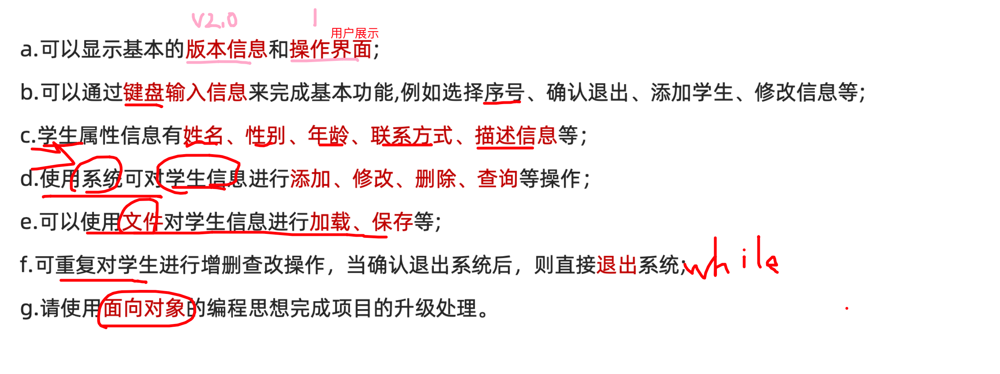
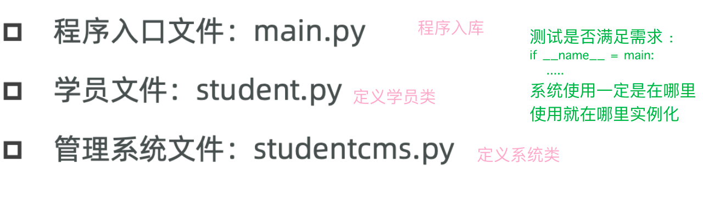
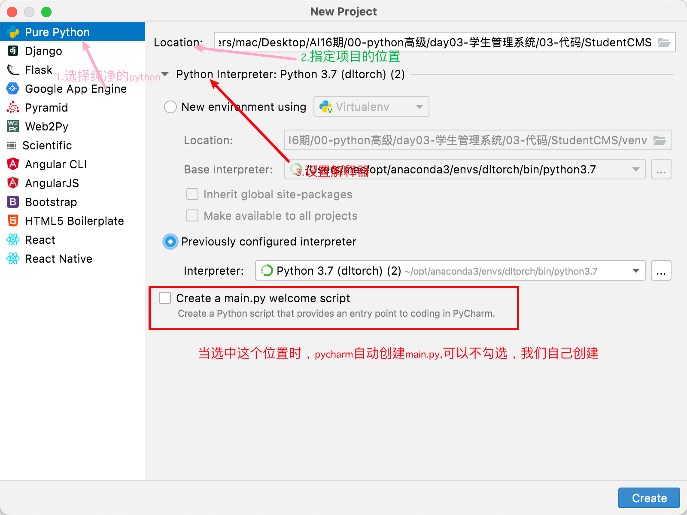
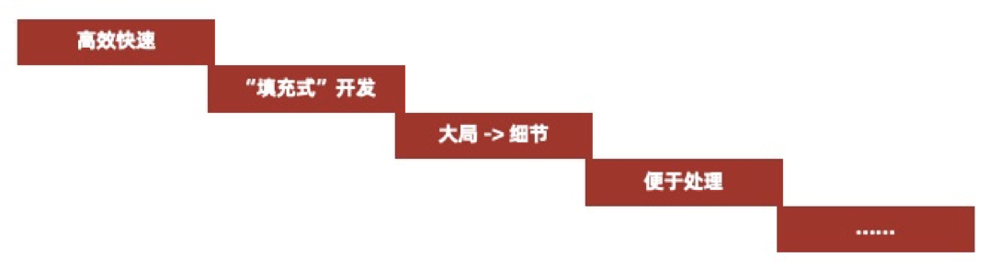

# 学生管理系统(面向对象)

##  1 学生管理系统需求分析

**学习目标**

1. 了解学生管理系统的基本需求；
2. 了解学生管理系统的基本界面及升级改进的好处；

### 1.1  [了解]基本需求

使用**面向对象**、字符串、列表、字典、文件等知识点来完成一个学生管理系统V2.0

针对学生，该系统具有添加、修改、删除、查询所有学生、查询某个学生、**保存信息**、退出系统等操作。


简单的操作流程图如下：


对于本学生管理系统所具有的基本需求如下：

```properties
a.可以显示基本的版本信息和操作界面;


b.可以通过键盘输入一些信息来完成基本功能,例如选择序号、确认退出、添加学生、修改信息等;


c.学生属性信息有姓名、性别、年龄、联系方式、描述信息等；


d.使用系统可对学生信息进行添加、修改、删除、查询等操作；


e.可以使用文件对学生信息进行加载、保存等;


f.可重复对学生进行增删查改操作，当确认退出系统后，则直接退出系统;


g.请使用面向对象的编程思想完成项目的升级处理。
	
```



### 1.2  [理解]项目角色分析

角色：学生管理系统

但是由于学生管理系统操作对象为学员，为了方便后期扩展，我们把学员也封装为一个角色。

```properties
注意事项：
① 为了方便维护代码，一般一个角色一个程序文件
② 项目要有主程序入口，习惯为`main.py
```


### 1.3  [重点]项目文件规划

创建项目目录，例如：" StudentManagerSystem "程序文件如下：

- 程序入口文件：main.py

- 学员文件：student.py

- 管理系统文件：studentcms.py

- 




##  2 项目开发实践

==**学习目标**==

1. 知道如何定义程序入口文件；
2. 知道使用面向对象属性和方法；
3. 知道魔法方法`__init__()和__str__()`的使用;
4. 知道该如何执行学生的新增操作;
5. 知道该如何执行学生的修改操作;
6. 知道该如何执行学生的删除操作;
7. 知道该如何执行学生的查询操作；
8. 了解文件的加载与保存操作。

###  2.1 [重点]学生类文件student

对于学生类，属性有姓名、年龄、性别、联系方式、描述信息，使用面向对象写类。

例如，需要完成输出学生对象的功能：

（1）在文件中定义一个学生类；

（2）在类中使用`__init__()`初始化学生的属性；

（3）在类中使用`__str__()`方法输出对象信息。

```python
# 1.定义类
class Student(object):
    # 1.1 定义属性
    def __init__(self, name, age, gender, mobile, des):
        self.name = name
        self.age = age
        self.gender = gender
        self.mobile = mobile
        self.des = des

    # 1.2 输出信息设置
    def __str__(self):
        return f'{self.name}的年龄是{self.age},性别{self.gender},手机号{self.mobile},备注{self.des}'
      
# 2.测试功能
if __name__ == '__main__':
    s1 = Student('小红', 23, '女', 10086, '程序媛')
    print(s1.age)
    print(s1)
```


###  2.2 具体业务功能studentcms

#### 2.2.1  [重点]显示界面

用于显示学生信息的操作界面内容。


步骤：需要完成显示操作界面的功能：

（1）显示项目的升级后版本信息： 1.0  - 2.0

（3）显示项目的大体操作界面，以便提示用户如何操作。  -界面

```python
 # 1.2.1 显示界面
    @staticmethod
    def show_info():
        print("*"*40)
        print('本学员管理系统V2.0完成一下操作:')
        print('\t1.添加学员')
        print('\t2.修改学员')
        print('\t3.删除学员')
        print('\t4.查询某个学员')
        print('\t5.显示所有学员')
        print('\t6.保存学员')
        print('\t0.退出系统')
        print("*"*40)
```


#### 2.2.2 [重点]搭建项目基本框架

为了便于后期快速开发，一般在项目初期我们会根据项目开发需求进行搭建基本项目框架，以便于更高效的快速开发。




需求：系统功能循环使用，用户输入不同的功能序号执行不同的功能。

步骤： 

- 定义程序入口函数  start() 

  - 模拟系统启动用户等待

  - 显示功能菜单  

  - 用户输入功能序号  ,也要考虑下程序的稳定性

  - 根据用户输入的功能序号执行不同的功能 

- 定义系统功能函数，添加、删除学员等

```python
  def add_student(self):
        pass

    def update_student(self):
        pass

    def del_student(self):
        pass

    def search_student(self):
        pass

    def show_all_student(self):
        pass

    def save_student(self):
        pass

    # 循环的实现
    def start(self):
        # 1.用户等待
        time.sleep(1)
        # 2.循环
        while True:
            # 2.1 显示界面
            StudentCMS.show_info()
            # 2.2 用户输入
            num = int(input('请输入要执行的任务对应序号:'))
            # 2.3 判断:增加容错性
            if num == 1:
                print('请添加学员:')
                self.add_student()
            elif num == 2:
                print('请修改学员:')
                self.update_student()
            elif num == 3:
                print('请删除学员:')
                self.del_student()
            elif num == 4:
                print('请查询学员')
                self.search_student()
            elif num == 5:
                print('请查询所有学员')
                self.show_all_student()
            elif num == 6:
                print('请保存学员')
                self.save_student()
            elif num == 0:
                str = input('你是否要退出系统(Y/N):')
                if str.lower() == "y":
                    print('退出系统,再见')
                    break

            else:
                print('请输入0-6之间的序号,新的功能敬请期待')
```


#### 2.2.3  [重点]退出系统

首先，我们来完成项目操作的退出功能。当然，在退出前必须要能==反复多次==显示操作界面。


步骤：需要完成退出系统的功能：

- 能反复多次的选择操作序号来执行功能；


- 用户想要退出时，可输入Y或y后退出系统的继续执行。

```python
            elif num == 0:
                str = input('你是否要退出系统(Y/N):')
                if str.lower() == "y":
                    print('退出系统,再见')
                    break
```


#### 2.2.4 上午内容总结 

- 需求分析
  - 角色->类->在一个py文件中实现一个类 ,实例化在调用这个类对象的文件中
  - 确定文件: 入口main.py
  - 比如：房源系统中职员管理，需要抽取职员类 ....
- 实现:
  - 学生类:属性
  - 系统类: 
    - 界面展示: 静态方法
    - 框架的搭建:循环的过程->增删改查
    - 退出:确认


#### 2.4.5  [重点]程序入口文件main

项目总程序入口是main.py，是整个项目的程序入口。

步骤：需要完成定义程序主入口的功能：

- 定义程序功能的一个主入口；


- 启动学生管理系统程序。

```python
# 项目入口:只负责程序的进入,业务相关的各个功能都不要在这里实现
from studentcms import StudentCMS

# 程序入口:
if __name__ == '__main__':
    studentCMS = StudentCMS()
    studentCMS.start()
```


#### 2.4.6[重点]添加学生

需求：用户可按要求输入学生的相关信息，例如姓名、性别、年龄、联系方式、描述信息等。

步骤： 

- 用户输入姓名、年龄、手机号

- 创建该学员对象

- 将该学员对象添加到列表

```python
    def add_student(self):
        # 1.创建学生对象
        name = input('请输入学生姓名:')
        gender = input('请输入学生性别:')
        age = int(input('请输入学生年龄:'))
        mobile = input('请输入学生联系方法:')
        des = input('请输入学生备注信息:')
        student =Student(name,age,gender,mobile,des)
        print(student)
        # 2.添加到list
        self.student_list.append(student)
        print(self.student_list)
```


#### 2.4.7  [重点]显示所有学生

需求：显示系统内的所有学生信息，便于浏览信息

步骤： 

- 遍历学员数据列表，打印所有学员信息

```python
    def show_all_student(self):
        # 1.遍历列表
        print('\t姓名\t性别\t年龄\t电话\t备注')
        for student in self.student_list:
            # 2.输出每个学员信息
            # print(student)
            print(f'\t{student.name}\t{student.gender}\t{student.age}\t{student.mobile}\t{student.des}')

```


#### 2.4.8  [重点]删除学生

需求：因某学生已毕业，为提升系统内信息的准确度，此时就要对学生信息进行删除。用户输入目标学员姓名，如果学员存在则删除该学员。

步骤： 

- 用户输入目标学员姓名
- 遍历学员数据列表，如果用户输入的学员姓名存在则删除，否则则提示该学员不存在。

```python
    def del_student(self):
        # 1.输入要删除的学员
        del_name = input('请输入要删除的学员姓名:')
        # 2.查找学员,找到就删除
        for student in self.student_list:
            if student.name == del_name:
                self.student_list.remove(student)
                break
        else:
            print('查无此人')
```


####  2.4.9 [了解]添加默认学员

需求：在操作学生的修改、删除、查询操作前，学生列表中应该有学员才可以进行测试，否则都要先添加学员才能测试当前功能，所以在系统操作前，可以先默认让系统已有3名学生，便于测试系统的其他功能

步骤： 

- 创建学员对象

- 将学员对象添加到list中。

```python
# 供测试使用,最后应该删除
        s1 = Student('小红',16,'女',10087,'高中生')
        self.student_list.append(s1)
        s2 = Student('小灰', 16, '男', 10077, '高中生')
        self.student_list.append(s2)
        s3 = Student('小明', 16, '男', 10088, '高中生')
        self.student_list.append(s3)
```


#### 2.4.10  [重点]修改学员信息

需求：因核对学生信息后，发现某学生的信息在系统中显示有误，此时就要对信息进行修改。

步骤：需要完成修改某个学生信息的功能：

- 用户输入待修改的学生姓名；


- 遍历学生列表，根据学生姓名来修改学生的相关信息。

```python
# 修改学员信息
    def update_student(self):
        # 1.输入学员名称
        update_name =input('请输入要修改的学员姓名:')
        # 2.查找学员,进行修改
        for student in self.student_list:
            if student.name == update_name:
                student.age = input('请输入学员年龄:')
                student.gender = input('请输入学员的性别:')
                student.mobile = input('请输入学员手机号:')
                student.des = input('请输入学员备注信息:')
                break
        else:
            print('查无此人')
```


#### 2.4.11  [重点]查询某个学生

需求：用户输入目标学员姓名，如果学员存在则打印该学员信息。

步骤： 

- 用户输入目标学员姓名

- 遍历学员数据列表，如果用户输入的学员姓名存在则打印学员信息，否则提示该学员不存在


```

```


#### 2.4.12  [了解]保存信息

需求：将修改后的学员数据保存到存储数据的文件。

步骤： 

- 打开文件

- 将列表中的学员转换为字符串类型写入到文件中 

- 关闭文件

思考：① 文件写入的数据是学员对象的内存地址吗？② 文件内数据要求的数据类型是什么？


#### 2.4.13  [了解]加载学生数据信息

需求：当启动学生管理系统时，为便于进行操作学生信息，则可以直接初始化或加载数据文件中的信息

步骤： 

- 尝试以`"r"`模式打开学员数据文件，如果文件不存在则以`"w"`模式打开文件

- 如果文件存在则读取数据并存储数据

  - 读取数据

  - 转换数据类型为列表并转换列表内的字典为对象

  - 存储学员数据到学员列表

- 关闭文件


思考：当第1次启动系统时，数据文件中是没有数据的，该怎么做才能避免下一步的类型转换错误呢？


##  3 今日总结


面向对象的思想搭建学生管理系统

- 需求分析:

  - 确定角色: 学生,系统

    - 房屋管理系统:房屋,系统
    - 库房管理系统:电器,电脑,电视,系统

  - 规划文件:

    - 项目入口:main.py->只做入口,所有业务相关的就不要在这里

    - 每个类有独立的文件...

    - 测试类的效果:在文件中i

      ```
      if __name__ = main:
      ```

- 开发实践 

  - 界面:静态方法
  - 搭建基本框架:while True: 
  - 学员信息的增,删,改,查
  - 文件处理: 
    - 保护数据,文件后缀进行修改 .data .config
    - 保存
    - 加载
    - 数据类型的转换
  - 入口文件的编写


## 今日作业

- 自己实现学生管理系统
- 使用思维导图总结下学生管理系统


