# 闭包和装饰器

##  1 函数知识

**学习目标**

1. 理解函数的作用；
2. 知道函数可以作为参数使用。

---

###  1.1 函数名的作用

- 函数名存放的是函数所在内存空间的地址

- 函数名()执行函数名所存放空间地址中的代码

- 函数名可以像普通变量一样赋值,赋值后的结果与原函数名作用是一样的

例如：定义一个无返回值的函数func01，并直接输出函数名查看效果。

```python
# 1.定义函数
def func():
    print('这是一个函数')

# 2.查看函数的作用
# func()
# 2.1 函数名
print(func)
# 2.2 调用函数
func()
# 2.3 函数名可以像其他一样赋值
func2 = func
print(func2)
# 2.4 变量执行函数
func2()
```


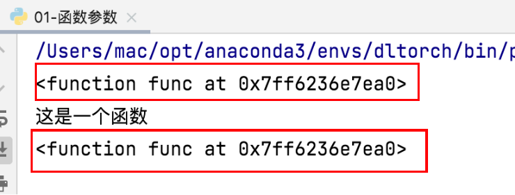

### 1.2 函数作为参数传递

我们知道，函数名记录的是函数的引用地址值。

那么，函数名能直接作为参数进行传递吗？能!

当把函数名直接作为实参进行传递时，本质上传递的是：对应函数的引用地址值。

例如，将函数作为实参来传递：

（1）定义一个无参函数test()；

（2）定义一个有一个参数的函数func()；

（3）把无参函数test()的函数名传递给有参函数func()，并观察效果。

```python
# 1.定义函数1
def test():
    print('这是一个测试函数')

# 2.定义函数2
def func(x):
    x()


# 3.调用函数
# test()
func(test)
```


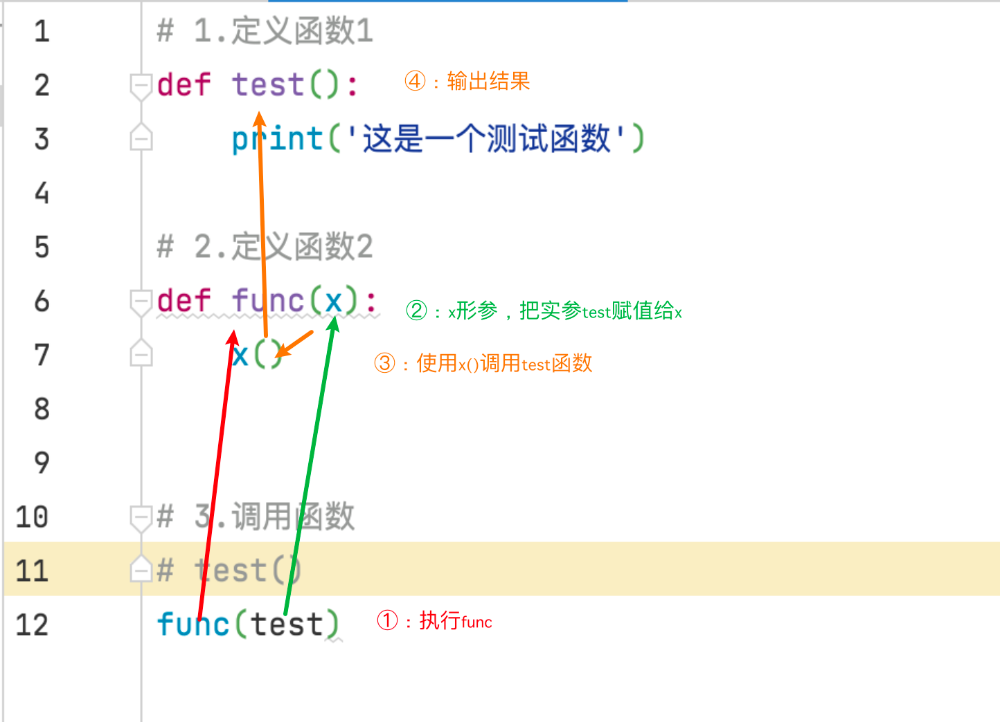


### 1.3 ⚡️内容总结⚡️

函数作用:

- 函数名: 函数在内存中的地址
- 函数名():执行函数体的代码
- 函数可以赋值
- 函数可以作为参数传递给其他函数


## 2 闭包

**学习目标**

1. 知道闭包的构成条件；
2. 知道定义闭包的语法格式。

---

###  2.1 [重点]闭包的作用

在之前的学习中，我们会发现：
当调用完函数后，函数内定义的变量就销毁了，但是我们有时需要保存函数内的这个变量，并在这个变量的基础上完成一系列的操作。

例如，每次在这个变量的基础上和其它数字进行求和计算，那怎么办呢?

我们就可以通过咱们今天学习的**闭包**来解决这个需求。

**闭包的作用：**闭包可以**保存函数内的变量**，而不会随着调用完函数而被销毁。

例如，定义一个函数用于保存变量10，然后调用函数返回值变量并重复累加数值，观察效果。

```python
# 1.定义一个函数
def func():
    return 10


# 2.累加,观察输出结果
number = func()
print(number+10+20+30)
print(number+20)
print(number+30)
```


###  2.2 [重点]闭包的语法

概念：在函数嵌套的前提下，内部函数使用了外部函数的变量，并且外部函数返回了内部函数。

我们把这个**使用外部函数变量的内部函数称为闭包**。

```python
# 外部函数
def 外部函数名(外部参数):
    # 内部函数
    def 内部函数名(内部参数):
        ...[使用]
    return 内部函数名      # 闭包
```

### 2.3 [重点]闭包的使用

例如，定义一个用于求和的闭包。

其中，外部函数有参数x，内部函数有参数y，然后调用，并用于求解两数之和，观察效果。

```python
# 1.函数嵌套:内外部函数(outer,inner)
# 2.有引用:内部函数引用外部函数的变量
# 3.有返回:外部函数要返回内部函数名
def outer(num1):
    def inner(num2):
        sum =num2+num1
        print(f'两数之和是{sum}')
    return inner

# 调用闭包
fun =outer(10)
fun(20)
```

#### 了解闭包的执行流程

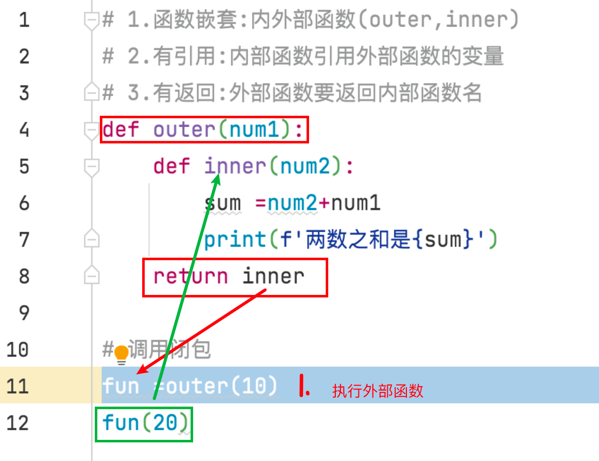


### 2.4 [了解]nonlocal关键字

global: 声明全局变量

**nonlocal**: 声明能够让内部函数去修改外部函数的变量

语法：

```properties
nonlocal 变量名
```

例如，编写一个闭包，让内部函数去访问外部函数内的参数a = 100，修改值，a = a + 1，并观察效果。

```python
# 1.函数嵌套:内外部函数(outer,inner)
# 2.有引用:内部函数引用外部函数的变量
# 3.有返回:外部函数要返回内部函数名
# 4.nonlocal声明后可以使用内部函数修改外部函数的变量
def outer():
    a = 1
    def inner():
        nonlocal a
        a=a+1
        print(f'a的取值{a}')
    return inner

f =outer()
f()
```


## 3 装饰器基础

**学习目标**

1. 知道定义装饰器的语法格式；
2. 能够说出装饰器的作用；
3. 知道多种类型装饰器的使用。

---

### 3.1 [重点]装饰器入门

#### [知道]什么是装饰器

装饰器就是**在不改变原有函数的基础上，给原有函数增加额外功能**。

装饰器的构成条件：

- **有嵌套**：在函数嵌套(函数里面再定义函数)的前提下；

- **有引用**：内部函数使用了外部函数的变量(还包括外部函数的参数)；

- **有返回**：外部函数返回了内部函数名；

- **有额外功能**：给需要装饰的原有函数增加额外功能。

```properties
def outer([外面参数列表]):
	def inner([内部参数列表]):  # 有嵌套
		新增额外功能代码 # 有额外功能
		....
		...[引用] # 有引用
	return inner # 有返回
```

#### [了解]使用语法1:传统方式

装饰器就是一个闭包。

```python
# 使用语法1:传统方式
变量名 = outer([外面参数列表])
变量名([内部参数列表])
```

例如，发表评论前，都是需要先登录的。
此处，先定义有发表评论的功能函数，然后在不改变原有函数的基础上，需要提示用户要先登录~。

```python
# 发表评论前,要先登录
# 1.定义原有函数
def comment():
    print('发表评论')

# 2.定义装饰器:装饰器名称就是外部函数名
# 2.1 嵌套
def outer(fn):
    # 2.2 引用
    def inner():
        # 2.4 额外功能
        print('请先登录...')
        fn()
    # 2.3 返回
    return inner


# 3.装饰原有函数
fn =outer(comment)
# 4.调用
fn()
```


##### 了解装饰器的执行流程

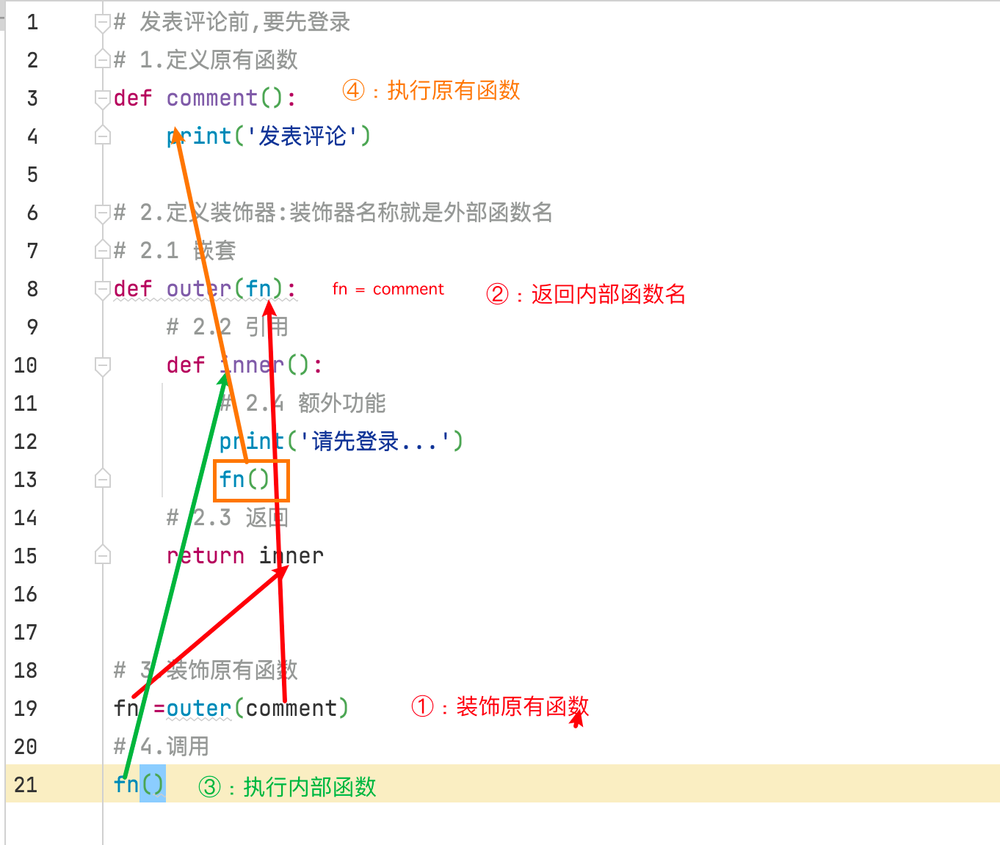


#### [重点]使用语法2:语法糖

```python
# 使用语法2:语法糖
@outer
def 函数名():
	...
```

例如，发表评论前，都是需要先登录的。
此处，先定义有发表评论的功能函数，然后在不改变原有函数的基础上，需要提示用户要先登录~。

```python
# 发表评论前,要先登录
# 1.定义装饰器:装饰器名称就是外部函数名
# 2.1 嵌套
def outer(fn):
    # 2.2 引用
    def inner():
        # 2.4 额外功能
        print('请先登录...')
        fn()
    # 2.3 返回
    return inner

# 2.定义原有函数
@outer
def comment():
    print('发表评论')

# 3.调用
comment()
```


### 3.2 装饰器的使用

#### [知道]函数分类

```properties
无参无返回值的函数
    定义: def 函数名(): ...
    调用: 函数名()

有参无返回值的函数
    定义: def 函数名(形参): ...
    调用: 函数名(实参)
    
无参有返回值的函数
    定义: def 函数名(): ... return 返回值
    调用: 用变量接收返回值 = 函数名()
    
有参有返回值的函数
    定义: def 函数名(形参): ... return 返回值
    调用: 用变量接收返回值 = 函数名(实参)

```

#### [重点]装饰无参无返回值的函数

例如，在无参无返回值的原有函数求和计算结果之前，添加一个友好提示(注意：不能改变源码)：正在努力计算中...。

```python
# 1.定义装饰器
# 1.1 有嵌套
def outer(fn):
    # 1.2 有引用
    def inner():
        # 1.4 有额外功能
        print('正在努力计算中...')
        fn()

    # 1.3 有返回
    return inner


# 2.原有函数(无参无返回值)
@outer
def get_sum():
    a = 10
    b = 20
    print(f'求和结果为{a + b}')

# 3.调用
get_sum()

```

装饰器的内部函数是无参,无返回值的.


#### 上午总结

函数的作用:

- 函数名:内存地址
- 函数名(): 执行函数体的代码
- 可以像变量一样进行赋值
- 函数可以作为参数传递

闭包:

- 作用:保存函数中的变量

- 构成条件:

  - 有嵌套:外部和内部
  - 有返回:外部函数返回内部函数名
  - 有引用:内部函数引用外部函数的变量

- 语法

  ```properties
  - 有嵌套:外部和内部
  def outer():
  	def inner():
  	   [有引用:内部函数引用外部函数的变量]
  	有返回:外部函数返回内部函数名
  	return 内部函数名
  ```

- nonlocal

  - 使用内部函数修改外部变量时,使用nonLocal进行声明

  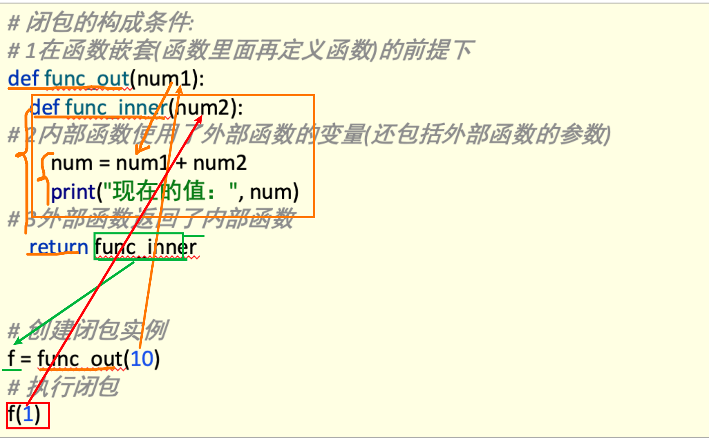

装饰器:

- 作用: 不改变原有函数的基础上,增加额外功能
- 构成条件:
  - 有嵌套:外部和内部
  - 有返回:外部函数返回内部函数名
  - 有引用:内部函数引用外部函数的变量
  - 有额外功能:
- 实际上就是闭包

```properties
- 有嵌套:外部和内部
def outer(fn):
	def inner():
		增加额外功能
	   [有引用:内部函数引用外部函数的变量]
	   fn()
	有返回:外部函数返回内部函数名
	return 内部函数名
```

语法糖:

```properties
@装饰器名
def 原有函数()
	pass
```

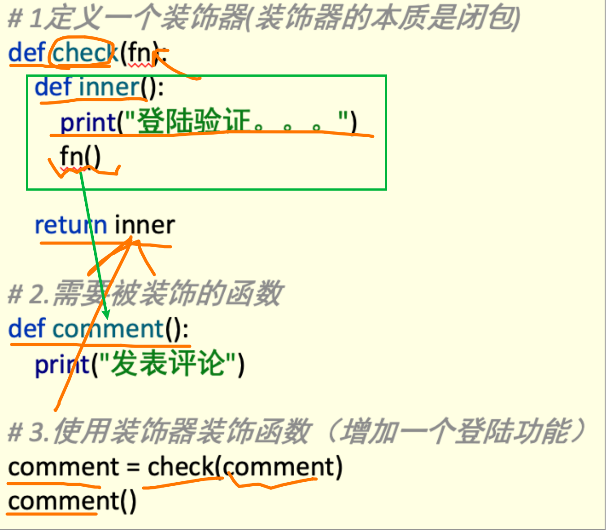


#### [重点]装饰有参无返回值的函数

例如，在有参无返回值的原有函数求和计算结果之前，添加一个友好提示(注意：不能改变源码)：正在努力计算中...。

```python
# 1.装饰器
# 1.1 有嵌套
def outer(fn):
    def inner(a, b):
        # 1.4 增加额外功能
        print('正在努力计算中....')
        # 1.2 有引用:并且添加了参数
        fn(a, b)

    # 1.3 有返回
    return inner


# 2.原有函数
@outer
def get_sum(x, y):
    sum = x + y
    print(f'两数之和{sum}')


# 3.调用
get_sum(10, 20)

```

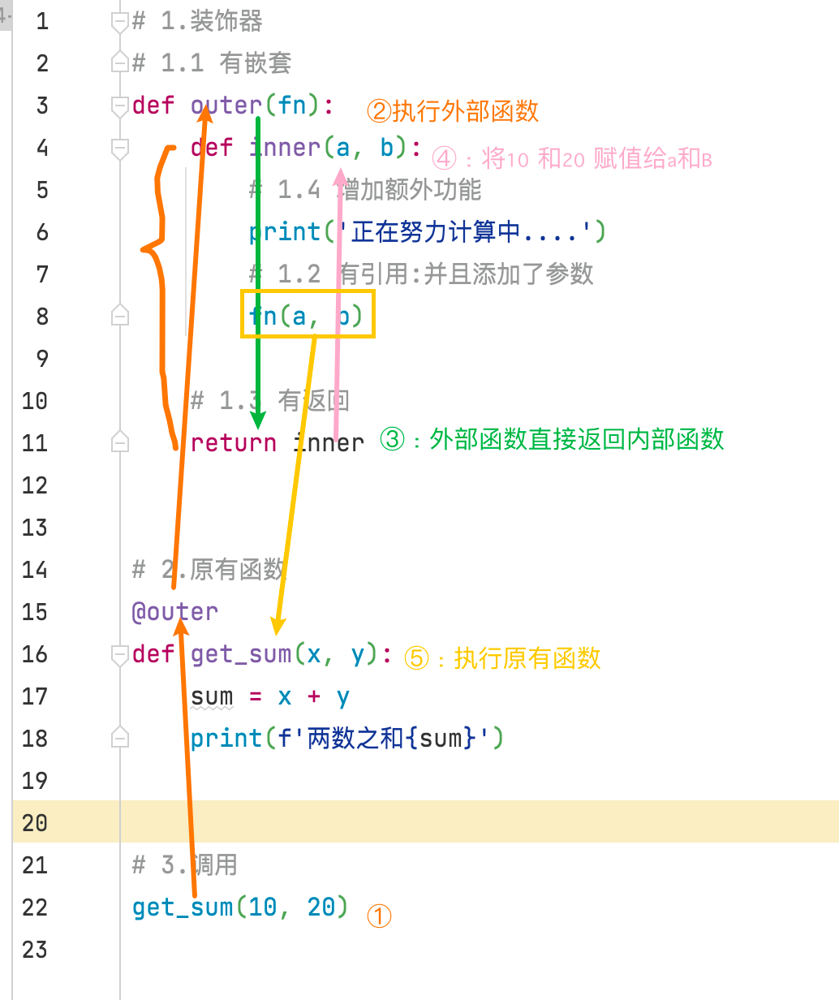

有参无返回值的函数,装饰器中的内部函数就是有参无返回值

#### [重点]装饰无参有返回值的函数

例如，在无参有返回值的原有函数求和计算结果之前，添加一个友好提示(注意：不能改变源码)：正在努力计算中...。

```python
# 1.装饰器
def outer(fn):
    def inner():
        print('正在努力计算中...')
        result=fn()
        return result
    return inner


# 2.原有函数:无参有返回值
@outer
def get_sum():
    sum = 10 + 20
    return sum

# 3.调用
sum = get_sum()
print(sum)

```

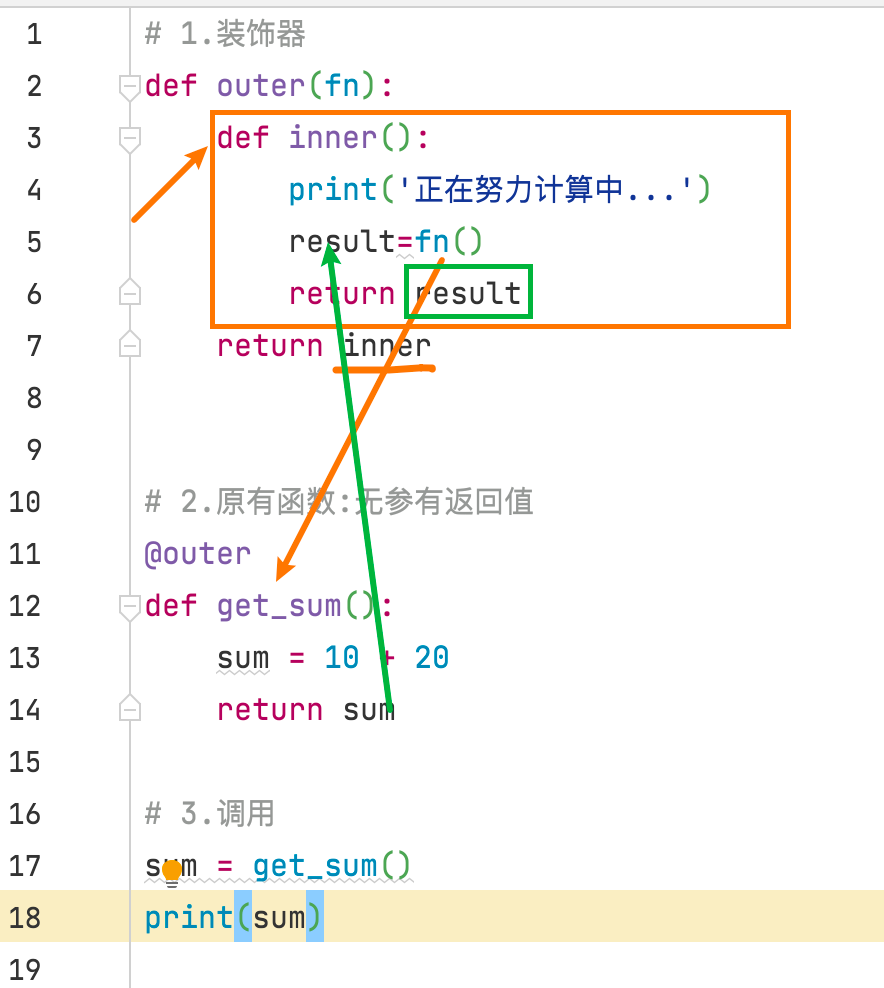

当装饰无参有返回值的函数时,装饰器的内部函数中无参有返回值

#### [重点]装饰有参有返回值的函数

例如，在有参有返回值的原有函数求和计算结果之前，添加一个友好提示(注意：不能改变源码)：正在努力计算中...。

```python
# 1.定义装饰器
def outer(fn):
    def inner(a,b):
        print('正在计算中....')
        result =fn(a,b)
        return result
    return inner


# 2.原有函数
@outer
def get_sum(x,y):
    sum =x+y
    return sum


# 3.调用
result =get_sum(10,20)
print(result)

```

有参有返回值的函数中装饰器中内部函数有参有返回值

#### [重点]通用装饰器的使用

通用：

```properties
*args: 元组类型
**kwargs: 字典类型
```

例如，定义一个可以计算多个数据和多个字典value值之和的函数，并调用。  
在原有函数的计算结果之前，加一个友好提示(不能改变源码)：正在努力计算中...。

```python
# 1.定义装饰器
def outer(fn):
    def inner(*args,**kwargs):
        print('正在努力计算中....')
        result = fn(*args,**kwargs)
        return result
    return inner


# 2.定义原有函数
@outer
def get_sum(*args, **kwargs):
    sum = 0
    for arg in args:
        sum += arg
    for value in kwargs.values():
        sum += value
    return sum


# 3.调用
result = get_sum(1, 2, 3, 4, a=1, b=2, c=3)
print(result)

```


## 4 装饰器进阶

**学习目标**

1. 能够使用多个装饰器
2. 了解带有参数的装饰器。

---

### 4.1 多个装饰器装饰一个函数

多个装饰器的**装饰过程**是: 离函数**最近**的装饰器先装饰，然后外面的装饰器再进行装饰，**由内到外**的装饰过程。


例如，发表评论前，都是需要先登录用户并进行验证码验证。

先定义有发表评论的功能函数，然后在**不改变原有函数的基础上**，需要提示用户要先登录和输入验证码

```python
# 1.定义装饰器
# 1.1 登录的装饰器
def login(fn):
    def inner():
        print('请登录用户...')
        fn()

    return inner


# 1.2 验证的装饰器
def check(fn):
    def inner():
        print('请输入验证码...')
        fn()

    return inner


# 2.原有函数
@login
@check
def comment():
    print('发表评论...')


# 3.调用
comment()

```

装饰顺序

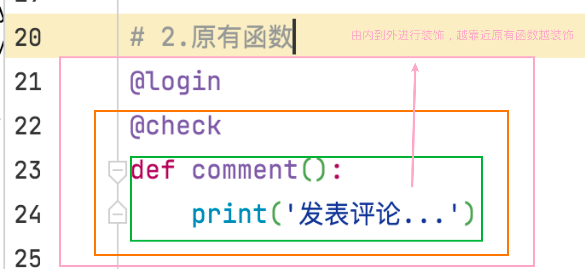

执行流程

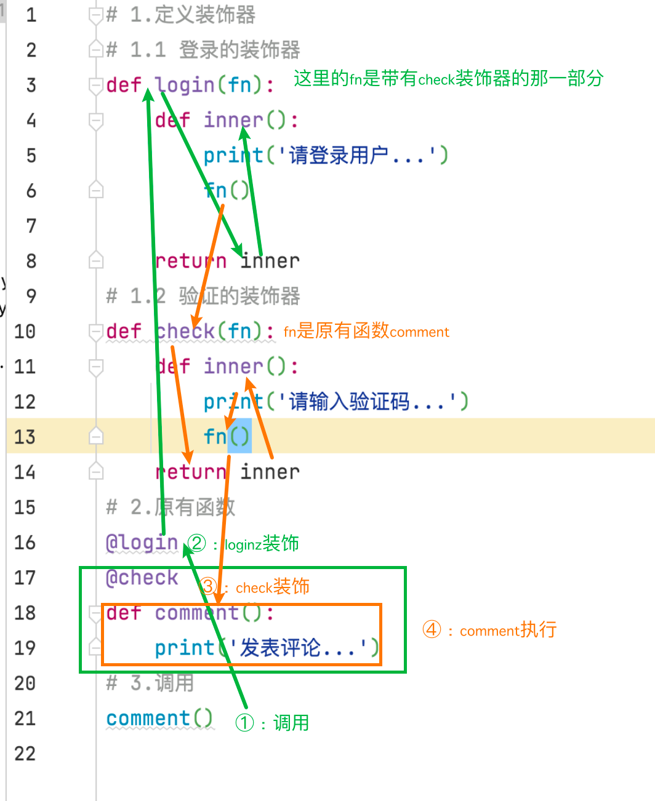

### 4.2  [了解]带有参数的装饰器

使用带有参数的装饰器，其实是在装饰器外面又包裹了一个函数，使用该函数接收参数，返回装饰器。

例如，定义一个既能装饰减法运算，又能装饰加法运算的装饰器，即带有参数的装饰器：

（1）当装饰减法运算时，提示：正在进行减法运算；

（2）当装饰加运算时，提示：Adding...。

```python
# 1.装饰器
def logging(flag):
    def outter(fn):
        def inner(a, b):
            # 额外功能
            if flag == "+":
                print('正在进行加法计算...')
            elif flag == '-':
                print('正在进行减法运算....')
            z = fn(a, b)
            return z

        return inner

    return outter


# 2.原有函数
@logging('+')
def add(a, b):
    sum = a + b
    return sum


@logging('-')
def reduce(a, b):
    res = a - b
    return res


# 3.调用
result1 = add(10, 20)
print(result1)
result2 = reduce(20, 10)
print(result2)

```

### 4.3  装饰器的使用[扩展]

```python
# 定义一个类
class Person(object):
    def __init__(self):
        self.__money = 2000

    # def get_money(self):
    #     return self.__money
    #
    # def set_money(self):
    #     self.__money = 5000
    @property
    def money(self):
        return self.__money

    @money.setter
    def money(self,m):
        if m < 100:
            print('这是不可能的')
        else:
            self.__money = m


# 在类外获取
p = Person()
print(p.money)
p.money = 5000
print(p.money)

```

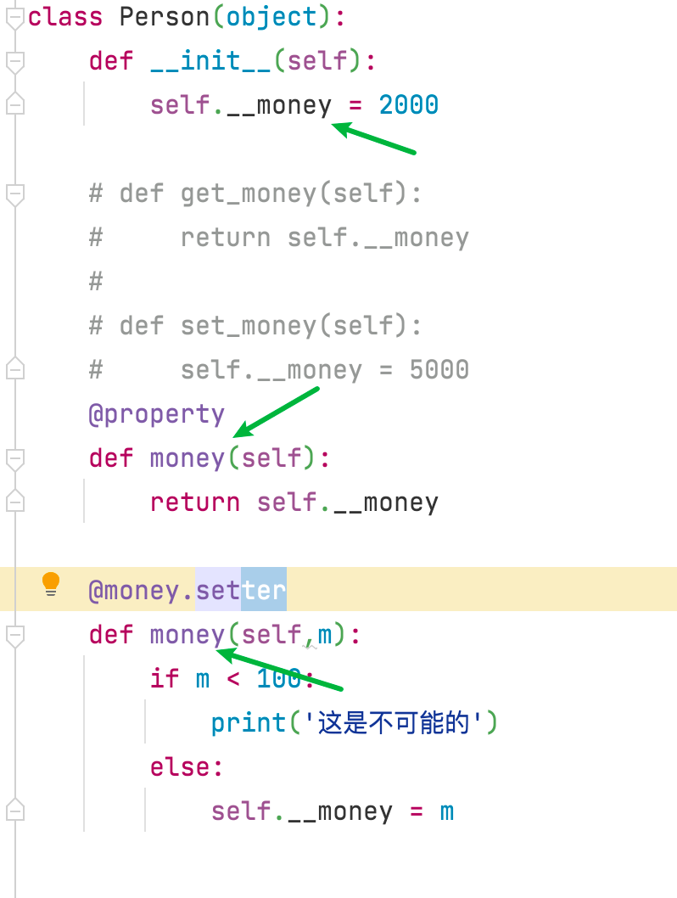

##  5 今日总结

函数的作用

- 函数名:内存地址
- 函数名(): 执行函数
- 函数名可以赋值,可以其他函数的参数进行传递

闭包

- 作用:保存函数中的变量
- 构成条件:
  - 有嵌套
  - 有引用
  - 有返回
- 语法:

- nonlocal: 当内部函数要修改外部函数变量要声明下

装饰器:

- 作用:在不改变原有函数的基础上,添加额外功能
- 条件
  - 有嵌套
  - 有引用
  - 有返回
  - 额外功能
- 语法:语法糖
- 装饰不同类型函数时:
  - 有参有返回的在内部函数中有参有返回
  - 无参无返回的在内部函数中无参无返回
  - 通用函数的装饰:*args **kwargs
- 多个装饰器装饰一个函数
  - 由内到外进行装饰
- 带参数的装饰
  - 参数不能直接在外部函数中传递
  - 在装饰器再包裹一层函数,用来接收参数
- [扩展] property属性


## 重要场景

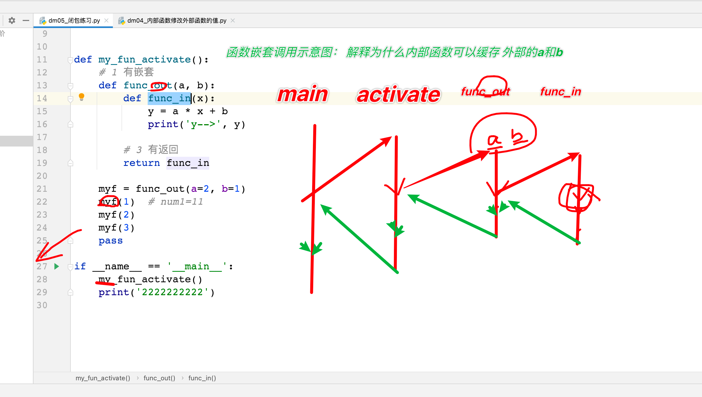


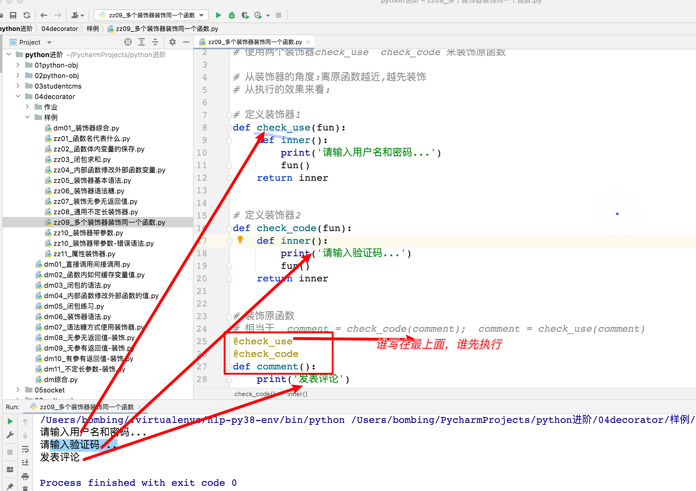


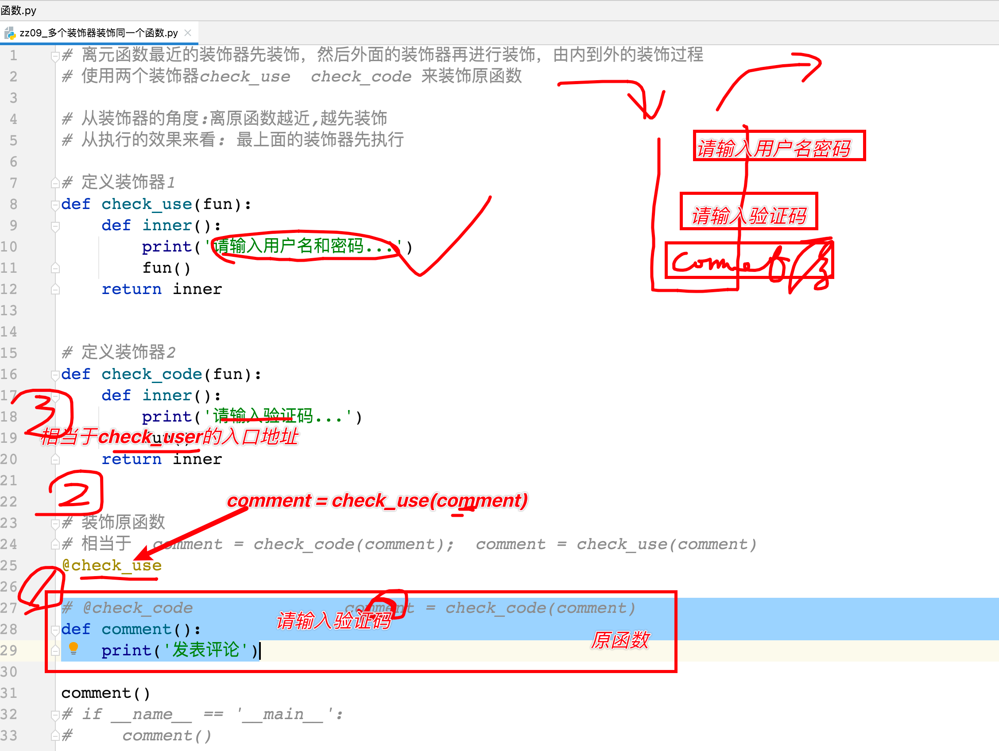


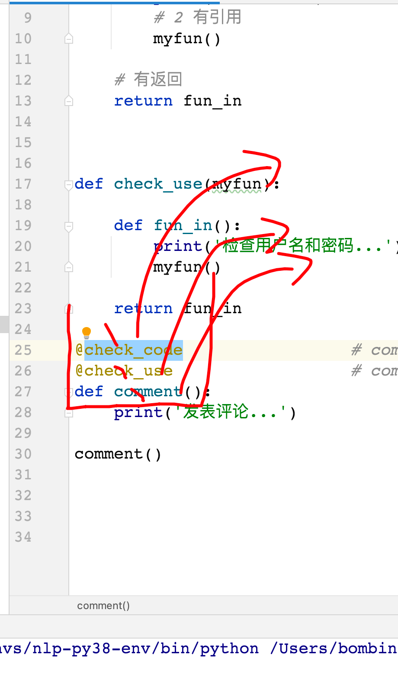


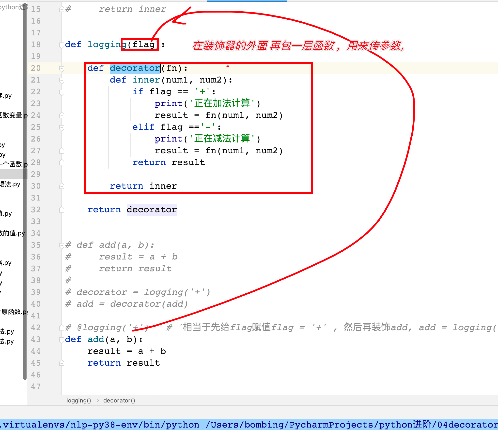


