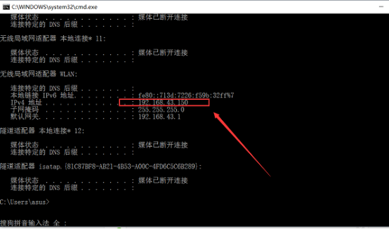

##  1 网络编程三要素

**学习目标**

1. 知道IP地址的作用；
2. 知道端口和端口号的作用；
3. 能够说出TCP的特点。

---

###  1.1 [了解]基本概念

将具有独立功能的多台计算机通过通信线路和通信设备连接起来，在网络管理软件及网络通信协议下，实现资源共享和信息传递的虚拟平台。


能够编写基于网络通信的软件或程序，通常来说就是网络编程。

要使用编程语言实现多台计算机的网络通信，则需要具备三个要素，分别是：

- (1)**IP地址**：这是网络环境下每一台计算机的唯一标识，通过IP地址来找到指定的计算机；   作用：找到计算机
- (2)**端口**：用于标识进程的逻辑地址，通过端口来找到指定的进程(应用软件)；   作用：找到计算机中的对应软件
- (3)**协议**：定义通信规则，符合协议则可以通信，否则无法正常通信。

以“**我要和小明面对面说上话**”为案例进行理解。

```properties
例如，假如我要和小明面对面说上话。
- 首先我要到【小明的住处】找到小明(相当于通过IP地址找到指定计算机)；
- 然后我要和小明说话，小明使【用耳朵听】我说(相当于用端口接收)；
- 最后，我们对话不能随便使用任意语言，此时说的话【彼此都能听懂】，如讲普通话(这就是协议的作用)。
```

### 1.2 [重点]IP地址

#### IP地址的概念

IP地址就是标识网络中设备的一个地址，好比现实生活中的家庭地址。网络中的设备效果图:


#### IP地址的表现形式


IP地址分为两类： **IPv4** 和 **IPv6**；

- **IPv4**：是目前大家使用的IP地址；  
- **IPv6**：作为了解，IPv6是未来使用的IP地址。


#### IP地址的作用

IP地址的作用是**标识网络中唯一的一台设备的**，也就是说通过IP地址能够找到网络中某台设备。IP地址作用效果图：


#### 查看IP地址

若要查看计算机的IP地址信息，可以使用ipconfig命令。

| 操作系统     | 命令名称     |
| ------------ | ------------ |
| Linux、MacOS | ifconfig     |
| Windows系统  | ==ipconfig== |


#### 检查网络是否正常

若要检查计算机网络是否正常时，命令：

```properties
ping 地址
```

> 说明：
>
> |        地址        | 说明                           | 使用               |
> | :----------------: | ------------------------------ | ------------------ |
> |     127.0.0.1      | 本机IP、回环地址.              | ping 127.0.0.1     |
> |   192.168.26.63    | 当前所在局域网的IP地址         | ping 192.168.26.63 |
> | 域名 www.baidu.com | 帮助记忆的符号。。本质：IP地址 | ping www.baidu.com |
>


#### window中查看ip地址的方法

##### **直接查看网络连接**

1、在Win10右下角任务栏的网络图标上点击鼠标右键，在弹出的菜单中，点击【网络设置】。


2、滑到最下面，单击打开【打开网络和共享中心】。


3、进入网络共享中心后，点击已经连接的网络名称。


4、在打开的网络状态中，点击【详细信息】。


5、之后就可以找到IPv4，也就是电脑本机IP地址了。


##### **通过命令查看Win10本机IP地址**

1、在Win10开始菜单中，打开【运行】，也可以直接使用 Windows + R 组合快捷键，快速打开。


2、然后在“运行”框的打开后面输入命令“cmd”，然后，点击下方的【确定】打开cmd命令运行符。


3、在打开的cmd命令操作框中，键入命令“ipconfig”，输入完成后，按回车键运行,之后就可以找到本地IP地址(IPv4)了。




### 1.3 [重点]端口和端口号

#### 问题思考

不同电脑上的微信之间进行数据通信，它是如何保证把数据给微信而不是给其它软件呢?

**其实，每运行一个网络程序都会有一个端口，想要给对应的程序发送数据，找到对应的端口即可。**端口效果图：


#### 什么是端口

**端口是传输数据的通道**，好比教室的门，**是数据传输必经之路**。

那么如何准确的找到对应的端口呢?

**其实，每一个端口都会有一个对应的端口号，好比每个教室的门都有一个门牌号，想要找到端口通过端口号即可。**端口号效果图：


#### 什么是端口号

操作系统为了统一管理这么多端口，**就对端口进行了编号**，这就是端口号，**端口号其实就是一个数字**，好比我们现实生活中的门牌号，端口号有65536个。

那么最终飞秋之间进行数据通信的流程是这样的，**通过ip地址找到对应的设备，通过端口号找到对应的端口，然后通过端口把数据传输给应用程序**。最终通信流程效果图：


####  端口和端口号的关系

端口号可以标识电脑中唯一的一个端口。

#### 端口号的分类

- **知名端口号:**是指**众所周知的端口号，范围从0到1023。**   http:80   https:443  75
- **动态端口号:**一般程序员**开发应用程序使用端口号称为动态端口号, 范围是从1024到65535。**


### 1.4[了解]TCP协议

#### [了解]通信流程

之前我们已学习了 IP地址和端口号，通过 IP地址能够找到对应的设备，然后再通过端口号找到对应的端口，再通过端口把数据传输给应用程序。

**要注意，数据不能随便发送，在发送之前还需要规则，以保证程序之间按照指定的规则来进行数据的通信，** 而这个规则就是TCP协议.

#### [了解]TCP面向连接

TCP的英文全拼(**T**ransmission **C**ontrol **P**rotocol)简称**传输控制协议**，它是一种**面向连接的、可靠的、基于字节流的传输层通信协议**。

面向连接的效果图：


**TCP通信步骤:**

1. 创建连接
2. 传输数据
3. 关闭连接

**说明:**

TCP通信模型相当于生活中的“==**打电话**==“，在通信开始之前，一定要先建立好连接，才能发送数据，通信结束要关闭连接。


#### [了解]三次握手

三次握手（Three-Way Handshake）就是指建立一个TCP连接时，需要客户端和服务端总共发送3个包以确认连接的建立。


- 第一次握手：客户端向服务端发送请求，等待服务端确认。

- 第二次握手：服务端收到请求后知道客户端请求建立连接**，**回复给客户端以确认连接请求。

- 第三次握手：客户端收到确认后，再次发送请求确认服务端，服务端收到正确请求后，如果正确则连接建立成功，完成三次握手，随后客户端与服务端之间可以开始传输数据了。

  

==11:03上课==


#### [了解]四次挥手

四次挥手说TCP断开链接的时候需要经过4次确认


- 第一次挥手： 当主机A（可以是客户端也可以是服务端）完成数据传输后, 提出停止TCP 连接的请求 ； 

- 第二次挥手： 主机B收到请求后对其作出响应，确认这一方向上的TCP连接将关闭

- 第三次挥手： 主机B 端再提出反方向的关闭请求,；

- 第四次挥手： 主机A对主机B 的请求进行确认，双方向的关闭结束 。

  


####  [了解]TCP的特点

- 面向连接
  - 通信双方必须先建立好连接才能进行数据传输，数据传输完成后，需要断开连接，以释放系统资源。

- 可靠传输
  - 都建立了连接，传输数据可靠；
  
  - 必须要先建立连接，相对效率较低；
  - 大多数服务器程序都是使用TCP协议开发的，比如文件下载，网页浏览等。


## 2  socket套接字与TCP开发流程

**学习目标**

1. 了解socket套接字的作用；
2. 知道TCP程序的开发流程。

---

### 2.1[了解]socket套接字

我们已了解了网络编程的三要素，那么通信数据是如何完成传输的呢？此时，就可以使用 **socket** 来完成。

socket(简称 套接字) 是**进程(任务、应用软件)之间通信一个工具**，好比现实生活中的**插座**，所有的家用电器要想工作都是基于插座进行，**而进程之间想要进行网络通信需要基于这个 socket**。插座效果图：


socket效果图:


负责**进程之间的网络数据传输**，好比数据的搬运工。

### 2.2 socket使用场景

不夸张的说，只要跟**网络相关的应用程序或者软件都使用到了==socket==** 。


### 2.3 使用socket

socket(套接字)能实现不同主机之间的进程间通信。

重要：

Python中有专门的socket类用来处理用户的请求和响应，利用socket类可以轻松实现两台计算机间的通信。

```python
# 导入socket模块
import socket
```

要使用socket，则通常要使用到socket模块下的socket类创建socket对象：

|             函数名              | 含义                                                         |
| :-----------------------------: | ------------------------------------------------------------ |
| **socket(AddressFamily, Type)** | 用于创建一个socket对象。<br>其中，参数AddressFamily可以选择AF_INET用于Internet进程间通信，实际工作中常用它，网络通信就需要使用这个参数；AF_INET是socket模块下的一个常量。<br>参数Type表示套接字类型，可以是SOCK_STREAM流式套接字，主要用于TCP协议。 |

例如，来创建一个TCP协议下的socket对象。

```python
import socket

# 创建socket
tcp_socket = socket.socket(socket.AF_INET,socket.SOCK_STREAM)

print(tcp_socket)
```


### 2.4 [重点]TCP开发流程介绍

TCP网络应用程序开发分为:

- TCP客户端程序开发
- TCP服务端程序开发

**说明:**

客户端程序是指运行在**用户设备上的程序**，服务端程序是指运行在**服务器设备上的程序**，专门为客户端提供数据服务。


#### 流程步骤说明

##### [重点]TCP服务器端

TCP服务器端操作步骤流程：

1. 创建服务端套接字对象；

2. 绑定端口号与IP；

3. 设置监听；

4. 等待接受客户端的连接请求；

5. 发送数据；

6. 或接收数据；

7. 关闭套接字。

   

   当有了socket对象后，常用于服务器端的函数如下：

|       函数名        | 含义                                                         |
| :-----------------: | ------------------------------------------------------------ |
|  **bind(address)**  | 绑定地址(host,port)到socket套接字，在AF_INET下，address以元组(host,port)的形式表示地址。其中，参数host表示字符串类型的主机名或IP地址[大家记得写IP]；port表示int类型的端口号【1024-65535】。 |
| **listen(backlog)** | 开始TCP监听。参数backlog指定在拒绝连接之前，操作系统可以挂起的最大连接数量。该值至少为1，大部分应用程序设为**5**就可以了，最大值可设置为128。 |
|    **accept()**     | 被动接受TCP客户端连接，等待连接的到来，返回一个connection对象，以元组形式显示，且元组的第一个参数为已建立连接的socket对象，第二个参数为**客户端**地址address。 |

能同时应用于服务器端和客户端的函数如下：

|               函数名                | 含义                                                         |
| :---------------------------------: | ------------------------------------------------------------ |
|          **recv(bufsize)**          | 用于接收TCP数据，数据以bytes二进制形式返回，bufsize指定要接收的最大数据量，可设置为1024的倍数。  4096   4*1024 |
|           **send(data)**            | 发送TCP数据，将data中的数据发送到连接的套接字，data为bytes二进制数据。 bytes类型转换字符串。 |
|             **close()**             | 关闭套接字。                                                 |
| **setsockopt(level,optname,value)** | 可设置端口号复用，让程序退出端口号并立即释放。level可指定为SOL_SOCKET, optname可指定为SO_REUSEADDR, value可指定为True。   ==了解== |

##### [了解]TCP客户端

TCP客户端操作步骤流程：

1. 创建客户端套接字对象;
2. 客户端连接服务器端；
3. 接收数据；
4. 或发送数据；
5. 关闭套接字。


当有了socket对象后，常用于客户端的函数如下：

|        函数名        | 含义                                                         |
| :------------------: | ------------------------------------------------------------ |
| **connect(address)** | 主动初始化TCP服务器连接，一般地，参数address的格式为元组(host,port)，若连接出错，则返回socket.error错误。 |


### 2.5 上午总结

网络编程三要素:

- ip :网络设备的唯一标识,IpV4
  - 可视化
  - 终端:
    - win: ipconfig
    - macos或linux: ifconfig
  - ping 查看连接
- 端口: 标识进程
  - 0-1023:知名
  - 1024-65535:自己使用
- 协议:TCP
  - 面向连接,可靠的,基于字节流
  - 步骤:
    - 创建连接:三次握手
    - 数据传输:字节流
    - 断开连接:  四次挥手

socket: 进程间通信的工具

- 服务端:
  - 1.创建socket,他是负责监听
  - 2.bind(ip,port)
  - 3.listen():监听请求
  - 4.accept(): 返回一个新的套接字和客户端地址
  - 5.send() 和recv()
  - 6.close()
- 客户端
  - 1.创建套接字
  - 2.connect():向服务端发送请求
  - 3.send() 和recv()
  - 4.close()


### 2.6 重点]字符串str与二进制bytes类型转换

在网络中，数据是以`二进制数据类型bytes`的形式进行传递的, 所以在我们向网络传输数据的时候需要把数据转化成`二进制`, 从网络中接受到的数据默认也是`二进制`类型的数据，想要正常使用这些数据也需要把这些数据从`二进制`类型数据转化为`字符串`型。

当字符串str数据转换为二进制bytes类型时，可使用如下函数：  

| encode(encoding) | 用于把字符串编码转换为二进制数据，其中，encoding表示编码格式，常设置为`utf-8`。 |
| ---------------- | ------------------------------------------------------------ |

当二进制bytes数据转换为字符串str类型时，可使用如下函数： 

| decode(encoding) | 用于把二进制数据解码转换为字符串，其中，encoding表示编码格式，常设置为`utf-8`。 |
| ---------------- | ------------------------------------------------------------ |

例如，把字符串`黑马程序员`转换为二进制数据

```python

# 将字符串装换为bytes
str = '黑马程序员'
b = str.encode(encoding='utf-8')
print(b)

# 将bytes换为字符串
it = b'itcast'
print(it)
print(type(it))

# hm=b'黑马程序员'
# print(hm)

str_it = it.decode(encoding='utf-8')
print(str_it)

```


## 3 TCP编程

**学习目标**

1. 能完成客户端与服务器端发送或接收消息；
3. 了解开发TCP网络应用程序的注意点。

---

### 3.1 [重点]服务器端

例如，创建一个socket对象服务器端，并向客户端发送消息内容`Welcome to study socket!`

```python
import socket
# 1.创建服务端套接字
server_socket = socket.socket(socket.AF_INET,socket.SOCK_STREAM)
# 2.绑定ip和端口号
ip = '127.0.0.1'
port = 8888
server_socket.bind((ip,port))
# 3.监听来自客户端的请求
server_socket.listen(5)
print('正在监听中...')
# 4.接受请求,并创建新的套接字
conn_socket,client_ad=server_socket.accept()
print(f'客户端地址:{client_ad}')
# 5.发送数据或接受数据
recv_data =conn_socket.recv(1024)
print(f'接收到客户端发送的数据{recv_data.decode(encoding="utf-8")}')
send_str = '数据已收到'
send_data = send_str.encode(encoding='utf-8')
conn_socket.send(send_data)
# 6.关闭套接字(服务端套接字根据实际需求)
conn_socket.close()
server_socket.close()
```


### 3.2 [重点]客户端

例如，创建一个socket对象客户端，并用来接收服务器端发送过来的内容。  

```python
import socket
# 1.创建套接字
client_socket = socket.socket(socket.AF_INET,socket.SOCK_STREAM)
# 2.向服务端发送请求
ip = '127.0.0.1'
port = 8888
client_socket.connect((ip,port))
# 3.发送和接受数据
str = '你好'
client_socket.send(str.encode(encoding='utf-8'))
recv_data =client_socket.recv(1024)
print(recv_data.decode(encoding='utf-8'))
# 4.关闭套接字
client_socket.close()
```


### 3.3 [了解]TCP网络程序的注意点

1. TCP服务端程序必须绑定端口号，否则客户端找不到这个TCP服务端程序，为了更稳定，建议把IP也绑定；
2. accept()前的套接字是被动套接字，只负责接收新的客户端的连接请求，不能收发消息；
3. 当 TCP客户端程序和 TCP服务端程序连接成功后， TCP服务器端程序会产生一个新的套接字，用于收发客户端消息；
4. 若关闭 accept()返回的被动连接套接字，则表示和这个客户端已经通信完毕；

5. 对于服务器端socket，==关闭时需慎重==。


### 3.4 [补充]一个服务器服务多个客户端

```python
import socket
# 1.创建服务端套接字
server_socket = socket.socket(socket.AF_INET,socket.SOCK_STREAM)
server_socket.setsockopt(socket.SOL_SOCKET,socket.SO_REUSEADDR,True)

# 2.绑定ip和端口号
ip = '192.168.36.91'
port = 10000
server_socket.bind((ip,port))
# 3.监听来自客户端的请求
server_socket.listen(128)
print('正在监听中...')
while True:
    # 4.接受请求,并创建新的套接字
    conn_socket,client_ad=server_socket.accept()
    print(f'客户端地址:{client_ad}')
    # 5.发送数据或接受数据
    recv_data =conn_socket.recv(1024)
    print(f'接收到客户端发送的数据{recv_data.decode(encoding="utf-8")}')
    send_str = '数据已收到'
    send_data = send_str.encode(encoding='utf-8')
    conn_socket.send(send_data)
    # 6.关闭套接字(服务端套接字根据实际需求)
    conn_socket.close()

server_socket.close()
```


## 4 今日总结

三要素:

- IP:网络设备的唯一标识
  - IpV4 IPV6
  - 图形化界面
  - 终端: ipconfig    ifconfig
  - ping 
- 端口:进程的标识
  - 0-1023:知名
  - 1024-65535:动态
- 协议:tcp
  - 连接,可靠,字节流
  - 步骤:
    - 创建连接:三次握手
    - 数据传输:双工
    - 断开连接:四次挥手

socket编程:进程间通信的工具

tcp编程流程:

- 服务器

  - 创建套接字:sockets
  - 绑定IP(字符串)和端口(数字):bind()
  - 监听客户端的请求:listen(5-128)
  - 接收请求返回套接字和客户端地址:accept()
  - 收发数据:recv() send()
  - 关闭套接字:close()

- 客户端

  - 创建套接字:sockets
  - 向服务器发送请求:connect()
  - 收发数据:recv() send()
  - 关闭套接字:close()

- TCP网络中传输的数据:bytes

  - str.encode()->bytes
  - bytes.decode()->str

  


## 5 其他拓展

### 网络协议数据流示意图


### tcp-ip协议各层协议


TCP/IP模型分为：1. 应用层；2. 传输层；3. 网际互联层；4. 网络接入层(即主机-网络层)。


### iso的7层协议和事实上的工业标准


