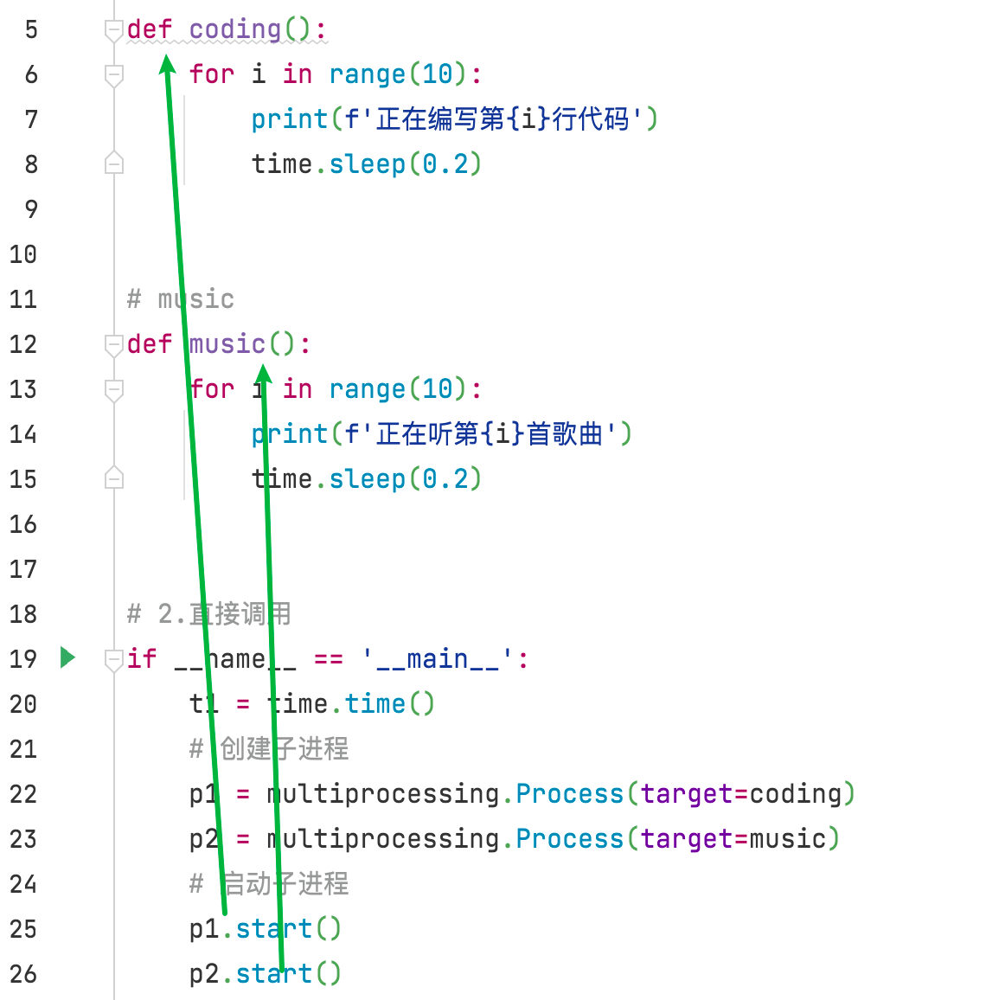
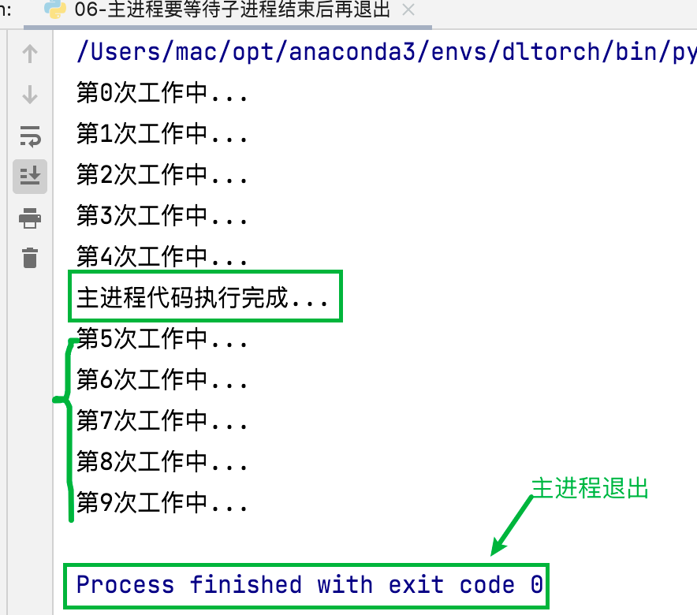

# 多任务编程-课堂笔记

## 1 多任务介绍

**学习目标**

1. 了解多任务是什么；
2. 能够知道多任务的执行方式。

---

### 1.1 思考

网盘下载资料是为什么要多个文件同时下载？


**利用现学知识能够让两个函数或者方法同时执行吗?**  同时执行！

多任务的最大好处是**充分利用CPU资源，提高程序的执行效率**。

例如，为便于了解多任务能提高程序的执行效率，试着采用单任务、多任务方式去炒菜。   


### 1.2 [重点]多任务的概念

多任务是指在**同一时间内**执行**多个任务**

例如: 现在电脑安装的操作系统都是多任务操作系统，可以同时运行着多个软件。

**多任务效果图:**


### 1.3  [了解]多任务的执行方式

- 并发：在一段时间内交替去执行多个任务
- 并行：在一段时间内真正的同时一起执行多个任务

#### 并发

对于单核cpu处理多任务,操作系统轮流让各个任务交替执行太快了，假如:软件1执行0.01秒，切换到软件2，软件2执行0.01秒，再切换到软件3，执行0.01秒……【切换时间太快了，肉眼看不出】


这样反复执行下去 , 实际上每个软件都是交替执行的 . 但是，由于CPU的执行速度实在是太快了，表面上我们感觉就像这些软件都在同时执行一样 . 这里需要注意单核cpu是并发的执行多任务的。


#### 并行

对于多核cpu处理多任务，操作系统会给cpu的每个内核安排一个执行的任务，多个内核是真正的一起同时执行多个任务。这里需要注意多核cpu是并行的执行多任务，始终有多个任务一起执行。


## 2  进程

### 2.1 [了解]进程的基本概念

**学习目标**

1. 能够知道进程的作用；
2. 能够使用多进程完成多任务；

#### 进程的介绍

在Python程序中，想要实现多任务可以使用进程(应用程序、任务)来完成，进程是实现多任务的一种方式。

#### 进程的概念

一个正在运行的程序或者软件就是一个进程【运行在操作系统】

**它是操作系统进行资源分配的基本单位**，也就是说每启动一个进程，操作系统都会给其分配一定的运行资源(内存资源)保证进程的运行。


#### 进程的作用


思考：

   图中是一个非常简单的程序 , 一旦运行hello.py这个程序 , 按照代码的

执行顺序 , func_a函数执行完毕后才能执行func_b函数 . 如果可以让func_a

和func_b同时运行 , 显然执行hello.py这个程序的效率会大大提升 .

**单进程效果图:**


**多进程效果图:**


#### 上课重要场景


### 2.2 [重点]多进程的使用

**学习目标：**

1.知道使用多进程完成多任务步骤

2.能够编程实现多进程完成多任务

3.知道进程任务的传参方式并实现

#### 导入进程包

#### Process进程类的说明

1. 导入进程包
             import multiprocessing
2. 通过进程类创建进程对象 
             进程对象 = multiprocessing.Process() 
3. 启动进程执行任务
             进程对象.start()

**Process([group [, target [, name [, args [, kwargs]]]]])**==

- group：指定进程组，目前只能使用None
- target：执行的目标任务名  注意：传递值是函数名(引用地址值)   work()       target = work 【不能加()】
- name：进程名字    A: 可以自定义进程名;   B:若使用默认的进程名，Process - 1   [1-N]
- args：以元组方式给执行任务传参      args = (xx,xxx,)
- kwargs：以字典方式给执行任务传参   'kwargs = {key1:xxx, key2:xxx}'

**Process创建的实例对象的常用方法:**

- start()：启动子进程实例（创建子进程）   让任务执行起来  [发动机]
- join()：等待子进程执行结束 

**Process创建的实例对象的常用属性:**

name：当前进程的别名，默认为Process-N，N为从1开始递增的整数

#### 多进程完成多任务的代码

例如，使用多进程来模拟一边编写代码，一边听音乐功能实现。

单任务:

```python
import time
# 1.定义好函数
# codeing
def coding():
    for i in range(10):
        print(f'正在编写第{i}行代码')
        time.sleep(0.2)


# music
def music():
    for i in range(10):
        print(f'正在听第{i}首歌曲')
        time.sleep(0.2)


# 2.直接调用
if __name__ == '__main__':
    t1 = time.time()
    coding()
    music()
    t2 = time.time()
    print(t2-t1)
```


- 多任务

```python
import time
import multiprocessing
# 1.定义好函数
# codeing
def coding():
    for i in range(10):
        print(f'正在编写第{i}行代码')
        time.sleep(0.2)


# music
def music():
    for i in range(10):
        print(f'正在听第{i}首歌曲')
        time.sleep(0.2)


# 2.直接调用
if __name__ == '__main__':
    t1 = time.time()
    # 创建子进程
    p1 = multiprocessing.Process(target=coding)
    p2 = multiprocessing.Process(target=music)
    # 启动子进程
    p1.start()
    p2.start()
    p1.join()
    p2.join()
    t2 = time.time()
    print(t2-t1)
```





- 执行顺序是无序的...


#### 进程执行带有参数的任务的

前面我们使用进程执行的任务是没有参数的，假如我们使用进程执行的任务带有参数，如何给函数传参呢?

Process类执行任务并给任务传参数有两种方式:

- args 表示以元组的方式给执行任务传参
- kwargs 表示以字典方式给执行任务传参

例如：使用多进程来模拟小明一边编写num行代码，一边听count首音乐功能实现

```python
import time
import multiprocessing
# 1.定义好函数
# codeing
def coding(name,num):
    for i in range(num):
        print(f'{name}正在编写第{i}行代码')
        time.sleep(0.2)


# music
def music(name,count):
    for i in range(count):
        print(f'{name}正在听第{i}首歌曲')
        time.sleep(0.2)


# 2.多进程执行
if __name__ == '__main__':
    # 创建子进程
    # p1=multiprocessing.Process(target=coding,args=('小名',3))
    # p2=multiprocessing.Process(target=music,args=('小名',5))
    p1=multiprocessing.Process(target=coding,kwargs={'name':"小名",'num':3})
    p2=multiprocessing.Process(target=music,kwargs={'count':3,'name':"小名"})
    # 启动子进程
    p1.start()
    p2.start()

```


###  2.3 [重点]获取进程编号

**学习目标：**

1.知道进程编号的作用

2.能够获取进程编号

#### 获取进程编号的目的

**获取进程编号的目的是验证主进程和子进程的关系，可以得知子进程是由那个主进程创建出来的。**

获取进程编号的两种操作

- 获取当前进程编号
- 获取当前父进程编号

#### 获取当前进程编号

**os.getpid()** 表示获取当前进程编号

#### 获取当前父进程编号

**os.getppid()** 表示获取当前父进程编号  

```python
import time
import multiprocessing
import os
# 1.定义好函数
# codeing
def coding():
    for i in range(3):
        print(f'正在编写第{i}行代码')
        time.sleep(0.2)
    print(f'coding进程编号{os.getpid()}')
    print(f'coding父进程编号{os.getppid()}')


# music
def music():
    for i in range(3):
        print(f'正在听第{i}首歌曲')
        time.sleep(0.2)
    print(f'music进程编号{os.getpid()}')
    print(f'music父进程编号{os.getppid()}')


# 2.直接调用
if __name__ == '__main__':
    t1 = time.time()
    print(f'主进程id:{os.getpid()}')
    # 创建子进程
    p1 = multiprocessing.Process(target=coding)
    p2 = multiprocessing.Process(target=music)
    # 启动子进程
    p1.start()
    p2.start()
    p1.join()
    p2.join()
    t2 = time.time()
    print(t2-t1)
    os.kill(os.getpid(),9)
```

###  2.4 [重点]进程的注意点

**学习目标**

1.知道并能够说出进程的注意点

#### 进程的注意点介绍

1. 进程之间不共享全局变量    喂两个鱼缸中的金鱼，互不影响!
2. 主进程会等待所有的子进程执行结束再结束

#### 进程之间不共享全局变量

例如，在不同进程中修改列表my_list[]并新增元素，试着在各个进程中观察列表的最终结果。

```python
import multiprocessing
import time

my_list = []

# 1.定义任务
def write_data():
    for i in range(3):
        my_list.append(i)
    print(f'写数据后的{my_list}')

def read_data():
    print(f'读的结果{my_list}')

# 2.创建进程
if __name__ == '__main__':
    p1 = multiprocessing.Process(target=write_data)
    p2 = multiprocessing.Process(target=read_data)
    p1.start()
    time.sleep(1)
    p1.join()
    p2.start()
    print(f'主进程中的{my_list}')
```


#### 主进程会等待所有的子进程执行结束再结束

假如我们现在创建一个子进程，子进程执行完大概需要2秒钟，现在让主进程执行1秒钟就退出程序。

```python
import multiprocessing
import time

# 1.定义任务
def work():
    for i in range(10):
        print(f'第{i}次工作中...')
        time.sleep(0.2)


# 2.创建进程
if __name__ == '__main__':
    p = multiprocessing.Process(target=work)
    p.start()
    time.sleep(1)
    print('主进程代码执行完成...')
```



主进程代码执行完成子进程也结束，设置守护进程。


###  2.5 内容总结

多任务: 

- 同一时间多个同时执行
- 并发: cpu<任务数 交替
- 并行:cpu>任务数  同时

- 多进程 多线程

进程:

- 操作系统进行资源分配和调度的基本单位

- 步骤:

  - 导入工具包

    ```properties
    import multiProcessing
    ```

  - 创建子进程

  ```properties
  multiProcessing.Process(target,args,kwargs)
  ```

  

  - 启动进程

  ```properties
  p.start()
  ```

  ```properties
  p.join() :阻塞主进程
  ```

  

- 获取进程编号

  ```properties
  os.getpid():获取当前进程编号
  os.getppid():获取父进程编号
  ```


- 注意点:
  - 进程间不共享全局变量
  - 主进程等待子进程结束后再结束
    - 守护进程
    - 手动结束子进程(不建议使用..)


##  3 线程

###  3.1 [了解]线程的基本概念

**学习目标**：

1.知道线程是什么？

2.知道线程的作用

#### 线程的介绍

在Python中，想要实现多任务除了使用进程，还可以使用线程来完成，线程是实现多任务的另外一种方式。

#### 线程的概念

线程是进程中执行代码的一个分支执行路径！，每个执行分支（线程）要想工作执行代码需要cpu进行调度 ，也就是说线程是cpu调度的基本单位，每个进程至少都有一个线程，而这个线程就是我们通常说的主线程。

#### 线程的作用


思考：

   图中是一个非常简单的程序 , 一旦运行hello.py这个程序 , 按照代码的

执行顺序 , func_a函数执行完毕后才能执行func_b函数 . 如果可以让func_a

和func_b同时运行 , 显然执行hello.py这个程序的效率会大大提升 .

**多线程效果图:**


### 3.2 [重点]多线程的使用

**学习目标：**

1.知道使用多线程完成多任务步骤

2.能够编程实现多线程完成多任务

3.知道线程任务的传参方式并实现

#### 线程创建的步骤

-  导入线程模块

  import threading

-  通过线程类创建线程对象

  线程对象 = threading.Thread(target=任务名) 

-  启动线程执行任务

  线程对象.start()


#### 线程类Thread参数说明

Thread([group [, target [, name [, args [, kwargs]]]]])   # Thread/线程

- group: 线程组，目前只能使用None
- target: 执行的目标任务名   target = 函数名
- args: 以元组的方式给执行任务传参
- kwargs: 以字典方式给执行任务传参
- name: 线程名，一般不用设置

#### 多线程完成多任务的代码

例如，使用多线程来模拟一边写代码，一边听音乐的功能。

```python
import threading
import time

# 1.定义函数
def coding():
    for i in range(10):
        print(f'正在编写第{i}行代码')
        time.sleep(0.2)

def music():
    for i in range(10):
        print(f'正在听第{i}行歌曲')
        time.sleep(0.2)


# 2.创建子线程
if __name__ == '__main__':
    t_start = time.time()
    t1 =threading.Thread(target=coding)
    t2 =threading.Thread(target=music)
    t1.start()
    t2.start()
    t1.join()
    t2.join()
    t_stop = time.time()
    print(t_stop-t_start)
```


#### [重点]线程执行带有参数的任务

前面我们使用线程执行的任务是没有参数的，假如我们使用线程执行的任务带有参数，如何给函数传参呢?

Thread类执行任务并给任务传参数有两种方式:

- args 表示以元组的方式给执行任务传参
- kwargs 表示以字典方式给执行任务传参

例如：使用多线程来模拟小明一边编写num行代码，一边听count首音乐功能实现。

```
import threading
import time


# 1.定义函数
def coding(name, num):
    for i in range(num):
        print(f'{name}正在编写第{i}行代码')
        time.sleep(0.2)


def music(name, count):
    for i in range(count):
        print(f'{name}正在听第{i}行歌曲')
        time.sleep(0.2)


# 2.创建子线程
if __name__ == '__main__':
    t_start = time.time()
    # t1 =threading.Thread(target=coding,args=('小明',3))
    # t2 =threading.Thread(target=music,args=('小明',3))
    t1 = threading.Thread(target=coding, kwargs={'name': '小明', 'num': 3})
    t2 = threading.Thread(target=music, kwargs={'count': 3, 'name': '小明'})
    t1.start()
    t2.start()
    t1.join()
    t2.join()
    t_stop = time.time()
    print(t_stop - t_start)

```


### 3.3  [重点]线程的注意点

**学习目标：**

1.知道线程的执行顺序

2.知道线程间能够共享全局变量

3.知道多线程的数据安全问题

#### 线程的注意点介绍

1. 线程之间执行是无序的
2. 主线程会等待所有的子线程执行结束再结束
3. 线程之间共享全局变量
4. 线程之间共享全局变量数据出现错误问题

#### 线程之间执行是无序的

线程之间执行是无序的，它是由cpu调度决定的 ，cpu调度哪个线程，哪个线程就执行，没有调度的线程是不能执行的。

例如：创建多个线程，多次运行，观察各次线程的执行顺序

```python
import threading
import time

# 1.定义任务

def get_info():
    time.sleep(0.2)
    thr =threading.current_thread()
    print(thr)


# 2.创建子线程
if __name__ == '__main__':
    for i in range(10):
        sub_thread = threading.Thread(target=get_info)
        sub_thread.start()
```


#### 主线程会等待所有的子线程执行结束再结束

假如创建一个子线程，这个子线程执行完大概需要2.5秒钟，现在让主线程执行1秒钟就退出程序，查看一下执行结果

```python
import threading
import time

# 定义任务
def work():
    for i in range(10):
        print(f'第{i}次运行')
        time.sleep(0.2)

# 创建线程
if __name__ == '__main__':
    t1=threading.Thread(target=work)
    t1.start()
    time.sleep(1)
    print('主线程已执行完成')
```


```properties
说明:主线程会等待所有的子线程执行结束再结束

假如我们就让主线程执行1秒钟，子线程就销毁不再执行，那怎么办呢?

我们可以设置**守护主线程**


**守护主线程****:**

   守护主线程就是主线程退出子线程销毁不再执行

**设置守护主线程有两种方式：**

  threading.Thread(target=show_info, daemon=True)

  线程对象.setDaemon(True)
```

示例代码：

```python
import threading
import time

# 定义任务
def work():
    for i in range(10):
        print(f'第{i}次运行')
        time.sleep(0.2)

# 创建线程
if __name__ == '__main__':
    # t1=threading.Thread(target=work,daemon=True)
    t1 = threading.Thread(target=work)
    t1.setDaemon(True)
    t1.start()
    time.sleep(1)
    print('主线程已执行完成')
```


#### 线程之间共享全局变量

定义一个列表类型的全局变量，创建两个子线程分别执行向全局变量添加数据的任务和向全局变量读取数据的任务，查看线程之间是否共享全局变量数据

```python
import threading
import time

# 全局变量
my_list= []

# 子任务

def write_data():
    for i in range(3):
        my_list.append(i)
    print(f'写数据的{my_list}')

def read_data():
    print(f'读数据的{my_list}')

# 创建线程
if __name__ == '__main__':
    t1 = threading.Thread(target=write_data)
    t2 = threading.Thread(target=read_data)
    t1.start()
    time.sleep(1)
    t2.start()
    print(f'主线程中的{my_list}')
```


#### 线程之间共享全局变量数据出现错误问题

**需求:**

1. 定义两个函数，实现循环100万次，每循环一次给全局变量加1；   数据量要足够大！

2. 创建两个子线程执行对应的两个函数，查看计算后的结果。

   ```python
   import threading
   import time
   # 全局变量
   g = 0
   
   # 定义子任务
   def get_sum1():
       for i in range(1000000):
           global g
           g+=1
       print(f'sum1:{g}')
   
   def get_sum2():
       for i in range(1000000):
           global g
           g+=1
       print(f'sum2:{g}')
   
   
   if __name__ == '__main__':
       t1=threading.Thread(target=get_sum1)
       t2=threading.Thread(target=get_sum2)
       t1.start()
       t2.start()
   ```

   


## 4  互斥锁

### 4.1 互斥锁的作用


### 4.2  互斥锁的使用


例如：定义两个函数，实现循环100万次，每循环一次给全局变量加1，创建两个子线程执行对应的两个函数，添加互斥锁后，查看计算后的结果


### 4.3  死锁


例如：定义两个函数，实现循环100万次，每循环一次给全局变量加1，创建两个子线程执行对应的两个函数，死锁后，查看计算后的结果


##  5 [重点]进程和线程的区别

###  进程和线程的对比的三个方面

1. 关系对比
2. 区别对比
3. 优缺点对比

### 关系对比

- 线程是依附在进程里面的，没有进程就没有线程。

- 一个进程默认提供一条线程，进程可以创建多个线程。


### 区别对比

- 进程之间不共享全局变量

- 线程之间共享全局变量，但是要注意资源竞争的问题，解决办法: 互斥锁或者线程同步

- 创建进程的资源开销要比创建线程的资源开销要大

- 进程是操作系统资源分配的基本单位，线程是CPU调度的基本单位

- 线程不能够独立执行，必须依存在进程中

- 多进程开发比单进程多线程开发稳定性要强

###  优缺点对比

- 进程优缺点:
  - 优点：可以用多核
  - 缺点：资源开销大
- 线程优缺点:
  - 优点：资源开销小
  - 缺点：不能使用多核


## 6 今日总结

多任务:

- 多个任务同一时刻一起执行
- 并发:  多个任务交替执行     cpu<任务数
- 并行: 多个任务同时执行    cpu>任务数
- 串行:一个个任务依次执行

多进程:

- 进程:操作系统进行资源分配和调度的基本单位,  一个正在执行的程序

- 多进程完成多任务的流程:

  ```properties
  1:导入工具包
  	import multiprocessing
  2:创建进程
  	p = multiprocessing.Process()
  3:启动进程
  	p.start()
  ```

- 获取进程编号

```properties
os.getpid()
os.getppid()
```

- 进程的注意点
  - 进程之间执行无序的,有操作系统
  - 进程之间不共享全局变量
  - 主进程要等待子进程结束后再结束
    - 设置守护进程
    - 手动结束子进程

多线程:

- 线程: CPU调度的基本单位
- 步骤:

```properties
1:导入工具包
import threading

2:创建线程
t = threading.Thread()

3:启动线程
t.start()
```

- 注意点

  - 线程之间也是无序的,CPU 
  - 线程要等待子线程结束后再结束
    - 守护线程
  - 线程共享全局变量
    - 数据安全->互斥锁

- 互斥锁

  - 步骤

  ```
  1:创建锁
  lock=threading.Lock()
  2:上锁
  lock.acquire()
  3:释放锁
  lock.release()
  ```

  - 死锁
    - 未在合适的位置释放锁,发生死锁


在python使用多进程完成多任务要更稳定一些


## 7 重要场景

### Python 子进程为什么加 if __name__ == 'main'

python每次创建子进程都会先把主进程中的代码当成模块加载一遍

创建一次子进程就相当于执行一次主进程,创建两个相当于执行两次子进程,

所以下面的代码有3个bar


所以要把进程写到 if __name__下面,模块加载的时候不会执行if __name__下面的代码,如果不写到下面,当模块加载的时候在创建子进程,在加载在创建会陷入死循环


### 操作系统加载程序基本过程


### 两个线程共同操作一个资源


