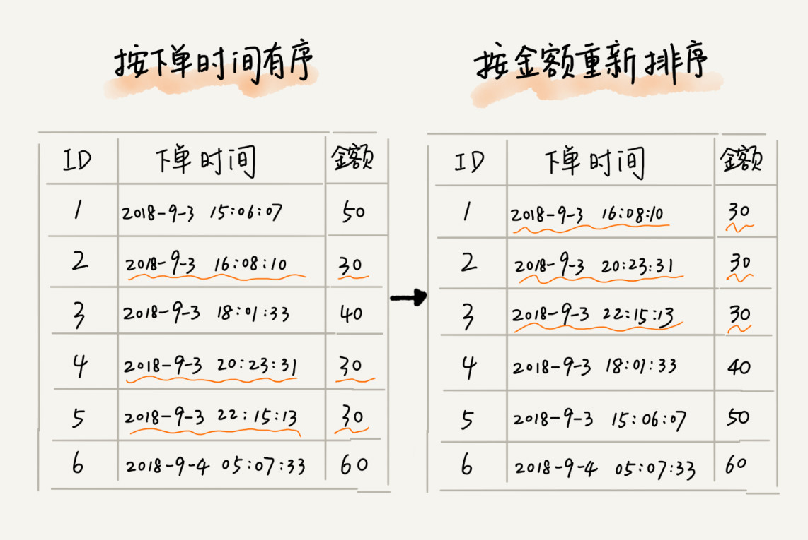

# 01-算法的稳定性


算法的稳定性：相同的元素在排序之后相对位置不会发生改变。例如：根据下单时间排序之后，再根据金额排序，我们希望下单时间的相对位置不发生改变。


不稳定的排序算法：选择、快排

稳定的排序算法：冒泡、插入


先按照金额排序再按照时间排序。任务需求是需要稳定的算法，实现业务时要选择稳定的算法




多标签：


# 02-冒泡排序


遍历所有的元素序列，以此比较相邻的两个元素，如果满足条件则交换两个元素的位置，重复上面的操作直到所有的元素有序。

注意：冒泡每遍历一次，会确定待排序序列中的极大值、极小值的合适位置，总共需要遍历元素 N-1 次。


# 03-冒泡排序代码实现


```python
def bubble_sort(alist):
    """冒泡排序"""

    # 数列的长度
    n = len(alist)

    # 控制比较轮数
    for j in range(0, n-1):
        # 计数
        count = 0
        # 控制每一轮的比较次数
        for i in range(0,n-j-1):
            # 比较相邻的两个数字 , 不符合要求交换位置
            if alist[i] > alist[i+1]:
                alist[i], alist[i+1] = alist[i+1], alist[i]
                count+=1
        # 如果遍历一遍发现没有数字交换,退出循环,证明数列是有序的
        if count == 0:
            break

if __name__ == '__main__':
    alist = [5, 3, 4, 7, 2]
    bubble_sort(alist)
    print(alist)
```

**输出结果:**

```
 [2, 3, 4, 5, 7]
```


# 04-冒泡排序的算法稳定性


冒泡排序最优时间复杂度：O(n)，最差时间复杂度：O(n2)，冒泡排序是稳定排序算法。


# 05-选择排序


冒泡排序是两两比较，只要满足交换条件则交换两个数据。选择排序则是遍历完整个序列之后，再进行交换。


# 06-选择排序代码实现


```
 def select_sort(alist):
     """选择排序"""
 
     # 列表的长度
     n = len(alist)
 
     # 控制比较轮数
     for j in range(0, n - 1):
         # 假定的最小值的下标
         min_index = j
 
         # 控制比较次数
         for i in range(j + 1, n):
             # 进行比较获得最小值
             if alist[i] < alist[min_index]:
                 min_index = i
 
         # 如果假定的最小值下标发生变化了,那么我们就进行交换
         if min_index != j:
             alist[j], alist[min_index] = alist[min_index], alist[j]
 
 
 if __name__ == '__main__':
     alist = [1, 3, 4, 10, 0, 1000, 88]
     select_sort(alist)
     print(alist)
```


**输出结果：**

```
 [0, 1, 3, 4, 10, 88, 1000]
```


注意：由于遍历一次整个序列，并没有比 min_index 更小的元素，所以此时可以避免交换。


# 07-选择排序的算法稳定性


选择排序最优时间复杂度：O(n2)，最差时间复杂度：O(n2)，选择排序是非稳定排序算法。


# 08-插入排序


插入排序的基本思想是，遍历无序的序列，将每一个元素插入到有序序列中。参考PPT.


# 09-插入排序代码实现


```python
def insert_sort(alist):
    """插入排序"""

    # 列表的长度
    n = len(alist)

    # 控制轮数
    for j in range(1, n):
        # [j,j-1,j-2, ..., 1]
        # 找到合适的位置安放我们的无序的数据
        for i in range(j, 0, -1):
            if alist[i] < alist[i-1]:
                alist[i], alist[i-1] = alist[i-1], alist[i]
            else:
                break

if __name__ == '__main__':
    alist = [1,100,99,20,5,1000]
    insert_sort(alist)
    print(alist)
```


# 10-插入排序算法稳定性


 插入排序最优时间复杂度：O(n)，最差时间复杂度：O(n<sup>2</sup>)，插入排序是稳定性排序算法。


# 11-快速排序


# 12-快速排序代码实现


```python
def quick_sort(alist, start, end):
    """快速排序"""

    # 递归的结束条件
    if start >= end:
        return

    # 界限值
    mid = alist[start]
    # 左右游标
    left = start
    right = end


    while left < right:

        # 从右边开始找寻小于mid的值 归类到左边
        while alist[right] >= mid and left < right:
            right -= 1
        alist[left] = alist[right]

        # 从左边开始找寻大于mid的值 归类到右边
        while alist[left] < mid and left < right:
            left += 1
        alist[right] = alist[left]

    # 循环一旦结束了 证明找到了mid应该在的位置
    alist[left] = mid

    # 递归操作
    quick_sort(alist, start, left-1)
    quick_sort(alist, right+1, end)


if __name__ == '__main__':
    alist = [1,2,100,50,1000,0,1,1]
    quick_sort(alist, 0, len(alist)-1)
    print(alist)
```


# 13-快速排序算法稳定性


快速排序最优时间复杂度：O(nlogN)，最差时间复杂度：O(n<sup>2</sup>)，快速排序是非稳定排序算法。


1. 需要递归 N 次才能只剩下一个元素
2. 假设每次比较 n 个元素，则O(n<sup>2</sup>)为最差时间复杂度


1. log<sub>2</sub>n 表示要递归多少次到只剩下一个元素。
2. 每次递归假设要比较 n 个元素，则快速排序最优时间复杂度为：O(nlogN)


# 14-二分查找


原理：将数组分为三部分，依次是中值前，中值，中值后

将要查找的值与中值进行比较，若小于中值则在中值前面找，若大于中值则在中值后面找，等于中值时直接返回


# 15-二分查找法代码实现-递归版


```python
def binary_search(alist, item):
    """二分查找"""

    # 数列的长度
    n = len(alist)
    # 递归的结束条件
    if n == 0:
        return False

    # 中间值下标
    mid = n//2

    if item == alist[mid]:
        return True
    elif item < alist[mid]:
        return binary_search(alist[0:mid], item)
    elif item > alist[mid]:
        return binary_search(alist[mid+1:], item)


if __name__ == '__main__':
    alist = [1,2,3,4,5]
    print(binary_search(alist, 1))
    print(binary_search(alist, 100))


```


# 16-二分查找-非递归版


```python
def binary_search(alist, item):
    """二分查找"""

    # 设置起始位置 获取中间值
    start = 0
    end = len(alist) - 1

    while start <= end:
        # 获取中间值
        mid = (start + end) // 2

        if item == alist[mid]:
            return True
        elif item < alist[mid]:
            end = mid - 1
        elif item > alist[mid]:
            start = mid + 1

    # 没有找到想要找的数字
    return False

if __name__ == '__main__':
    alist = [1,2,3,4,5]
    print(binary_search(alist, 1))
    print(binary_search(alist, 100))
```


# 17-二分查找时间复杂度


