#  01-树的基本概念


树是一种一对多关系的数据结构，主要分为：

1. 多叉树
   1. 每个结点有0、或者多个子节点
   2. 没有父节点的结点成为根节点
   3. 每一个非根节点有且只有一个父节点
   4. 除了根节点外，每个子节点可以分为多个互不相交的子树
2. 二叉树
   1. 每个结点有0、1、2 个子节点
   2. 没有父节点的结点成为根节点
   3. 每一个非根节点有且只有一个父节点
   4. 除了根节点外，每个子节点可以分为多个互不相交的子树


# 02-树的相关术语


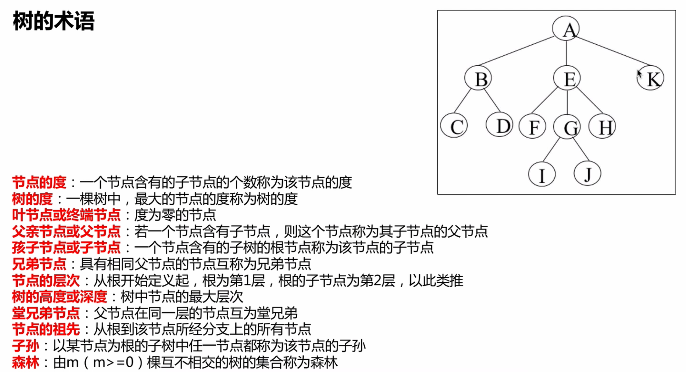


# 03-二叉树的种类


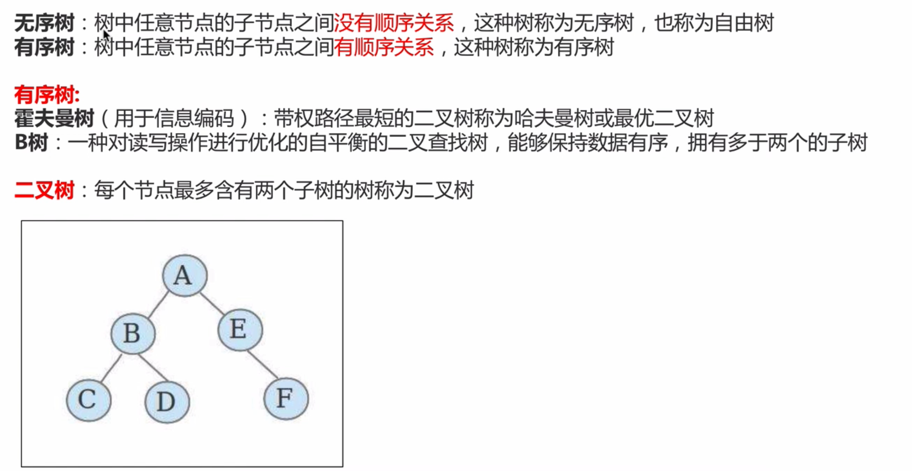


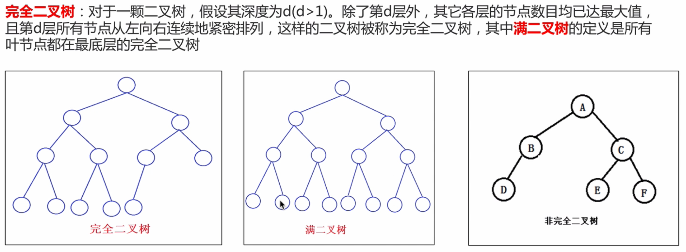


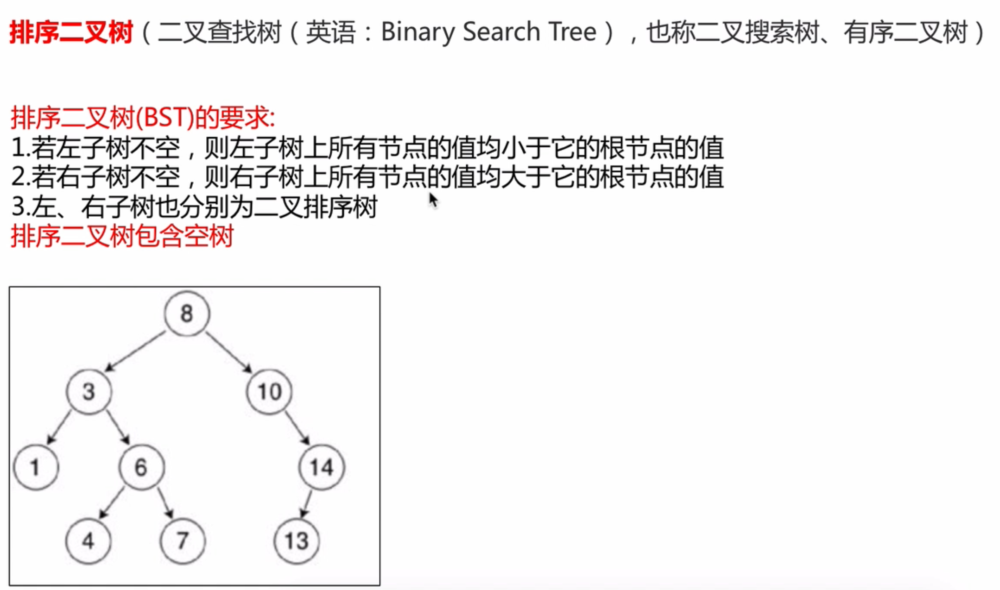


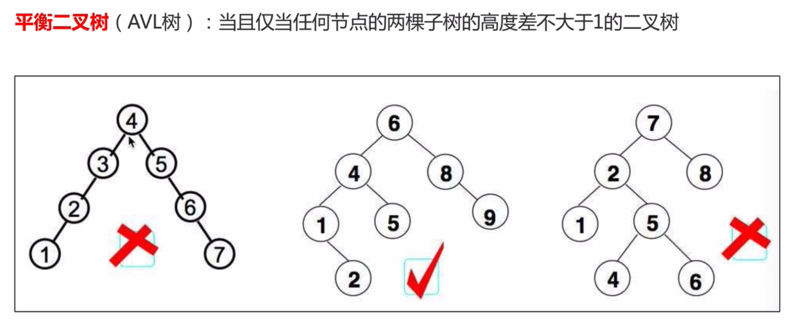


# 04-二叉树的存储


顺序存储、链式存储。树在存储的时候，要存储什么？

1. 值
2. 结点关系


如果树是完全二叉树、满二叉树，可以使用顺序存储。大多数构建出的树都不是完全、满二叉树，所以使用链式存储比较多。

```python
class TreeNode:
  
  def __init__(self):
    self.item = value
    self.parent = 父亲
    self.lchild = 左边树
    self.rchild = 右边树
```


对于树而言，只要拿到根节点，就相当于拿到整棵树。


.

完全二叉树适合顺序结构存储，但其插入删除元素效率较差。


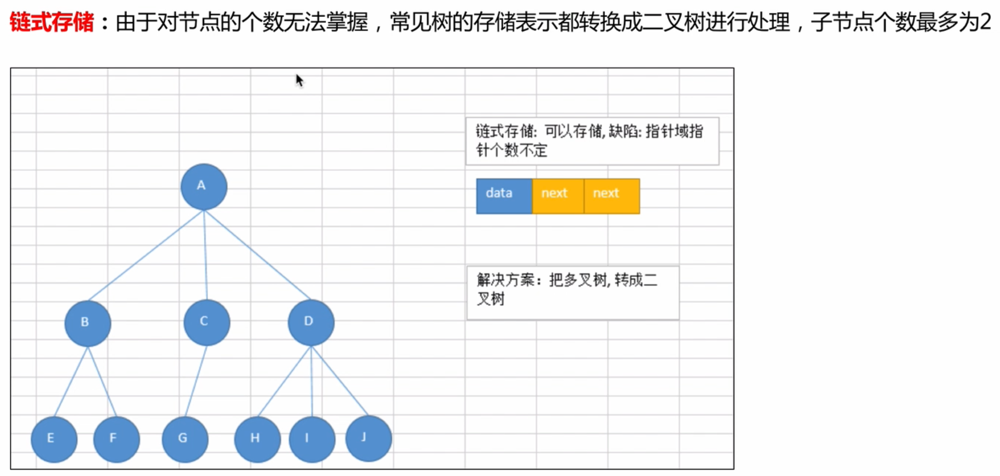

大多数的二叉树都是使用链式结构存储。


# 05-树的应用场景_数据库索引


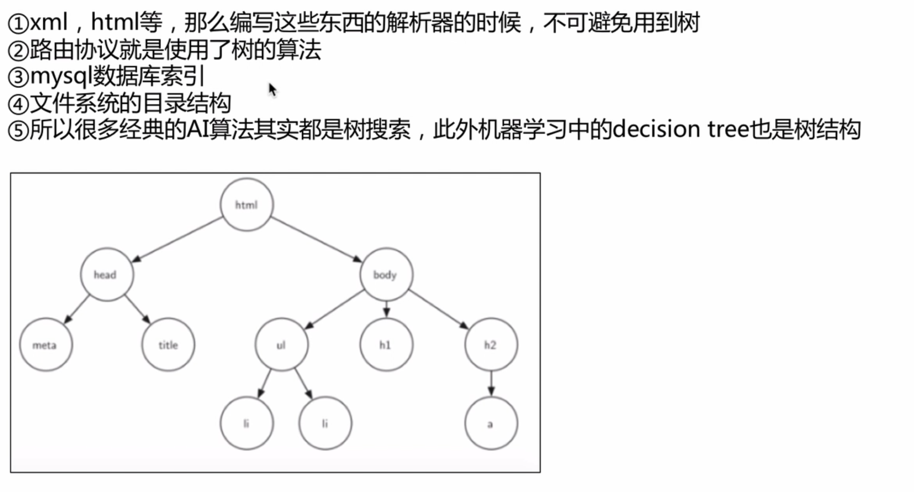


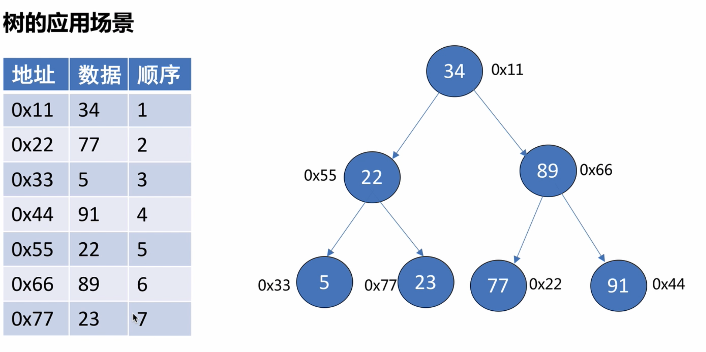


# 06-二叉树的概念和性质


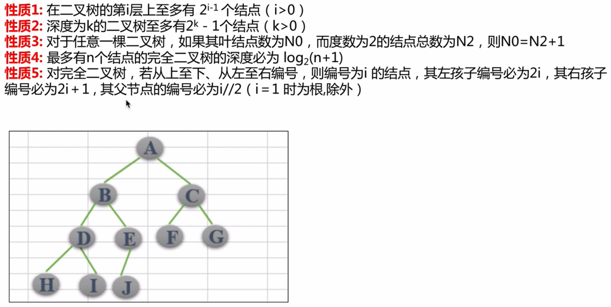


# 07-广度优先遍历


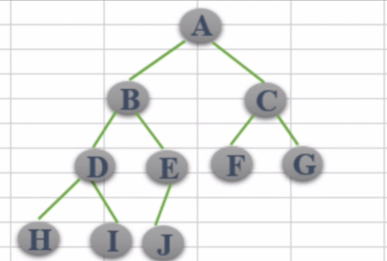


```python
class Node(object):
    """节点类"""
    def __init__(self, item):
        self.item = item
        self.lchild = None
        self.rchild = None


class BinaryTree(object):
    """二叉树"""
    def __init__(self, node=None):
        self.root = node

    def add(self, item):
        """添加节点"""
        pass

    def bradh_travel(self):
        """广度优先遍历"""
        pass
```


1. 深度优先遍历：沿着某一个路径遍历到叶子结点，再从另外一个路径遍历，直到遍历完所有的结点
2. 广度优先遍历：按照层次进行遍历


# 08-添加节点思路分析


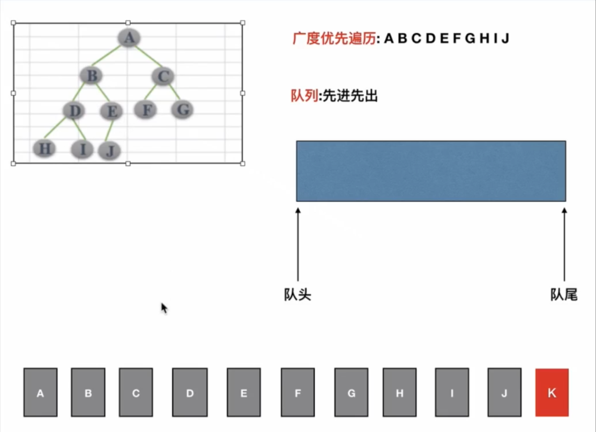


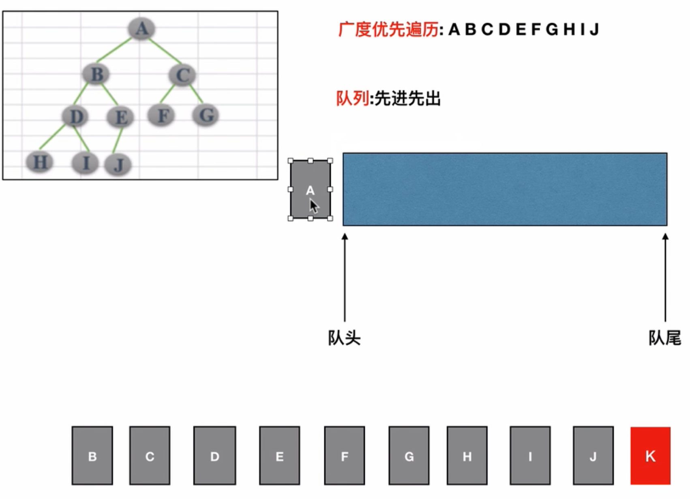


1. 初始操作：初始化队列、将根节点入队、创建新结点
2. 重复执行：
   1. 获得并弹出队头元素
      1. 如果当前结点的左右子结点不为空，则将其左右子节点入队
      2. 如果当前结点的左右子节点为空，则将新结点挂到为空的左子结点、或者右子节点


# 09-添加节点代码实现


# 10-遍历方法的实现


```python
class Node(object):
    """节点类"""
    def  __init__(self, item):
        self.item = item
        self.lchild = None
        self.rchild = None


class BinaryTree(object):
    """完全二叉树"""
    def __init__(self, node=None):
        self.root = node

    def add(self, item):
        """添加节点"""
	
  			# 初始操作：初始化队列
        if self.root == None:
            self.root = Node(item)
            return

        # 队列
        queue = []
        # 根节点入队
        queue.append(self.root)
				
        while True:
            # 从头部取出数据
            node = queue.pop(0)
            # 判断左节点是否为空
            if node.lchild == None:
                node.lchild = Node(item)
                return
            else:
                queue.append(node.lchild)

            if node.rchild == None:
                node.rchild = Node(item)
                return
            else:
                queue.append(node.rchild)


if __name__ == '__main__':
    tree = BinaryTree()
    tree.add("A")
    tree.add("B")
    tree.add("C")
    tree.add("D")
    tree.add("E")
    tree.add("F")
    tree.add("G")
    tree.add("H")
    tree.add("I")
    tree.breadh_travel()
```


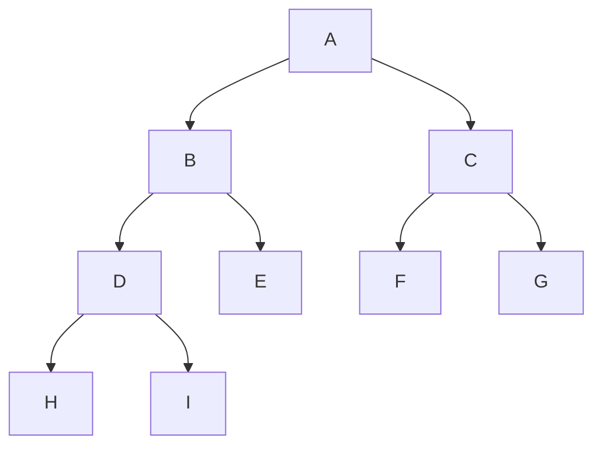


# 11-二叉树的三种深度优先遍历

先序遍历：先访问根节点、再访问左子树、最后访问右子树

中序遍历：先访问左子树、再访问根节点、最后访问右子树

后序遍历：先访问左子树、再访问右子树、最后访问根节点


1. 无论那种遍历方式，都是先访问左子树、再访问右子树
2. 碰到根节点就输出、碰到左子树、右子树就递归     注意：左子树右子树是一棵树所以递归；根节点是一个节点所以打印输出


# 12-二叉树的三种深度优先遍历代码实现


```python
class Node(object):
    """节点类"""
    def  __init__(self, item):
        self.item = item
        self.lchild = None
        self.rchild = None


class BinaryTree(object):
    """完全二叉树"""
    def __init__(self, node=None):
        self.root = node

    def add(self, item):
        """添加节点"""

        if self.root == None:
            self.root = Node(item)
            return

        # 队列
        queue = []
        # 从尾部添加数据
        queue.append(self.root)

        while True:
            # 从头部取出数据
            node = queue.pop(0)
            # 判断左节点是否为空
            if node.lchild == None:
                node.lchild = Node(item)
                return
            else:
                queue.append(node.lchild)

            if node.rchild == None:
                node.rchild = Node(item)
                return
            else:
                queue.append(node.rchild)

    def breadh_travel(self):
        """广度优先遍历"""

        if self.root == None:
            return

        # 队列
        queue = []
        # 添加数据
        queue.append(self.root)

        while len(queue)>0:
            # 取出数据
            node = queue.pop(0)
            print(node.item, end="")

            # 判断左右子节点是否为空
            if node.lchild is not None:
                queue.append(node.lchild)
            if node.rchild is not None:
                queue.append(node.rchild)

    def preorder_travel(self, root):
        """先序遍历 根 左 右"""
        if root is not None:
            # 先访问根节点
            print(root.item, end="")
            # 递归再访问左子树
            self.preorder_travel(root.lchild)
            # 递归访问右子树
            self.preorder_travel(root.rchild)

    def inorder_travel(self, root):
        """中序遍历 左 根 右"""
        if root is not None:
            self.inorder_travel(root.lchild)
            print(root.item, end="")
            self.inorder_travel(root.rchild)

    def postorder_travel(self, root):
        """后序遍历 根 左 右"""
        if root is not None:
            self.postorder_travel(root.lchild)
            self.postorder_travel(root.rchild)
            print(root.item, end="")


if __name__ == '__main__':
    tree = BinaryTree()
    tree.add("0")
    tree.add("1")
    tree.add("2")
    tree.add("3")
    tree.add("4")
    tree.add("5")
    tree.add("6")
    tree.add("7")
    tree.add("8")
    tree.add("9")
    tree.preorder_travel(tree.root)
    print()
    tree.inorder_travel(tree.root)
    print()
    tree.postorder_travel(tree.root)
```


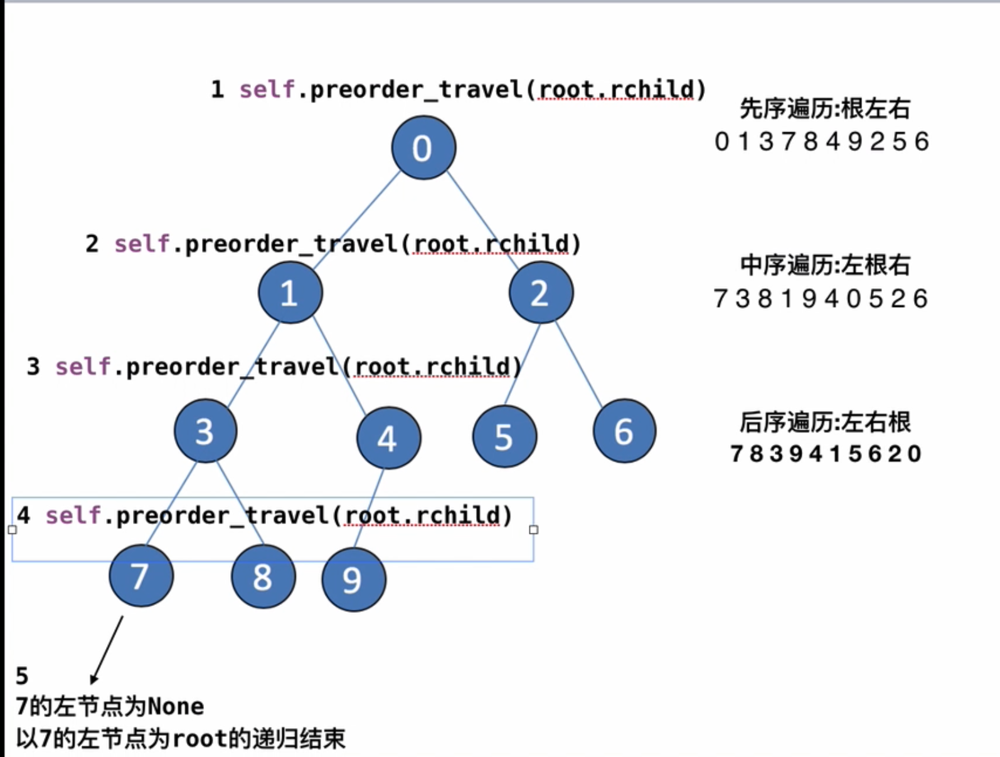


# 13-二叉树由遍历结果反推二叉树的结构


我们需要知道先序遍历结果和中序遍历结果、或者后序遍历结果和中序遍历结果才能够确定唯一一棵树。

只知道先序遍历、后序遍历结果，不能保证确定唯一一棵树。


通过先序遍历可以确定哪个元素是根节点，通过中序遍历可以知道左子树都有那些结点、右子树都有那些结点。


