## 1 Linux 系统简介

Linux创始人: 林纳斯 托瓦兹Linux 诞生于1991年，作者上大学期间开发的

Linux系统的组成如下：

- Linux系统内核   开源免费的
- 系统级应用程序  Linux发行版

Ubuntu linux/ centos   Linux发行版


## 2 VMware

虚拟机软件, 我们通过vmware来加载Linux镜像, 来学习Linux的使用

先安装VMware 再导入linux镜像


## 3 Linux的使用

需要掌握的内容

- 文件/文件夹操作
  - 查看/复制/移动/删除/修改
- Linux用户/权限 问题
- Linux常用操作
  - 常用服务开启关闭
  - 下载文件/安装软件 

### 3.1 Linux基础命令

Linx系统的目录结构

Linux只有一个顶级目录，称之为：根目录

/root/anaconda3

- Linux命令格式

  在Linux中，

  - 命令有其通用的格式：command： 命令本身
  - -options：[可选，非必填]命令的一些选项，可以通过选项控制命令的行为细节
  - parameter：[可选，非必填]命令的参数，多数用于命令的指向目标等

##### 对文件文件夹的增删改查

**ls** 展示目录下的内容

-l / -a / -lh

**cd** change directory 切换工作目录

**pwd** print word directory 打印当前工作目录

- 绝对路径/相对路径
  - **绝对路径**：以根目录为起点，描述路径的一种写法，路径描述以/开头
  - **相对路径**：以当前目录为起点，描述路径的一种写法，路径描述无需以/开头
- 特殊路径符：
  - .	表示当前目录，比如 cd ./Desktop 表示切换到当前目录下的Desktop目录内，和cd Desktop效果一致
  - ..	表示上一级目录，比如：cd ..   即可切换到上一级目录，cd ../..  切换到上二级的目录
  - ~	表示HOME目录，比如：cd ~    即可切换到HOME目录或cd ~/Desktop，切换到HOME内的Desktop目录

**mkdir**  创建一个目录

- mkdir -p 路径1/路径2
- mkdir -p itcast/ai17

文件的创建和查看 touch/cat/more

touch 创建文件

cat/more 文件路径 查看文件的内容

- cat 一次性显示所有内容
- more 可以控制翻页

复制/移动/删除文件/文件夹

cp  copy

- cp 源文件 目的地
- cp -r  复制非空白的文件夹的时候, 需要带-r的参数

mv move

- mv 源文件 要移动到的目的地路径
- 可以通过mv来改名

rm remove

- 删除文件
- -r 删除非空白的文件夹的时候, 需要带-r的参数
- -f 强制删除 在root用户下谨慎使用

**查找文件/命令**

 which命令查找

命令的程序文件语法：无需选项，只需要参数表示查找哪个命令

2. find命令用于查找指定的文件按文件名查找：支持通配符按文件大小查找

##### 对文件内容进行过滤修改

**文件内容过滤**

grep 关键词过滤

grep "关键词" 文件路径

- 会检索文件中包含关键词的行

管道符

- |  管道符前面(左边)输出会作为管道符后面(右边)命令的输入

grep 和 管道符可以配合使用

```shell
cat test.txt|grep itcast|grep itheima
```

**文件内容修改**

echo

- 使用echo命令在命令行内输出指定内容
- echo "hello itheima"
- echo  \`pwd \`

重定向符号

- \> 将左侧命令的结果，覆盖写入到符号右侧指定的文件中
- \>> 将左侧命令的结果，追加写入到符号右侧指定的文件中

tail / tail -f (了解)

- tail 文件路径  可以输出文件的末尾内容 默认显示10行
- tail -3 文件路径  指定显示末尾的3行
- tail -f 文件路径 持续监听文件末尾变化

##### vi/vim 编辑器的使用

- 三种模式 命令模式/输入模式/底行模式

  - vi/vim 文件名  → 命令模式
  - 命令模式进入到输入模式  i/a/o

  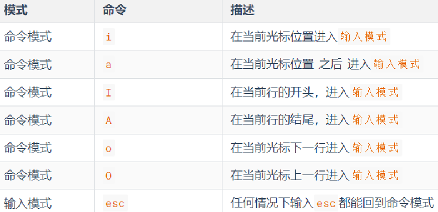

  - 在命令模式下还有其它快捷键

    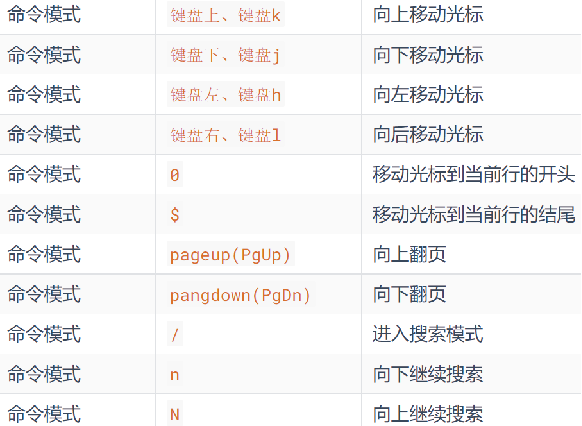

    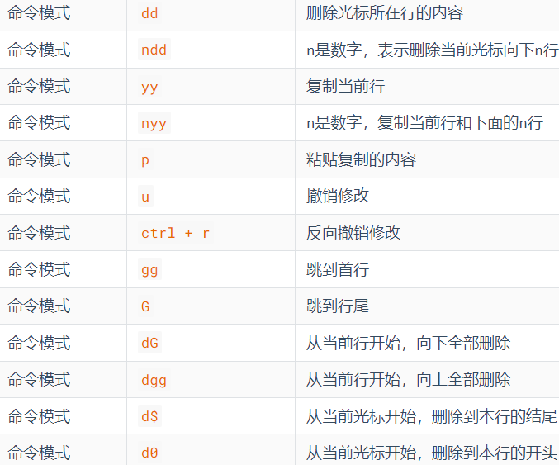

  - **底线命令模式:** 命令模式内，输入: ，即可进入底线命令模式，支持如下命令

    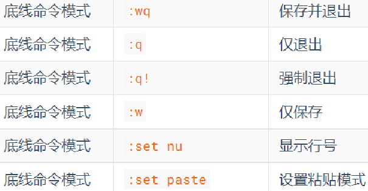

vi/vim最常见的应用场景 装完软件之后, 修改配置文件

##### linux命令的帮助和手册

- 命令 --help
- man 命令

anaconda

- python的发行版
- 把跟数据科学相关的所有的包都集成起来了, 装anaconda之后, 所有跟数据科学相关的常用的开源库都装好了

### 3.2 linux用户和权限

#### linux用户体系介绍

linux的用户分成两类

- root 超级管理员 具备所有的权限
- 普通用户 

```shell
useradd -m itheima  # 创建itheima用户
passwd itheima      # 为itheima用户指定密码(这里密码不能过于简单, 123ABCitcast)
```

- 创建了普通用户之后在/home路径下就会创建和普通用户用户名相同的文件夹

  - itcast用户 它的家目录就是 /home/itcast
  - 普通用户在自己的家目录下是有所有权限的 在其它普通用户的家目录下没有权限

- 在使用linux的时候, 生产环境下不要直接使用root用户, 可以使用普通用户, 需要用到超级管理员权限的时候做临时申请 sudo

  visudo 给普通用户添加sudo权限

  切换到root用户，执行visudo命令，会自动通过vi编辑器打开：

  /etc/sudoers在文件的最后添加：

  

  其中最后的NOPASSWD:ALL 表示使用sudo命令，无需输入密码最后通过 wq 保存

#### 查看文件权限

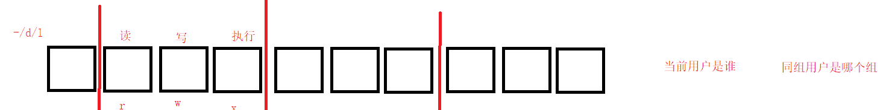

#### chmod 修改文件权限

我们可以使用chmod命令，修改文件、文件夹的权限信息。

> 注意，只有文件、文件夹的所属用户或root用户可以修改。

语法：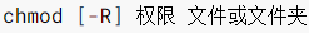

选项：-R，对文件夹内的全部内容应用同样的操作

示例：chmod u=rwx,g=rx,o=x hello.txt 

- 将文件权限修改为：rwxr-x--x其中：
  - u表示user所属用户权限，g表示group组权限，o表示other其它用户权限

chmod -R u=rwx,g=rx,o=x test，

- 将文件夹test以及文件夹内全部内容权限设置为：rwxr-x--x

除此之外，还有快捷写法：chmod 751 hello.txt

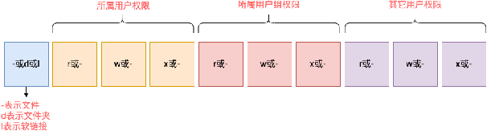

#### chown 修改文件所有者

- 普通用户没有权限修改文件的所有者/所有的用户组

- 想通过普通用户修改, 需要添加sudo权限

  - visudo  itheima ALL=(ALL)       NOPASSWD: ALL

  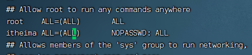

在itheima这个用户的家目录下创建一个test1.txt文件

- 此时 test1.txt 用户是itheima 用户组 itheima

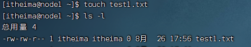

通过chown 修改test1.txt 文件的所有者

- 需要注意 当前用户itheima 不能执行chown 没有权限, 通过sudo 临时获取超级管理员权限, 修改所有者

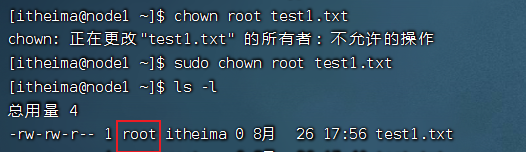

- 虽然所有者从itheima 改成了root , 但是itheima对于当前test1.txt 属于同组用户, 权限看中间的 rw-
  - 此时依然可以查看并修改这个test1.txt

通过chown 修改test1.txt 文件的所属的用户组

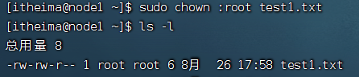

此时 itheima 属于其它用户 只有读的权限,没有其它权限


### 4 内容小结

文件文件夹的增删改查

文件内容过滤/修改

Linux用户/用户权限
