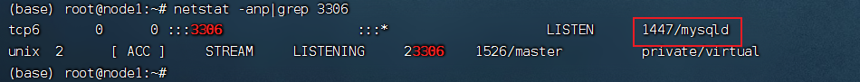
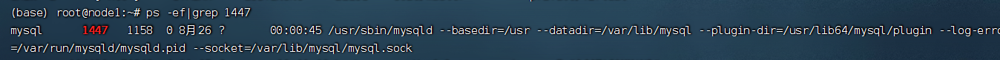
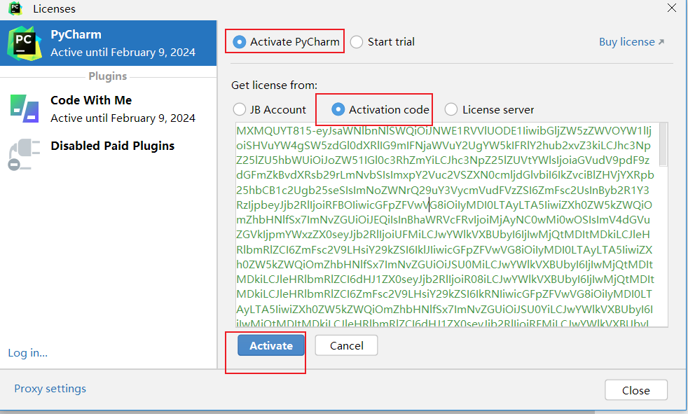
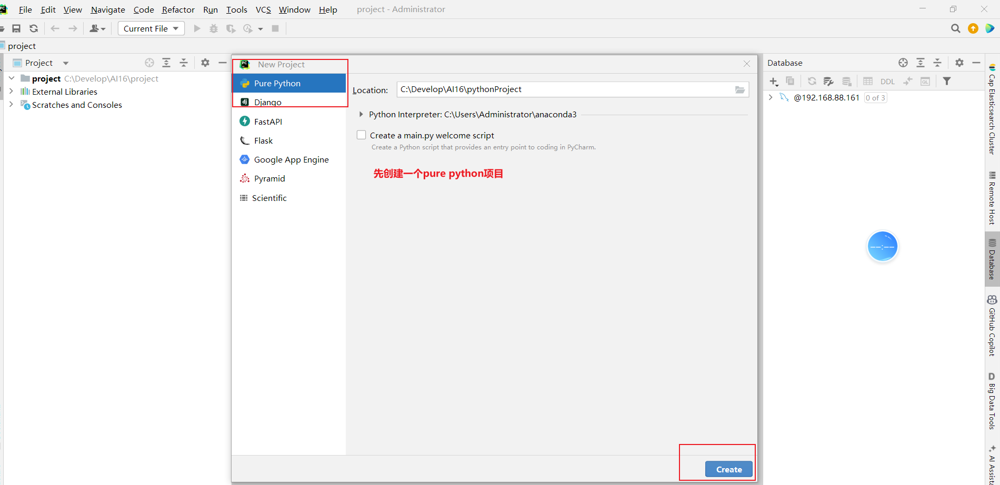
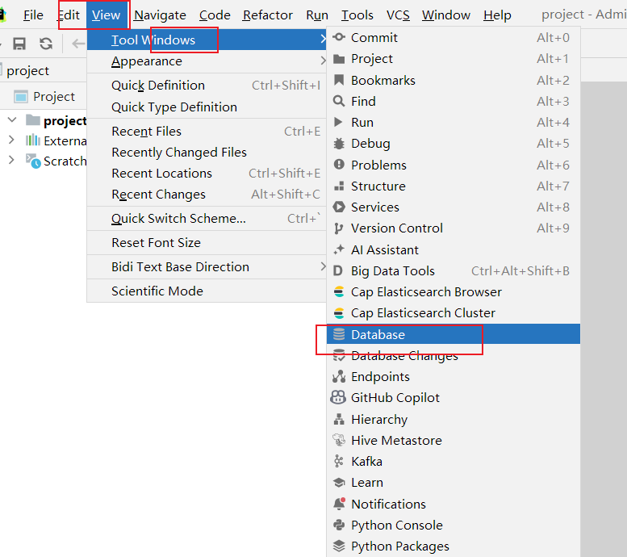
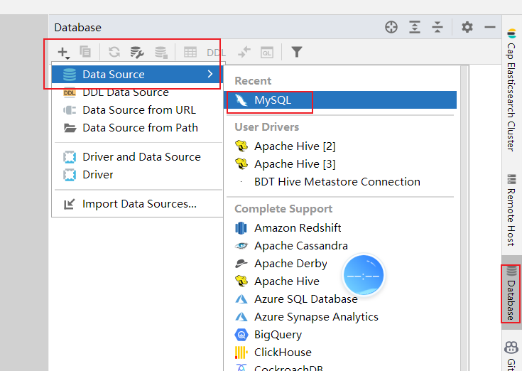
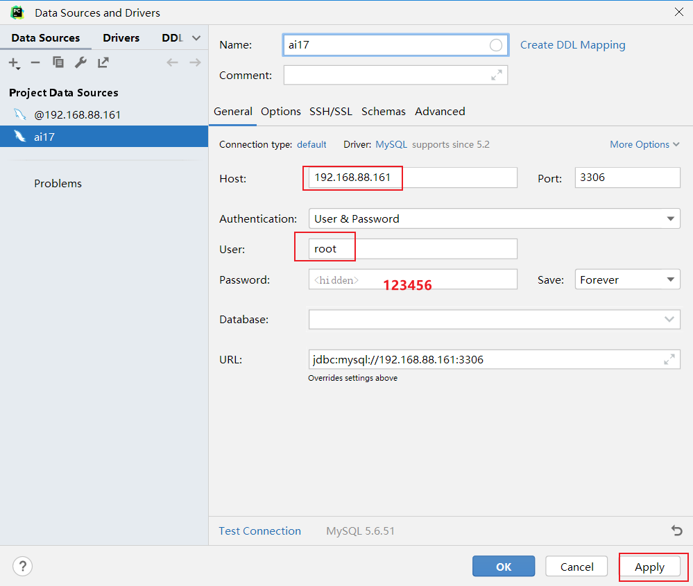
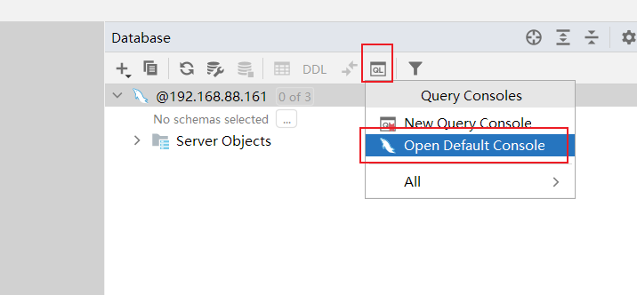

## Linux使用技巧

### 1 常用快捷键

- ctrl + c 强制停止
- ctrl + d 退出登出
- history 查看历史命令
- !命令前缀，自动匹配上一个命令
- ctrl + r，搜索历史命令
-  ctrl + a | e，光标移动到命令开始或结束
- ctrl + ← | →，左右跳单词
- ctrl + l 或 clear命令 清屏

### 2 软件安装

yum：RPM包软件管理器，用于自动化安装配置Linux软件，并可以自动解决依赖问题。

yum install|remove|search 软件名字

### 3 服务/软件 打开关闭 systemctl

Linux系统很多软件（内置或第三方）均支持使用systemctl命令控制：启动、停止、开机自启能够被systemctl管理的软件，一般也称之为：服务

```shell
systemctl start|stop|status|enable|disable
```

>start 启动
>
>stop 关闭
>
>status 查看状态
>
>enable 开启开机自启
>
>disable 关闭开机自启

应用场景:  修改了网络配置, 需要重启网络的服务 systemctl stop/start

系统内置的服务比较多，比如：

NetworkManager，主网络服务

network，副网络服务

firewalld，防火墙服务

sshd，ssh服务（FinalShell远程登录Linux使用的就是这个服务）

### 4 软连接

在系统中创建软链接，可以将文件、文件夹链接到其它位置。类似Windows系统中的《快捷方式》

语法：

-s选项，创建软连接

参数1：被链接的文件或文件夹参数2：要链接去的目的地

### 5 IP地址/域名解析/主机名

想联网访问互联网, 必须有IP地址

- ip地址两个版本 ipv4 ipv6
  - ipv4  a.b.c.d  4个8位二进制数组成

通过域名访问网络服务, 先要进行域名解析

- 通过本地的hosts 记录域名和ip的对应关系
  - windows C:\Windows\System32\drivers\etc\hosts
  - linux /etc/hosts
- DNS服务 在网络上记录了域名和ip的对应关系
  - 8.8.8.8  114.114.114.114

主机名, 每一台机器都有名字

- hostname查看主机名
- hostnamectl set-hostname 主机名，修改主机名（需root）

### 6 centos 固定ip设置(了解)

### 7 网络操作/文件下载

- ping  ping url /ping ip
  - 测试网络是否联通
  - ping 192.168.88.2  测局域网通不通
  - ping baidu.com 测互联网是否联通
- wget
  - 软件的下载
  - wget url地址
- curl
  - 发送http请求的命令
  - curl -o url 也可以做软件下载

### 8 端口占用查看/进程查询

nmap 127.0.0.1

**netstat** -anp | grep 端口号  可以查看端口被占用的情况 获取占用端口的进程ID



**ps -ef** 查看进程相关的所有信息



查询出1447是mysql占用之后, 可以根据当前情况判断

- 如果端口冲突, 可以选择换端口
- kill -9 1447

### 9 环境变量

环境变量是一组信息记录，类型是KeyValue型（名称=值），用于操作系统运行的时候记录关键信息

- 配置环境变量的时候, 主要就是配置PATH
- PATH 是一系列的**文件夹**, 多个文件夹之间用 **:** 隔开
- 配置了PATH之后, 在PATH中的可执行文件, 在任何一个工作目录下敲文件名就可以直接执行了

linux 配置环境变量

export PATH=$PATH:/home/itheima/myenv

针对用户：~/.bashrc文件中配置

针对全部用户：/etc/profile文件中配置

配置完成，可以通过source命令立刻生效

```shell
source /etc/profile
source ~/.bashrc
```


创建一个文件mkhaha 添加可执行的权限

- chmod +x mkhaha

### 10 压缩解压缩

tar/tar.gz

- 打tar包

  tar -cvf xxxx.tar 文件名

- 打 tar.gz包

  tar -zcvf xxxx.tar 文件名

- 解开tar包

  tar -xvf xxxx.tar -C 要解开的目的地路径

- 解开tar.gz包

  tar -zxvf xxxx.tar -C 要解开的目的地路径

zip

- 打包zip

zip [-r] XXX.zip  要打包的文件 .....

- 解压zip

unzip xxx.zip -d 指定要解压的目录


## Mysql

环境配置

激活pycharm



先创建一个python的项目



找到 Database 工具栏



配置mysql 链接, 这里使用centos上的Mysql (连之前centos一定要打开)

- ip 192.168.88.161
- 用户名 root
- 密码 123456

mac 同学在mac本地安装一下  ip  127.0.0.1

https://zhuanlan.zhihu.com/p/599351042





配置好Mysql连接之后, 打开默认控制台, 可以在里面写SQL



### 1 数据库简介

数据库就是存储数据的仓库，用户可以对数据库中的数据进行增加，修改，删除及查询操作。

数据库分为关系型数据库和非关系型数据库。

常用的关系型数据库有：MySQL，Oracle，DB2，SQLserver，sqlite

常用的非关系型数据库有：Redis，Hbase，MongoDB

### 2 Mysql 简介

MySQL的特点：免费，支持大型数据库，标准的SQL语言形式，跨平台。

课程使用的版本 centos上装的是5.6.51  不支持窗口函数 window function

后面使用MySQL8.0版本。2018

MySQL登录的两种方式：

方法一：mysql -uroot -p123456

方法二：mysql --host=192.168.88.161 --user=root --password=123456

### 3 SQL 语言介绍

- 结构化查询语言(Structured Query Language)简称SQL，是关系型数据库管理系统都需要遵循的规范，是数据库认识的语句。不同的数据库生产厂商都支持SQL语句，但都有自己特有内容。

- 标准SQL 

  - Mysql 支持的SQL 可以看做是标准SQL的方言 (大多数都一样, 少部分区别)
  - Oracle 支持的SQL 可以看做是标准SQL的方言

- SQL 的分类

  操作数据库数据表  DDL

  对数据进行增加删除修改 DML

  对数据库进行**查询 DQL**

  DCL  权限控制, 用户创建管理   不涉及(DBA 管理)

- SQL 注释

```
/**/：多行注释，在注释区域内可以随意换行
-- # ：单行注释，写在语句开头，换行后注释截止。
单行注释快捷键：ctrl+/
```

- 常用的数据类型：
  - 字符：char，varchar
  - 整数：int
  - 浮点型：float, double,decimal
  - 日期型：date，datetime


### 4 SQL语言的DDL

**DDL 建库建表** →DML 向表中写入数据(修改, 删除) → DQL(数据查询)

数据库操作

- 创建数据库：CREATE DATABASE 数据库名；
- 查看数据库：SHOW DATABASES;
- 删除数据库：DROP DATABASE 数据库名；
- 使用数据库：USE 数据库名

```sql
-- DDL 创建数据库
create database if not exists ai_db charset =utf8;
-- create database if not exists 数据库名 charset=字符集
show databases;

-- 删除数据库
DROP DATABASE ai_db;

-- 选中一个数据库, 后续操作, 都在这个数据库中进行
use ai_db;
```

数据表操作

创建表：CREATE TABLE 表名(字段名 类型 约束…)

查询表：SHOW TABLES;     DESC 表名；

删除表：drop table 表名;

修改表：

- alter  table  表名  add  列名  类型(长度)  [约束];   增加一列
- alter table 表名 change 旧列名 新列名 类型(长度) 约束;  修改一列名字
- alter table 表名 drop 列名;	删除一列
- rename table 表名 to 新表名;  修改表名

```sql
-- 选中一个数据库, 后续操作, 都在这个数据库中进行
use ai_db;

-- DDL 对数据表的操作
-- 创建数据表
create table category(cid varchar(20) primary key not null ,cname varchar(100));

-- 查看当前数据库有哪些数据表
show tables;
-- 查看表结构
desc category;

use mysql;
show tables;
desc plugin;

-- 添加字段, 需要注意这里添加的字段 字段的名字和sql的关键字冲突了,
-- 如果非要使用SQL的关键字作为字段名 需要添加 ``
-- alter table 表名 add `字段名字 字段类型;
alter table category add `desc` varchar(20);
desc category;

alter table category add num varchar(20);

-- 修改字段名字  alter table 表名 change 老字段名 新字段名字 类型;
alter table category change `desc` description varchar(20);

-- 删除字段 alter table 表名 drop 字段名;
alter table category drop description;

-- rename table 表名 to 新表名;
rename table category to category2;
show tables;


use ai_db;
drop table ai_db.category;
```

### 5 SQL语言的DML

插入记录：格式：insert into 表 (字段1,字段2,字段3...) values(值1,值2,值3...),(值1,值2,值3...)…;

更新记录：格式：update 表名 set 字段名=值,字段名=值,...;

删除记录：delete from 表名 [where 条件];truncate category;

```sql
-- DML
-- 插入数据 insert into
insert into category values ('c001','电器');
insert into category values ('c002','衣服');
insert into category2 values ('c002','衣服',3);
insert into category2(cid,cname) values ('c001','电器');
# insert into category2(cname,num) values ('衣服',3);
insert into category2 (cid, cname) values('03','化妆品'),('04','书籍'),('05',null);
insert into category2 values('06','玩具',4),('07','蔬菜',5);

-- 修改数据
-- 格式：update 表名 set 字段名=值,字段名=值,... where 条件
update category2 set cname = '家电';
# where;
update category2 set cname='水果' where cid='c001';


delete from category2 where cid='c002';
delete from category;
truncate category2;
```

>update category2 set cname = '家电';
>
>delete from category;
>
>update 不带where条件会一次性修改 要修改字段的所有的记录
>
>delete from  不带where条件, 会删除所有记录


## 小结

Linux使用技巧

网络下载软件, 解压缩, 修改配置文件, 配置环境变量, 启动服务

- 有可能会出现端口冲突
- 查询端口占用情况  netstat -anp | grep 端口号   → 获取到占用端口的 pid
- 通过端口占用的对应的程序pid 查询进程的详细信息决定 换端口还是kill占用的程序
  - ps -ef|grep pid编号
  - kill -9 进程编号

Mysql

- 关系型数据库/非关系型数据库

  - 写在表格中的数据, 有固定的表结构, 每个字段都有固定的数据类型这种数据就是关系型数据, Mysql这类关系型数据库处理的就是这种数据

  - 非关系型数据 没有固定的表结构, 每个字段存储数据大小不固定
    - 视频
    - 图片
    - 长文本

- SQL 

  - ISO SQL 标准SQL
  - Mysql  Oracle SqlSever DM2
  - DDL DML DQL DCL

- 今天作业

  - Linux 思维导图 补充完整
  - SQL 

编码

iso8859-1 没有中文

gbk

utf-8

username char(3)
