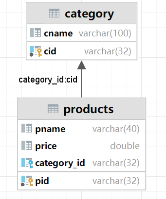
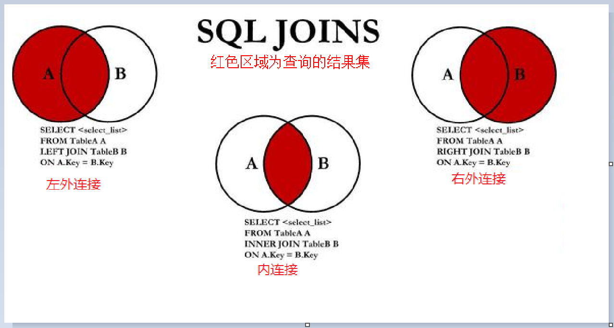
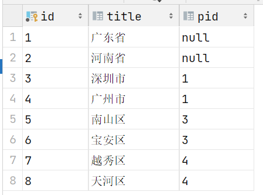
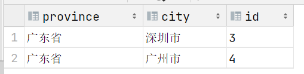
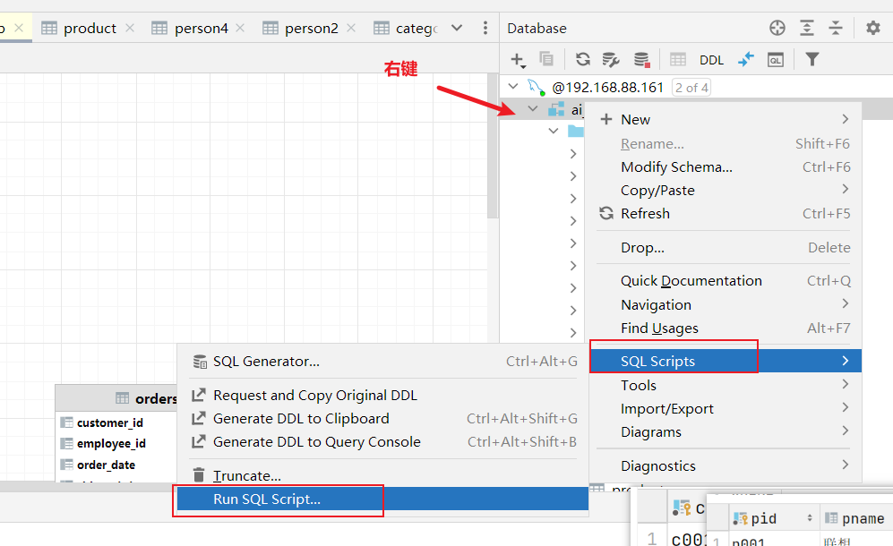
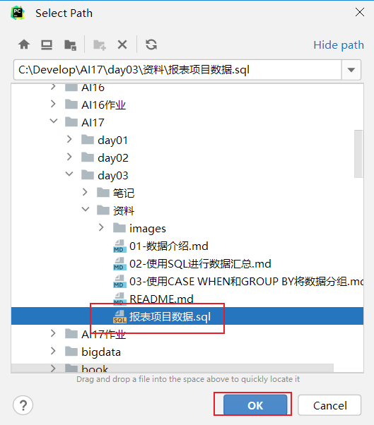

## Mysql

### 1 约束

主键约束：唯一标示，不能重复，不能为空。

1）主键应当是对用户没有意义的

2）永远也不要更新主键。

3）主键不应包含动态变化的数据，如时间戳、创建时间列、修改时间列等。

4） 主键应当由计算机自动生成。

自动增长：我们可以在表中使用 auto_increment（自动增长列）关键字，

- 自动增长列类型必须是整型

- 自动增长列必须为键(一般是主键)。

  

非空约束：NOT NULL 约束强制列不接受 NULL 值。

唯一约束：UNIQUE 约束唯一标识数据库表中的每条记录。

- UNIQUE 和 PRIMARY KEY 约束均为列或列集合提供了唯一性的保证。
- PRIMARY KEY 拥有自动定义的 UNIQUE 约束。

默认值约束如果插入数据时不指定当前字段的值，则查询该字段是否有默认值，如果有则插入默认值。

```sql
-- 约束
-- 主键约束

CREATE TABLE person(id INT PRIMARY KEY ,
last_name VARCHAR(100),
first_name VARCHAR(100),
address VARCHAR(100),city VARCHAR(100));

desc person;

CREATE TABLE person1(id INT ,
last_name VARCHAR(100),
first_name VARCHAR(100),
address VARCHAR(100),city VARCHAR(100));

desc person1;

-- 修改表结构, 添加主键约束
ALTER TABLE person1 ADD PRIMARY KEY (id);
-- 删除主键约束
ALTER TABLE person1 DROP PRIMARY KEY;

-- 指定主键约束 和自增长
CREATE TABLE person2(id INT PRIMARY KEY AUTO_INCREMENT,
last_name VARCHAR(100),
first_name VARCHAR(100),
address VARCHAR(100),city VARCHAR(100));

desc person2;


insert into person(first_name,last_name) values ('Bill','Gates');
insert into person2(first_name,last_name) values ('Bill','Gates');
insert into person2(id,first_name,last_name) values (null,'Bill','Gates');
insert into person2(id,first_name,last_name) values (2,'Bill','Gates');
insert into person(id,first_name,last_name) values (null,'Bill','Gates');


CREATE TABLE person3(id INT PRIMARY KEY AUTO_INCREMENT,
last_name VARCHAR(100) UNIQUE,
first_name VARCHAR(100),
address VARCHAR(100),city VARCHAR(100));

desc person3;

insert into person3(first_name,last_name) values ('Bill','Gates');
insert into person3(id,first_name,last_name) values (null,'Bill','Gates');


CREATE TABLE person4(id INT PRIMARY KEY AUTO_INCREMENT,
last_name VARCHAR(100) UNIQUE,
first_name VARCHAR(100),
address VARCHAR(100),city VARCHAR(100) DEFAULT '北京');

desc person4;
insert into person4(first_name,last_name) values ('Bill','Gates');
insert into person4(first_name,last_name) values ('Bill','Gate');
```

### 2 DQL 单表查询

条件查询：select *|字段名 form 表名 where 条件；

排序查询：SELECT * FROM 表名 ORDER BY 排序字段 ASC|DESC;

聚合查询函数：count()，sum()，max()，min()，avg()。

分组查询：SELECT 字段1,字段2… FROM 表名 GROUP BY 分组字段 HAVING 分组条件;

分页查询：SELECT 字段1，字段2... FROM 表名 LIMIT M,NM: 整数，表示从第几条索引开始，计算方式 （当前页-1）*每页显示条数N: 整数，表示查询多少条数据

```sql
-- 数据准备 建表
CREATE TABLE product
(
    pid         INT PRIMARY KEY,
    pname       VARCHAR(20),
    price       DOUBLE,
    category_id VARCHAR(32)
);

-- 向表中插入数据
INSERT INTO product(pid,pname,price,category_id) VALUES(1,'联想',5000,'c001');
INSERT INTO product(pid,pname,price,category_id) VALUES(2,'海尔',3000,'c001');
INSERT INTO product(pid,pname,price,category_id) VALUES(3,'雷神',5000,'c001');
INSERT INTO product(pid,pname,price,category_id) VALUES(4,'杰克琼斯',800,'c002');
INSERT INTO product(pid,pname,price,category_id) VALUES(5,'真维斯',200,'c002');
INSERT INTO product(pid,pname,price,category_id) VALUES(6,'花花公子',440,'c002');
INSERT INTO product(pid,pname,price,category_id) VALUES(7,'劲霸',2000,'c002');
INSERT INTO product(pid,pname,price,category_id) VALUES(8,'香奈儿',800,'c003');
INSERT INTO product(pid,pname,price,category_id) VALUES(9,'相宜本草',200,'c003');
INSERT INTO product(pid,pname,price,category_id) VALUES(10,'面霸',5,'c003');
INSERT INTO product(pid,pname,price,category_id) VALUES(11,'好想你枣',56,'c004');
INSERT INTO product(pid,pname,price,category_id) VALUES(12,'香飘飘奶茶',1,'c005');
INSERT INTO product(pid,pname,price,category_id) VALUES(13,'海澜之家',1,'c002');

-- select 字段名字 from 表名
select * from product;

select pname,price from product;
select pname,price+10 from product;

-- 条件查询
select pname,price from product where pname='花花公子';
select pname,price from product where price=800;
select pname,price from product where price!=800;
select pname,price from product where price<=60;

-- 范围查询
select pname,price from product where price between 200 and 800;
-- in 中传入的是具体的取值, 不是范围, 范围要使用between and
select pname,price from product where price in(200,800);

-- 逻辑查询

-- 下面这句相当于 between 200 and 800
select * from product where  price>=200 and price <=800;
-- 下面这句相当于 in (200, 800)
select * from product where  price=200 or price =800;

select * from product where  not (price=200);

-- 模糊查询
select * from product where pname like '香%';
select * from product where pname like '_想%';

-- 非空查询
select * from product where product.category_id is not null ;

-- 排序 order by DESC降序 默认是升序 ASC
-- 多字段排序, 如果第一个排序字段中 有相同取值的结果, 后面的字段排序才会看到效果
select * from product order by price DESC ,category_id DESC ;


-- 聚合函数  count 计数 sum 求和 max 最大 min最小 avg 平均
select count(*)
from product;
select count(*) from product where price>200;
select sum(price) from product where category_id='c001';
select avg(price) from product where category_id='c001';
select MAX(price),MIN(price) from product;


select * from product;

select category_id, count(*) from product group by category_id;
select category_id, max(price) from product group by category_id;

-- limit 起始编号 这一页显示几条数据
select * from product limit 0,5;
select * from product limit 5,10;
```

### 3 DQL 多表查询

#### 3.1 表和表之间的关系

- 实际业务应用中, 同一块业务的数据, 会存在不同的表中, 在做查询是需要将不同的表关联起来才能完成查询工作
- 表和表之间, 通过字段建立联系
  - 一对一
  - 一对多
    - 在从表(多方)创建一个字段，字段作为外键指向主表(一方)的主键。从表外键的值是对主表主键的引用。从表外键类型，必须与主表主键类型一致。

外键约束

- 在创建表的时候, 如果两张表之间有一对多的关系, 可以指定外键约束
  - 从表中引用了主表中的数据，主表中数据不可被删除。
  - 主表中没有数据，从表外键也无法被插入


```sql
create table category (cid varchar(32) primary key ,cname varchar(100));
create table  products (pid varchar(32) primary key, pname varchar(40), price DOUBLE,
category_id varchar(32),
CONSTRAINT FOREIGN KEY (category_id) REFERENCES category(cid));
```

>CONSTRAINT FOREIGN KEY (category_id) REFERENCES category(cid)
>
>给category_id字段添加了外键约束 指向 category这个表的cid字段
>
>

```sql
#1 向分类表中添加数据
INSERT INTO category (cid ,cname) VALUES('c001','服装');
#2 向商品表添加普通数据,没有外键数据，默认为null
INSERT INTO products (pid,pname) VALUES('p001','商品名称');
#3 向商品表添加普通数据，含有外键信息(category表中存在这条数据)
INSERT INTO products (pid ,pname ,category_id) VALUES('p002','商品名称2','c001');
#4 向商品表添加普通数据，含有外键信息(category表中不存在这条数据) -- 失败,异常
INSERT INTO products (pid ,pname ,category_id) VALUES('p003','商品名称2','c999');
#5 删除指定分类(分类被商品使用) -- 执行异常
DELETE FROM category WHERE cid = 'c001';
```

#### 3.2 多表查询, 不同的连接方式



```sql
-- 多表查询
-- 内连接, 左连接, 右连接

-- 数据准备
CREATE TABLE hero
(
hid   INT PRIMARY KEY,
hname VARCHAR(255),
kongfu_id INT
);
CREATE TABLE kongfu
(
kid     INT PRIMARY KEY,
kname   VARCHAR(255)
);

# 插入hero数据
INSERT INTO hero VALUES(1, '鸠摩智', 9),(3, '乔峰', 1),(4, '虚竹', 4),(5, '段誉', 12);

# 插入kongfu数据
INSERT INTO kongfu VALUES(1, '降龙十八掌'),(2, '乾坤大挪移'),(3, '猴子偷桃'),(4, '天山折梅手');

SELECT hname,kname FROM hero INNER JOIN kongfu ON hero.kongfu_id=kongfu.kid;
-- 如果直接写join 没有其它修饰词 就是内连接
SELECT hname,kname FROM hero JOIN kongfu ON hero.kongfu_id=kongfu.kid;
-- 左外连接 也叫左连接
SELECT hname,kname FROM hero LEFT OUTER JOIN kongfu ON hero.kongfu_id=kongfu.kid;
SELECT hname,kname FROM hero LEFT JOIN kongfu ON hero.kongfu_id=kongfu.kid;
-- 右外连接  也叫右连接  OUTER 写不写都可以
SELECT hname,kname FROM hero RIGHT OUTER JOIN kongfu ON hero.kongfu_id=kongfu.kid;
SELECT hname,kname FROM hero RIGHT JOIN kongfu ON hero.kongfu_id=kongfu.kid;
```

>join  内连接  保留的是交集
>
>left join  左连接  左表的信息会完整的保留
>
>right join  右连接  右表的信息会完整的保留

交叉连接, 两表相乘

```sql
select * from hero,kongfu;
```

>把两张表相乘, hero4条数据  kongfu4条数据  4*4 16条数据, 把所有可能的组合都列出来了


#### 3.3 多表查询 练习

```sql
drop  table products;
drop table category;
CREATE TABLE category (
  cid VARCHAR(32) PRIMARY KEY ,
  cname VARCHAR(50)
);
CREATE TABLE products(
  pid VARCHAR(32) PRIMARY KEY ,
  pname VARCHAR(50),
  price INT,
  flag VARCHAR(2),    #是否上架标记为：1表示上架、0表示下架
  category_id VARCHAR(32),
  CONSTRAINT products_fk FOREIGN KEY (category_id) REFERENCES category (cid)
);

INSERT INTO category(cid,cname) VALUES('c001','家电');
INSERT INTO category(cid,cname) VALUES('c002','服饰');
INSERT INTO category(cid,cname) VALUES('c003','化妆品');
INSERT INTO category(cid,cname) VALUES('c004','奢侈品');


INSERT INTO products(pid, pname,price,flag,category_id) VALUES('p001','联想',5000,'1','c001');
INSERT INTO products(pid, pname,price,flag,category_id) VALUES('p002','海尔',3000,'1','c001');
INSERT INTO products(pid, pname,price,flag,category_id) VALUES('p003','雷神',5000,'1','c001');
INSERT INTO products (pid, pname,price,flag,category_id) VALUES('p004','JACK JONES',800,'1','c002');
INSERT INTO products (pid, pname,price,flag,category_id) VALUES('p005','真维斯',200,'1','c002');
INSERT INTO products (pid, pname,price,flag,category_id) VALUES('p006','花花公子',440,'1','c002');
INSERT INTO products (pid, pname,price,flag,category_id) VALUES('p007','劲霸',2000,'1','c002');
INSERT INTO products (pid, pname,price,flag,category_id) VALUES('p008','香奈儿',800,'1','c003');
INSERT INTO products (pid, pname,price,flag,category_id) VALUES('p009','相宜本草',200,'1','c003');


select distinct c.cname from category as c inner join products p on c.cid = p.category_id where p.flag='1';

-- 所有分类商品的个数
select cname , count(category_id) from category c left join products p on c.cid = p.category_id group by cname;

select cname , category_id from category c left join products p on c.cid = p.category_id;
```

>在关联查询的时候,  两个表进行关联, 表名比较长可以起别名
>
> from category as c inner join products p    as 可以写也可以省略掉
>
>在关联查询的时候, 需要想清楚, 以哪张表为主表(要保留哪张表的完整信息)
>
>当前的案例, 要查询的是类别信息的情况, 所以以category 作为左表 做left join

子查询

- 一个select语句的结果可以作为 另外一个查询的条件

  ```sql
  -- 一个select语句的结果 是作为另外一个select 条件取值
  select * from products where category_id =
  (select cid from category where cname='化妆品');
  ```

- 一个select语句的结果也可以做为一张临时表, 和另外一张表进行关联查询

  ```sql
  select * from products p, (select * from category where cname = '化妆品') c where p.category_id=c.cid;
  
  ```

自连接

- 两张表进行join 这两张表实际上来自同一张表 就是自连接

```sql
CREATE TABLE tb_areas (id    VARCHAR(30) NOT NULL PRIMARY KEY, title VARCHAR(30),pid   VARCHAR(30));
INSERT INTO tb_areas (id, title, pid) VALUES ('1', '广东省', 'null');
INSERT INTO tb_areas (id, title, pid) VALUES ('2', '河南省', 'null');
INSERT INTO tb_areas (id, title, pid) VALUES ('3', '深圳市', '1');
INSERT INTO tb_areas (id, title, pid) VALUES ('4', '广州市', '1');
INSERT INTO tb_areas (id, title, pid) VALUES ('5', '南山区', '3');
INSERT INTO tb_areas (id, title, pid) VALUES ('6', '宝安区', '3');
INSERT INTO tb_areas (id, title, pid) VALUES ('7', '越秀区', '4');
INSERT INTO tb_areas (id, title, pid) VALUES ('8', '天河区', '4');
```



把省市区放到一张表中展示

```sql
select p.title province,c.title city, c.id from tb_areas as c join tb_areas as p on c.pid=p.id where p.title = '广东省';
```

>上面的SQL 实际上就是自连接的关联查询, 两张表都是tb_areas  利用城市的pid = 省份的id这个条件做自关联
>
>

在上面SQL 基础之上, 再做一次关联查询, 把tb_areas中 区的信息在关联起来

- 区的pid = 市的id

```sql
select a.province 省, a.city 市 ,d.title 区 from (
select p.title province,c.title city, c.id from tb_areas as c join tb_areas as p on c.pid=p.id where p.title = '广东省') a join tb_areas d on d.pid = a.id;
```

>子查询作为一张表来使用的时候, 需要起别名

### 4 SQL 报表

数据导入



弹出对话框中选择对应的.sql文件



表和表之间关联

内连接/左连接/右连接如何选择

- 内连接  两个表关联的字段 公共的部分会保留在结果中
- 左连接  在查询结果中, 想把哪张表的结果完整保留下来, 这个表就是左表


SQL 分组聚合

- 当需求中出现, 每一个/每一种/每一组/每一类 这样的字样, 考虑使用group by 分组

- 日期时间类型  如果数据中有日期时间类型, 可以做日期大小判断

count(*)  和 count(字段) 区别

- 如果所有字段都没有null  count(*) count(字段) 取值都一样, 在这个条件下, 分组之后, count任何一个字段取值都相同
- 如果 某个字段中包含了null   count(字段) 不统计null值的 , count(*)  会统计null


CASE WHEN 小结

可以把连续的取值的一列, 变成类别型

- 运费 根据运费的多少 → 高运费 中档运费 低运费
- 年龄 根据年龄的大小 → 青少年 , 青年, 中年, 老年

```sql
CASE WHEN 字段  条件 THEN 取值 WHEN 字段 条件 THEN 取值 ELSE 取值 END (AS) 新列别名
```

```sql
select customer_id,company_name, country,
CASE WHEN country IN ('Germany','Switzerland','Austria') THEN 'German'
    WHEN country IN('UK', 'Canada', 'USA', 'Ireland') THEN 'English'
    ELSE 'Other' END language
from customers;
```


### 5 今日重点

多表查询、连接（内连接, 外连接, 交叉连接-了解）

多表查询和分组聚合结合

CASE WHEN 使用

今天作业

- PPT里面的SQL
- 报表练习前20个


