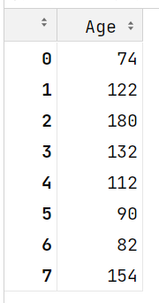
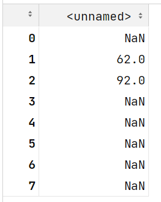
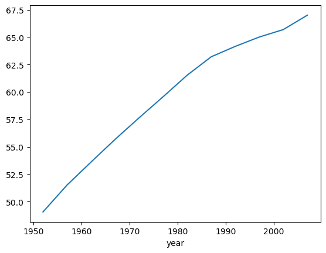

## 今日重点

Pandas数据结构

DataFrame入门


### 1 Anaconda 和虚拟环境

anaconda 是一个Python的发行版, 主要用于科学计算

- 继承了一个conda 虚拟环境管理器
  - conda create -n 虚拟环境名字 可以创建一个新的虚拟环境
  - conda activate 虚拟环境名字
  - conda deactivate 退出当前的虚拟环境
- 为什么要有虚拟环境
  - future warning XXX功能在未来的版本中会删除
  - 2020年开发了一个项目, 用的是pandas 的 1.12版本 现在这个项目处于维护阶段, 不需要做新的变化
  - 2023年要写一个新的项目, 需要用到Pandas2.0功能, 可以创建一个新的虚拟环境, 在这个新的虚拟环境中安装新版本Pandas

### 2 布尔索引/Boolean index

从Series/DataFrame中获取满足某些条件的数据，可以使用布尔索引

- 布尔索引类似于where条件
- 将数据中的某一列 和 一个值进行比较 (>, <  , = , !=) 比较之后会返回一个True/False组成的Series, 把这个Series再传递给Series/DataFrame (传递的时候, 需要注意要写到中括号中)
  - True/False组成的Series, True所对应的行, 原始数据会留下
  - True/False组成的Series, False所对应的行, 原始数据会过滤掉

```python
scientiests= pd.read_csv('data/scientists.csv')

#计算平均年龄
avg_age = scientiests['Age'].mean()
# 获取了年龄的Series
age = scientiests['Age']
scientiests['Name'][age>avg_age]
scientiests['Name'][scientiests['Age']>avg_age]
# 上面的代码相当于
temp_list = [False,True,True,True,False,False,False,True]
scientiests['Name'][temp_list]
```

### 3 Series的运算

- Series和一个数值之间的计算
  - 每一个元素都会和这个数值进行计算
- 两个Series之间计算
  - 能算出非nan的条件, 两个Series的index 相同
  - 如果在另外一个Series中没有找到当前行的Index, 这个index在计算结果中会保留但是,  得到的值是nan

```python
age+age
```



```python
age+pd.Series([1,2],index = [1,2])
```



### 4 DataFrame的常用操作

和Series基本相同

属性 shape/values/

```
movie.min()
```

>C:\Users\Administrator\AppData\Local\Temp\ipykernel_26672\976421507.py:1: FutureWarning: The default value of numeric_only in DataFrame.min is deprecated. In a future version, it will default to False. In addition, specifying 'numeric_only=None' is deprecated. Select only valid columns or specify the value of numeric_only to silence this warning.
>
>pandas 给了一个未来版本变化的提示
>
>'numeric_only=None'  这个参数 未来会发生变化, 就没有这个None的取值了, 会变成False

常用方法

count()

describe()

布尔索引/两个DataFrame之间的计算, 和Series完全一样

### 5 DataFrame 行列索引的修改

#### 5.1 行索引(index)的调整

- set_index() 把某一列设置为索引
- reset_index() 重置索引, 回到从0开始计数的数值索引的状态
- 在加载数据的时候, 可以通过pd.read_csv('路径', index_col='列名') 直接指定某一列作为索引

需要注意的问题

- 99%关于DataFrame/Series调整的API , 都会默认在副本上进行修改, 调用修改的方法后, 会把这个副本返回
  - 这类API都有一个共同的参数 inplace 默认值都是False
  - 如果把inplace 改成True会直接修改原来的数据, 此时这个方法就么有返回值了

#### 5.2 行列索引值的修改

- rename()

  ```python
  idx_rename = {'Avatar':'阿凡达'}
  col_rename = {'duration':'时长'}
  # index 要修改的索引的信息{老索引值:新的索引值}
  # columns 要修改的列名的信息{老列名值:新的列名值}
  # inplace 是否在原始的数据上修改, 默认是False 不会修改原始数据
  movie3.rename(index=idx_rename,columns=col_rename,inplace=True)
  ```

  >需要注意 传入的字典, 老的列名/行索引不存在, 不会报错, 只不过运行之后没有效果
  >
  >比较适合使用的场景, 行/列比较多的时候

- 整体替换 index / columns

  - dataframe.index 获取行索引    数据类型  pandas.core.indexes.base.Index
  - dataframe.columns 获取列索引  数据类型 pandas.core.indexes.base.Index
  - Index 类型不能直接修改 先需要把这个Index转换成列表, 修改列表中的元素, 再整体替换 index/columns

  ```python
  index_list = movie3.index.to_list()
  index_list[1] = '加勒比海盗:世界的尽头'
  movie3.index =index_list
  col_list = movie3.columns.to_list()
  col_list[1] = '导演'
  movie3.columns = col_list
  ```

  >movie3.columns.to_list

#### 5.3     DataFrame 插入/删除/追加一列数据      

追加一列数据

```python
movie['是否看过'] = 0
movie['脸书点赞总数'] = movie['actor_1_facebook_likes']+movie['actor_2_facebook_likes']\
                     +movie['actor_3_facebook_likes']+movie['director_facebook_likes']
```

删除一列数据

```python
movie.drop('脸书点赞总数',axis=1,inplace=True)
```

>要删除的列名
>
>axis = 'columns'|'index' (默认)   1|0(默认)  按列|行 删除
>
>inplace = 默认False 是否修改原始数据

insert 在指定位置插入一列数据

```python
movie.insert(loc=0,column='利润',value=movie['gross']-movie['budget'])
```

>loc=0  要插入列的位置编号
>
>columns 要插入列的列名
>
>value = 要插入列的值
>
>需要注意的是这个方法没有inplace 参数, 直接在原始数据上修改

从DataFrame中, 取出一列数据两种写法

- df['列名']  一定成功

- df.列名 :  有些情况下这种写法会有问题  

  - 列名和python的关键字/方法名冲突
  - 列名中有空格

  

#### 5.4 DataFrame数据的保存跟加载

保存数据 df.to_数据格式(路径)

- pickle python特有的数据格式 如果数据处理之后, 后续还是要在Python中使用, 推荐保存成pickle文件
- tsv  用制表符作为分隔符

```python
movie5 = movie4.reset_index().head()
movie5.to_pickle('data/movie5.pkl')
movie5.to_csv('data/movie5.csv')
movie5.to_excel('data/movie5.xlsx')
movie5.to_csv('data/movie5_noindex.csv',index=False) # index 不保存行索引
movie5.to_csv('data/movie5_noindex.tsv',index=False,sep='\t')
```

加载数据, pd.read_数据格式(路径)

```python
pd.read_pickle('data/movie5.pkl')
pd.read_excel('data/movie5.xlsx')
pd.read_csv('data/movie5.csv')
pd.read_csv('data/movie5_noindex.csv')
```

### 6 DataFrame数据分析入门

#### 6.1 DataFrame获取部分数据

获取一列/多列数据

df['列名'] → series

df[['列名']] → DataFrame

获取多列数据

df[列表] / df[['列名1','列名2']]

#### 6.2 loc 和 iloc

df.loc[[行名字],[列名字]] / df.iloc [[行序号],[列序号]]

- loc/iloc 不是方法是属性
- 可以使用切片语法, 可以传入一个值, 也可以传入列表

```python
df.iloc[:,[2,4,-1]] # :, 获取所有行  [2,4,-1] 获取序号是2和4 以及最后一列
df.loc[:,['country','year']] # :, 获取所有行  获取名字是country 和 year这两列数据
df.iloc[:,0:6:2] # 切片 0:6 左闭右开 不包含6  2是步长
df.loc[:,'country':'year'] # 切片 'country':'year' 没有开闭区间的概念
```

在使用的时候, 推荐使用loc 使用行/列的名字来取值, 代码可读性比较好

#### 6.3 分组聚合

分组聚合在SQL中 

```sql
select 字段, 聚合函数(字段名字) from 表名 group by 分组字段名字
```

DataFrame的api

```python
df.groupby('分组字段')['要聚合的字段'].聚合函数()
df.groupby(['分组字段','分组字段2'])[['要聚合的字段','要聚合的字段2']].聚合函数()
```

>分组后默认会把分组字段作为结果的行索引(index)
>
>如果是多字段分组, 得到的是MultiIndex(复合索引), 此时可以通过reset_index() 把复合索引变成普通的列
>
>基本代码调用的过程
>
>- 通过df.groupby('year')先创一个分组对象
>
>- 从分组之后的数据DataFrameGroupBy中，传入列名进行进一步计算返回结果为一个 SeriesGroupBy ，其内容是分组后的数据
>
>- 对分组后的数据计算平均值

#### 6.4 pandas 简单绘图

series数据.plot()

- 默认绘制的是折线图
- index 作为x坐标取值
- value y坐标取值

```python
df.groupby('year')['lifeExp'].mean().plot()
```



### 7 pandas数据分析/处理练习

加载数据之后, 要先查看数据的基本情况

- df.info()
  - 数据有哪些列, 有多少条数据, 每列数据的数据类型, 每一列数据是否有空值
- df.describe()
  - 数值 计数, 极值,分位数, 均值, 标准差
  - 类别型 df.describe(include =object)  不同取值的数量, 出现次数最多的取值, 出现次数最多取值出现的次数

排序相关的API

- nlargest/nsmallest
  - nlargest 获取某个字段取值最大的前n条数据
  - nsmallest  获取某个字段取值最小的前n条数据

```python
movie2 = movie[['movie_title','imdb_score','budget']]
movie2.nlargest(100,'imdb_score').nsmallest(5,'budget')
```

- sort_values() 对某一列/某几列的值排序

  ```python
  sorted_result = movie3.sort_values(['title_year','imdb_score'],ascending=False)
  ```

  >ascending 升序 默认是True , 改成False之后, 就是降序了
  >
  >ascending  传入的参数是True, False的列表, 这个列表的长度需要和要排序的字段对应
  >
  >- 可以分别指定 哪个字段升序, 哪个字段降序

- 去重 drop_duplicates()

  ```python
  sorted_result.drop_duplicates(subset=['title_year'],keep='last')
  ```

  >drop_duplicates
  >
  >- subset  通过这个参数, 可以指定, 哪些字段重复, 认为是重复值, 可以被删除
  >- keep first/last   去重的时候, 保留第一条/保留最后一条

### 8 内容回顾

加载数据

df  = pd.read_XXX(路径)

了解数据, 认识数据

df.info()

df.describe()

df.shape/values/dtype

加载部分数据

df['列名'] / df[['列名1','列名2']]

df.loc[['行名'],['列名']] / df.iloc[['行序号'],['列序号']]

df[df['列']> 值] /df[df['列']== 值] /df[df['列']<值]  类似于SQL 的where 条件

行列修改

- set_index() / reset_index()
- rename(index=idx_rename,columns=col_rename )
- df.index =  
- df.columns = 

插入/删除/追加数据

- df['新列名'] = 值

- df.insert(loc,column,value=)
- df.drop() 按行/按列

分组聚合

df.groupby(分组字段)[聚合字段].聚合方法()

简单绘图

series.plot() 画图

排序

nlargest/nsmallest

sort_values([字段], ascending = False/True)

去重

df.drop_duplicates(subset)

api 中两个经常遇到的参数

inplace 是否在原始数据上修改

- 修改数据的API 调用之后, 如果有返回说明修改的是副本, 如果没有返回说明修改的是原始的数据

axis 按行操作/按列操作  columns 列/index行
