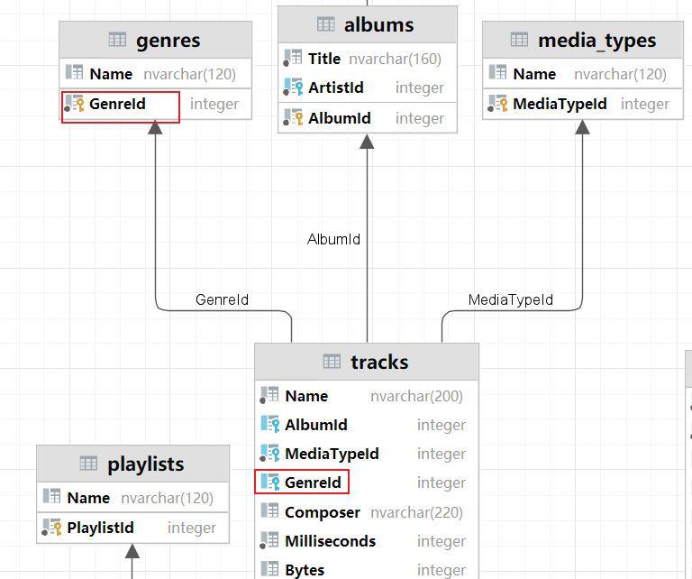
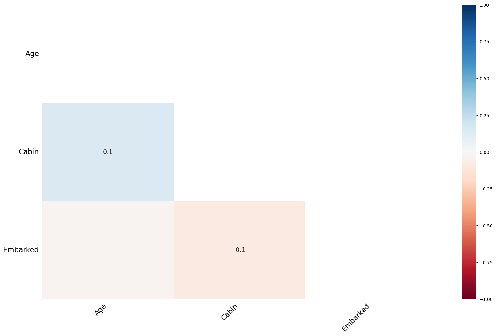

## 今日重点

数据组合 (类似SQL join)

缺失值处理 (null 值处理)

Apply 自定义函数


## 1 租房数据练习

加载数据之后, 先要了解数据的基本情况

- df.head()
- df.info()
- df.describe()

**分组聚合**

```
house_data.groupby('view_num',as_index=False)['district'].count()
```

- as_index 默认是True , 分组字段会作为分组结果的索引, 把它改成False之后, 分组字段会作为结果中的普通列

- as_index=False  效果相当于groupby('view_num')   再 reset_index

- 分组之后 count

  - 如果数据没有缺失(null) 分组之后对任何一个字段count结果都相同
  - 如果有些字段有缺失, count的时候, 需要注意要统计哪一列的数据

- 分组之后, 聚合多个字段, 采用不同的聚合方式

  ```python
  # agg aggregate 聚合  {'字段':'聚合方法名字'} 可以实现不同的字段, 用不同的聚合方法来聚合
  house_data.groupby('house_type').agg({'view_num':'sum','price':'mean'})
  ```

**绘图**

pandas的Plot() 实际上调用的是matplotlib

matplotlib 中文显示问题

```python
import matplotlib.pyplot as plt
plt.rcParams['font.sans-serif'] = ['SimHei'] # 正常显示汉字
plt.rcParams['axes.unicode_minus'] = False # 正常显示负号
```

plot 几个参数

```python
house_data.groupby('house_type')['district'].count().sort_values(ascending=False).plot(kind = 'bar',figsize=(16,8))
```

>kind 指定画什么图  'bar' 条形图/柱状图
>
>figsize = (16,8) 指定绘图区域的大小 16 宽度, 8 高度

## 2 DataFrame数据组合

### 2.1 concat连接

应用场景  两个DataFrame 有相同的结构(行名差不多, 列名差不多)

- 典型场景,  每个df 记录了一天的数据, 记录的列名都一致, 把n天的数据放到一起分析

pd.concat([df1,df2,df3], ingnore_index = , axis = )

- ingnore_index  忽略索引, 默认是False 连接之后会保留原来的索引, 设置为True 会重建从0开始的索引
- axis 上下连接(列名对齐)/左右连接(行索引对齐)

上下连接, 如果列名不一致, 会多出列, 出现NaN

左右连接, 如果行索引不一致, 会多出行, 出现NaN

**df.appen(df)** 作用跟concat类似, 已经过时了, 在新版本的pandas中这个方法已经被删除了, 使用concat可以实现完全一样的效果

### 2.2 merge连接 (相当于SQL 的join)

```python
import sqlite3
# 创建和SQLlite数据库之间的连接  sqlite数据库,一个数据库对应一个文件 chinook.db
con = sqlite3.connect('data/chinook.db')
# tracks 记录了 不同的音乐/视频  对应的类型, 价格, 时长, 大小(多少字节), 艺术家, 专辑, 类型信息
tracks = pd.read_sql_query("select * from tracks",con)
# 音乐/视频作品的类型  摇滚/爵士/.....歌剧/喜剧
genres = pd.read_sql_query('select * from genres',con)

```




```python
tracks_subset = tracks.loc[[0,62,76,98,110,193,204,281,322,359]]
# Sql join  在pandas里用merge   how 连接方式  on 连接的字段
# how inner outer left right
genres.merge(tracks_subset,how='outer',on='GenreId')
```

>how 参数
>
>- how = ’left‘ 对应SQL中的 left outer 保留左侧表中的所有key
>
>- how = ’right‘ 对应SQL中的 right outer 保留右侧表中的所有key
>- how = 'outer' 对应SQL中的 full outer 保留左右两侧侧表中的所有key
>- how = 'inner' 对应SQL中的 inner 只保留左右两侧都有的key
>
>on 连接的字段, 如果左右两张表 连接的字段名字相同直接使用on
>
>- 如果名字不同, left_on right_on
>
>连接之后, 两张表中如果有相同名字的字段, 默认会加上后缀 默认值 _x, _y
>
>suffixes:("_ x", "_ y")

### 2.3 join连接 (了解)

两种应用场景

- 第一种 类似于concat  但是只能是左右连接, 不能上下连接 使用index(行索引) 对齐

  ```python
  stock_2016 = pd.read_csv('data/stocks_2016.csv')
  stock_2017 = pd.read_csv('data/stocks_2017.csv')
  stock_2018 = pd.read_csv('data/stocks_2018.csv')
  stock_2016.join(stock_2017,lsuffix='_2016',rsuffix='_2017',how='outer')
  ```

>stock_2016 直接 join stock_2017 两张表index相同的部分会连在一起
>
>如果两张表有同名字段, 必须指定 lsuffix 左表后缀  rsuffix 右表后缀
>
>how 连接方式 inner outer left right 默认inner

- 第二种  df的一列跟右表的index(行索引) 的值进行关联

```python
stock_2016.join(stock_2018.set_index('Symbol'),lsuffix='_2016',rsuffix='_2018',on='Symbol')
```

>stock_2016 的 on='Symbol'  Symbol这一列 和  stock_2018.set_index('Symbol') 行索引 匹配
>
>这种用法可以用concat / merge 替换
>
>- merge 把 stock_2018 和 stock_2016 要连接的列, 通过reset_index 都变成一列
>- cancat 把 stock_2016 的 Symbel 通过set_index 也设置为Index


## 3 缺失值处理

### 3.1 缺失值简介和如何判断缺失值

数据中出现缺失值是很常见的

- 计算的过程中, 两个表join 可能会有缺失
- 原始的数据中也有可能直接带着缺失值

数据处理和模型训练的时候, 有很多场景要求必须先把缺失值处理掉, 想处理缺失值先要在数据中找到缺失值

pd.isnull() pd.isna() /pd.notnull() pd.notna()

- np.nan np.NAN np.NaN 都是缺失值, 这个类型比较特殊, 不同通过 == 方式判断, 只能通过API

```python
import numpy as np
print(np.NAN==True)
print(np.NAN==False)
print(np.NAN=='')
print(np.NAN==0)
```

>False
>False
>False
>False

```python
print(np.NAN==np.NaN)
print(np.NAN==np.nan)
print(np.NaN==np.nan)
```

>False
>False
>False

```python
import pandas as pd
print(pd.isnull(np.NAN))
print(pd.isnull(np.nan))
print(pd.isnull(''))
```

>True
>True
>False

```python
print(pd.notnull(np.NAN))
print(pd.notnull(np.nan))
print(pd.notnull(''))
```

>False
>
>True
>
>True

### 3.2 读取包含缺失值的数据

```python
pd.read_csv('data/survey_visited1.csv',na_values=['?'],keep_default_na=False)
```

>na_values = 除了空白值之外, 还有哪些值在加载数据的过程中被按照缺失值对待, 上面传入了?  说明数据中的?加载之后会用 NaN 来表示
>
>keep_default_na = 是否把 空白的内容作为缺失值来加载

### 3.3 缺失值处理

```python
titanic = pd.read_csv('data/titanic_train.csv')
titanic.head()
titanic.isnull().sum() # 快速计算是否包含缺失值
```

可以通过可视化的方式来展示数据缺失的情况

- pip install missingno

```python
import missingno as msno
msno.bar(titanic)
```


```python
# 绘制缺失值热力图, 发现缺失值之间是否有关联, 是不是A这一列确实, B这一列也会确实
msno.heatmap(titanic)
```



删除缺失值

```python
titanic.dropna(subset=None,how='any',inplace=False,axis=0)
```

>subset=None  默认是有缺失值的行, 就会被删除, 可以通过这个参数来指定, 哪些列有缺失值才会被删除
>
>subset = ['Age']  只有当年龄有缺失才会被删除
>
>inplace=False  通用参数, 是否修改原始数据默认False
>
>axis=0 通用参数 按行按列删除 默认行
>
>how='any'  只要有缺失就会删除 还可以传入'all' 全部都是缺失值才会被删除


缺失值填充, 非时序数据

- 非时序数据的缺失值填充, 直接使用fillna(值, inplace)

  - 可以使用统计量  众数 , 平均值, 中位数 ...
  - 也可以使用默认值来填充  

  

缺失值填充, 时序数据

- 数值的变化, 跟时间相关 气温/天气情况/用电量 ....

```python
city_day = pd.read_csv('data/city_day.csv',parse_dates=['Date'],index_col='Date')
# parse_dates 解析日期, 指定日期列 Date 加载的时候自动会把它处理成日期时间类型
city_day['Xylene'][50:64]
```

>筛选部分数据进行处理

```python
city_day['Xylene'][50:64].fillna(method='ffill') # 使用缺失值前面的有效值来填充
city_day['Xylene'][50:64].fillna(method='bfill') # 使用缺失值后面的有效值来填充
```

线性插值

```python
city_day['Xylene'][50:64].interpolate(limit_direction='both')
```

>利用缺失值前面和后面两个有效值连线, 填充的缺失值从线上找

### 3.4 小结

缺失值处理的套路

- 能不删就不删 , 如果某列数据, 有大量的缺失值(50% 以上是缺失值, 具体情况具体分析)
- 如果是类别型的, 可以考虑使用 '缺失' 来进行填充
- 如果是数值型 可以用一些统计量 (均值/中位数/众数) 或者业务的默认值来填充


## 4 Apply 自定义函数

应用场景, 当Pandas自带的APi 不能满足需求, 我们需要遍历的对Series中的每一条数据/DataFrame中的一列或一行数据做相同的自定义处理, 就可以使用Apply自定义函数

### 4.1 Series的apply方法

```python
import pandas as pd
df = pd.DataFrame({'a':[10,20,30],'b':[20,30,40]})
df 
```

- 创建一个方法, 接收一个参数(一个值), 也可以接收多个参数(使用的时候, 第一个参数来自Series 后面的参数可以自己传递)

```python
def my_sq(x):
    return x**2
# 方法传递多个参数
def my_sq2(x,e):
    return x**e
```

- series 调用apply

```python
df['a'].apply(my_sq)
df['a'].apply(my_sq,e=3)
```

>apply 传入方法名字, 不是方法的调用, 方法是由apply 来进行调用的
>
>apply 相当于遍历了Series中的每一个取值, 一个一个传给自定函数, 把返回值整理成series

### 4.2 DataFrame的apply方法

df.apply(func, axis = )

- axis = 0 按列传递数据 传入一列数据(Series)
- axis = 1 按行传递数据 传入一列数据(Series)

练习: 把titanic 的数据中, 年龄替换成年龄段

```python
def cut_age(age):
    if age<18:
        return '未成年'
    elif 18<=age<40:
        return '青年'
    elif 40<=age<60:
        return '中年'
    elif 60<=age<81:
        return '老年'
    else:
        return '未知'
```

```python
titanic['Age'].apply(cut_age).value_counts()
```


创建一个字段 vip 

- Pclass  = 1
- 名字 Name 包含特殊称呼 Master , Dr, Sir

```python
# Pclass = 1 并且 Name中 包含了Master/Dr/Sir
def get_vip(x):
    if x['Pclass'] ==1 and ('Master' in x['Name'] or 'Dr' in x['Name'] or 'Sir' in x['Name'] ):
        return 'VIP'
    else:
        return 'Normal'
```

```python
titanic['vip'] = titanic.apply(get_vip,axis=1)
titanic['vip'].value_counts()
```


## 5 内容回顾

**数据组合,** 就是把多张有关联的表连接到一起, 有两种连接方式

- 上下连 场景, 多天的数据合并到一起(每一天有一张表, 每张表统计的都是相同的信息就是列名一样)
  - pd.concat()
- 左右连
  - pd.concat
  - df.merge
  - df.join

**concat/merge** 使用的最多 区别

- concat 是使用索引关联 , 要么行索引相同, 要么列名相同
- merge 两列数据的值建立关联, 相当于SQL join

df.join

- 既可以使用两个表的索引建立关联
- 也可以是df的一列和它join表的行索引(index) 建立关联

**缺失值处理**

- nan/NAN/NaN
- pd.isnull() pd.notnull()
- 加载数据的时候可以直接读取出缺失值来 
- 处理方法 删除/填充/赋值为缺失
  - 原则能不删就不删
  - 关键信息缺失的行, 缺失值占比过高的列 考虑删除
  - 填充
    - 时序数据 考虑到数据随时间变化的情况, 可以使用缺失值的前一个非空值/缺失值的后一个非空值来填充, 线性插值
    - 非时序数据
      - 统计量/默认值
      - 类别型 可以创建一个新的取值类型 缺失
- df.dropna()
- df.fillna({'列名1':'列1填充值', '列名2':'列2填充值'})
  - df['列名'].fillna()
- df.interpolate()

**apply自定义函数**

自己创建的函数要有返回值, 写函数的时候, 需要注意, 要想清楚, 传入的到底是一列, 还是一行, 还是一个数值

- series.apply() 
  - 传入的是每一个值
- df.apply(axis) 
  - 传入的是一行/一列数据


