## 今日重点

1 数据分组  groupby

- 分组聚合
- 分组转换
- 分组过滤
- 分组接自定义处理

2 数据透视表

- 透视表API的使用
- 结合零售的鞋的业务综合运营包括透视表相关的API


### 1 向量化函数/lambda表达式

```python
def avg_test2(x,y):
    if x==20:
        return np.NaN
    else:
        return (x+y)/2
avg_test2(df['a'],df['b'])
```

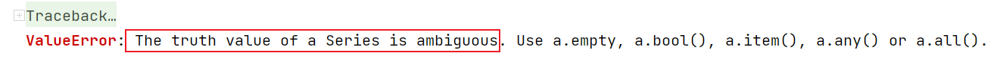

>上面的方法调用之所以报错, 就是因为if 需要传入的是 一个True/False , 但是我们传入的是一个 True/False 组成的Series  此时if 不能做出判断, 抛出了错误
>
>想让上面的代码正常的执行, 我们需要把 Series里的每一个值遍历的传递给if 做多次判断, 此时必须要自己写for循环, 可以通过 np.vectorize(avg_test2) 这种方式, 把这个方法变成一个向量化的方法(会遍历每一个值(分量)多次调用这个方法)

np.vectorize 两种用法

```python
import numpy as np
def avg_test2(x,y):
    if x==20:
        return np.NaN
    else:
        return (x+y)/2
avg_vec = np.vectorize(avg_test2)
```

还有一种通过装饰器来调用的方式

```python
@np.vectorize
def avg_test3(x,y):
    if x==20:
        return np.NaN
    else:
        return (x+y)/2
avg_test3(df['a'],df['b'])
```

**lambda表达式**

使用apply的时候, 如果自定义处理逻辑比较简单, 一行代码就可以搞定, 可以使用lambda, 不用再def 一个起名字的函数, 使用lambda 创建一个匿名函数就可以了

```python
df.apply(lambda x:x.isnull().sum())
```

### 2 数据分组

#### 2.1 分组聚合

df.groupby('分组字段')['聚合字段'].describe()

分组之后想调用非Pandas的聚合函数, 需要使用agg/aggregate 方法, 聚合函数可以自定义

```python
import numpy as np
df.groupby('continent')['lifeExp'].aggregate(np.mean)
```

自定义聚合函数

```python
def my_mean_diff(s,global_mean):
    return s.mean() - global_mean
```

```python
global_mean = df['lifeExp'].mean()
df.groupby('continent')['lifeExp'].agg(my_mean_diff,global_mean = global_mean)
```

```python
# 不同字段按照不同方式进行聚合
df.groupby('year').agg({'lifeExp':'mean','pop':'median','gdpPercap':'max'})
```

#### 2.2 分组转换

分组计算均值来填充缺失值

```python
# 加载小费数据集
tips = pd.read_csv('data/tips.csv')
#random_state 具体的取值没有啥意义, 但是把这个值固定下来, 多次运行采样的代码, 采样出来的数据是一样的
tips_10 = tips.sample(10,random_state=42) # sample采样 
import numpy as np
tips_10.loc[np.random.permutation(tips_10.index)[:4],'tip'] = np.NAN 
#np.random.permutation(tips_10.index) 将index随机打乱 随机找了4条数据 给tip复制为nan
```

- 创建自定义函数, 用来填充缺失值

```python
def fillna_mean(x):
    # 计算每组的小费平均值 利用均值填充缺失值
    return x.fillna(x.mean())
```

```python
tips_10.groupby('sex')['tip'].transform(fillna_mean)
```

>不同性别填充的缺失值, 是各自性别的小费平均值

分组转换跟SQL中的窗口函数中的聚合函数作用一样

- 可以把每一条数据和这个数据所属的组的一个聚合值在放在一起, 可以根据需求进行相应计算

#### 2.3 分组转换练习

- 加载减重数据 数据中包含了Bob和Amy 从1月到4月 每周的体重数据(每个月4周, 一共32条数据)

```python
weight_loss = pd.read_csv('data/weight_loss.csv')
weight_loss
```

- query 类似于SQL 的where 条件  query 需要传入的是条件对应的字符串, 如果条件中还有字符串, 需要用不同类型的引号进行区分

```python
weight_loss.query("Month=='Jan'")
```

>从数据中查询出月份是 'Jan' 一月份的数据

我们要使用分组转换来计算Bob和Amy每个月的减重效果 (每个月每周的体重减去当月第一周的体重), 定义一个自定义函数

```python
# 计算减重的比例
def find_perc_loss(s):
    # s.iloc[0] 每个月的第一周, 体重
    return (s.iloc[0]-s)/s.iloc[0]

# 使用Query 查询出一月份 bob的数据, 测试一下自定义函数
bob_jan = weight_loss.query("Name=='Bob' and Month=='Jan'")
find_perc_loss(bob_jan['Weight'])
```

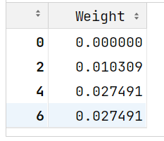

按姓名和月份分组转换，计算Bob和Amy每个月中每周的减重效果

```python
weight_loss['减重比例'] = weight_loss.groupby(['Name','Month'])['Weight'].transform(find_perc_loss)

```

提取第4周的数据用于比较， 看谁的减重效果更明显

```python
week4_result = weight_loss.query('Week=="Week 4"')[['Name','Month','减重比例']]
week4_amy = week4_result[week4_result['Name']=='Amy']
week4_bob = week4_result.query("Name=='Bob'")
```

比较第四周的减重数据

- 将月份设置为行索引, 方便两份数据进行计算

```python
week4_bob[['Month','减重比例']].set_index('Month') - week4_amy[['Month','减重比例']].set_index('Month')
```

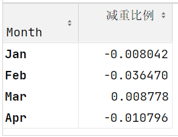

从数据中, 看出bob-amy 三个月的数据是负值, 说明amy的减重比例高于bob, amy减重效果更好

#### 2.4 分组过滤

- groupby()分组之后, 接filter方法, 传入一个返回True/False 的方法, 当数据传入这个方法中,返回True的会被留下, 返回False的会被过滤掉

```python
tips.groupby('size').filter(lambda x:x['size'].count()>5)
```

>使用就餐人数进行分组, 过滤掉条目数少于5条的组

#### 2.5 DataFrameGroupby对象

调用了groupby方法之后, 就会返回一个DataFrameGroupby对象

```python
grouped = tips_10.groupby('sex')
grouped.groups
```

> `{'Female': [198, 124, 101], 'Male': [24, 6, 153, 211, 176, 192, 9]}`
>
>`返回了分组的情况 {'组中的取值':[取值对应的条目索引列表]}`

```python
grouped.get_group('Female')
```

可以获取每组中的数据 (DataFrame)

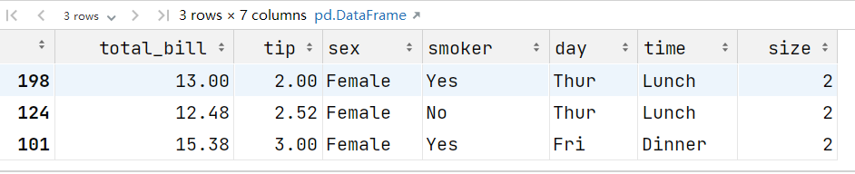

可以遍历这个DataFrameGroupby对象

```python
for group in grouped:
    # print(group)
    print(type(group[1]))
```

>每个group 都是一个元组 (分组的值, 这一组对应数据的DataFrame)

多字段分组的时候, 返回的是复合索引(MultiIndex)

```python
result = tips_10.groupby(['sex','time']).mean()
result.loc[('Female', 'Dinner')] # 获取复合索引后, 需要使用索引对应的元组才能获取到对应行的数据
```

可以把复合索引变成普通的索引

```python
result.reset_index()
tips_10.groupby(['sex','time'],as_index = False).mean()
```

### 3 会员分析和数据透视表

分析会员运营的基本情况从量的角度分析会员运营情况：

① 整体会员运营情况（存量，增量）

② 不同渠道（线上，线下）的会员运营情况

③ 线下业务，拆解到不同的地区、门店会员运营情况

从质的角度分析会员运营情况：

① 会销比 会员消费占整体消费的占比

② 连带率 是不是每次购买商品的时候, 都购买一件以上

③ 复购率 是不是买了之后, 又来买

#### 3.1 会员增量和存量分析

df.pivot_table(index= , columns = , values=, aggfunc=)

- index：行索引，传入原始数据的列名, 这一列中每一个取值会作为透视表结果的一个行索引

- columns：列索引，传入原始数据的列名,  这一列中每一个取值会作为透视表结果的一列

- values: 要做聚合操作的列名

- aggfunc：聚合函数

累计求和

df[列名].cumsum()

```python
import pandas as pd
customer_info = pd.read_excel('data/会员信息查询.xlsx')
customer_info.head()
customer_info.info()
```

>&lt;class 'pandas.core.frame.DataFrame'&gt;
>RangeIndex: 952714 entries, 0 to 952713
>Data columns (total 12 columns):
>
>Column  Non-Null Count   Dtype         
>
>---  ------  --------------   -----
> 0   会员卡号    952714 non-null  object        
> 1   会员等级    952714 non-null  object        
> 2   会员来源    952714 non-null  object        
> 3   注册时间    952714 non-null  datetime64[ns]
> 4   所属店铺编码  952714 non-null  object        
> 5   门店店员编码  253828 non-null  object        
> 6   省份      264801 non-null  object        
> 7   城市      264758 non-null  object        
> 8   性别      952714 non-null  object        
> 9   生日      785590 non-null  object        
> 10  年齡      952705 non-null  float64       
> 11  生命级别    952714 non-null  object        
>dtypes: datetime64[ns](1), float64(1), object(10)
>memory usage: 87.2+ MB

- 将注册年月转换成 年月的形式展示
  - strftime 时间类型格式化

```python
customer_info.loc[:,'注册年月'] = customer_info['注册时间'].apply(lambda x:x.strftime('%Y-%m'))
```

##### 统计每个月份新增会员数量

(注册年月分组, 对会员卡号计数)

```python
month_count = customer_info.groupby('注册年月')[['会员卡号']].count()
# 修改列名
month_count.columns = ['月增量']
```

绘制会员增量曲线

```python
import matplotlib.pyplot as plt
plt.rcParams['font.sans-serif'] = ['SimHei'] # 正常显示汉字
plt.rcParams['axes.unicode_minus'] = False # 正常显示负号
customer_info.groupby('注册年月')['会员卡号'].count()[1:].plot(figsize=(16,8))
```

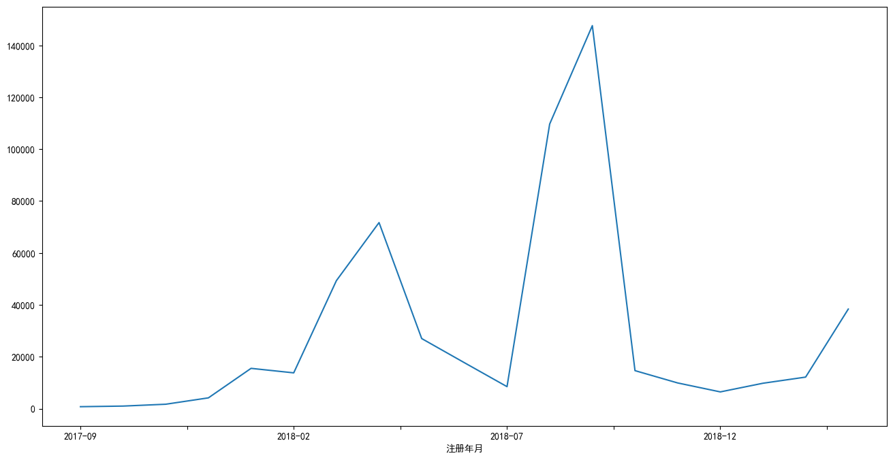

通过透视表计算月增量

```python
# index 在透视表结果中, 哪一列数据作为行索引  columns 在透视表结果中, 哪一列数据作为列名 values 对哪一个字段进行统计 aggfunc 聚合方式
customer_info.pivot_table(index='注册年月',values='会员卡号',aggfunc='count')
```

对月增量字段累计求和计算月存量

```python
month_count.loc[:,'会员存量']=month_count['月增量'].cumsum()
```

将月增量和月存量进行可视化

```python
month_count['月增量'].plot(figsize=(16,8),color = 'red',secondary_y = True)
month_count['会员存量'].plot(kind = 'bar',figsize=(16,8))
```

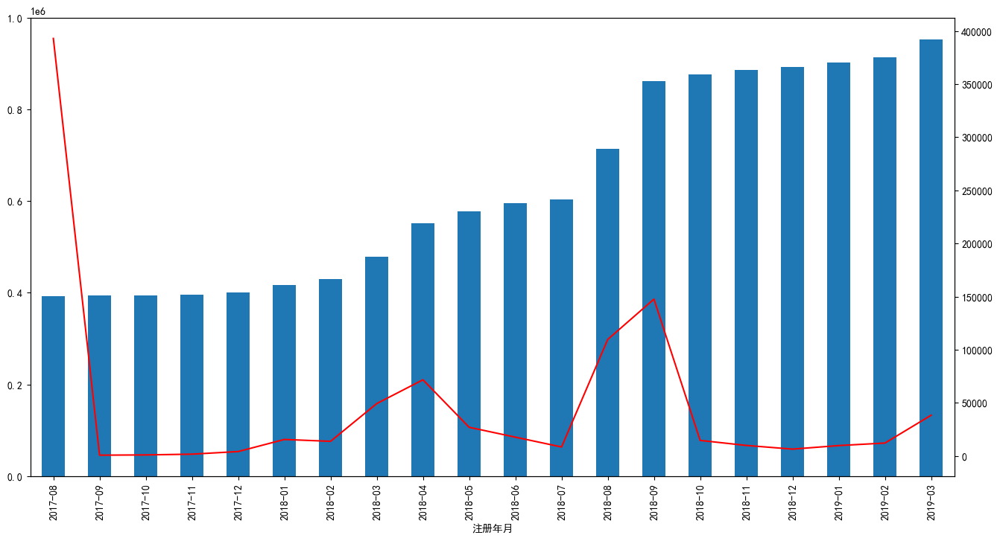

##### **统计月增量会员中的会员等级分布**

```python
customer_info.groupby(['注册年月','会员等级'])['会员卡号'].count().unstack()
member_level = customer_info.pivot_table(index='注册年月',columns='会员等级',values='会员卡号',aggfunc='count')
member_level = member_level[1:]
```

可视化

```python
import matplotlib.pyplot as plt
fig,ax1 = plt.subplots(figsize=(20,8))
ax2 = ax1.twinx() # 通过ax1 创建了一个共享x轴的坐标系 ax2
# plt.subplots 创建了一个绘图区域 fig 和坐标系 ax1   grid=True 添加网格线  xlabel/ylabel x轴y轴 起名  legend 图例
member_level[['白银会员','黄金会员']].plot.bar(ax=ax1,grid=True,xlabel='年月',ylabel='白银黄金',legend= True)
member_level[['铂金会员','钻石会员']].plot(ax=ax2,color=['red','gray'],ylabel='铂金钻石',legend= True)
# 把ax2 坐标系 图例显示的地方调整到左上角
ax2.legend(loc='upper left')
plt.title('会员增量等级分布')
plt.show()
```

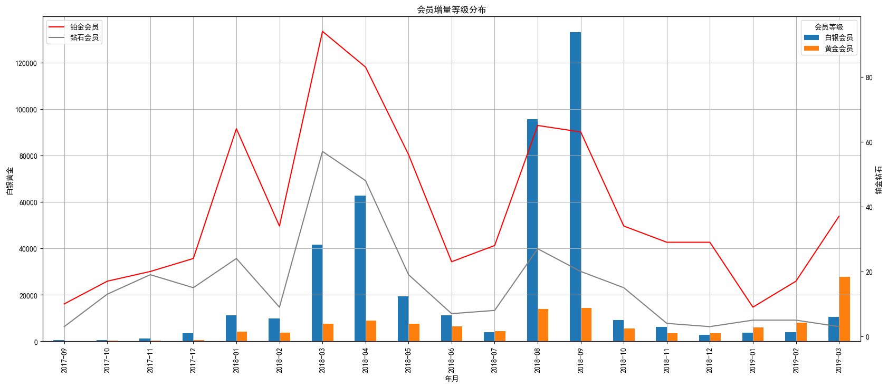

计算不同等级会员占比

```python
member_level.loc[:,'总计'] = member_level.sum(axis=1)
member_level.loc[:,'白银会员占比'] = member_level['白银会员']/member_level['总计']
member_level.loc[:,'黄金会员占比'] = member_level['黄金会员']/member_level['总计']
```

黄金白银会员占比可视化

```python
member_level[['白银会员占比','黄金会员占比']].plot(color=['r','g'],ylabel='占比',figsize=(16,8),grid=True)
```

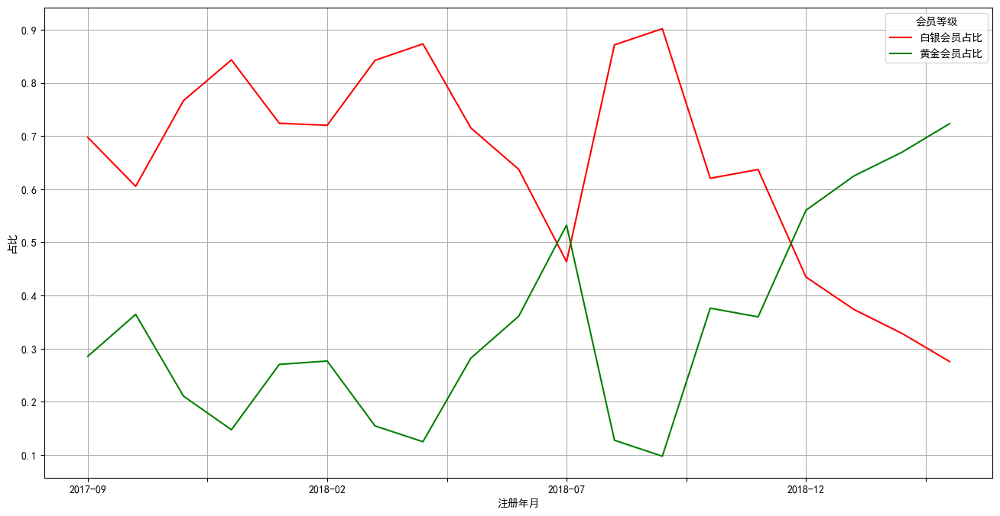

#####  整体等级分布      

```python
ratio = customer_info.groupby('会员等级')[['会员卡号']].count()
customer_info.pivot_table(index='会员等级',values='会员卡号',aggfunc='count')
ratio.columns=['会员数']
ratio['占比'] = ratio['会员数']/ratio['会员数'].sum()
ratio
```

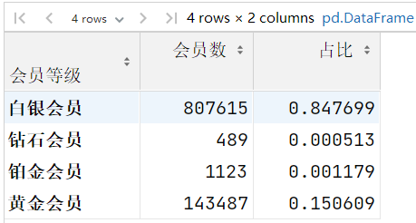

绘制饼图

```python
ratio.loc[['白银会员','铂金会员','黄金会员','钻石会员'],'占比'].plot.pie(figsize=(16,8),autopct='%.2f%%',fontsize=16)
```

>由于铂金会员/钻石会员占比较低, 绘图之前先调整在数据中的顺序, 让铂金会员和钻石会员在数据中不要挨着
>
>pie 绘制饼图
>
>autopct 控制显示饼图的占比数据图例   .2f% 表示保留两位有效数字
>
>fontsize = 16 控制字体大小

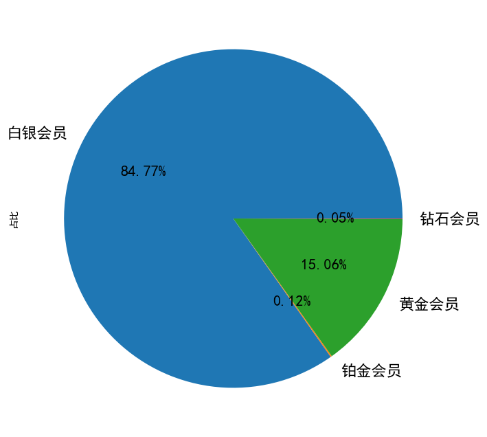

##### 线上线下会员增量分析      

```python
customer_info['会员来源'].value_counts()
```

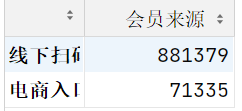

从数据中看出, 主要来线下扫码

- 计算每个月 线上线下的会员增量

```python
customer_info.groupby(['注册年月','会员来源'])['会员卡号'].count().unstack()
online_offline = customer_info.pivot_table(index='注册年月',columns='会员来源',values='会员卡号',aggfunc='count')
```

数据可视化

```python
online_offline[1:].plot(figsize=(16,8),grid=True)
plt.title('线上线下会员增量分析')
plt.show()
```

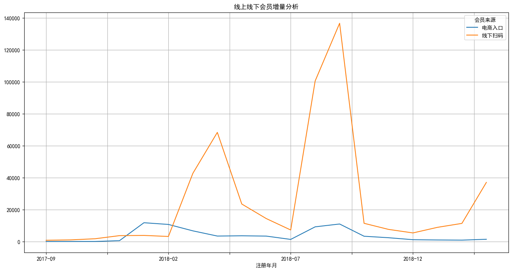

##### 按地区统计会员数量

```python
store_info = pd.read_excel('data/门店信息表.xlsx')
store_info.head()
```

将门店信息跟会员数据连接到一起

```python
customer_info1 = customer_info.merge(store_info[['店铺代码','地区编码']],left_on='所属店铺编码',right_on='店铺代码',how='left')
```

>会员信息作为左表
>
>left_on 所属门店编码 (customer_info1 表中字段)
>
>right_on='店铺代码' (store_info 表中字段)
>
>how='left' 左连接, 以用户信息表为主

```python
# 统计每个地区会员数量 去掉线上数据  GBL6D01线上电商数据
customer_info2 = customer_info1[customer_info1['地区编码']!='GBL6D01']
# 统计每个地区会员数量
district_count = customer_info2.groupby('地区编码')[['会员卡号']].count()
district_count.columns =['会员数量']
# 统计每个地区店铺数量
district_shop_count = customer_info2[['地区编码','所属店铺编码']].drop_duplicates().groupby('地区编码')['所属店铺编码'].count()
district_shop_count.name = '店铺数量'
# 将会员数量跟店铺数量数据连接起来
district = pd.concat([district_count,district_shop_count],axis=1)
```

>最后的连接使用join也可以
>
>district_count.join(district_shop_count)

计算店均会员数 和 总平均会员数

```python
district['地区店均会员数'] = round(district['会员数量'].div(district['店铺数量']))
district['总平均会员数'] = round(district['会员数量'].sum()/district['店铺数量'].sum())
district = district.sort_values(by='地区店均会员数',ascending=False)
```

可视化

```python
district['地区店均会员数'].plot.bar(figsize=(16,8),color='r',legend=True,grid=True)
district['总平均会员数'].plot(color='g',legend=True,grid=True)
plt.title('地区店均会员分析')
plt.show()
```

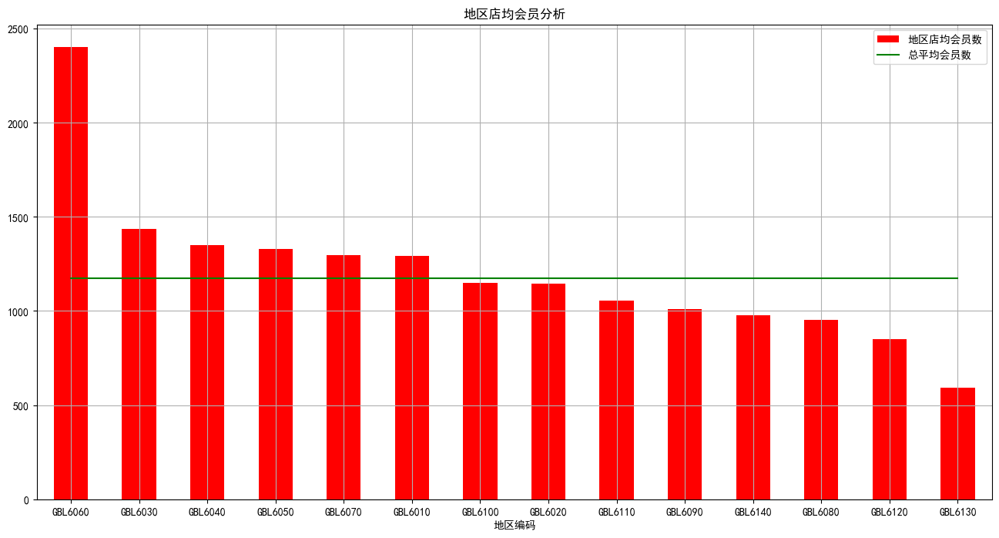

##### 各地区会销比

- 加载数据

```python
custom_consume=pd.read_excel('data/会员消费报表.xlsx')
all_orders=pd.read_excel('data/全国销售订单数量表.xlsx')
```

- 将订单日期字段转换为日期时间类型

```python
custom_consume['订单日期'] = pd.to_datetime(custom_consume['订单日期'])
```

- 从订单日期中提取年月数据, 并转换成数值类型方便与另一张表合并

```python
custom_consume['年月'] = custom_consume['订单日期'].apply(lambda x: x.strftime('%Y%m')).astype(int)
```

- 计算各地区会销比,先计算各地区的会员销量

```python
#将销售数据跟地区信息关联起来
member_orders = custom_consume.merge(store_info[['店铺代码','地区编码']],on='店铺代码',how='left')
# 去掉电商数据
member_orders =member_orders[member_orders['地区编码']!='GBL6D01']
# 创建数据透视表 计算每个月每个地区会员的订单数
area_sales= member_orders.pivot_table(index='地区编码',columns='年月',values='消费数量',aggfunc=sum,margins=True,margins_name='汇总')
area_sales
```

- 计算各地区每个月的总销量

```python
country_sales = all_orders.pivot_table(index='地区代码',columns='年月',values='全部订单数',aggfunc=sum,margins=True,margins_name='汇总')
country_sales
```

两张表相除得到会销比

```python
area_sales/country_sales
```


## 今日小结

数据分组

df.groupby().agg()

df.groupby().transform()

df.groupby().filter()

数据透视表

df.pivot_table(index= columns=  values=  aggfunc=,margins=True , margins_name)

cumsum() 累计求和

绘图

s.plot.bar() #条形图

s.plot.pie() # 饼图

- figsize = () 画布大小
- grid= True 网格线
- legend = True 显示图例
- color=['r','g']  # 控制颜色
- xlabel /ylabel  x.y轴标签


concat/merge 区别

