## 今日重点

日期时间类型数据的处理

数据可视化

- 基于Matplotlib  没有交互效果
- JS库
  - pyecharts 对echarts的封装


## 1 连带率和复购率计算

### 1.1 连带率计算

连带率的概念和为什么分析连带率

- 连带率是指销售的件数和交易的次数相除后的数值

- 反映的是顾客平均单次消费的产品件数

为什么分析连带率

- 连带率直接影响到客单价

- 连带率反应运营质量

连带率的计算

- 连带率 = 消费数量 / 订单数量

分析连带率的作用

- 通过连带率分析可以反映出人、货、场几个角度的业务问题

**计算连带率**

- 只统计下单的数据

```python
order_data = member_orders.query('订单类型=="下单"')
# 去重, 订单编号相同的只保留一个
order_count = order_data[['年月','地区编码','订单号']].drop_duplicates()
# 数据透视表计算每个地区, 每个月份买了多少单
order_count = order_count.pivot_table(index='地区编码',columns='年月',values='订单号',aggfunc='count')
sale_count = order_data.pivot_table(index='地区编码',columns='年月',values='消费数量',aggfunc='sum')

```

- 连带率计算

```python
sale_count/order_count
```

### 1.2 复购率

复购率的概念和复购率分析的作用

- 复购率：指会员对该品牌产品或者服务的重复购买次数，重复购买率越多，则反应出会员对品牌的忠诚度就越高，反之则越低。
- 计算复购率需要指定时间范围

如何计算复购：

- 会员消费次数一天之内只计算一次

- 复购率 = 一段时间内消费次数大于1次的人数 / 总消费人数

复购率分析的作用：通过复购率分析可以反映出运营状态

-  先把一天内多次购买的用户, 只保留一条

```python
# 订单日期, 卡号, 地区编码
unique_date_order = order_data.drop_duplicates(subset=['订单日期','卡号'])[['订单日期', '卡号', '地区编码','年月']]
consume_count = unique_date_order.pivot_table(index=['地区编码','卡号'],values='订单日期',aggfunc='count').reset_index()
consume_count.rename(columns={'订单日期':'消费次数'},inplace = True)
consume_count['是否复购'] =consume_count['消费次数']>1
result = consume_count.pivot_table(index='地区编码',values=['消费次数','是否复购'],aggfunc={'消费次数':'count','是否复购':'sum'})
result.columns= ['复购人数','消费人数']
result['复购率'] = result['复购人数']/result['消费人数']
result
```


把复购率计算过程封装成方法

```python
def repurchase_rate(oder_data, start,end,col):
    # 使用起始结束的日期筛选要计算的数据的范围
    order_data1 = order_data[(oder_data['年月']<=end)&(order_data['年月']>=start)]
    # 去重
    unique_date_order = order_data1.drop_duplicates(subset=['订单日期','卡号'])[['订单日期', '卡号', '地区编码','年月']]
    consume_count = unique_date_order.pivot_table(index=['地区编码','卡号'],values='订单日期',aggfunc='count').reset_index()
    consume_count.rename(columns={'订单日期':'消费次数'},inplace = True)
    consume_count['是否复购'] =consume_count['消费次数']>1
    result = consume_count.pivot_table(index='地区编码',values=['消费次数','是否复购'],aggfunc={'消费次数':'count','是否复购':'sum'})
    result.columns= ['复购人数','消费人数']
    result[col+'复购率'] = result['复购人数']/result['消费人数']
    return result
```

- 计算复购率环比

```python
# 计算18年1月-18年12月 复购率
result1 = repurchase_rate(order_data,201801,201812,'18年1月-18年12月')
# 计算18年2月-19年1月 复购率
result2 = repurchase_rate(order_data,201802,201901,'18年2月-19年1月')
result = pd.concat([result1.iloc[:,-1],result2.iloc[:,-1]],axis=1)
# 计算复购率环比
result.iloc[:,1]/result.iloc[:,0]
```


## 2 日期时间类型数据

### 2.1 日期时间类型简介

```python
import pandas as pd
ebola = pd.read_csv('data/country_timeseries.csv')
```

pandas的日期时间类型默认是 datetime64[ns]

在加载了上面的数据之后, 发现日期数据列是Object类型, 可以通过

pd.to_datetime()转换成日期时间类型

```python
ebola['date_dt'] = pd.to_datetime(ebola['Date'])
```

也可以在读取数据的时候, 直接指定, 某一列解析成日期时间的格式

```python
ebola = pd.read_csv('data/country_timeseries.csv',parse_dates=[0])
```

关于日期时间相关的还有TimeStamp 时间戳 这种类型

```python
pd.Timestamp(2023,9,1)
```

>Timestamp('2023-09-01 00:00:00')


提取不同维度的日期信息

```python
time_stamp = pd.to_datetime('2023-09-01')
time_stamp.year
time_stamp.month
time_stamp.day
```

如果是一列日期时间的数据ebola['Date'].dt.XXX

```python
ebola['year']=ebola['Date'].dt.year
ebola['month'] = ebola['Date'].dt.month
ebola['day'] = ebola['Date'].dt.day
```

### 2.2 日期时间索引

把日期时间类型的数据设置为索引, 优势就是方便进行时间范围的选择, 进行时间维度的切片操作会变得十分简单

datetimeIndex

- 把datetime64这个类型的数据设置为索引, 就是日期时间索引datetimeIndex

```python
tesla_stock = pd.read_csv('data/TSLA.csv',parse_dates=[0])
# 要筛选出2015年8月的股票信息, 如果Date是一列, 需要使用下面的布尔索引的写法(query写条件)
tesla_stock[(tesla_stock['Date'].dt.year==2015)&(tesla_stock['Date'].dt.month==8)]
```

- 把'Date'设置为日期时间索引, 这类操作就会变得十分简单

```python
tesla_stock.set_index('Date',inplace=True)
tesla_stock.loc['2015-08']
```

>tesla_stock['2015-08']  这种写法在2.0的版本已经被删除了

timedeltaIndex

- 把timedelta64这个类型的数据设置为索引, 就是时间差值索引timedeltaIndex

```python
tesla_stock.reset_index(inplace=True)
tesla_stock['ref_date'] = tesla_stock['Date']-tesla_stock['Date'].min()
tesla_stock.set_index('ref_date',inplace=True)
tesla_stock.loc['0 days':'4 days']
```

>上面的切片操作, 4 days在数据中不存在, 依然能正确返回结果, 就是TimeDeltaIndex 优势

### 2.3 生成日期时间序列

pd.date_range('起始时间','结束时间', freq= 生成时间序列的方式)

freq可能取值

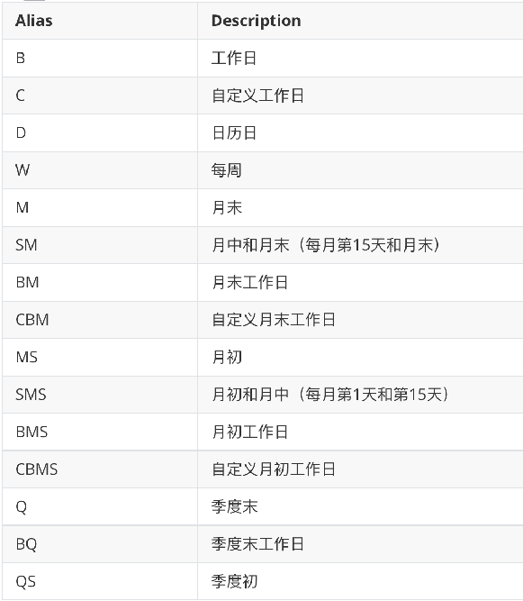

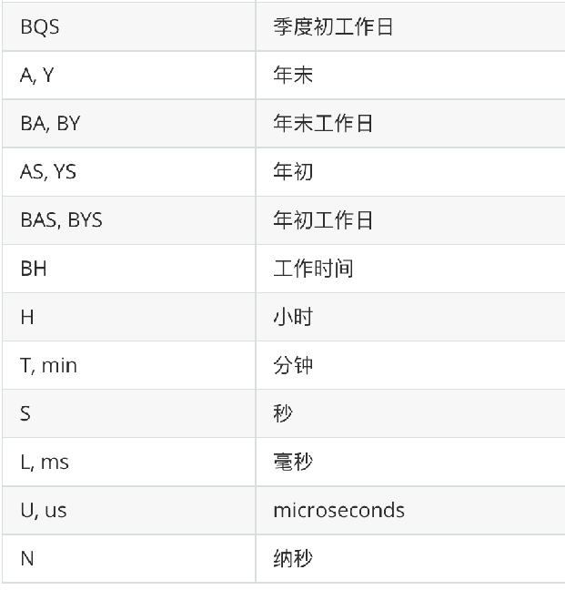

```python
pd.date_range('2023-08-01','2023-10-30',freq='B')
pd.date_range('2023-08-01','2023-10-30',freq='2B')# 隔一个工作日获取一个工作日
pd.date_range('2023-08-01','2023-10-30',freq='WOM-1THU') # 每个月的第一个星期4
# WOM week of month  THU Thursday
pd.date_range('2023-08-01','2023-10-30',freq='WOM-3FRI')  # Friday 星期五
```

### 2.4 日期时间数据的小结

- Pandas关于日期时间的数据 有如下几种数据类型

  - TimeStamp 时间戳 就是一个时间点
  - Datetime64 一列时间数据  →DatetimeIndex
  - TimeDelta64 两列时间的差值  → TimeDeltaIndex

- 如果数据中包含了日期时间的数据, 并且后续计算/数据的处理需要用到日期时间类型数据的特性需要把他转换成日期时间类型

  - pd.to_datetime(一列数据)  
  - pd.read_csv(parse_dates= [列名/序号]) 加载的时候直接进行转换

- 还可以通过Pandas提供的API生成日期时间的序列

  pd.date_range('起始时间','结束时间', freq= 生成时间序列的方式)

- 在特征处理/数据处理 看见日期时间类型数据需要马上反映出通过这一列数据,可以做出很多列特征来

  - df['Date'].dt.year /df['Date'].dt.month /df['Date'].dt.quarter 季度 df['Date'].dt.dayofweek 星期几

  - 如果想快速的对日期进行切片/范围选取的操作, 可以把它转换成日期时间索引

### 2.5 日期时间数据类型的练习

把日期时间设置为Index 行索引之后, 可以使用

```
crime.between_time('2:00','5:00',include_start=False)
crime.at_time('5:43')
```

>between_time 在两个时刻的范围内
>
>at_time 在某个具体的时刻

crime.resample('W') 将数据按周进行分组 , 分组之后可以接聚合函数, 类似于groupby之后的聚合

crime.resample('M') 将数据按月份进行分组,分组之后可以接聚合函数, 类似于groupby之后的聚合,

crime.resample('Q') 将数据按季度进行分组, 分组之后可以接聚合函数, 类似于groupby之后的聚合


如果需要对DatetimeIndex这个类型的数据进行切片操作, 建议先排序, 再切片, 效率更高

## 3 数据可视化

### 3.1 可视化库的介绍

基于Matplotlib 绘制静态图形

- pandas
- seaborn 

基于JS (javaScript)

- pyecharts/echarts
- plotly


### 3.2 Matplotlib可视化

#### Matplotlib api介绍

- 准备数据

```python
# 准备数据
x = [-3,5,7]  # 所有坐标点的 x坐标
y = [10,2,5]  # 所有坐标点的 y坐标
```

- 绘制折线图 使用plt. 这一套API

```python
# 创建绘图区域
plt.figure(figsize=(12,5))
# 画图
plt.plot(x,y)
plt.grid(True)  # 添加网格线
plt.xlim(-3,7)
plt.ylim(2,11)
plt.xlabel('x axis',size=20)
plt.ylabel('y axis',size=10)
plt.title('折线图')
plt.show()
```

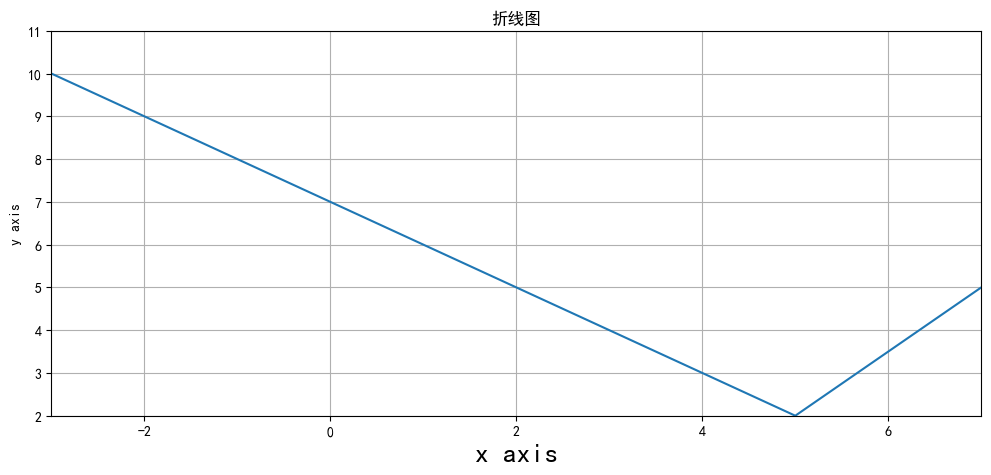

- 绘制折线图,使用面向对象这一套API

```python
fig,ax = plt.subplots(figsize=(12,5)) # ax 坐标系
# 在坐标系中 画图
ax.plot(x,y) # 调用ax 坐标系的绘图方法
ax.set_xlim(-3,7) # 调用ax 坐标系的设置方法
ax.set_ylim(2,11)
ax.set_xlabel('x axis',size=20)
ax.set_ylabel('y axis',size=10)
ax.set_title('折线图')
plt.show()
```

#### anscombe数据集可视化

数据集介绍通

- 过Anscombe数据集说明数据可视化的重要性
- Anscombe数据集由英国统计学家Frank Anscombe创建
- 数据集包含4组数据，每组数据包含两个连续变量。
- 每组数据的平均值、方差、相关性基本相同，但是当它们可视化后，就会发现每组数据的模式明显不同。

```python
import pandas as pd
anscombe = pd.read_csv('data/anscombe.csv')
anscombe.dataset.value_counts()
```

>4组数据, 放在一个数据集中, 分别用I, II, III , IV 加以区分
>
>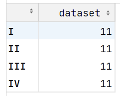

```python
anscombe.groupby('dataset').describe().T
```

>describe()查看数据的查看数据的分布情况
>
>发现每组数据中, x, y 的分布情况基本相同, 从均值, 极值和几个4分位数上看, 这几组数据貌似分布差不多
>
>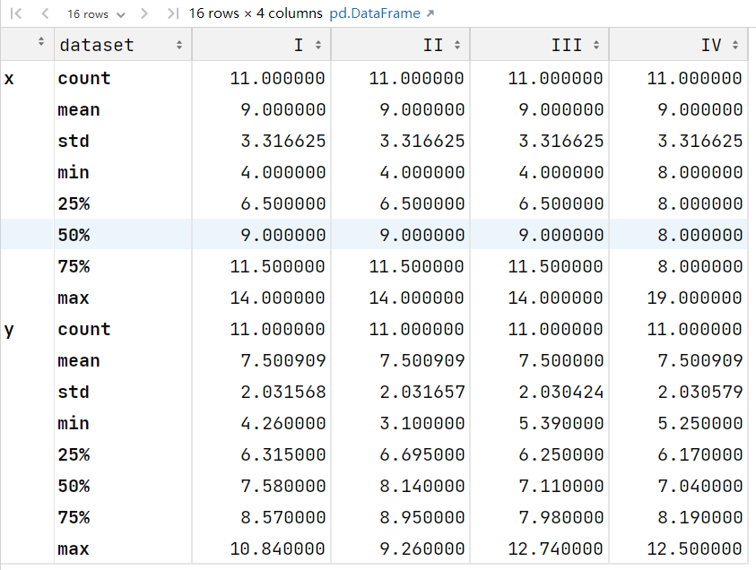

数据可视化

```python
# 上面的数据一共可以分成4分 I II III IV  我们把这四份数据分别可视化, 画4张小图, 放到一个画布中
fig = plt.figure(figsize=(16,8))
# 在画布中 设置一个两行两列的框, 第一个框 对应axes1
axes1 = fig.add_subplot(2,2,1)
# 在画布中 设置一个两行两列的框, 第二个框 对应axes2
axes2 = fig.add_subplot(2,2,2)
# 在画布中 设置一个两行两列的框, 第三个框 对应axes3
axes3 = fig.add_subplot(2,2,3)
# 在画布中 设置一个两行两列的框, 第四个框 对应axes4
axes4 = fig.add_subplot(2,2,4)
axes1.scatter(anscombe[anscombe['dataset']=='I']['x'],anscombe[anscombe['dataset']=='I']['y'])
axes2.scatter(anscombe[anscombe['dataset']=='II']['x'],anscombe[anscombe['dataset']=='II']['y'])
axes3.scatter(anscombe[anscombe['dataset']=='III']['x'],anscombe[anscombe['dataset']=='III']['y'])
axes4.scatter(anscombe[anscombe['dataset']=='IV']['x'],anscombe[anscombe['dataset']=='IV']['y'])
plt.show()
```

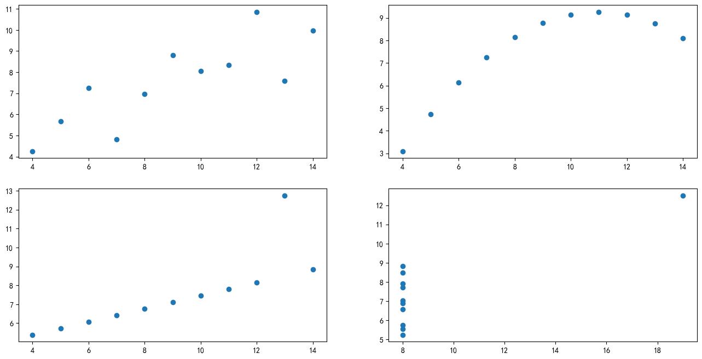

#### Matplotlib 单变量可视化

直方图 直方图能反应一个变量数据的分布情况

```python
tips = pd.read_csv('data/tips.csv')
# 创建绘图区域
plt.figure(figsize=(16,8))
# 绘制账单金额的直方图, 指定把账单金额均匀分成10组
plt.hist(tips['total_bill'],bins=10)
plt.title('总账单金额的分布情况')
plt.xlabel('账单金额')
plt.ylabel('出现次数')
```

>import numpy as np
>np.linspace(3.07,50.81,11)  # bins = 10 相当于在账单的最小值, 和最大值范围内生成了11值的等差数列
>
>11个值划分10个区间, 直方图的高度, 就是落到每个区间中的数据的条目数
>
>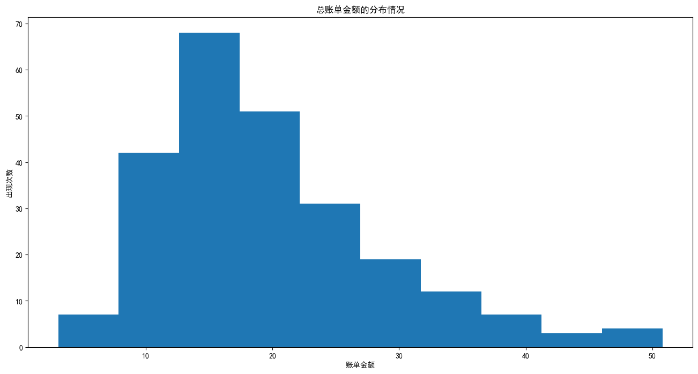

#### Matplotlib双变量/多变量可视化

双变量（bivariate)指两个变量

- 散点图用于表示一个连续变量随另一个连续变量的变化所呈现的大致趋势

了解账单金额和消费之间的关系可以绘制散点图

```python
plt.figure(figsize=(12,8))
plt.scatter(tips['total_bill'],tips['tip'])
plt.xlabel('账单金额')
plt.ylabel('小费金额')
plt.grid(True)
```

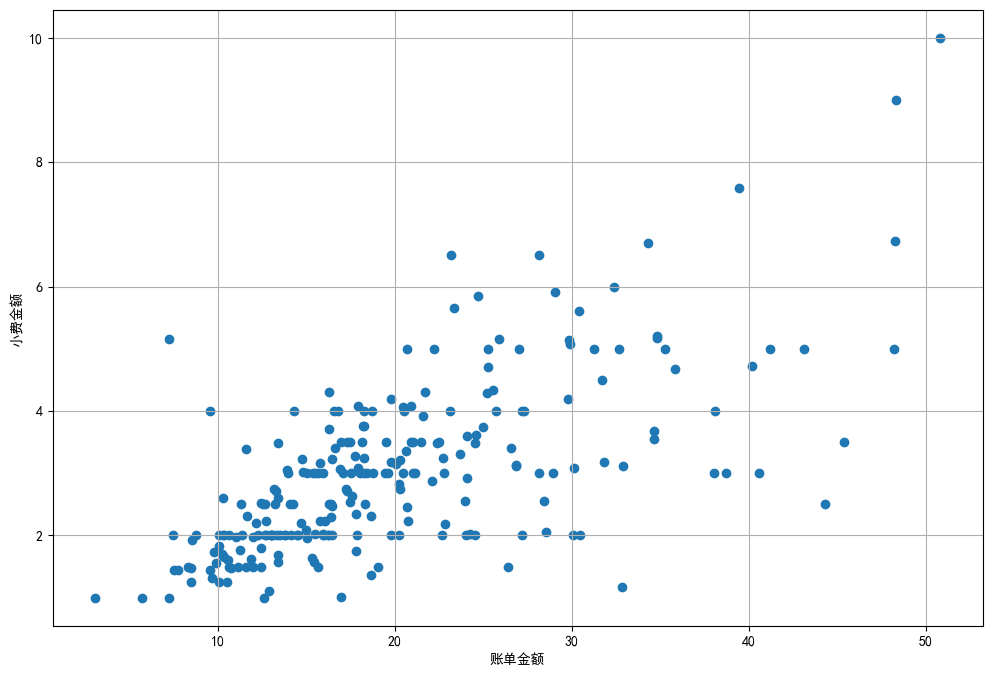

多变量可视化

- 在散点图的基础上, 可以通过颜色来区分不同的类别
- 散点的大小也可以用来表示一个变量

```python
# 添加一列, 用来区分不同性别显示的颜色
def recode_sex(sex):
    if sex=='Female':
        return 'r'
    else:
        return 'b'
tips['sex_color'] = tips['sex'].apply(recode_sex)
```

- 绘制散点图

```python
plt.figure(figsize=(12,8))
plt.scatter(tips['total_bill'],tips['tip'],c=tips['sex_color'],s = tips['size']*10,alpha=0.5)
plt.xlabel('账单金额')
plt.ylabel('小费金额')
plt.legend(tips['sex'])
```

>c=tips['sex_color']  区分颜色
>
>s = tips['size']*10  区分大小
>
>alpha=0.5 设置点的透明度

## 4 Pandas绘图

### 4.1 Pandas 单变量可视化

如果是类别型

- 柱状
- 饼图 (类别相对较少 5-6个 或者更少), 所有的类别加起来是1个整体

如果是数值型

- 看变化趋势 折线 plot.line()
- 看分布直方plot.hist()
  - 绘制直方图的时候,需要注意, 如果数据分布不均匀(倾斜的数据, 有取值数量较少的极大, 极小值) 这个时候如果不做数据的处理, 直接绘制直方图, 不能反映出数据的分布来, 只能得到一个柱子
    - 可以把极值单独取出来讨论
    - 把去掉极值的部分再绘制直方图

```python
import pandas as pd
reviews = pd.read_csv('data/winemag-data_first150k.csv',index_col=0)
reviews.info()
```

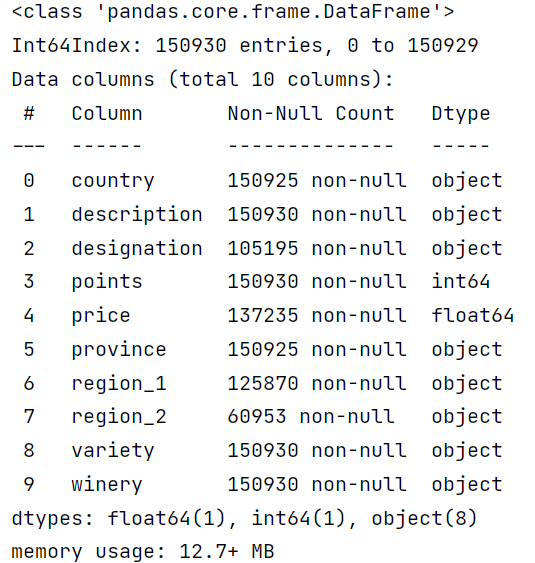

```python
reviews.describe()
```

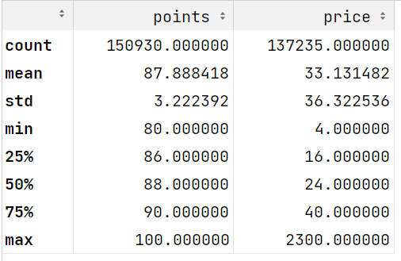

```python
reviews.describe(include=object)
```

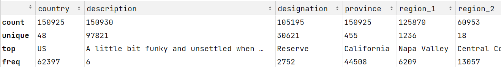

#### 1 柱状图

- 统计葡萄酒出产种类最多的10个省份

```python
kwargs = dict(figsize=(16,8),fontsize=20,color = ['b','orange','g','r','purple','brown','pink','gray','cyan','y'])
reviews['province'].value_counts().head(10).plot.bar(**kwargs)
```

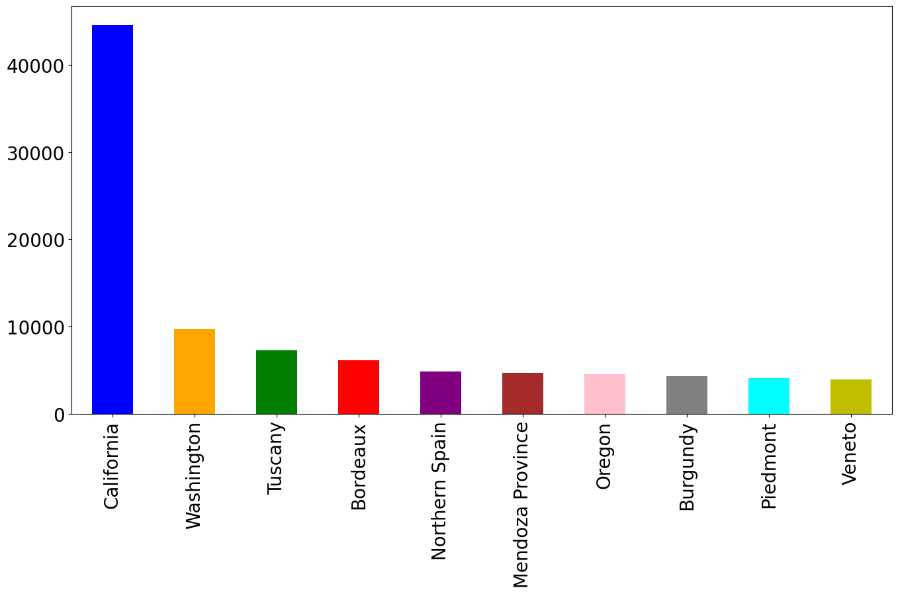

```python
import matplotlib.pyplot as plt
from matplotlib import ticker
fig,ax = plt.subplots(figsize=(16,8))
# 设置坐标轴为百分比形式展示 decimals=1表示百分比的小数位数为1
ax.yaxis.set_major_formatter(ticker.PercentFormatter(xmax=1,decimals=1))
kwargs = dict(fontsize=20,color = ['b','orange','g','r','purple','brown','pink','gray','cyan','y'])
reviews['province'].value_counts(1).head(10).plot.bar(**kwargs)
```

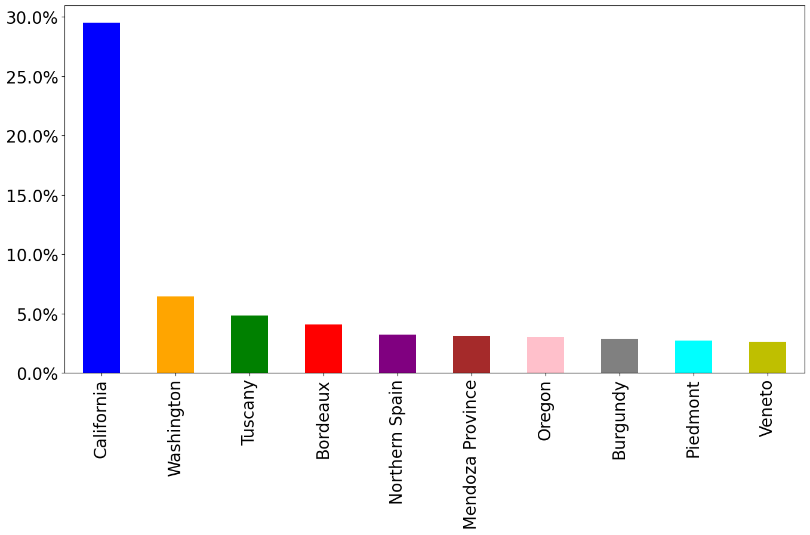		

#### 2  折线图和面积图

- 绘制分数的分布情况

```python
reviews['points'].value_counts().sort_index().plot.line(grid=True)
```


```python
# 为了方便绘图 sort_index 对行索引进行排序
reviews['points'].value_counts().sort_index().plot.area(grid=True)
```

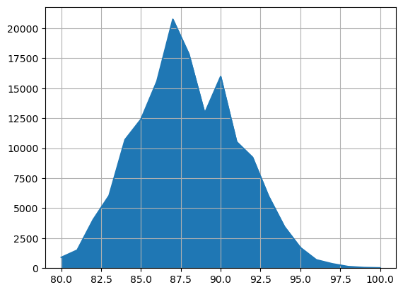

#### 3 直方图

- 绘制直方图的时候需要注意, 如果数据是有偏的, 需要先将数据进行处理
  - 这里葡萄酒的价格分布并不均匀, 高于500元的葡萄酒种类很少, 先从数据中截取价格<150的再绘制直方图

```python
reviews[reviews['price']<150]['price'].plot.hist(bins=15)
```

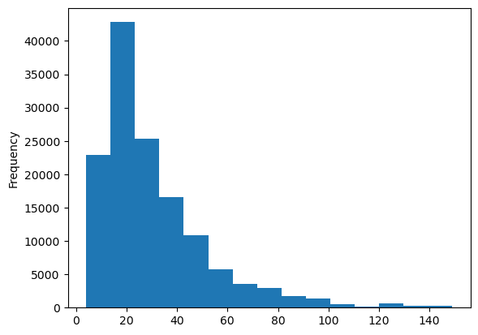

```python
# quantile 计算分位数
reviews['price'].quantile(0.9994)
```

>500.0

#### 4 饼图

- 饼图适合统计类别数量不多, 组合起来是1的数据的可视化

```python
reviews['province'].value_counts().head(10).plot.pie()
```


## 5 今日内容小结

**日期时间类型数据**

Pandas关于日期时间的数据 有如下几种数据类型

- TimeStamp 时间戳 就是一个时间点
- Datetime64 一列时间数据  →DatetimeIndex
- TimeDelta64 两列时间的差值  → TimeDeltaIndex

pd.to_datetime()

df['日期列'].dt.year/df['日期列'].dt.month/df['日期列'].dt.day/df['日期列'].dt.weekday

DatetimeIndex 转换成日期时间索引后方便做切片处理

**数据可视化**

matplotlib 图片

- pandas
- seaborn
- 最核心的两句  
  - 创建绘图区域 plt.figure(figsize=())  / fig, ax = plt.subplots(figsize=())
  - plt.plot(x,y) /plt.scatter(x,y)/plt.hist(x)

javascript 网页中展示的

绘图的图形

- 单变量可视化

  - 柱状 bar 饼 pie

  - 折线 line  直方hist

- 双变量/多变量可视化
  - 双变量 散点
  - 多标量 三维 / 在散点scatter基础上 加颜色区分 大小的区分 ..
